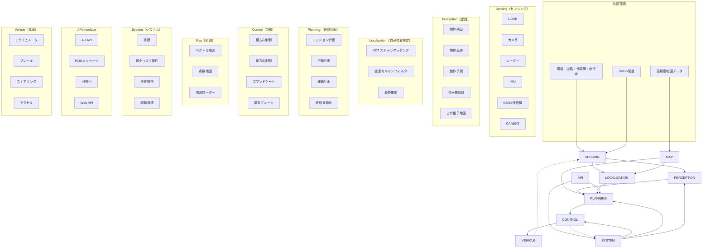

# Autowareアーキテクチャ概要図

## システム全体アーキテクチャ

## 各コンポーネント詳細説明

### 1. Sensing（センシング）
- **役割**: 環境情報の取得とセンサーデータの前処理
- **主要機能**:
  - LiDAR点群データの取得・前処理
  - カメラ画像の取得・歪み補正
  - レーダーデータの処理
  - IMU・GNSSデータの統合
  - CAN通信による車両データ取得

### 2. Perception（認識）
- **役割**: センサーデータから環境の意味的理解
- **主要機能**:
  - 3D物体検出（車両、歩行者、自転車）
  - 多物体追跡（Multi-Object Tracking）
  - 動作予測（Motion Prediction）
  - 信号機認識・分類
  - 占有格子地図生成

### 3. Localization（自己位置推定）
- **役割**: 高精度な自車位置・姿勢の推定
- **主要機能**:
  - NDTアルゴリズムによるスキャンマッチング
  - 拡張カルマンフィルタによるセンサー融合
  - GNSS/IMU統合
  - 姿勢推定の信頼性評価

### 4. Planning（経路計画）
- **役割**: 目的地までの安全で効率的な経路・軌道生成
- **主要機能**:
  - **Mission Planning**: 大局的な経路計画
  - **Behavior Planning**: 交通状況に応じた行動決定
  - **Motion Planning**: 詳細な軌道生成
  - 経路最適化・平滑化

### 5. Control（制御）
- **役割**: 計画された軌道の正確な追従
- **主要機能**:
  - Model Predictive Control（MPC）による横方向制御
  - PID制御による縦方向制御
  - 緊急ブレーキシステム
  - コマンドゲートによる安全性確保

### 6. Map（地図）
- **役割**: 高精度地図データの管理・提供
- **主要機能**:
  - Lanelet2ベクトル地図の読み込み
  - 点群地図（PCD）の管理
  - 地図投影・座標変換
  - 動的地図更新

### 7. System（システム）
- **役割**: システム全体の監視・制御・安全性確保
- **主要機能**:
  - 診断システム（故障検知・報告）
  - Minimum Risk Maneuver（最小リスク操作）
  - 状態監視・ヘルスチェック
  - 起動・停止管理

### 8. API/Interface
- **役割**: 外部システムとの連携・可視化
- **主要機能**:
  - Autoware AD API（標準化されたインターフェース）
  - ROSメッセージ通信
  - RViz可視化
  - Web API・リモート制御

## データフロー概要

1. **上流**: Sensing → Perception → Planning
2. **位置情報**: Map + Sensing → Localization → Planning
3. **制御**: Planning → Control → Vehicle
4. **監視**: System ← 全コンポーネント
5. **インターフェース**: API ← → 各コンポーネント

## 特徴

- **モジュラー設計**: 各コンポーネントは独立して開発・テスト可能
- **ROS 2ベース**: 分散システム・リアルタイム処理に対応
- **プラグイン対応**: アルゴリズムの動的切り替えが可能
- **安全性重視**: 多重の安全機構を内蔵
- **拡張性**: 新機能・アルゴリズムの追加が容易