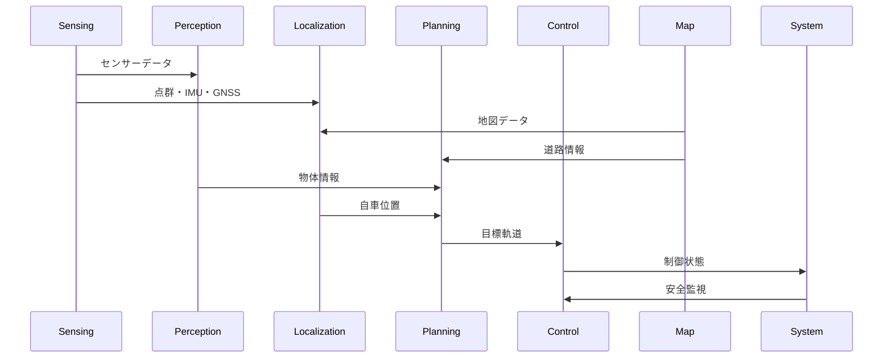

# Autoware コンポーネント詳細解説

## 1. Sensing（センシング）コンポーネント

### 概要
車両周辺環境の情報を取得し、後段の処理に適した形でデータを前処理するコンポーネント

### 主要モジュール
- **Point Cloud Preprocessor**: LiDAR点群の前処理（ノイズ除去、ダウンサンプリング）
- **Image Transport Decompressor**: 圧縮画像の展開
- **IMU Corrector**: IMUデータの補正・キャリブレーション
- **Radar Processors**: レーダーデータの変換・フィルタリング

### 担当機能
- センサー生データの取得
- データの同期・タイムスタンプ調整
- ノイズ除去・外れ値検出
- 座標系変換

---

## 2. Perception（認識）コンポーネント

### 概要
センサーデータから環境の意味的な理解を行い、周囲の物体や道路状況を認識

### 主要モジュール
- **LiDAR Object Detection**: 
  - CenterPoint（3D物体検出）
  - Apollo Instance Segmentation
- **Camera Recognition**:
  - YOLOX（2D物体検出）
  - Traffic Light Recognition
- **Multi-Object Tracker**: 物体追跡・ID管理
- **Prediction**: 他車両・歩行者の動作予測
- **Occupancy Grid Map**: 占有格子地図生成

### 主要アルゴリズム
- **物体検出**: PointPillars, CenterPoint, YOLOX
- **追跡**: カルマンフィルタ, Hungarian Algorithm
- **予測**: Constant Velocity Model, Map-based Prediction

---

## 3. Localization（自己位置推定）コンポーネント

### 概要
高精度地図と各種センサーを用いて、センチメートル級の自車位置・姿勢を推定

### 主要モジュール
- **NDT Scan Matcher**: 点群マッチングによる位置推定
- **EKF Localizer**: 拡張カルマンフィルタによるセンサー融合
- **GNSS Poser**: GNSS位置情報の処理
- **Pose Initializer**: 初期位置の設定

### 主要アルゴリズム
- **NDT（Normal Distributions Transform）**: 点群マッチング
- **拡張カルマンフィルタ**: 複数センサーの融合
- **粒子フィルタ**: 非線形推定（YabLoc）

---

## 4. Planning（経路計画）コンポーネント

### 概要
目的地まで安全で効率的な経路・軌道を生成する階層的な計画システム

### 階層構造
1. **Mission Planning**: 大局的経路計画
2. **Behavior Planning**: 行動レベル計画
3. **Motion Planning**: 詳細軌道計画

### 主要モジュール
- **Behavior Path Planner**: 
  - Lane Following, Lane Change
  - Static/Dynamic Obstacle Avoidance
  - Goal/Start Planner
- **Behavior Velocity Planner**: 
  - Traffic Light, Crosswalk
  - Intersection, Stop Line
- **Motion Velocity Planner**: 障害物回避速度調整
- **Path Optimizer**: 経路最適化
- **Sampling-based Planner**: Frenet座標系軌道生成

### 主要アルゴリズム
- **A* / Hybrid A***: グラフ探索
- **RRT* / Informed RRT***: サンプリングベース
- **Model Predictive Path Integral (MPPI)**: 確率的最適制御
- **Constant Jerk Profile**: 滑らかな軌道生成

---

## 5. Control（制御）コンポーネント

### 概要
計画された軌道を正確に追従し、車両を安全に制御

### 主要モジュール
- **MPC Lateral Controller**: Model Predictive Controlによる操舵制御
- **PID Longitudinal Controller**: 速度制御
- **Pure Pursuit**: 簡易操舵制御
- **Vehicle Command Gate**: 制御コマンドの安全性チェック
- **Autonomous Emergency Braking**: 緊急ブレーキ

### 制御手法
- **MPC**: 予測制御による最適操舵
- **PID制御**: 速度・加減速制御
- **フィードフォワード制御**: 操舵角予測

---

## 6. Map（地図）コンポーネント

### 概要
高精度地図データの読み込み・管理・提供

### 主要モジュール
- **Map Loader**: Lanelet2形式地図の読み込み
- **Point Cloud Map Loader**: PCD点群地図の管理
- **Map Height Fitter**: 地図の高さ情報調整
- **Map TF Generator**: 地図座標系の設定

### 地図形式
- **Lanelet2**: 道路ネットワークのベクトル地図
- **PCD (Point Cloud Data)**: LiDAR点群地図
- **OSM (OpenStreetMap)**: オープンな地図形式

---

## 7. System（システム）コンポーネント

### 概要
システム全体の監視・診断・安全性確保を行う

### 主要モジュール
- **Diagnostic Monitor**: システム診断・ヘルスチェック
- **MRM Handler**: Minimum Risk Maneuver（最小リスク操作）
- **Component Monitor**: ノード状態監視
- **Emergency Stop Operator**: 緊急停止制御

### 安全機能
- **故障検知**: ハードウェア・ソフトウェア監視
- **フェイルセーフ**: 安全な状態への遷移
- **冗長性**: 重要機能のバックアップ

---

## 8. API/Interface

### 概要
外部システムとの連携・可視化・リモート操作インターフェース

### 主要モジュール
- **AD API (Autonomous Driving API)**: 標準化されたインターフェース
- **RViz Plugins**: 可視化プラグイン
- **Web Server**: リモートモニタリング
- **Component Interface**: モジュール間通信

### インターフェース種類
- **REST API**: HTTP/JSONベースの外部連携
- **ROS Topics/Services**: 内部モジュール間通信
- **Visualization**: RViz, PlotJuggler等による可視化

---

## コンポーネント間の相互作用

このアーキテクチャにより、Autowareは複雑な自動運転タスクを安全かつ効率的に実行できます。