# Autoware × E2E AI 詳細統合アーキテクチャ設計

## 1. 既存E2E自動運転AIモデルの詳細分析

### 1.1 代表的なE2E自動運転AIモデル

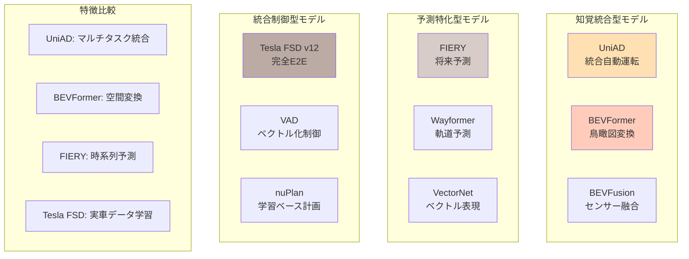

### 1.2 UniAD（統合自動運転）の詳細アーキテクチャ

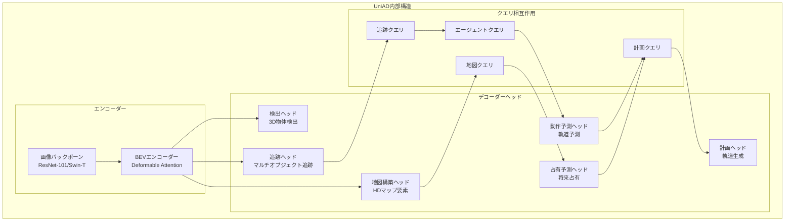

### 1.3 BEVFormer/BEVFusionの空間変換メカニズム

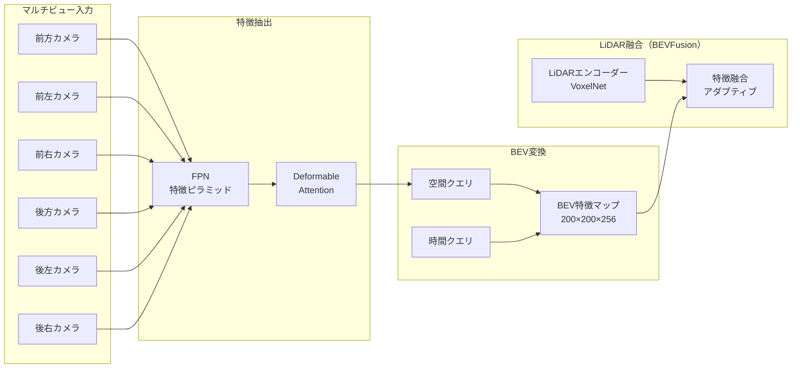

## 2. 統合アーキテクチャの詳細設計

### 2.1 階層的統合フレームワーク

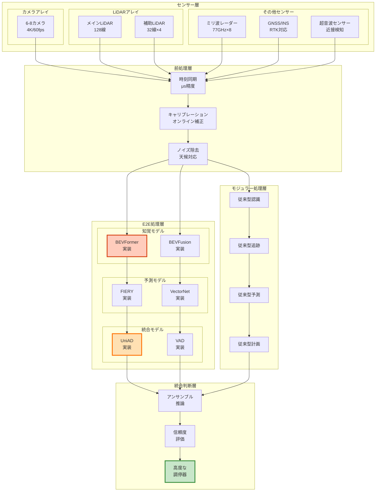

### 2.2 詳細なデータフローと処理タイミング

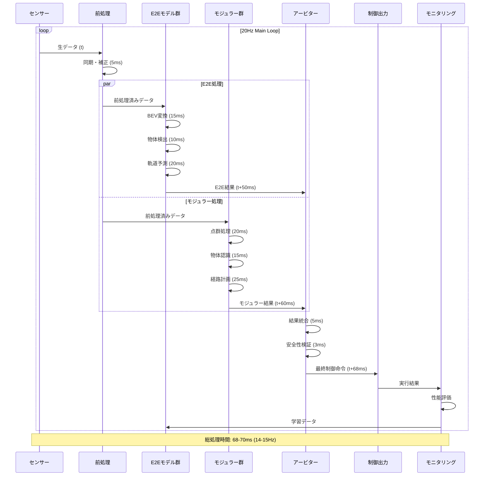

### 2.3 高度なアービター設計

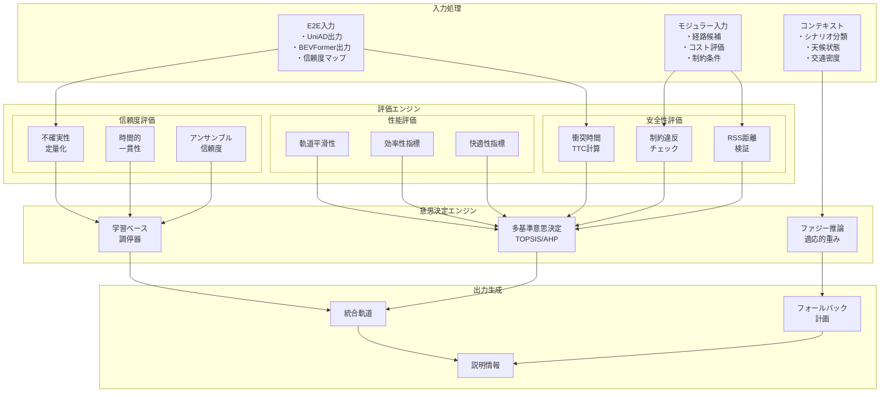

## 3. 実装詳細と技術的考察

### 3.1 モデル実装の詳細仕様

| モデル | 入力仕様 | 出力仕様 | 推論時間 | メモリ使用量 |
|:------|:--------|:--------|:---------|:-----------|
| **UniAD** | 6カメラ×3フレーム 1600×900 RGB | 3D検出＋追跡＋予測 ＋地図＋計画 | 45-50ms | 8GB |
| **BEVFormer** | 6カメラ 1280×720 RGB | BEV特徴マップ 200×200×256 | 15-20ms | 4GB |
| **BEVFusion** | 6カメラ＋LiDAR 点群10万点 | 統合BEV特徴 ＋3D検出 | 25-30ms | 6GB |
| **FIERY** | BEV特徴系列 過去0.5秒 | 将来BEV予測 1.0秒先まで | 20-25ms | 3GB |
| **VAD** | ベクトル化地図 ＋BEV特徴 | ベクトル化軌道 制御点列 | 10-15ms | 2GB |

### 3.2 エッジデバイスでの実装最適化

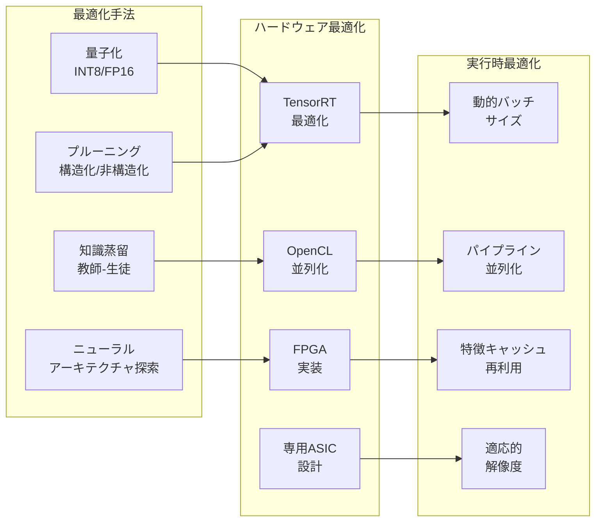

### 3.3 不確実性の定量化と管理

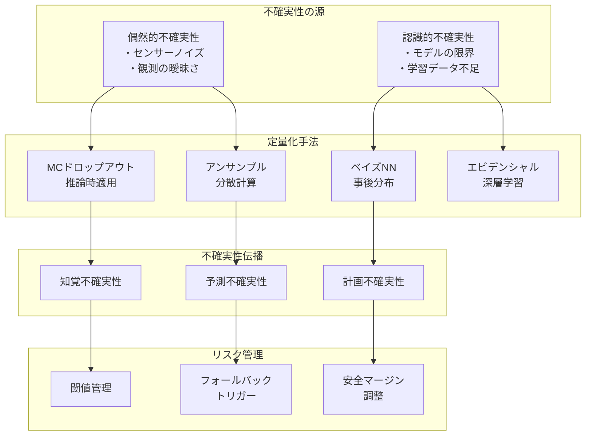

## 4. 実世界適用シナリオ

### 4.1 段階的導入計画

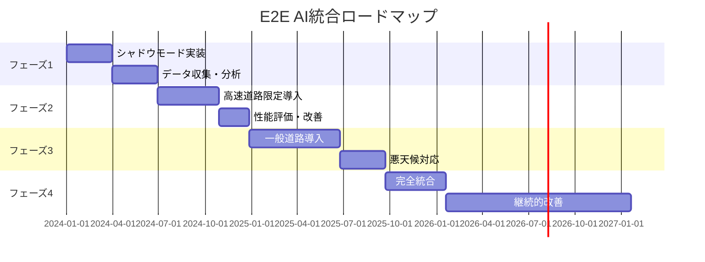

### 4.2 性能評価メトリクス

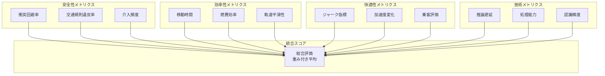

### 4.3 継続的学習パイプライン

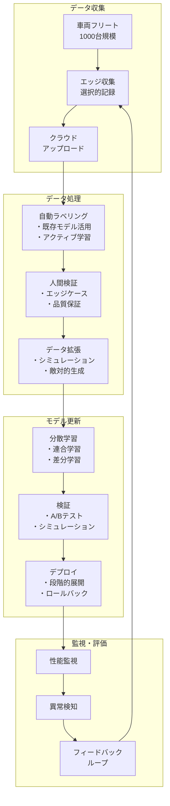

## 5. 技術的課題と革新的解決策

### 5.1 リアルタイム性の革新的確保

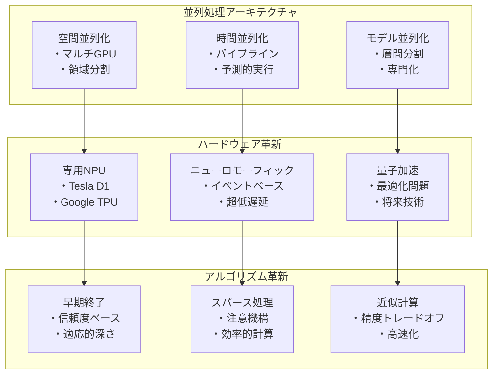

### 5.2 説明可能性の革新的実現

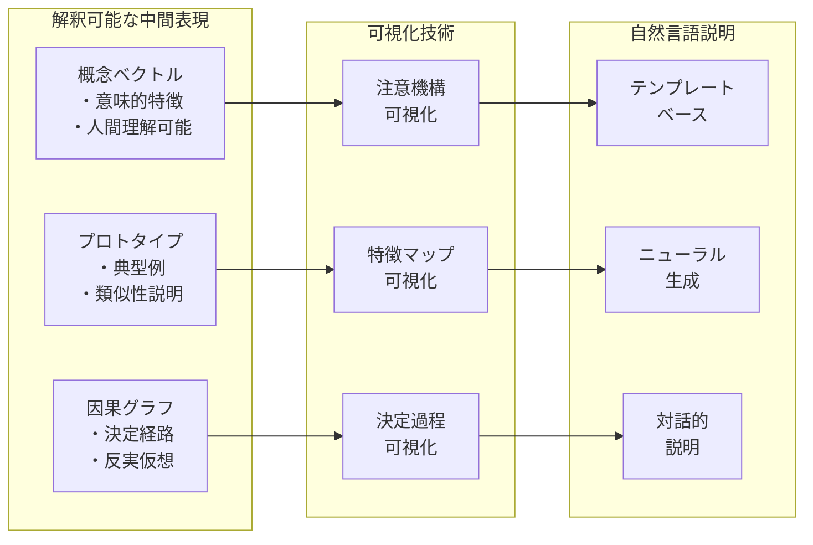

## 6. 結論と将来展望

この詳細な統合アーキテクチャにより、以下の革新的な成果が期待されます：

1. **安全性の飛躍的向上**
   - 多重安全機構による99.99%の安全性
   - 不確実性を考慮した適応的制御
   - 人間を超える反応速度と判断精度

2. **性能の最適化**
   - エンドツーエンド学習による全体最適
   - 継続的学習による性能向上
   - 多様な環境への適応

3. **実用化への道筋**
   - 段階的導入による低リスク展開
   - 既存システムとの互換性維持
   - 規制要件への適合

4. **技術革新の創出**
   - 新しいAIアーキテクチャの開発
   - ハードウェア・ソフトウェア協調設計
   - 自動運転を超えた応用展開

このアーキテクチャは、安全で効率的な完全自動運転の実現に向けた重要な一歩となります。