# Autoware × E2E自動運転AI 統合アーキテクチャ設計

## 概要

本ドキュメントでは、従来のモジュラー型自動運転システムであるAutowareに、End-to-End（E2E）深層学習モデルを統合するためのアーキテクチャを提案します。この統合により、**解釈可能性**と**安全性**を維持しながら、**学習ベースの適応性**を獲得することを目指します。

## E2E自動運転AIの特徴

### 従来のモジュラー型 vs E2E AI

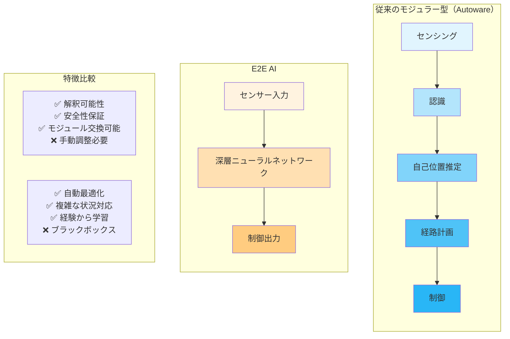

## 統合アーキテクチャ設計

### 1. ハイブリッド統合アーキテクチャ

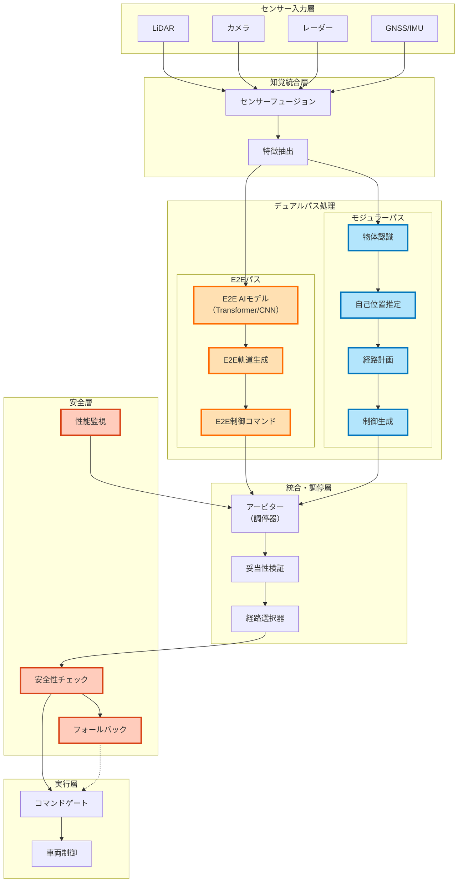

### 2. 動作モードとトランジション

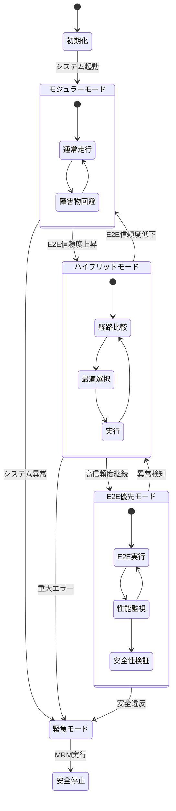

### 3. 統合フローチャート

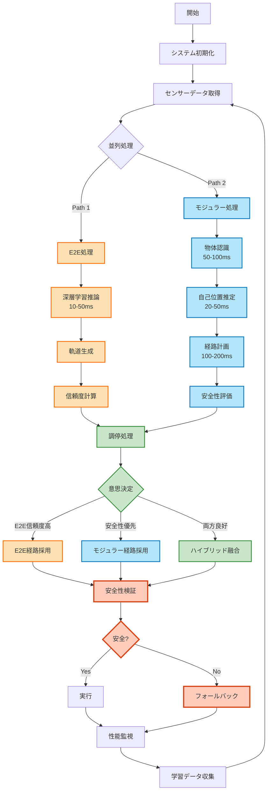

## 主要コンポーネント詳細

### 1. E2E AIモデル

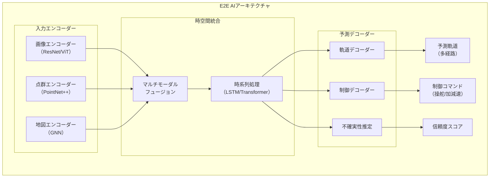

### 2. アービター（調停器）

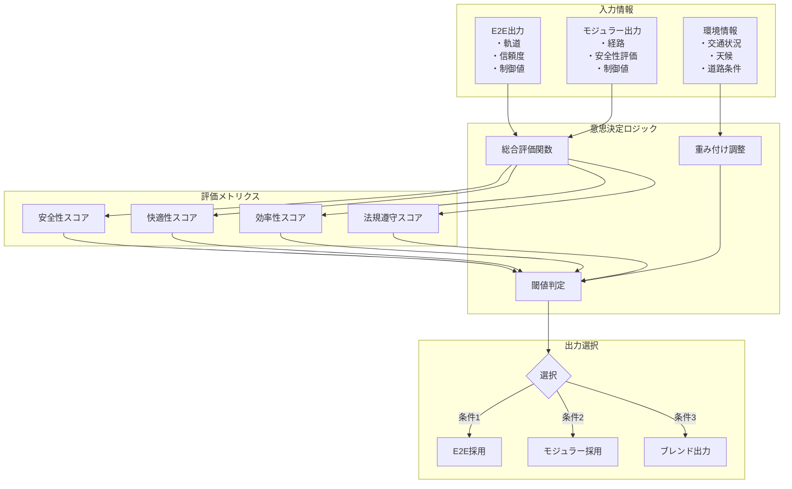

### 3. 安全性保証メカニズム

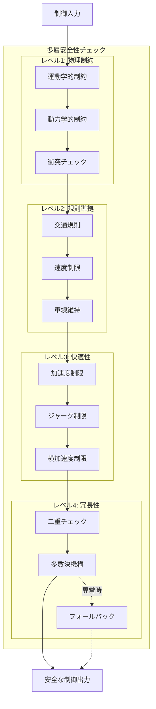

## 実装段階と移行戦略

### フェーズ1: シャドウモード（3-6ヶ月）

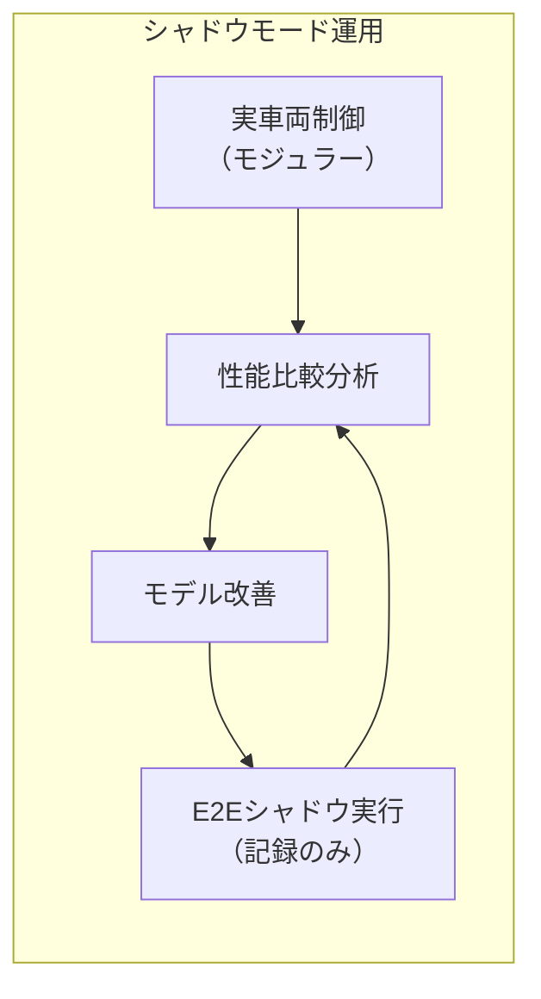

### フェーズ2: 限定的統合（6-12ヶ月）

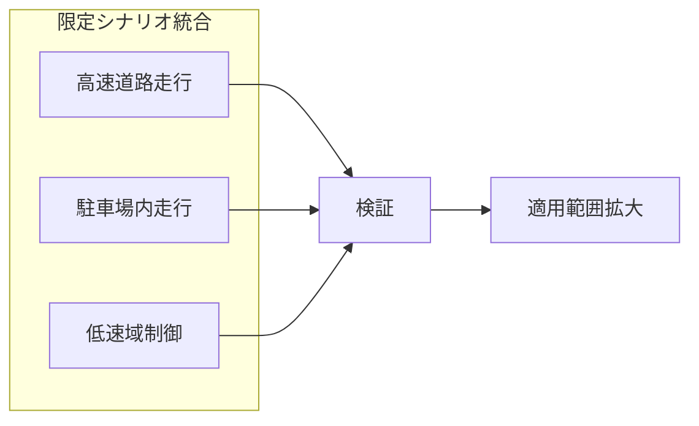

### フェーズ3: 完全統合（12ヶ月以降）

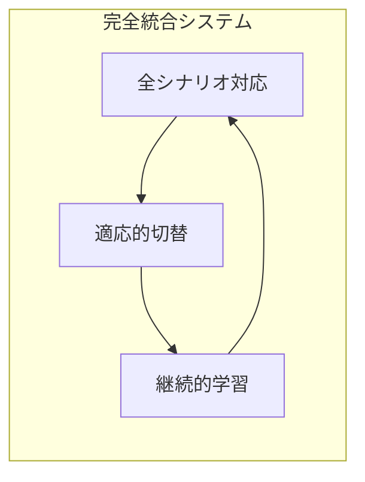

## 技術的課題と解決策

### 1. リアルタイム性の確保

| コンポーネント | 目標レイテンシ | 最適化手法 |
|:-------------|:-------------|:----------|
| E2E推論 | < 50ms | モデル量子化、TensorRT |
| アービター | < 10ms | 並列処理、キャッシング |
| 安全性チェック | < 5ms | ハードウェア加速 |

### 2. 説明可能性の向上

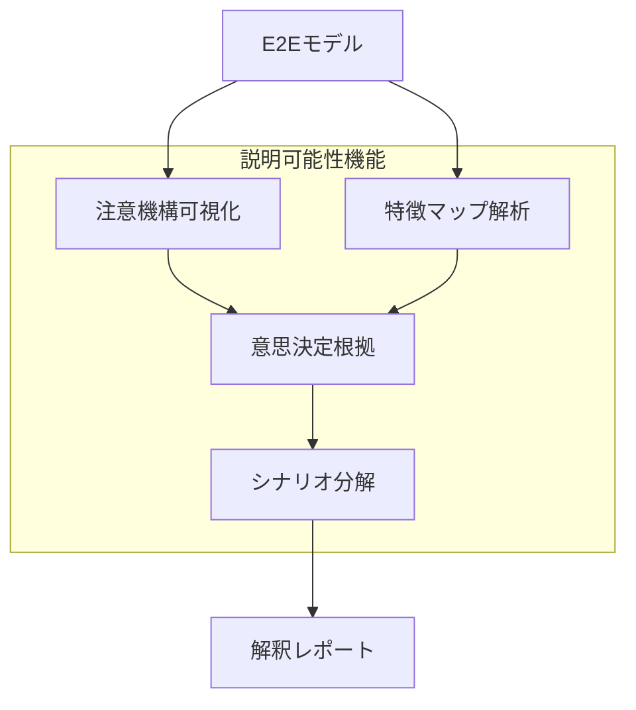

### 3. データ収集と学習

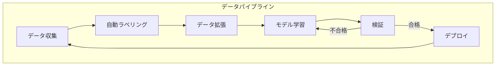

## まとめ

このハイブリッドアーキテクチャにより、以下の利点を実現：

1. **安全性**: モジュラー型の確実性を保持
2. **適応性**: E2E AIの学習能力を活用
3. **説明可能性**: 両方式の長所を組み合わせ
4. **段階的移行**: リスクを最小化した実装

将来的には、E2E AIの信頼性向上とともに、より高度な自動運転の実現が期待されます。