# Autoware × E2E AI 統合アーキテクチャ完全ガイド

## 目次

1. [概要](#1-概要)
2. [E2E自動運転AIの基礎](#2-e2e自動運転aiの基礎)
3. [反射動作と熟考動作の実装](#3-反射動作と熟考動作の実装)
4. [既存E2Eモデルの詳細分析](#4-既存e2eモデルの詳細分析)
5. [統合アーキテクチャ設計](#5-統合アーキテクチャ設計)
6. [リアルタイム分散システム設計](#6-リアルタイム分散システム設計)
7. [実装詳細と技術仕様](#7-実装詳細と技術仕様)
8. [安全性とセキュリティ](#8-安全性とセキュリティ)
9. [段階的導入計画](#9-段階的導入計画)
10. [性能評価と最適化](#10-性能評価と最適化)
11. [将来展望](#11-将来展望)

---

## 1. 概要

### 1.1 背景と目的

本ドキュメントは、従来のモジュラー型自動運転システムであるAutowareに、最新のEnd-to-End（E2E）深層学習モデルを統合するための包括的なアーキテクチャを提示します。この統合により、以下の目標を達成します：

- **安全性の確保**: ISO 26262準拠の機能安全を維持
- **性能の向上**: AI技術による適応的な運転行動の実現
- **説明可能性**: ブラックボックス問題の解決
- **実用性**: 段階的な導入による低リスクな展開

### 1.2 ドキュメントの構成

このドキュメントは、基礎概念から始まり、詳細な技術仕様、実装計画まで、E2E AI統合に必要なすべての情報を網羅しています。各セクションには、理解を助けるための図表と詳細な説明が含まれています。

---

## 2. E2E自動運転AIの基礎

### 2.1 従来のモジュラー型 vs E2E AI

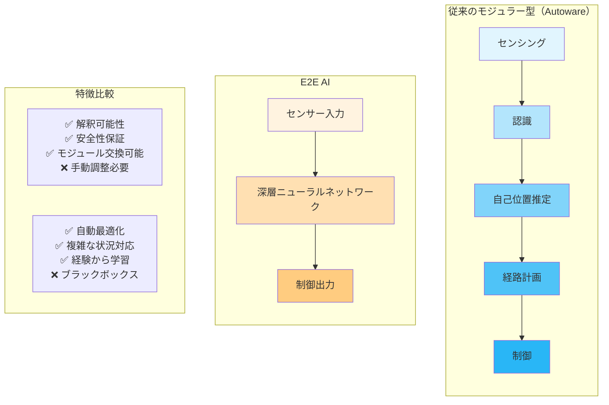

**詳細説明**：
従来のモジュラー型アプローチでは、各機能が独立したモジュールとして実装され、段階的に処理が進みます。これにより、各段階での処理内容が明確で、問題が発生した際の原因特定が容易です。一方、E2E AIアプローチでは、センサー入力から制御出力まで一つの深層学習モデルで処理するため、複雑な状況への適応力が高く、人間の運転に近い滑らかな動作を実現できます。

### 2.2 E2E AIの利点と課題

**利点**：
- **全体最適化**: センサー入力から制御出力まで一貫した最適化
- **暗黙知の学習**: 言語化困難な運転スキルの獲得
- **適応性**: 新しい状況への柔軟な対応
- **開発効率**: 手動でのルール設計が不要

**課題**：
- **ブラックボックス性**: 判断根拠の説明が困難
- **安全性保証**: 形式的検証の困難さ
- **データ依存性**: 大量の学習データが必要
- **計算資源**: 高性能なハードウェアが必要

---

## 3. 反射動作と熟考動作の実装

### 3.1 概要

Autowareは安全で効率的な自動運転を実現するため、**反射動作（Reflexive Actions）**と**熟考動作（Deliberative Actions）**を階層的に実装しています。この二重構造により、緊急時の即座の対応と通常時の最適な行動計画を両立させています。

### 3.2 反射動作と熟考動作の分類

```mermaid
graph TB
    subgraph "反射動作 (Reflexive Actions)"
        AEB[緊急ブレーキ<br/>AEB<br/>(autoware_auto_emergency_braking)]
        MRM[最小リスク操作<br/>MRM<br/>(autoware_adapi_v1_msgs)]
        FILTER[制御フィルタ<br/>CMD Gate<br/>(vehicle_cmd_gate)]
        EMERGENCY[緊急停止<br/>Emergency Stop<br/>(emergency_handler)]
    end
    
    subgraph "熟考動作 (Deliberative Actions)"
        MISSION[ミッション計画<br/>Mission Planning<br/>(mission_planner)]
        BEHAVIOR[行動計画<br/>Behavior Planning<br/>(behavior_path_planner)]
        MOTION[運動計画<br/>Motion Planning<br/>(motion_planner)]
        OPTIMIZE[経路最適化<br/>Path Optimization<br/>(obstacle_avoidance_planner)]
    end
    
    subgraph "特徴"
        REFLEX_CHAR[反射動作特徴:<br/>・低レイテンシー<br/>・ハードコード<br/>・安全性重視<br/>・単純ルール]
        DELIB_CHAR[熟考動作特徴:<br/>・高レイテンシー<br/>・最適化<br/>・効率性重視<br/>・複雑計算]
    end
```

**詳細説明**：
反射動作は、人間の脊髄反射に相当する即座の反応を実現します。これらは1-100msという極めて短い時間で実行され、事前に定義された単純なルールに基づいて動作します。一方、熟考動作は人間の前頭前野での思考に相当し、100ms-10秒という比較的長い時間をかけて最適な行動を計画します。この二重構造により、安全性と効率性を両立させています。

### 3.3 階層的意思決定システム

```mermaid
graph TD
    SENSOR[センサー入力<br/>(sensing)] --> PERCEPTION[認識処理<br/>(perception)]
    PERCEPTION --> EMERGENCY_CHECK{緊急状況?<br/>(system_monitor)}
    
    EMERGENCY_CHECK -->|Yes| REFLEXIVE[反射動作実行]
    EMERGENCY_CHECK -->|No| DELIBERATIVE[熟考動作実行]
    
    subgraph "反射動作層 (1-10ms)"
        REFLEXIVE --> AEB_CHECK{衝突危険?}
        AEB_CHECK -->|Yes| AEB_BRAKE[緊急ブレーキ]
        AEB_CHECK -->|No| MRM_CHECK{システム故障?}
        MRM_CHECK -->|Yes| MRM_EXECUTE[MRM実行]
        MRM_CHECK -->|No| FILTER_CHECK{制御値異常?}
        FILTER_CHECK -->|Yes| FILTER_APPLY[フィルタ適用]
        FILTER_CHECK -->|No| NORMAL_CONTROL[通常制御]
    end
    
    subgraph "熟考動作層 (100-1000ms)"
        DELIBERATIVE --> PLAN_MISSION[ミッション計画<br/>大局的経路]
        PLAN_MISSION --> PLAN_BEHAVIOR[行動計画<br/>車線変更・回避]
        PLAN_BEHAVIOR --> PLAN_MOTION[運動計画<br/>詳細軌道]
        PLAN_MOTION --> OPTIMIZE[最適化<br/>平滑化]
    end
    
    AEB_BRAKE --> VEHICLE[車両制御<br/>(vehicle_interface)]
    MRM_EXECUTE --> VEHICLE
    FILTER_APPLY --> VEHICLE
    NORMAL_CONTROL --> VEHICLE
    OPTIMIZE --> VEHICLE
```

**詳細説明**：
階層的意思決定システムでは、センサー入力から認識処理を経て、まず緊急状況の有無を判断します。緊急状況が検出された場合は反射動作層で即座に対応し、そうでない場合は熟考動作層でより複雑な計画を立てます。反射動作層では衝突危険、システム故障、制御値異常を段階的にチェックし、それぞれに適切な対応を行います。

### 3.4 反射動作の詳細実装

#### 3.4.1 AEB (Autonomous Emergency Braking)

```mermaid
flowchart TD
    START[AEB開始<br/>(aeb_node)] --> ACTIVE_CHECK{AEB有効?<br/>(aeb_node)}
    ACTIVE_CHECK -->|No| END[終了]
    ACTIVE_CHECK -->|Yes| PATH_GEN[予測経路生成<br/>IMU/MPC<br/>(trajectory_generator)]
    
    PATH_GEN --> OBSTACLE_DET[障害物検出<br/>点群/物体<br/>(euclidean_cluster)]
    OBSTACLE_DET --> SPEED_EST[障害物速度推定<br/>(multi_object_tracker)]
    SPEED_EST --> RSS_CALC[RSS距離計算<br/>(aeb_node)]
    
    RSS_CALC --> COLLISION_CHECK{衝突危険?}
    COLLISION_CHECK -->|Yes| EMERGENCY_BRAKE[緊急ブレーキ信号<br/>診断システムへ]
    COLLISION_CHECK -->|No| MONITOR[監視継続]
    
    EMERGENCY_BRAKE --> END
    MONITOR --> PATH_GEN
    
    subgraph "RSS計算"
        RSS_FORMULA["d = v_ego*t_response + v_ego²/(2*a_min)<br/>- sign(v_obj)*v_obj²/(2*a_obj_min) + offset"]
    end
```

**詳細説明**：
AEB（自動緊急ブレーキ）は、Responsibility-Sensitive Safety（RSS）モデルに基づいて衝突リスクを計算します。RSS距離計算では、自車速度、反応時間、最小減速度、障害物速度を考慮して安全距離を算出します。この計算は1-10ms以内に完了し、衝突危険が検出されると即座に緊急ブレーキを作動させます。

**特徴**:
- **応答時間**: 1-10ms
- **判断基準**: RSS距離による厳密な計算
- **動作**: 即座の緊急ブレーキ

#### 3.4.2 MRM (Minimum Risk Maneuver)

```mermaid
flowchart TD
    FAILURE[システム故障検知<br/>(system_error_monitor)] --> MRM_SELECT{MRM選択<br/>(mrm_handler)}
    
    MRM_SELECT --> COMFORTABLE[快適停止<br/>Comfortable Stop<br/>(mrm_comfortable_stop)]
    MRM_SELECT --> EMERGENCY[緊急停止<br/>Emergency Stop<br/>(mrm_emergency_stop)]
    MRM_SELECT --> PULLOVER[路肩退避<br/>Pull Over<br/>(mrm_pull_over)]
    
    COMFORTABLE --> GRADUAL_STOP[段階的減速停止]
    EMERGENCY --> IMMEDIATE_STOP[即座の急停止]
    PULLOVER --> SAFE_LOCATION[安全な場所への移動]
    
    GRADUAL_STOP --> HAZARD[ハザードランプ点灯]
    IMMEDIATE_STOP --> HAZARD
    SAFE_LOCATION --> HAZARD
    
    HAZARD --> COMPLETE[MRM完了]
```

**詳細説明**：
MRM（最小リスク操作）は、システム故障時に車両を安全な状態に移行させる機能です。故障の種類と重要度に応じて、快適停止（通常の減速）、緊急停止（急停止）、路肩退避（安全な場所への移動）のいずれかを選択します。すべての場合でハザードランプを点灯させ、周囲に異常を知らせます。

**特徴**:
- **応答時間**: 10-100ms
- **判断基準**: システム故障の種類と重要度
- **動作**: 状況に応じた最小リスク行動

#### 3.4.3 Vehicle Command Gate

```mermaid
flowchart TD
    CONTROL_IN[制御コマンド入力<br/>(control_command)] --> GATE_MODE{ゲートモード<br/>(vehicle_cmd_gate)}
    
    GATE_MODE --> AUTO[自動運転モード<br/>(autonomous_mode)]
    GATE_MODE --> EXTERNAL[外部制御モード<br/>(external_mode)]
    GATE_MODE --> EMERGENCY[緊急モード<br/>(emergency_mode)]
    
    AUTO --> FILTER[制御フィルタ]
    EXTERNAL --> FILTER
    EMERGENCY --> DIRECT[直接出力]
    
    FILTER --> LIMIT_CHECK{制限値チェック}
    LIMIT_CHECK -->|正常| OUTPUT[車両へ出力]
    LIMIT_CHECK -->|異常| LIMIT_APPLY[制限値適用]
    
    LIMIT_APPLY --> OUTPUT
    DIRECT --> OUTPUT
    
    subgraph "フィルタ項目"
        VEL_LIM[速度制限]
        ACC_LIM[加速度制限]
        JERK_LIM[ジャーク制限]
        LAT_LIM[横加速度制限]
    end
```

**詳細説明**：
Vehicle Command Gateは、車両への最終的な制御コマンドをフィルタリングする安全機構です。速度、加速度、ジャーク、横加速度の制限値をチェックし、異常な値を検出した場合は安全な範囲に制限します。緊急モードでは、フィルタをバイパスして直接制御を可能にします。

**特徴**:
- **応答時間**: < 1ms
- **判断基準**: 事前定義された制限値
- **動作**: 異常値の補正・制限

### 3.5 熟考動作の詳細実装

#### 3.5.1 階層的計画システム

```mermaid
flowchart TD
    GOAL[目標設定<br/>(route_selector)] --> MISSION_PLAN[ミッション計画<br/>(mission_planner)]
    
    subgraph "ミッション計画 (1-10秒)"
        MISSION_PLAN --> ROUTE_SEARCH[大局的経路探索<br/>A*アルゴリズム<br/>(route_planner)]
        ROUTE_SEARCH --> WAYPOINT[ウェイポイント生成<br/>(waypoint_generator)]
    end
    
    subgraph "行動計画 (100-1000ms)"
        WAYPOINT --> BEHAVIOR_SEL[行動選択<br/>(behavior_path_planner)]
        BEHAVIOR_SEL --> LANE_FOLLOW[車線追従<br/>(lane_following)]
        BEHAVIOR_SEL --> LANE_CHANGE[車線変更<br/>(lane_change)]
        BEHAVIOR_SEL --> AVOIDANCE[障害物回避<br/>(avoidance)]
        BEHAVIOR_SEL --> INTERSECTION[交差点通過<br/>(intersection)]
        
        LANE_FOLLOW --> BEHAVIOR_PATH[行動経路生成<br/>(path_generator)]
        LANE_CHANGE --> BEHAVIOR_PATH
        AVOIDANCE --> BEHAVIOR_PATH
        INTERSECTION --> BEHAVIOR_PATH
    end
    
    subgraph "運動計画 (10-100ms)"
        BEHAVIOR_PATH --> MOTION_PLAN[運動計画<br/>(motion_planner)]
        MOTION_PLAN --> TRAJECTORY[軌道生成<br/>Frenet座標系<br/>(trajectory_generator)]
        TRAJECTORY --> VELOCITY[速度プロファイル]
        VELOCITY --> OPTIMIZE_PATH[経路最適化]
    end
    
    subgraph "最適化 (1-10ms)"
        OPTIMIZE_PATH --> SMOOTH[平滑化処理]
        SMOOTH --> COLLISION_FREE[衝突回避チェック]
        COLLISION_FREE --> FINAL_TRAJ[最終軌道]
    end
    
    FINAL_TRAJ --> CONTROL[制御コマンド生成]
```

**詳細説明**：
熟考動作は階層的な計画システムとして実装されています。最上位のミッション計画では、目的地までの大局的な経路をA*アルゴリズムで探索します。行動計画では、車線変更や障害物回避などの具体的な行動を選択し、運動計画では実際の軌道を生成します。最後に最適化処理により、滑らかで安全な軌道を生成します。

#### 3.5.2 意思決定プロセス

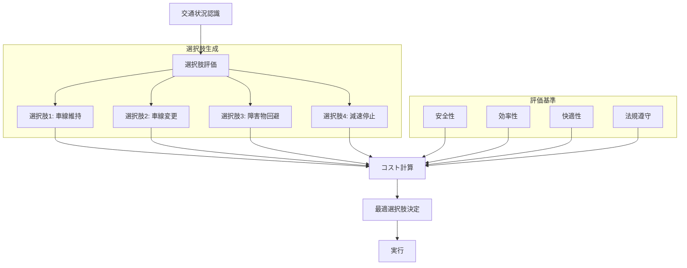

**詳細説明**：
意思決定プロセスでは、現在の交通状況から複数の行動選択肢を生成し、それぞれを安全性、効率性、快適性、法規遵守の観点から評価します。各選択肢のコストを計算し、最もコストの低い（最適な）選択肢を実行します。この多基準評価により、状況に応じた柔軟な判断が可能になります。

### 3.6 統合システムアーキテクチャ

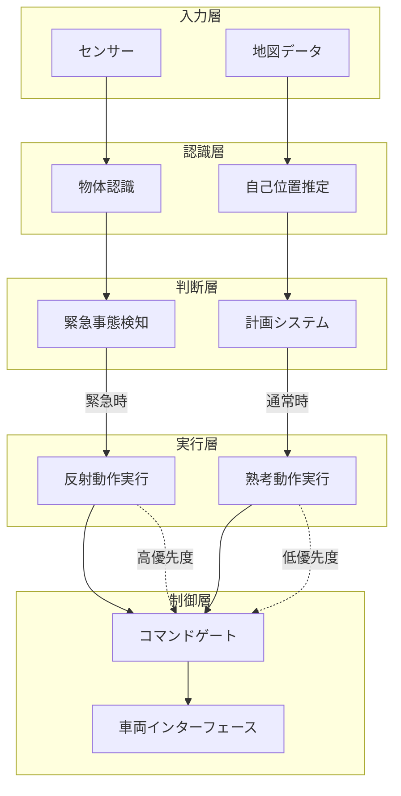

**詳細説明**：
統合システムアーキテクチャでは、入力層から制御層まで5つの層で構成されています。認識層で得られた情報は判断層で緊急性が評価され、緊急時は反射動作実行、通常時は熟考動作実行に振り分けられます。コマンドゲートでは反射動作を高優先度で処理し、安全性を最優先にした制御を実現します。

### 3.7 時間スケールと優先度

| レベル | 動作タイプ | 応答時間 | 優先度 | 主要機能 |
|--------|------------|----------|--------|----------|
| 1 | 反射動作 | 1-10ms | 最高 | AEB, 緊急停止 |
| 2 | 安全制御 | 10-100ms | 高 | MRM, フィルタ |
| 3 | 運動制御 | 100ms | 中 | 軌道追従 |
| 4 | 行動制御 | 1秒 | 中 | 車線変更, 回避 |
| 5 | 計画制御 | 10秒 | 低 | 経路計画 |

この階層的なアーキテクチャにより、Autowareは緊急時の即座の対応と、通常時の最適な計画を両立しています。E2E AIとの統合においても、この反射動作と熟考動作の枠組みは維持され、AIによる高度な判断と即座の安全対応を両立させることが可能となります。

---

## 4. 既存E2Eモデルの詳細分析

### 4.1 代表的なE2E自動運転AIモデル

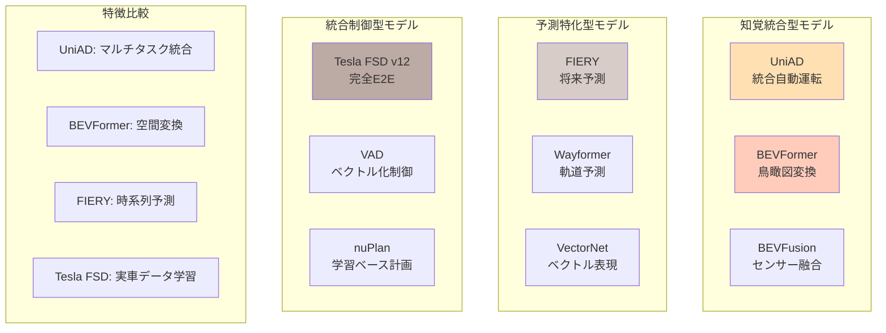

**詳細説明**：
現在の最先端E2E自動運転AIモデルは、大きく3つのカテゴリーに分類されます。知覚統合型は複数のセンサーデータを統一された表現に変換することに特化し、予測特化型は将来の交通参加者の動きを予測することに重点を置き、統合制御型は知覚から制御まで一貫した処理を行います。

### 4.2 UniAD（統合自動運転）の詳細アーキテクチャ

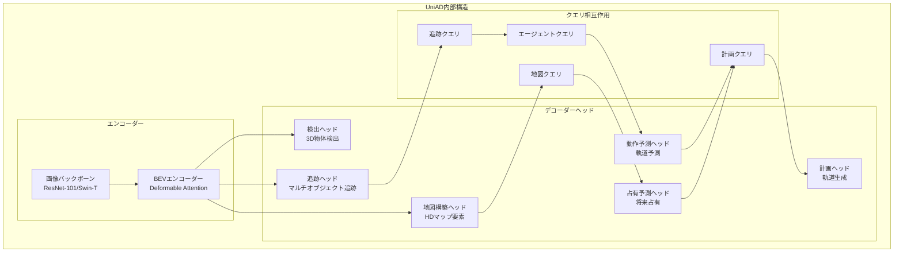

**詳細説明**：
UniAD（Unified Autonomous Driving）は、現代の最先端E2E自動運転AIの代表例です。画像入力は強力なバックボーン（ResNet-101またはSwin Transformer）で特徴抽出され、BEVエンコーダーで鳥瞰図表現に変換されます。6つの異なるデコーダーヘッドが相互に情報を交換しながら動作し、検出、追跡、地図構築、動作予測、占有予測、経路計画を統合的に処理します。

### 4.3 BEVFormer/BEVFusionの空間変換メカニズム

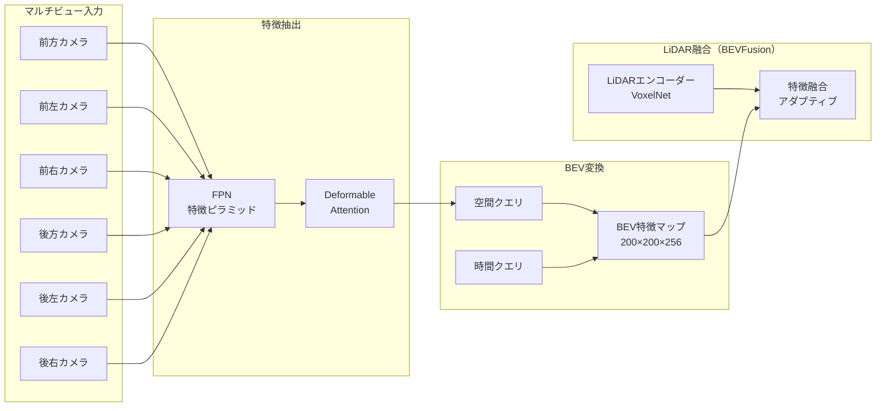

**詳細説明**：
BEVFormerとBEVFusionは、複数のカメラビューから統一された鳥瞰図（BEV）表現を生成する革新的な手法です。6つのカメラからの入力は、FPN（Feature Pyramid Network）で多スケール特徴を抽出し、Deformable Attentionで空間的な対応関係を学習します。BEVFusionではさらにLiDARデータも統合し、カメラの意味的理解とLiDARの正確な距離情報を組み合わせることで、200×200×256次元の豊富な特徴を持つBEV表現を生成します。

### 4.4 モデル実装の詳細仕様

| モデル | 入力仕様 | 出力仕様 | 推論時間 | メモリ使用量 | 特徴 |
|:------|:--------|:--------|:---------|:-----------|:-----|
| **UniAD** | 6カメラ×3フレーム<br/>1600×900 RGB | 3D検出＋追跡＋予測<br/>＋地図＋計画 | 45-50ms | 8GB | マルチタスク統合 |
| **BEVFormer** | 6カメラ<br/>1280×720 RGB | BEV特徴マップ<br/>200×200×256 | 15-20ms | 4GB | 効率的な空間変換 |
| **BEVFusion** | 6カメラ＋LiDAR<br/>点群10万点 | 統合BEV特徴<br/>＋3D検出 | 25-30ms | 6GB | マルチモーダル融合 |
| **FIERY** | BEV特徴系列<br/>過去0.5秒 | 将来BEV予測<br/>1.0秒先まで | 20-25ms | 3GB | 時系列予測 |
| **VAD** | ベクトル化地図<br/>＋BEV特徴 | ベクトル化軌道<br/>制御点列 | 10-15ms | 2GB | 軽量・高速 |
| **Tesla FSD v12** | 8カメラ<br/>1280×960 RGB | 直接制御コマンド | 30-40ms | 10GB | 完全E2E |

---

## 5. 統合アーキテクチャ設計

### 5.1 ハイブリッド統合アーキテクチャ

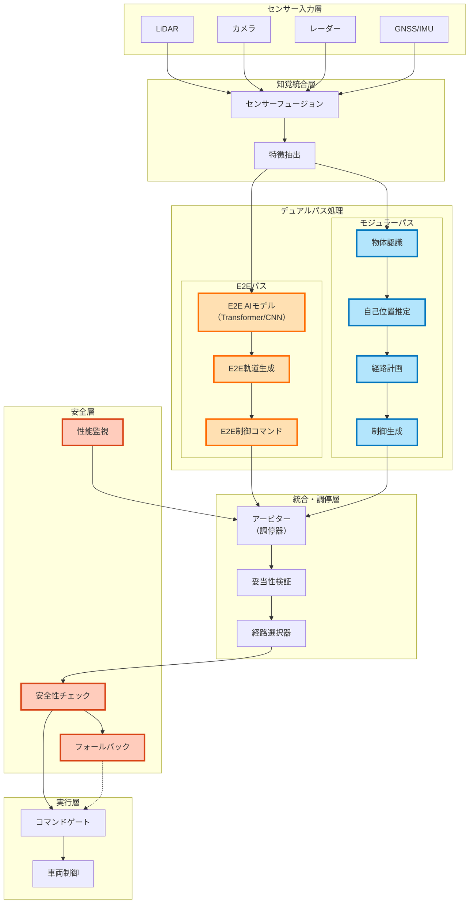

**詳細説明**：
このハイブリッド統合アーキテクチャは、従来のモジュラー型処理とE2E AI処理を並列に実行する革新的な設計です。センサーデータは「知覚統合層」で前処理された後、二つの独立したパスで処理されます。E2Eパスでは深層学習モデルが直接センサーデータから制御コマンドを生成し、モジュラーパスでは従来の段階的処理を行います。「統合・調停層」のアービターが両方の出力を評価し、状況に応じて最適な選択を行います。これにより、AIの創造性と従来手法の信頼性を組み合わせることができます。

### 5.2 動作モードとトランジション

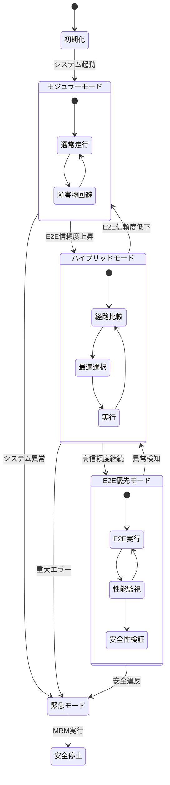

**詳細説明**：
システムは動作状況とE2E AIの信頼度に応じて、異なる動作モード間を遷移します。初期化後は安全性を重視した「モジュラーモード」で開始し、E2Eの信頼度が上昇すると「ハイブリッドモード」へ移行します。さらに高い信頼度が継続すると「E2E優先モード」へ移行しますが、異常検知時には即座により安全なモードへ戻ります。この段階的な移行戦略により、新しいAI技術を安全に導入しながら、常に安全な状態へのフォールバックを保証します。

### 5.3 高度なアービター設計

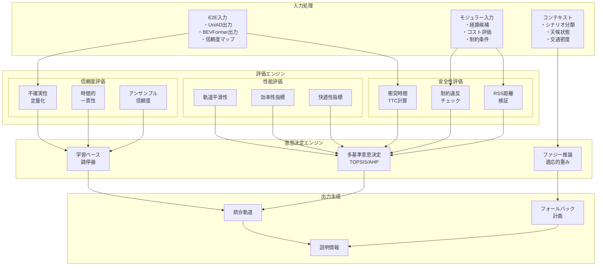

**詳細説明**：
アービター（調停器）は、E2Eとモジュラーシステムの出力を統合する重要なコンポーネントです。安全性評価では衝突時間（TTC）やResponsibility-Sensitive Safety（RSS）距離を計算し、性能評価では軌道の平滑性や効率性を評価します。信頼度評価では不確実性の定量化と時間的一貫性をチェックします。これらの評価結果は、多基準意思決定（MCDA）と機械学習ベースの調停器により統合され、最適な軌道が選択されます。

---

## 6. リアルタイム分散システム設計

### 6.1 リアルタイム制約階層

```mermaid
graph TD
    subgraph "ハードリアルタイム [1-10ms]"
        HRT_AEB[自動緊急ブレーキ<br/>WCET: 5ms<br/>(autonomous_emergency_braking)]
        HRT_STEER[操舵制御<br/>WCET: 8ms<br/>(trajectory_follower_nodes)]
        HRT_BRAKE[ブレーキ制御<br/>WCET: 6ms<br/>(vehicle_cmd_gate)]
        HRT_SAFETY[安全監視<br/>WCET: 3ms<br/>(system_monitor)]
    end
    
    subgraph "ファームリアルタイム [10-50ms]"
        FRT_DETECT[物体検出<br/>WCET: 30ms<br/>(lidar_centerpoint)]
        FRT_TRACK[物体追跡<br/>WCET: 25ms<br/>(multi_object_tracker)]
        FRT_FUSION[センサー融合<br/>WCET: 20ms<br/>(pointcloud_fusion)]
        FRT_LOC[自己位置推定<br/>WCET: 35ms<br/>(ekf_localizer)]
    end
    
    subgraph "ソフトリアルタイム [50-200ms]"
        SRT_PLAN[経路計画<br/>平均: 100ms<br/>(behavior_path_planner)]
        SRT_E2E[E2E推論<br/>平均: 80ms<br/>(e2e_driving_model)]
        SRT_MAP[地図更新<br/>平均: 150ms<br/>(map_loader)]
        SRT_PRED[軌道予測<br/>平均: 120ms<br/>(prediction_planner)]
    end
    
    subgraph "ベストエフォート [200ms+]"
        BE_LOG[ログ記録<br/>(logging_simulator)]
        BE_DIAG[診断情報<br/>(diagnostic_aggregator)]
        BE_UPLOAD[クラウド通信<br/>(web_controller)]
        BE_LEARN[オンライン学習<br/>(ml_pipeline)]
    end
    
    HRT_SAFETY --> FRT_DETECT
    FRT_DETECT --> FRT_TRACK
    FRT_TRACK --> SRT_PLAN
    SRT_PLAN --> HRT_STEER
    SRT_E2E --> HRT_BRAKE
    
    style HRT_AEB fill:#ffcdd2,stroke:#d32f2f,stroke-width:3px
    style HRT_STEER fill:#ffcdd2,stroke:#d32f2f,stroke-width:3px
    style HRT_BRAKE fill:#ffcdd2,stroke:#d32f2f,stroke-width:3px
    style HRT_SAFETY fill:#ffcdd2,stroke:#d32f2f,stroke-width:3px
```

**詳細説明**：
自動運転システムにおける時間制約は、その重要度に応じて4つのレベルに分類されます。ハードリアルタイム（1-10ms）には、AEBや操舵・ブレーキ制御など、遅延が許されない安全機能が含まれます。ファームリアルタイム（10-50ms）には、物体検出や追跡など、一定の遅延は許容されるが予測可能性が必要な機能が含まれます。ソフトリアルタイム（50-200ms）には、経路計画やE2E推論など、平均的な性能が重要な機能が含まれます。WCET（最悪実行時間）分析により、各機能が必ず制約時間内に完了することを保証します。

### 6.2 計算リソース配分アーキテクチャ

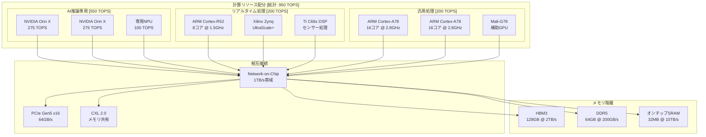

**詳細説明**：
総計算能力950 TOPSを効率的に配分するアーキテクチャです。AI推論専用に550 TOPS（NVIDIA Orin X×2 + 専用NPU）を割り当て、大規模な深層学習モデルの実行を可能にします。リアルタイム処理には200 TOPSを割り当て、ARM Cortex-R52とFPGAにより決定論的な処理を保証します。メモリ階層も重要で、HBM3（2TB/s）は高帯域が必要なAI処理に、DDR5（200GB/s）は汎用処理に、オンチップSRAM（10TB/s）は超低遅延が必要な処理に使用されます。

### 6.3 ゾーン型ECUアーキテクチャ

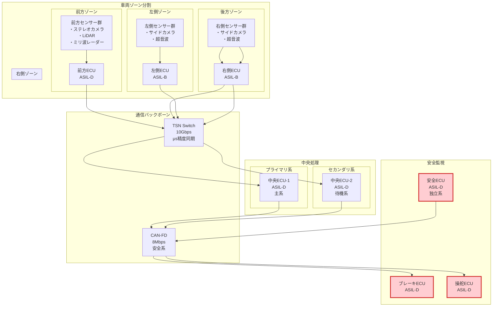

**詳細説明**：
このゾーン型ECUアーキテクチャは、車両を物理的なゾーンに分割し、各ゾーンに専用のECUを配置する最新の設計です。従来の機能別ECU配置から位置別配置への転換により、配線の簡素化と処理の効率化を実現します。各ゾーンECUはそのゾーンのセンサーデータを処理し、TSN Ethernet（10Gbps）経由で中央ECUへ送信します。中央ECUは主系と待機系の二重化構成で、高い可用性を確保します。安全系は独立したCAN-FDネットワークで接続され、最終的な安全保証を提供します。

### 6.4 分散処理フローと同期機構

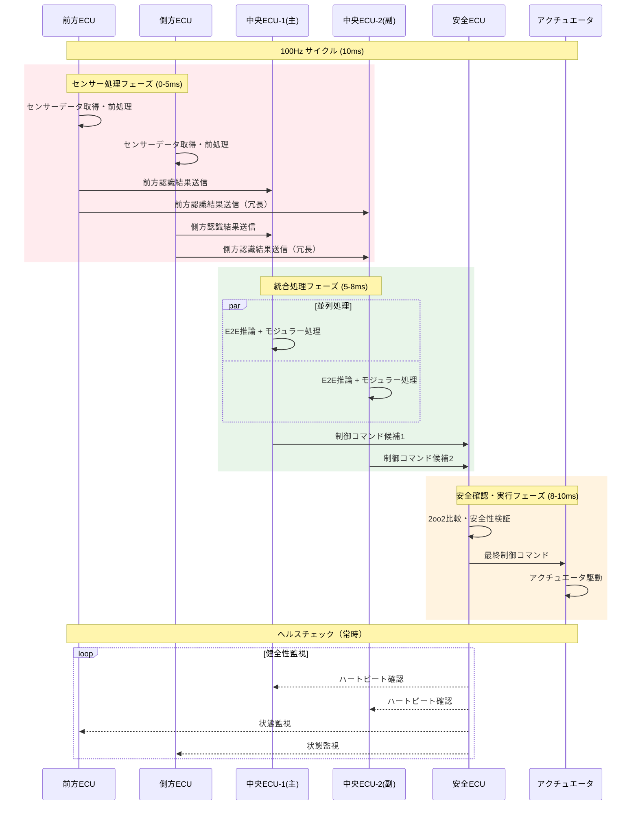

**詳細説明**：
このシーケンス図は、100Hz（10ms）サイクルでの分散処理の流れを示しています。前方ECUと側方ECUが並列にセンサー処理を行い（0-5ms）、結果を中央ECUの主系と副系の両方に送信します。中央ECUでは並列にE2E推論とモジュラー処理を実行し（5-8ms）、それぞれの制御コマンド候補を安全ECUに送信します。安全ECUは2oo2（2つのうち2つ）比較により安全性を検証し、最終的な制御コマンドをアクチュエータに送信します（8-10ms）。全体を通じてヘルスチェックが実行され、故障を即座に検出します。

---

## 7. 実装詳細と技術仕様

### 7.1 E2E AIモデルの最適化

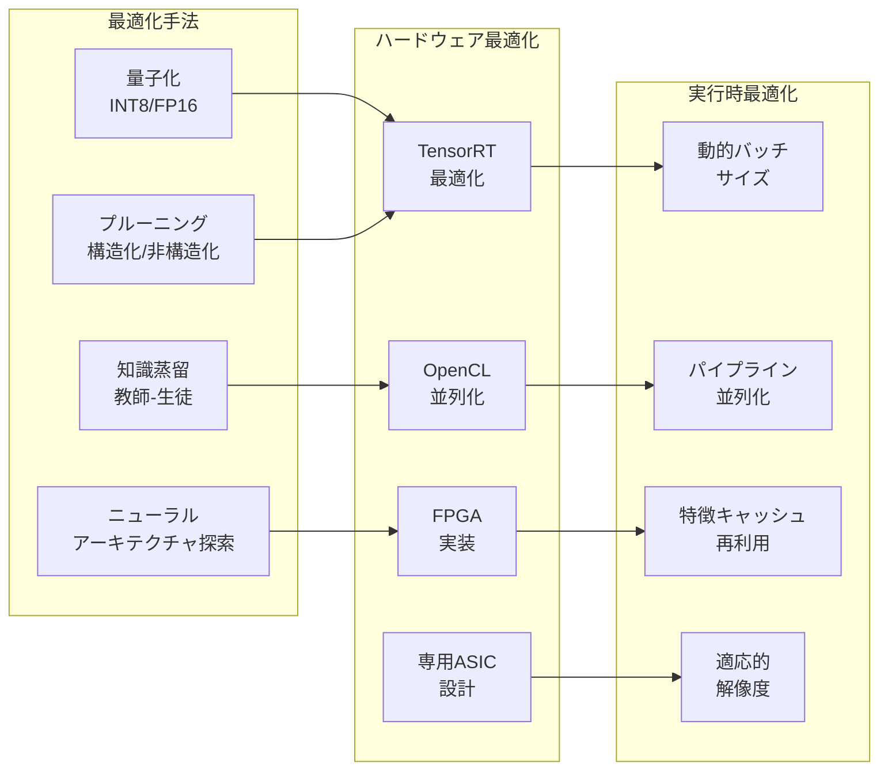

**詳細説明**：
E2E AIモデルの実装には、多層的な最適化が必要です。量子化によりモデルの精度を維持しながらINT8やFP16演算を使用し、推論速度を向上させます。プルーニングでは不要なパラメータを削除し、モデルサイズと計算量を削減します。知識蒸留では大規模な教師モデルから小規模な生徒モデルへ知識を転移し、軽量化を実現します。これらの最適化されたモデルは、TensorRTやFPGA実装によりさらに高速化され、動的バッチサイズ調整やパイプライン並列化により実行時の効率を最大化します。

### 7.2 不確実性の定量化と管理

```mermaid
graph TD
    subgraph "不確実性の源"
        ALEATORIC[偶然的不確実性<br/>・センサーノイズ<br/>・観測の曖昧さ]
        EPISTEMIC[認識的不確実性<br/>・モデルの限界<br/>・学習データ不足]
    end
    
    subgraph "定量化手法"
        DROPOUT[MCドロップアウト<br/>推論時適用]
        ENSEMBLE_UNC[アンサンブル<br/>分散計算]
        BAYESIAN[ベイズNN<br/>事後分布]
        EVIDENTIAL[エビデンシャル<br/>深層学習]
    end
    
    subgraph "不確実性伝播"
        PERCEP_UNC[知覚不確実性]
        PRED_UNC[予測不確実性]
        PLAN_UNC[計画不確実性]
    end
    
    subgraph "リスク管理"
        THRESHOLD[閾値管理]
        FALLBACK_TRIG[フォールバック<br/>トリガー]
        SAFE_MARGIN[安全マージン<br/>調整]
    end
    
    ALEATORIC --> DROPOUT
    ALEATORIC --> ENSEMBLE_UNC
    EPISTEMIC --> BAYESIAN
    EPISTEMIC --> EVIDENTIAL
    
    DROPOUT --> PERCEP_UNC
    ENSEMBLE_UNC --> PRED_UNC
    BAYESIAN --> PLAN_UNC
    
    PERCEP_UNC --> THRESHOLD
    PRED_UNC --> FALLBACK_TRIG
    PLAN_UNC --> SAFE_MARGIN
```

**詳細説明**：
E2E AIシステムにおける不確実性は、偶然的不確実性（データの本質的なノイズ）と認識的不確実性（モデルの知識不足）に分類されます。MCドロップアウトでは推論時に複数回の予測を行い、その分散から不確実性を推定します。アンサンブル手法では複数のモデルの予測の分散を利用します。これらの不確実性は、知覚、予測、計画の各段階で伝播し、最終的にはリスク管理システムで閾値管理され、必要に応じてフォールバックや安全マージンの調整を行います。

### 7.3 データ収集と継続的学習

```mermaid
flowchart TD
    subgraph "データ収集"
        FLEET[車両フリート<br/>1000台規模]
        EDGE_COL[エッジ収集<br/>選択的記録]
        CLOUD_UP[クラウド<br/>アップロード]
    end
    
    subgraph "データ処理"
        AUTO_LABEL[自動ラベリング<br/>・既存モデル活用<br/>・アクティブ学習]
        HUMAN_VAL[人間検証<br/>・エッジケース<br/>・品質保証]
        DATA_AUG[データ拡張<br/>・シミュレーション<br/>・敵対的生成]
    end
    
    subgraph "モデル更新"
        TRAIN_PIPE[分散学習<br/>・連合学習<br/>・差分学習]
        VALIDATE[検証<br/>・A/Bテスト<br/>・シミュレーション]
        DEPLOY[デプロイ<br/>・段階的展開<br/>・ロールバック]
    end
    
    subgraph "監視・評価"
        MONITOR_PERF[性能監視]
        ANOMALY[異常検知]
        FEEDBACK[フィードバック<br/>ループ]
    end
    
    FLEET --> EDGE_COL
    EDGE_COL --> CLOUD_UP
    CLOUD_UP --> AUTO_LABEL
    
    AUTO_LABEL --> HUMAN_VAL
    HUMAN_VAL --> DATA_AUG
    DATA_AUG --> TRAIN_PIPE
    
    TRAIN_PIPE --> VALIDATE
    VALIDATE --> DEPLOY
    DEPLOY --> MONITOR_PERF
    
    MONITOR_PERF --> ANOMALY
    ANOMALY --> FEEDBACK
    FEEDBACK --> EDGE_COL
```

**詳細説明**：
継続的学習パイプラインは、大規模な車両フリートからのデータ収集から始まります。エッジ側で重要なシーンを選択的に記録し、クラウドにアップロードします。自動ラベリングシステムが既存モデルを活用してアノテーションを行い、人間のバリデーターがエッジケースを確認します。データ拡張により多様性を確保し、分散学習や連合学習により新しいモデルを訓練します。A/Bテストとシミュレーションで検証後、段階的にデプロイされ、性能監視とフィードバックループにより継続的な改善を実現します。

---

## 8. 安全性とセキュリティ

### 8.1 機能安全アーキテクチャ（ISO 26262準拠）

```mermaid
graph TB
    subgraph "ASIL-D [最高安全性]"
        subgraph "安全機能"
            AEB_D["自動緊急ブレーキ<br/>2oo3投票"]
            STEER_D["操舵制御<br/>2oo3投票"]
            BRAKE_D["ブレーキ制御<br/>2oo3投票"]
        end
        subgraph "監視機能"
            SAFE_MON["安全監視<br/>独立系"]
            DIAG["診断機能<br/>継続監視"]
        end
    end
    
    subgraph "ASIL-B [高安全性]"
        PERCEP_B["知覚処理<br/>ASIL-B(D)"]
        PLAN_B["経路計画<br/>ASIL-B"]
        LOC_B["自己位置<br/>ASIL-B"]
    end
    
    subgraph "QM [品質管理]"
        E2E_QM["E2E AI推論<br/>QM+監視"]
        MAP_QM["地図更新<br/>QM"]
        HMI_QM["HMI表示<br/>QM"]
    end
    
    subgraph "安全メカニズム"
        REDUNDANCY["冗長性<br/>・ハードウェア<br/>・ソフトウェア"]
        MONITOR["継続監視<br/>・健全性<br/>・性能"]
        FALLBACK_SAFE["フェイルセーフ<br/>・縮退動作<br/>・安全停止"]
    end
    
    AEB_D --> SAFE_MON
    STEER_D --> SAFE_MON
    BRAKE_D --> SAFE_MON
    
    PERCEP_B --> MONITOR
    PLAN_B --> MONITOR
    LOC_B --> MONITOR
    
    E2E_QM --> MONITOR
    MAP_QM --> MONITOR
    
    MONITOR --> FALLBACK_SAFE
    SAFE_MON --> FALLBACK_SAFE
    
    style AEB_D fill:#ffcdd2,stroke:#d32f2f,stroke-width:3px
    style STEER_D fill:#ffcdd2,stroke:#d32f2f,stroke-width:3px
    style BRAKE_D fill:#ffcdd2,stroke:#d32f2f,stroke-width:3px
```

**詳細説明**：
ISO 26262に準拠した機能安全アーキテクチャでは、各機能をASIL（Automotive Safety Integrity Level）に基づいて分類します。ASIL-Dは最高レベルの安全性要求で、ブレーキや操舵制御などの重要機能に適用されます。これらの機能は2oo3（3つのうち2つ）投票システムで実装され、単一故障では機能が失われません。E2E AI推論はQMレベルですが、独立した監視機能により安全性を確保します。すべての機能は継続的に監視され、異常時にはフェイルセーフメカニズムにより安全な状態に移行します。

### 8.2 フェイルセーフ・フェイルオペレーショナル設計

```mermaid
stateDiagram-v2
    [*] --> 正常動作
    
    正常動作 --> 性能劣化: 軽微な故障
    性能劣化 --> 正常動作: 自己修復
    
    性能劣化 --> 縮退動作: 重要部故障
    正常動作 --> 縮退動作: 重大故障
    
    縮退動作 --> 最小リスク状態: 安全機能故障
    性能劣化 --> 最小リスク状態: 複合故障
    
    最小リスク状態 --> 安全停止: MRM実行
    
    state 正常動作 {
        [*] --> フル機能
        フル機能 --> 冗長系切替
        冗長系切替 --> フル機能
    }
    
    state 性能劣化 {
        [*] --> 機能制限
        機能制限 --> 速度制限
        速度制限 --> 機能制限
        note right of 速度制限: 最高速度60km/h
    }
    
    state 縮退動作 {
        [*] --> 手動優先
        手動優先 --> 車線維持のみ
        note right of 車線維持のみ: ACCのみ動作
    }
    
    state 最小リスク状態 {
        [*] --> 路肩停止
        路肩停止 --> ハザード点滅
        note right of ハザード点滅: 緊急通報
    }
```

**詳細説明**：
フェイルセーフ・フェイルオペレーショナル設計により、システムは故障時でも可能な限り機能を維持します。軽微な故障では「性能劣化」モードで最高速度を制限しながら動作を継続し、重要部の故障では「縮退動作」モードで基本的な車線維持機能のみを提供します。安全機能も故障した場合は「最小リスク状態」に移行し、路肩に安全に停止してハザードを点滅させ、緊急通報を行います。この段階的な劣化により、突然の機能喪失を防ぎ、常に安全な状態を維持します。

### 8.3 サイバーセキュリティ統合

```mermaid
graph TB
    subgraph "セキュリティレイヤー"
        subgraph "境界防御"
            FIREWALL[ファイアウォール<br/>侵入検知]
            VPN[VPN通信<br/>暗号化]
            ACCESS[アクセス制御<br/>認証・認可]
        end
        
        subgraph "内部保護"
            SECURE_BOOT[セキュアブート<br/>改ざん防止]
            CRYPTO[暗号化<br/>・通信<br/>・ストレージ]
            INTEGRITY[完全性検証<br/>・コード署名<br/>・ハッシュ検証]
        end
        
        subgraph "監視・対応"
            IDS[侵入検知<br/>システム]
            SIEM[セキュリティ<br/>情報管理]
            INCIDENT[インシデント<br/>対応]
        end
        
        subgraph "AI特有の対策"
            ADV_DEFENSE[敵対的攻撃<br/>防御]
            MODEL_PROTECT[モデル保護<br/>・難読化<br/>・暗号化]
            DATA_PRIVACY[データ<br/>プライバシー]
        end
    end
    
    FIREWALL --> IDS
    VPN --> ACCESS
    ACCESS --> SECURE_BOOT
    
    SECURE_BOOT --> CRYPTO
    CRYPTO --> INTEGRITY
    INTEGRITY --> SIEM
    
    IDS --> INCIDENT
    SIEM --> INCIDENT
    
    ADV_DEFENSE --> MODEL_PROTECT
    MODEL_PROTECT --> DATA_PRIVACY
    
    style SECURE_BOOT fill:#e8f5e9,stroke:#4caf50,stroke-width:3px
    style CRYPTO fill:#e8f5e9,stroke:#4caf50,stroke-width:3px
    style ADV_DEFENSE fill:#fff3e0,stroke:#ff9800,stroke-width:3px
```

**詳細説明**：
サイバーセキュリティは、境界防御、内部保護、監視・対応の多層防御で実現されます。境界防御ではファイアウォールとVPNにより外部からの攻撃を防ぎ、内部保護ではセキュアブートと暗号化により改ざんを防止します。AI特有の脅威として、敵対的攻撃（Adversarial Attack）への対策も重要で、入力の検証と異常検知により防御します。すべてのセキュリティイベントはSIEMで統合管理され、インシデント発生時には迅速な対応を可能にします。

---

## 9. 段階的導入計画

### 9.1 実装ロードマップ

```mermaid
gantt
    title E2E AI統合ロードマップ
    dateFormat  YYYY-MM-DD
    
    section フェーズ1: 基礎構築
    システム設計完了          :done, des1, 2024-01-01, 60d
    シャドウモード実装        :done, sha1, after des1, 90d
    データ収集基盤構築        :active, dat1, after sha1, 60d
    初期モデル訓練            :crit, mod1, after dat1, 90d
    
    section フェーズ2: 限定導入
    高速道路限定テスト        :hw1, after mod1, 120d
    駐車場内自動運転          :pk1, after mod1, 90d
    性能評価・改善            :ev1, after hw1, 60d
    安全性検証                :sf1, after ev1, 90d
    
    section フェーズ3: 拡大展開
    一般道路導入              :gn1, after sf1, 180d
    悪天候対応                :wt1, after gn1, 90d
    夜間走行対応              :nt1, after gn1, 90d
    複雑交差点対応            :in1, after gn1, 120d
    
    section フェーズ4: 完全統合
    全機能統合                :fi1, after in1, 120d
    継続的改善プロセス        :ci1, after fi1, 365d
    次世代モデル開発          :nx1, after fi1, 180d
    
    section マイルストーン
    限定ODD認証取得           :milestone, 2025-06-01, 0d
    一般道認証取得            :milestone, 2026-01-01, 0d
    商用サービス開始          :milestone, 2026-06-01, 0d
```

**詳細説明**：
E2E AI統合は4つのフェーズで段階的に実施されます。フェーズ1では基礎構築として、シャドウモードでの実装とデータ収集基盤の構築を行います。フェーズ2では高速道路や駐車場などの限定的な環境で実証実験を行い、性能と安全性を検証します。フェーズ3では一般道路への展開と、悪天候や夜間などの困難な条件への対応を進めます。フェーズ4では全機能を統合し、継続的な改善プロセスを確立します。各フェーズでは規制当局の認証取得も並行して進めます。

### 9.2 動作領域（ODD）の段階的拡大

```mermaid
graph LR
    subgraph "Phase 1: 限定ODD"
        ODD1[高速道路<br/>・晴天<br/>・日中<br/>・低密度交通]
        ENV1[制御環境<br/>・構造化道路<br/>・明確な車線<br/>・標識完備]
    end
    
    subgraph "Phase 2: 拡張ODD"
        ODD2[一般道路追加<br/>・曇天/小雨<br/>・薄暮時<br/>・中密度交通]
        ENV2[準構造化環境<br/>・信号交差点<br/>・歩行者あり<br/>・簡単な合流]
    end
    
    subgraph "Phase 3: 広域ODD"
        ODD3[市街地追加<br/>・雨天<br/>・夜間<br/>・高密度交通]
        ENV3[非構造化環境<br/>・複雑交差点<br/>・自転車混在<br/>・工事区間]
    end
    
    subgraph "Phase 4: 完全ODD"
        ODD4[全道路<br/>・悪天候<br/>・24時間<br/>・渋滞対応]
        ENV4[全環境対応<br/>・緊急車両<br/>・イレギュラー<br/>・災害時]
    end
    
    ODD1 --> ODD2
    ODD2 --> ODD3
    ODD3 --> ODD4
    
    ENV1 --> ENV2
    ENV2 --> ENV3
    ENV3 --> ENV4
    
    style ODD1 fill:#e8f5e9,stroke:#4caf50,stroke-width:2px
    style ODD2 fill:#fff9c4,stroke:#f9a825,stroke-width:2px
    style ODD3 fill:#ffe0b2,stroke:#ff6f00,stroke-width:2px
    style ODD4 fill:#ffcdd2,stroke:#d32f2f,stroke-width:2px
```

**詳細説明**：
動作領域（ODD: Operational Design Domain）は段階的に拡大されます。Phase 1では高速道路の晴天・日中・低密度交通という最も制御しやすい環境から開始します。Phase 2では一般道路を追加し、天候条件も曇天や小雨まで拡張します。Phase 3では市街地での走行を可能にし、雨天や夜間走行にも対応します。最終的なPhase 4では、悪天候を含むすべての道路環境での24時間運転を実現します。各フェーズでは十分な実績を積み重ねてから次のフェーズに進みます。

### 9.3 性能検証と品質保証

```mermaid
graph TB
    subgraph "検証レベル"
        subgraph "MIL/SIL"
            MIL[Model-in-the-Loop<br/>アルゴリズム検証]
            SIL[Software-in-the-Loop<br/>ソフトウェア検証]
        end
        
        subgraph "HIL/VIL"
            HIL[Hardware-in-the-Loop<br/>ECU検証]
            VIL[Vehicle-in-the-Loop<br/>実車検証]
        end
        
        subgraph "実環境検証"
            CLOSED[クローズドコース<br/>限定環境]
            OPEN[オープンロード<br/>実道路]
            FLEET[フリート検証<br/>大規模実証]
        end
    end
    
    subgraph "検証項目"
        FUNC[機能検証<br/>・要求仕様<br/>・性能基準]
        SAFETY_V[安全性検証<br/>・SOTIF<br/>・ISO 26262]
        ROBUST[ロバスト性<br/>・エッジケース<br/>・故障注入]
        CYBER_V[セキュリティ<br/>・侵入テスト<br/>・脆弱性評価]
    end
    
    subgraph "品質メトリクス"
        KPI[主要性能指標<br/>・介入率<br/>・快適性<br/>・効率性]
        SAFETY_M[安全指標<br/>・TTC分布<br/>・RSS準拠率<br/>・ニアミス率]
        QUALITY[品質指標<br/>・可用性<br/>・信頼性<br/>・保守性]
    end
    
    MIL --> SIL
    SIL --> HIL
    HIL --> VIL
    VIL --> CLOSED
    CLOSED --> OPEN
    OPEN --> FLEET
    
    FUNC --> KPI
    SAFETY_V --> SAFETY_M
    ROBUST --> QUALITY
    CYBER_V --> QUALITY
```

**詳細説明**：
性能検証は、MIL（Model-in-the-Loop）から始まり、段階的により現実に近い環境での検証に進みます。各レベルで機能、安全性、ロバスト性、セキュリティの観点から徹底的な検証を行います。品質メトリクスとして、介入率（人間の介入が必要になる頻度）、TTC（Time To Collision）分布、RSS（Responsibility-Sensitive Safety）準拠率などを継続的に監視します。最終的にはフリート規模での実証により、統計的に有意な安全性の証明を行います。

---

## 10. 性能評価と最適化

### 10.1 統合性能メトリクス

```mermaid
graph TB
    subgraph "安全性メトリクス"
        COLLISION[衝突回避率<br/>目標: 99.999%]
        VIOLATION[交通規則違反率<br/>目標: < 0.001%]
        INTERVENTION[介入頻度<br/>目標: < 1回/1000km]
    end
    
    subgraph "効率性メトリクス"
        TRAVEL_TIME[移動時間効率<br/>目標: 人間比 ±5%]
        FUEL_EFF[燃費効率<br/>目標: 最適化 +10%]
        SMOOTH_METRIC[軌道平滑性<br/>目標: ジャーク < 2m/s³]
    end
    
    subgraph "快適性メトリクス"
        JERK_METRIC[ジャーク指標<br/>目標: 快適基準内]
        ACCEL_METRIC[加速度変化<br/>目標: < 2m/s²]
        PASSENGER[乗客評価<br/>目標: 4.5/5.0]
    end
    
    subgraph "技術メトリクス"
        LATENCY[推論遅延<br/>目標: < 50ms]
        THROUGHPUT[処理能力<br/>目標: 30fps]
        ACCURACY[認識精度<br/>目標: mAP > 95%]
    end
    
    subgraph "統合スコア"
        SCORE[総合評価<br/>重み付き平均<br/>安全性: 50%<br/>効率性: 20%<br/>快適性: 20%<br/>技術: 10%]
    end
    
    COLLISION --> SCORE
    VIOLATION --> SCORE
    INTERVENTION --> SCORE
    TRAVEL_TIME --> SCORE
    FUEL_EFF --> SCORE
    SMOOTH_METRIC --> SCORE
    JERK_METRIC --> SCORE
    ACCEL_METRIC --> SCORE
    PASSENGER --> SCORE
    LATENCY --> SCORE
    THROUGHPUT --> SCORE
    ACCURACY --> SCORE
```

**詳細説明**：
統合性能は4つのカテゴリーで評価されます。安全性メトリクスが最も重要で、総合評価の50%を占めます。衝突回避率99.999%（5ナイン）、介入頻度1回/1000km未満という厳しい目標を設定しています。効率性では人間のドライバーと同等以上の性能を目指し、快適性では医学的に推奨される加速度・ジャーク制限内での運転を実現します。技術メトリクスでは、リアルタイム性（50ms以下の遅延）と高精度（mAP 95%以上）を両立させます。

### 10.2 最適化戦略

```mermaid
flowchart TD
    subgraph "オフライン最適化"
        ARCH_OPT[アーキテクチャ最適化<br/>・NAS<br/>・構造簡略化]
        PARAM_OPT[パラメータ最適化<br/>・量子化<br/>・プルーニング]
        COMPILE_OPT[コンパイル最適化<br/>・TensorRT<br/>・グラフ最適化]
    end
    
    subgraph "オンライン最適化"
        DYNAMIC_OPT[動的最適化<br/>・解像度調整<br/>・計算精度調整]
        CACHE_OPT[キャッシュ最適化<br/>・特徴再利用<br/>・予測的実行]
        SCHEDULE_OPT[スケジューリング<br/>・優先度制御<br/>・負荷分散]
    end
    
    subgraph "システム最適化"
        HW_MAPPING[ハードウェア<br/>マッピング<br/>・GPU/NPU割当<br/>・メモリ配置]
        POWER_OPT[電力最適化<br/>・DVFS<br/>・選択的起動]
        THERMAL_OPT[熱管理<br/>・動的制御<br/>・冷却最適化]
    end
    
    ARCH_OPT --> PARAM_OPT
    PARAM_OPT --> COMPILE_OPT
    
    COMPILE_OPT --> DYNAMIC_OPT
    DYNAMIC_OPT --> CACHE_OPT
    CACHE_OPT --> SCHEDULE_OPT
    
    SCHEDULE_OPT --> HW_MAPPING
    HW_MAPPING --> POWER_OPT
    POWER_OPT --> THERMAL_OPT
```

**詳細説明**：
最適化は3つのレベルで実施されます。オフライン最適化では、Neural Architecture Search（NAS）によるアーキテクチャの最適化、量子化とプルーニングによるモデル圧縮、TensorRTによるグラフレベルの最適化を行います。オンライン最適化では、実行時の状況に応じて動的に解像度や計算精度を調整し、特徴キャッシュにより冗長な計算を削減します。システムレベルでは、ハードウェアリソースの最適配分、DVFSによる電力最適化、熱管理により持続可能な性能を実現します。

### 10.3 ベンチマークと評価

```mermaid
graph LR
    subgraph "標準ベンチマーク"
        NUSCENES[nuScenes<br/>知覚性能]
        WAYMO[Waymo Open<br/>予測性能]
        CARLA[CARLA<br/>E2E性能]
        L5KIT[Lyft L5<br/>計画性能]
    end
    
    subgraph "カスタムベンチマーク"
        EDGE_CASES[エッジケース<br/>・希少事象<br/>・異常状況]
        STRESS_TEST[ストレステスト<br/>・高負荷<br/>・長時間]
        ADVERSARIAL[敵対的テスト<br/>・攻撃耐性<br/>・ロバスト性]
    end
    
    subgraph "実環境評価"
        SHADOW_EVAL[シャドウ評価<br/>・実車比較<br/>・介入分析]
        AB_TEST[A/Bテスト<br/>・性能比較<br/>・統計解析]
        LONG_TERM[長期評価<br/>・劣化分析<br/>・信頼性]
    end
    
    NUSCENES --> EDGE_CASES
    WAYMO --> EDGE_CASES
    CARLA --> STRESS_TEST
    L5KIT --> STRESS_TEST
    
    EDGE_CASES --> SHADOW_EVAL
    STRESS_TEST --> AB_TEST
    ADVERSARIAL --> LONG_TERM
```

**詳細説明**：
性能評価は、標準ベンチマーク、カスタムベンチマーク、実環境評価の3段階で実施されます。標準ベンチマークではnuScenesやWaymo Openなどの公開データセットを使用し、他の最先端システムとの比較を行います。カスタムベンチマークでは、標準データセットでカバーされないエッジケースや長時間運転でのストレステストを実施します。実環境評価では、シャドウモードでの評価やA/Bテストにより、実際の運転環境での性能を統計的に検証します。

---

## 11. 将来展望

### 11.1 技術ロードマップ

```mermaid
graph TB
    subgraph "2024-2025"
        CURRENT[現在の技術<br/>・単一モデル<br/>・限定ODD<br/>・人間監視必須]
    end
    
    subgraph "2026-2027"
        NEAR[近未来技術<br/>・マルチモーダルAI<br/>・拡張ODD<br/>・条件付き自動化]
        TECH1[・トランスフォーマー統合<br/>・エッジAI強化<br/>・V2X通信活用]
    end
    
    subgraph "2028-2030"
        MID[中期技術<br/>・汎用AI統合<br/>・全天候対応<br/>・高度自動化]
        TECH2[・大規模言語モデル活用<br/>・量子最適化<br/>・自己修復システム]
    end
    
    subgraph "2030+"
        FUTURE[将来技術<br/>・AGI統合<br/>・完全自動化<br/>・社会システム統合]
        TECH3[・意識的AI<br/>・群知能<br/>・都市OS連携]
    end
    
    CURRENT --> NEAR
    NEAR --> MID
    MID --> FUTURE
    
    CURRENT --> TECH1
    TECH1 --> TECH2
    TECH2 --> TECH3
    
    style CURRENT fill:#e8f5e9,stroke:#4caf50,stroke-width:2px
    style NEAR fill:#fff9c4,stroke:#f9a825,stroke-width:2px
    style MID fill:#ffe0b2,stroke:#ff6f00,stroke-width:2px
    style FUTURE fill:#e1bee7,stroke:#8e24aa,stroke-width:2px
```

**詳細説明**：
技術発展は段階的に進化します。2024-2025年は現在の技術をベースに、限定的な環境での実用化を進めます。2026-2027年にはマルチモーダルAIとV2X通信の統合により、より複雑な環境での自動運転を実現します。2028-2030年には大規模言語モデルとの統合により、人間のような状況理解と判断が可能になります。2030年以降は、AGI（汎用人工知能）との統合により、完全自動化と都市システムとの統合を目指します。

### 11.2 社会実装への課題と解決策

```mermaid
graph TD
    subgraph "技術的課題"
        TECH_CHAL[技術課題<br/>・説明可能性<br/>・長尾分布<br/>・計算資源]
        TECH_SOL[解決策<br/>・XAI技術<br/>・継続学習<br/>・エッジ最適化]
    end
    
    subgraph "社会的課題"
        SOC_CHAL[社会課題<br/>・法規制<br/>・社会受容性<br/>・責任所在]
        SOC_SOL[解決策<br/>・段階的規制<br/>・教育啓発<br/>・保険制度]
    end
    
    subgraph "経済的課題"
        ECO_CHAL[経済課題<br/>・開発コスト<br/>・インフラ整備<br/>・ビジネスモデル]
        ECO_SOL[解決策<br/>・規模の経済<br/>・官民連携<br/>・サービス化]
    end
    
    subgraph "倫理的課題"
        ETH_CHAL[倫理課題<br/>・トロッコ問題<br/>・プライバシー<br/>・公平性]
        ETH_SOL[解決策<br/>・倫理ガイドライン<br/>・透明性確保<br/>・多様性配慮]
    end
    
    TECH_CHAL --> TECH_SOL
    SOC_CHAL --> SOC_SOL
    ECO_CHAL --> ECO_SOL
    ETH_CHAL --> ETH_SOL
    
    TECH_SOL --> INTEGRATION[統合ソリューション<br/>・マルチステークホルダー<br/>・段階的導入<br/>・継続的改善]
    SOC_SOL --> INTEGRATION
    ECO_SOL --> INTEGRATION
    ETH_SOL --> INTEGRATION
```

**詳細説明**：
社会実装には技術、社会、経済、倫理の4つの側面での課題があります。技術的には説明可能なAI（XAI）技術の発展により透明性を確保し、継続学習により長尾分布問題に対処します。社会的には段階的な規制緩和と教育啓発により受容性を高めます。経済的には規模の経済とサービス化により持続可能なビジネスモデルを構築します。倫理的には多様なステークホルダーとの対話により、社会的に受け入れられる倫理ガイドラインを策定します。

### 11.3 長期ビジョン

```mermaid
graph LR
    subgraph "個別最適化"
        IND[個別車両<br/>・単独動作<br/>・局所最適]
    end
    
    subgraph "協調最適化"
        COOP[車車間通信<br/>・協調動作<br/>・局所協調]
        V2V[V2V通信<br/>隊列走行]
    end
    
    subgraph "システム最適化"
        SYS[交通システム<br/>・V2I統合<br/>・地域最適]
        TRAFFIC[信号制御<br/>交通流最適化]
    end
    
    subgraph "社会最適化"
        SOC[スマートシティ<br/>・都市OS統合<br/>・社会全体最適]
        SUSTAIN[持続可能性<br/>カーボンニュートラル]
    end
    
    IND --> COOP
    COOP --> SYS
    SYS --> SOC
    
    V2V --> TRAFFIC
    TRAFFIC --> SUSTAIN
    
    style IND fill:#e8f5e9,stroke:#4caf50,stroke-width:2px
    style COOP fill:#fff9c4,stroke:#f9a825,stroke-width:2px
    style SYS fill:#ffe0b2,stroke:#ff6f00,stroke-width:2px
    style SOC fill:#e1bee7,stroke:#8e24aa,stroke-width:2px
```

**詳細説明**：
長期的には、個別車両の最適化から始まり、最終的には社会全体の最適化を目指します。第一段階では個別車両のE2E AI統合により単独での自動運転を実現します。第二段階では車車間通信（V2V）により協調動作を可能にし、隊列走行などで効率を向上させます。第三段階では交通インフラ（V2I）との統合により、信号制御と連動した地域レベルの最適化を実現します。最終的には都市OSとの完全統合により、エネルギー効率、環境負荷、社会的公平性を考慮した社会全体の最適化を達成します。

---

## まとめ

本ドキュメントでは、AutowareへのE2E AI統合に関する包括的なアーキテクチャを提示しました。主要なポイントは以下の通りです：

1. **ハイブリッドアーキテクチャ**: モジュラー型とE2E AIの長所を組み合わせ、安全性と性能を両立

2. **段階的導入**: リスクを最小化しながら、段階的にE2E AIの適用範囲を拡大

3. **リアルタイム分散処理**: 950 TOPSの計算資源を効率的に配分し、ハードリアルタイム制約を満足

4. **包括的な安全設計**: ISO 26262準拠の機能安全とフェイルオペレーショナル設計

5. **継続的な進化**: データ駆動による継続的学習と改善のエコシステム

この統合アーキテクチャにより、安全で効率的、かつ社会に受け入れられる自動運転システムの実現が可能となります。技術の進歩とともに、このアーキテクチャも進化し続け、最終的には完全自動運転社会の実現に貢献することを目指します。