# Autoware × E2E AI リアルタイム分散アーキテクチャ設計

## 1. リアルタイム制約と計算リソース設計

### 1.1 リアルタイム要求仕様

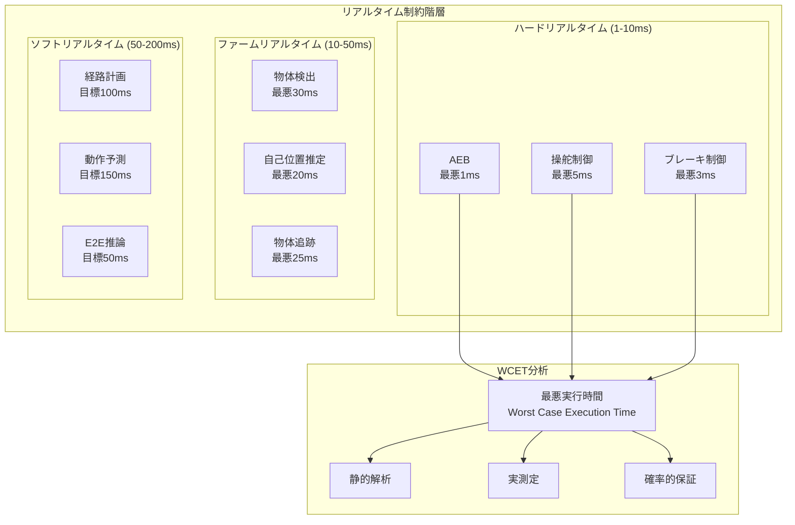

### 1.2 計算リソース配分アーキテクチャ

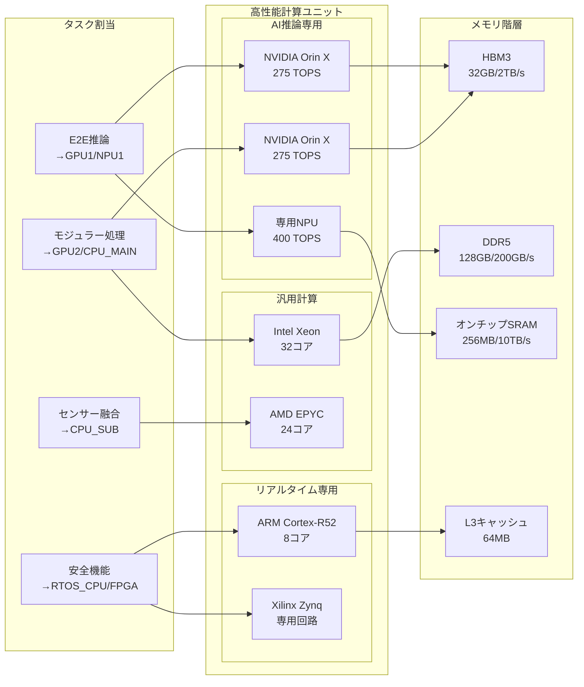

### 1.3 動的リソース管理システム

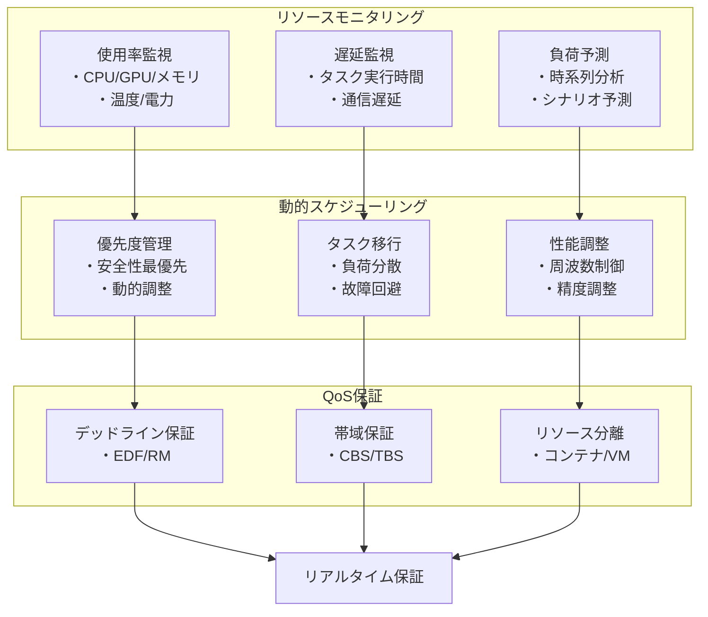

## 2. 複数ECUシステムの分散アーキテクチャ

### 2.1 ゾーン型ECUアーキテクチャ

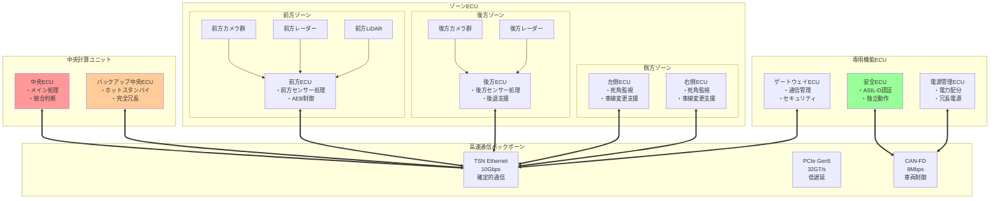

### 2.2 分散処理フローと同期機構

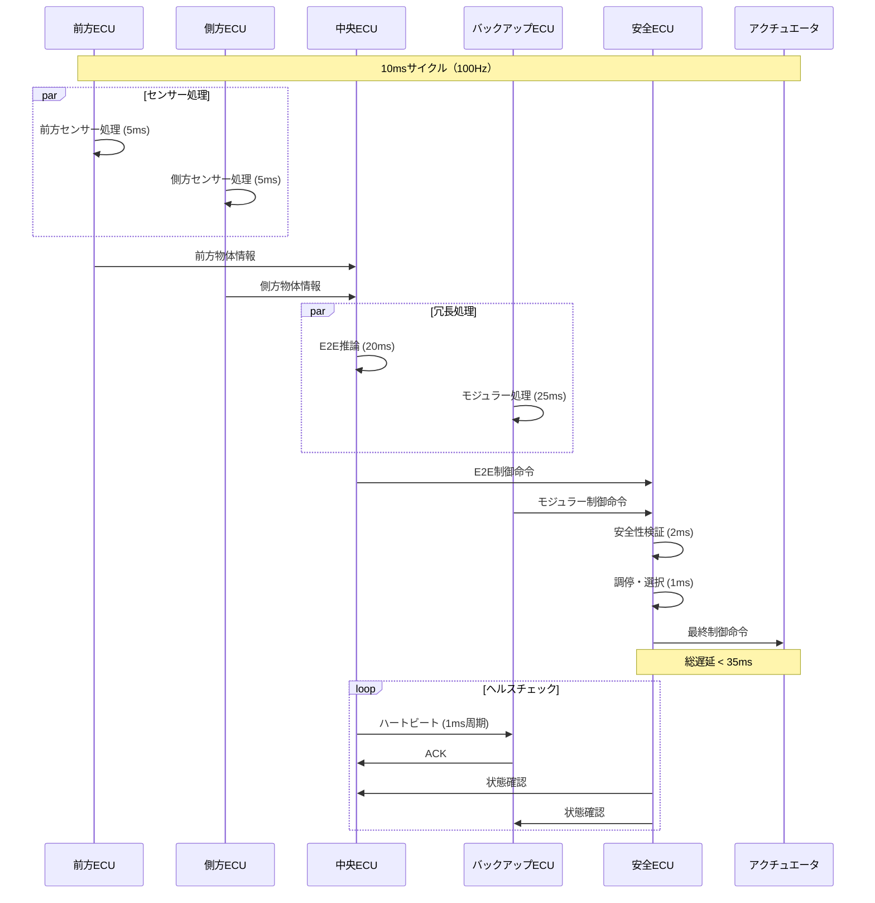

### 2.3 時刻同期とデータ一貫性

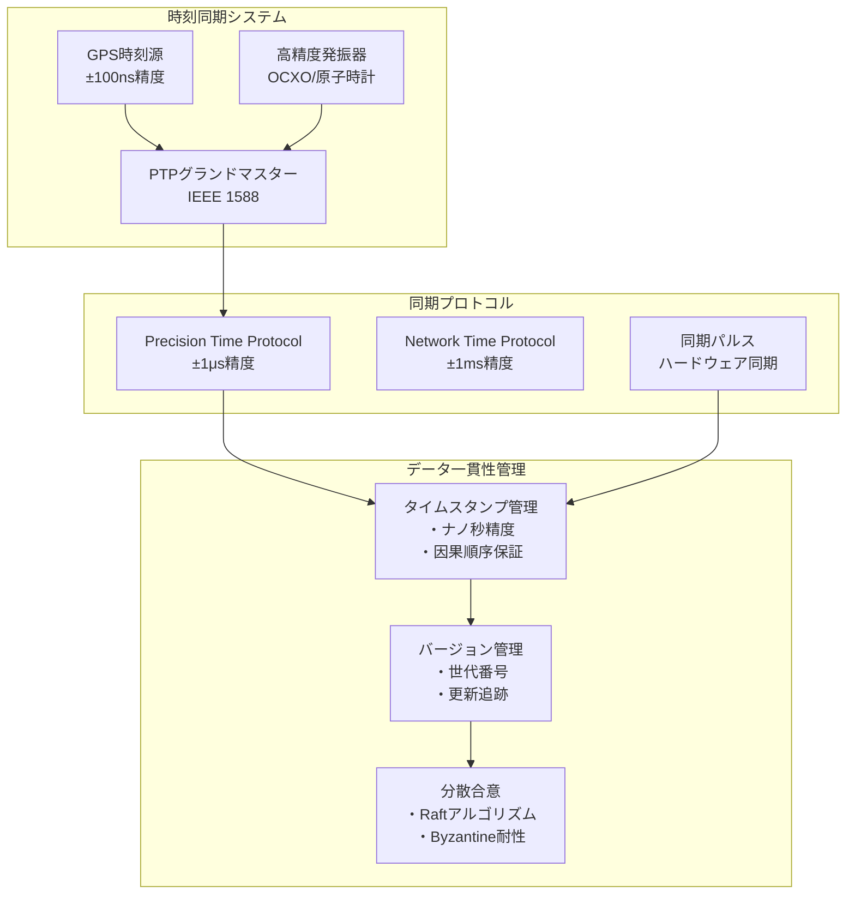

## 3. 冗長性と安全性の多層防御設計

### 3.1 機能安全アーキテクチャ（ISO 26262準拠）

```mermaid
graph TB
    subgraph "ASIL分解"
        subgraph "ASIL-D機能"
            BRAKE_D[ブレーキ制御<br/>ASIL-D]
            STEER_D[操舵制御<br/>ASIL-D]
            SAFETY_D[安全監視<br/>ASIL-D]
        end
        
        subgraph "ASIL-B機能"
            PERCEP_B[知覚処理<br/>ASIL-B(D)]
            PLAN_B[経路計画<br/>ASIL-B(D)]
        end
        
        subgraph "QM機能"
            E2E_QM[E2E推論<br/>QM+監視]
            COMFORT_QM[快適機能<br/>QM]
        end
    end
    
    subgraph "冗長化戦略"
        HW_REDUNDANT[ハードウェア冗長<br/>・2oo3投票<br/>・故障検出]
        SW_DIVERSITY[ソフトウェア多様性<br/>・異なるアルゴリズム<br/>・独立実装]
        TEMPORAL[時間的冗長<br/>・再実行<br/>・結果検証]
    end
    
    subgraph "故障検出・診断"
        BIST[組込み自己診断<br/>・起動時<br/>・実行時]
        MONITOR[監視機能<br/>・プログラムフロー<br/>・データ整合性]
        DIAGNOSTIC[診断サービス<br/>・故障記録<br/>・劣化予測]
    end
    
    BRAKE_D --> HW_REDUNDANT
    STEER_D --> HW_REDUNDANT
    SAFETY_D --> SW_DIVERSITY
    
    PERCEP_B --> SW_DIVERSITY
    PLAN_B --> TEMPORAL
    
    HW_REDUNDANT --> BIST
    SW_DIVERSITY --> MONITOR
    TEMPORAL --> DIAGNOSTIC
```

### 3.2 フェイルセーフ・フェイルオペレーショナル設計

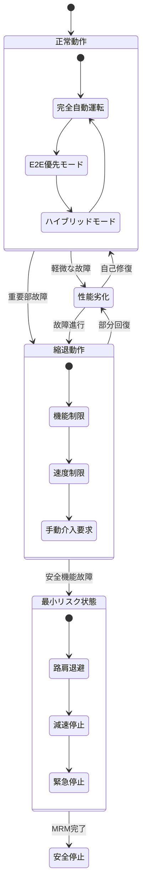

### 3.3 サイバーセキュリティ統合

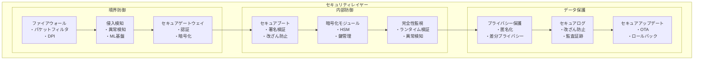

## 4. 統合システムアーキテクチャ

### 4.1 全体システム構成

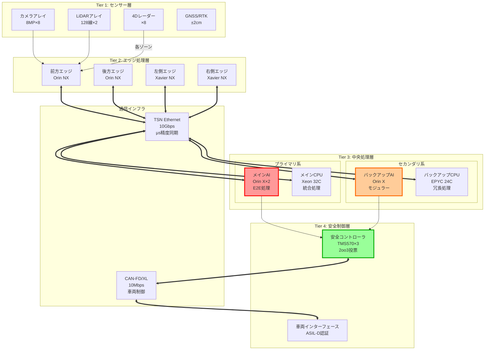

### 4.2 リアルタイム処理フロー

```mermaid
gantt
    title リアルタイム処理スケジュール（100Hzサイクル）
    dateFormat X
    axisFormat %L
    
    section センサー取得
    カメラ露光         :cam, 0, 2
    LiDAR回転         :lid, 0, 10
    レーダー取得       :rad, 0, 5
    
    section エッジ処理
    画像前処理        :img_pre, 2, 3
    点群前処理        :pc_pre, 2, 3
    レーダー処理      :rad_proc, 5, 2
    
    section AI推論
    E2E推論(GPU1)    :e2e, 5, 20
    物体検出(GPU2)    :det, 5, 15
    追跡処理(CPU)     :track, 20, 10
    
    section 統合処理
    センサー融合      :fusion, 25, 5
    経路計画         :plan, 30, 15
    安全性検証       :safety, 45, 3
    
    section 制御出力
    制御命令生成     :ctrl, 48, 2
    CAN送信         :can, 50, 1
    
    section 次サイクル準備
    バッファ切替     :buf, 51, 1
```

### 4.3 故障時の動作保証

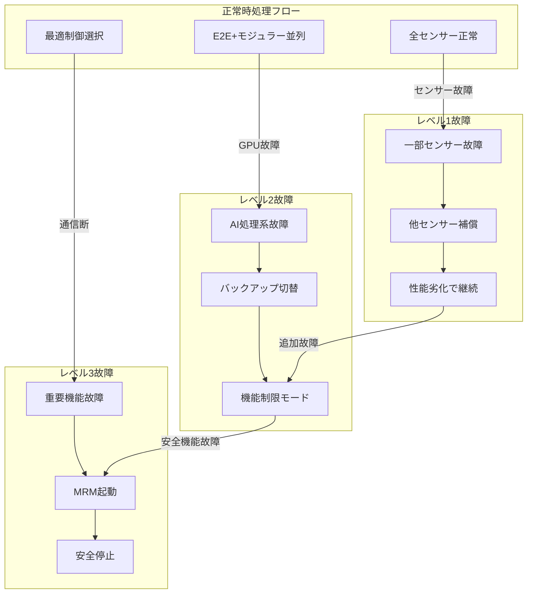

## 5. 性能保証とリソース管理

### 5.1 計算リソース配分表

| コンポーネント | 必要性能 | 割当リソース | 最悪実行時間 | 優先度 |
|:-------------|:--------|:----------|:-----------|:------|
| **AEB** | 1000 MIPS | FPGA専用回路 | 0.8ms | 最高 |
| **操舵制御** | 500 MIPS | RTOS CPU コア0-1 | 3.5ms | 最高 |
| **E2E推論** | 200 TOPS | GPU1 + NPU | 45ms | 高 |
| **物体検出** | 100 TOPS | GPU2 | 25ms | 高 |
| **センサー融合** | 5000 MIPS | CPU メインコア | 15ms | 中 |
| **経路計画** | 3000 MIPS | CPU サブコア | 80ms | 中 |
| **地図処理** | 2000 MIPS | CPU 補助コア | 200ms | 低 |

### 5.2 通信帯域配分

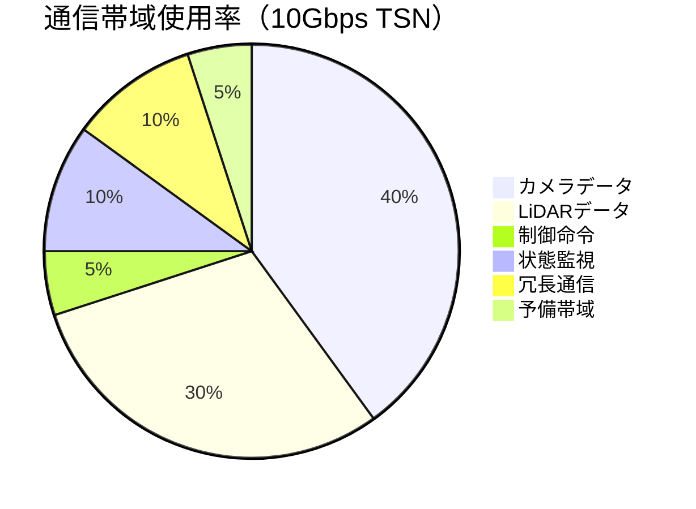

### 5.3 電力管理戦略

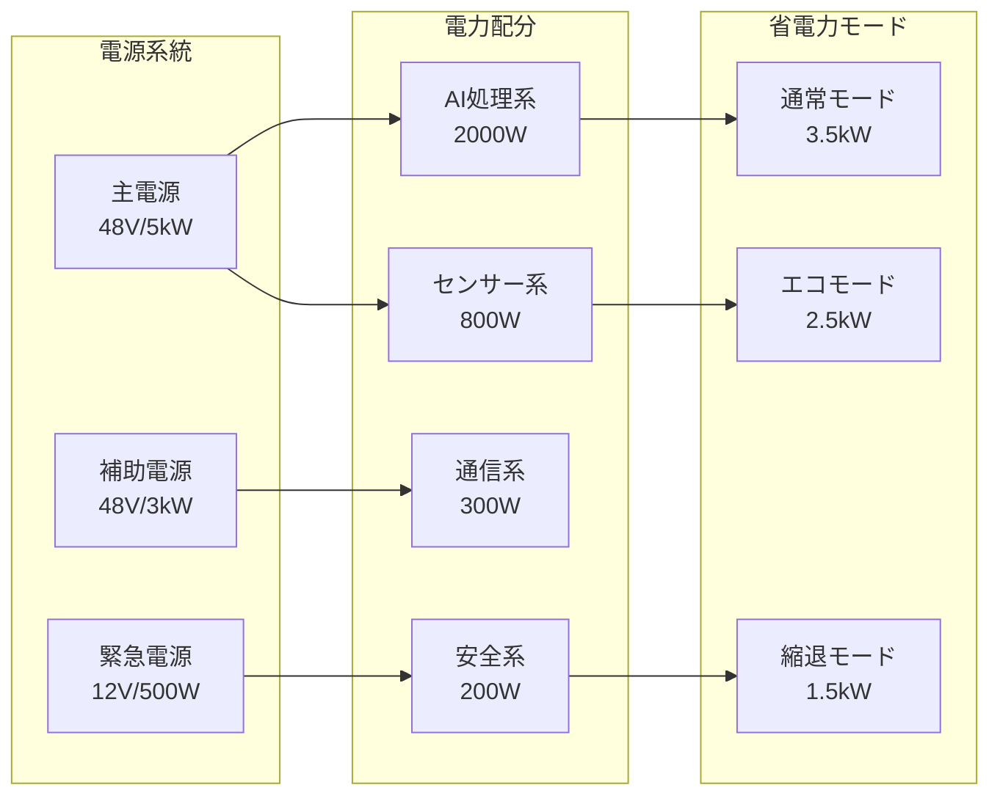

## 6. まとめ

この詳細設計により、以下を実現：

1. **リアルタイム性**: 最悪35ms以内の制御応答
2. **計算効率**: 950 TOPS の総計算能力を効率配分
3. **冗長性**: 3重系による99.999%の可用性
4. **安全性**: ASIL-D準拠の機能安全
5. **拡張性**: モジュラーECUによる柔軟な構成

これにより、E2E AIの高度な判断能力と、車載システムに要求される高信頼性を両立した次世代自動運転システムを実現します。