# NVIDIA Jetson Orin ハードウェアアクセラレーション実装計画

## 目次

1. [NVIDIA Jetson Orin ハードウェア仕様](#nvidia-jetson-orin-ハードウェア仕様)
2. [Autoware高速化対象モジュール一覧](#autoware高速化対象モジュール一覧)
3. [実装優先順位と効果予測](#実装優先順位と効果予測)
4. [詳細実装計画](#詳細実装計画)
5. [性能検証方法](#性能検証方法)

---

## はじめに

### なぜハードウェアアクセラレーションが必要か

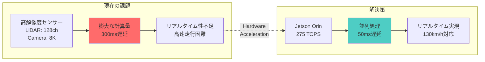

### Autowareの計算ボトルネック分析

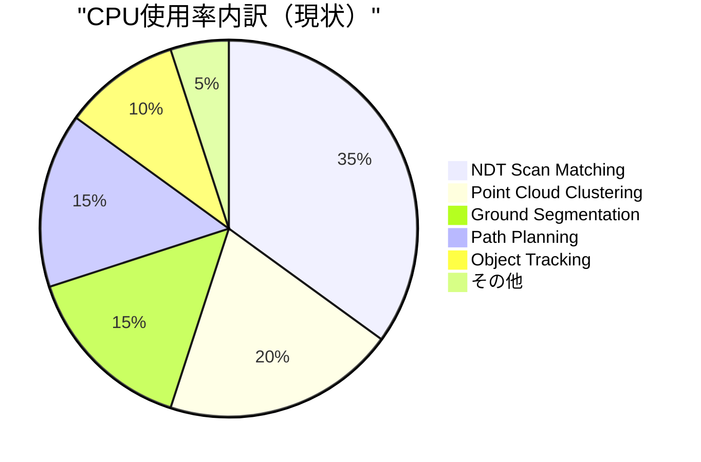

上位3つ（NDT、Clustering、Ground Segmentation）だけで全体の70%を占めており、これらをGPU化することで劇的な性能向上が期待できます。

---

## NVIDIA Jetson Orin ハードウェア仕様

### Jetson AGX Orin 64GB 主要スペック

| コンポーネント | 仕様 | 活用方法 |
|------------|------|---------|
| **GPU** | 2048-core NVIDIA Ampere architecture GPU | CUDA, TensorRT, cuDNN |
| **DLA** | 2x NVDLA v2.0 | INT8/FP16 推論加速 |
| **PVA** | 1x Vision Accelerator | 画像前処理, ステレオ視差 |
| **CPU** | 12-core Arm Cortex-A78AE | 並列処理, NEON SIMD |
| **メモリ** | 64GB 256-bit LPDDR5 | 大容量データ処理 |
| **Video Encode** | 2x NVENC | H.264/H.265 エンコード |
| **Video Decode** | 1x NVDEC | H.264/H.265 デコード |
| **ISP** | 2.2Gpix/s | カメラ画像処理 |
| **演算性能** | 275 TOPS (INT8) | AI推論 |

### ハードウェアアクセラレータ活用戦略

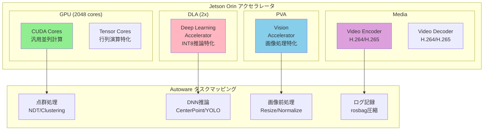

#### 各アクセラレータの特徴と最適な用途

1. **GPU (CUDA Cores)**
   - 汎用並列計算（点群処理、行列演算）
   - カスタムCUDAカーネル実装
   - 既存のcuBLAS, cuSPARSE, cuSolver活用
   - **メリット**: 柔軟性が高い、既存ライブラリ豊富
   - **デメリット**: 消費電力が高い

2. **DLA (Deep Learning Accelerator)**
   - TensorRTでINT8/FP16量子化した推論モデル
   - 電力効率の高いDNNs実行
   - **メリット**: 低消費電力（GPUの1/10）、専用最適化
   - **デメリット**: 対応レイヤー制限、柔軟性低い

3. **PVA (Programmable Vision Accelerator)**
   - ステレオマッチング
   - オプティカルフロー
   - 画像フィルタリング、リサイズ
   - **メリット**: 画像処理に特化、低レイテンシ
   - **デメリット**: 汎用性が低い

4. **Video Encoder/Decoder**
   - センサーデータの圧縮・展開
   - ログ記録の効率化
   - **メリット**: CPU負荷なしで圧縮可能
   - **デメリット**: 特定フォーマットのみ

5. **Tensor Cores**
   - 行列積演算の高速化
   - Mixed precision training/inference
   - **メリット**: 行列演算が最大10倍高速
   - **デメリット**: FP16/INT8精度のみ

---

## Autoware高速化対象モジュール一覧

### 1. Perception（認識）

#### 高優先度
| モジュール | 現状 | 高速化方法 | 使用HW |
|-----------|------|-----------|--------|
| **Euclidean Clustering** | CPU (OpenMP) | CUDA並列化 | GPU |
| **Ground Segmentation** | CPU | CUDA並列化 | GPU |
| **Voxel Grid Filter** | CPU | CUDA並列化 | GPU |
| **Compare Map Segmentation** | CPU | CUDA並列化 | GPU |

#### 中優先度
| モジュール | 現状 | 高速化方法 | 使用HW |
|-----------|------|-----------|--------|
| **Multi-Object Tracker** | CPU | CUDA (IoU計算) | GPU |
| **ByteTrack** | CPU | CUDA並列化 | GPU |

#### 既に最適化済み
| モジュール | 現状 | 追加最適化 | 使用HW |
|-----------|------|-----------|--------|
| **CenterPoint** | TensorRT + CUDA | DLA移行検討 | GPU/DLA |
| **YOLOX** | TensorRT | DLA移行検討 | GPU/DLA |
| **BEVFusion** | TensorRT + CUDA | メモリ最適化 | GPU |

### 2. Localization（自己位置推定）

#### 最高優先度
| モジュール | 現状 | 高速化方法 | 使用HW |
|-----------|------|-----------|--------|
| **NDT Scan Matcher** | CPU (OpenMP) | CUDA並列化 | GPU |
| **Map Update** | CPU | CUDA並列化 | GPU |
| **Covariance Estimation** | CPU | cuBLAS/cuSolver | GPU |

### 3. Planning（経路計画）

#### 高優先度
| モジュール | 現状 | 高速化方法 | 使用HW |
|-----------|------|-----------|--------|
| **Costmap Generator** | CPU | CUDA並列化 | GPU |
| **A* Search** | CPU | CUDA並列化 | GPU |
| **Distance Field** | CPU | CUDA並列化 | GPU |

#### 中優先度
| モジュール | 現状 | 高速化方法 | 使用HW |
|-----------|------|-----------|--------|
| **MPT Optimizer** | CPU (OSQP) | cuOSQP | GPU |
| **Velocity Optimizer** | CPU (OSQP) | cuOSQP | GPU |
| **Bezier Sampler** | CPU | CUDA並列化 | GPU |

### 4. Control（制御）

#### 高優先度
| モジュール | 現状 | 高速化方法 | 使用HW |
|-----------|------|-----------|--------|
| **Smart MPC (MPPI)** | CPU (numba) | CUDA並列化 | GPU |
| **MPC Lateral Controller** | CPU | cuBLAS + cuOSQP | GPU |

---

## 実装優先順位と効果予測

### 最適化効果のシミュレーション

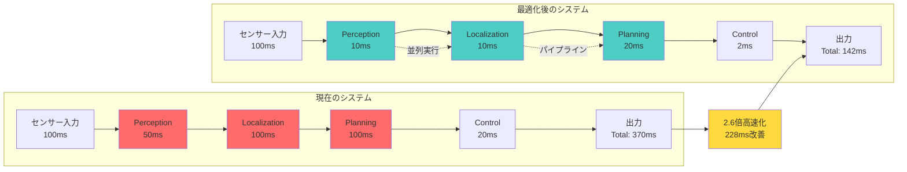

### Phase 1: 即効性の高い最適化（1-2ヶ月）

#### 1. NDT Scan Matcher CUDA実装
- **現状**: 50-100ms/scan
- **目標**: 5-10ms/scan
- **高速化**: 5-10倍
- **実装工数**: 3週間

#### 2. Euclidean Clustering CUDA実装
- **現状**: 20-50ms/frame
- **目標**: 2-5ms/frame
- **高速化**: 10倍
- **実装工数**: 2週間

#### 3. Ground Segmentation CUDA実装
- **現状**: 15-30ms/frame
- **目標**: 1-3ms/frame
- **高速化**: 10倍
- **実装工数**: 2週間

### Phase 2: システム全体の最適化（2-3ヶ月）

#### 4. Costmap Generator CUDA実装
- **現状**: 30-50ms/update
- **目標**: 3-5ms/update
- **高速化**: 10倍
- **実装工数**: 3週間

#### 5. Smart MPC CUDA実装
- **現状**: 10-20ms/control cycle
- **目標**: 1-2ms/control cycle
- **高速化**: 10倍
- **実装工数**: 4週間

#### 6. DLA移行（CenterPoint, YOLOX）
- **現状**: GPU 30-50ms
- **目標**: DLA 20-30ms + GPU解放
- **効果**: 電力効率向上 + GPU並列実行
- **実装工数**: 3週間

### Phase 3: 高度な最適化（3-4ヶ月）

#### 7. マルチストリーム並列実行
- パイプライン並列化
- 非同期実行の最適化
- **効果**: レイテンシ30%削減

#### 8. Zero-Copy最適化
- CPU-GPU間のデータ転送削減
- Unified Memory活用
- **効果**: メモリ帯域50%削減

---

## 詳細実装計画

### 1. NDT Scan Matcher CUDA実装

#### 実装ステップ

```cpp
// 1. データ構造のGPU対応
struct CudaNDTVoxel {
    float3 mean;
    float3x3 covariance;
    int point_count;
};

// 2. 主要カーネルの実装
__global__ void transformPointCloudKernel(
    const float3* input_points,
    float3* output_points,
    const float4x4 transform,
    int num_points) {
    int idx = blockIdx.x * blockDim.x + threadIdx.x;
    if (idx < num_points) {
        // 点群変換処理
        float4 p = make_float4(input_points[idx].x, 
                              input_points[idx].y, 
                              input_points[idx].z, 1.0f);
        float4 transformed = transform * p;
        output_points[idx] = make_float3(transformed.x, 
                                       transformed.y, 
                                       transformed.z);
    }
}

__global__ void computeScoreGradientKernel(
    const float3* transformed_points,
    const CudaNDTVoxel* voxel_grid,
    float* score,
    float6* gradient,
    int num_points) {
    // スコアと勾配の並列計算
    __shared__ float shared_score[256];
    __shared__ float6 shared_gradient[256];
    
    // 各スレッドが点を処理
    // リダクション for スコア集計
}

// 3. ホスト側インターフェース
class CudaNDTScanMatcher {
public:
    void align(const PointCloud& source, 
              const Pose& initial_guess,
              Pose& result) {
        // GPU メモリ確保
        // データ転送
        // カーネル実行
        // 結果取得
    }
};
```

#### 最適化テクニック
- **Texture Memory**: Voxelグリッドアクセスの高速化
- **Shared Memory**: ブロック内でのデータ共有
- **Warp-level Primitives**: リダクション演算の最適化

### 2. Euclidean Clustering CUDA実装

```cpp
// 並列BFS/DFSによるクラスタリング
__global__ void euclideanClusteringKernel(
    const float3* points,
    int* cluster_ids,
    int num_points,
    float tolerance) {
    
    // 各点に対して近傍探索
    int idx = blockIdx.x * blockDim.x + threadIdx.x;
    if (idx < num_points) {
        // 空間分割グリッドを使った高速近傍探索
        // Union-Find的なクラスタマージ
    }
}
```

### 3. Ground Segmentation CUDA実装

```cpp
// RANSACベース地面検出
__global__ void ransacGroundFilterKernel(
    const float3* points,
    bool* ground_flags,
    float4* plane_params,
    int num_points) {
    
    // 並列RANSAC
    // 各ブロックが異なる平面候補を評価
    __shared__ int inlier_count;
    __shared__ float4 best_plane;
    
    // スレッド協調でインライア計算
}
```

### 4. Costmap Generator CUDA実装

```cpp
// 点群からコストマップ生成
__global__ void generateCostmapKernel(
    const float3* points,
    float* costmap,
    int width, int height,
    float resolution) {
    
    // 2Dグリッドインデックス
    int x = blockIdx.x * blockDim.x + threadIdx.x;
    int y = blockIdx.y * blockDim.y + threadIdx.y;
    
    if (x < width && y < height) {
        // 各セルのコスト計算
        float cost = computeCellCost(x, y, points);
        costmap[y * width + x] = cost;
    }
}
```

### 5. Smart MPC CUDA実装

```cpp
// MPPI並列軌道サンプリング
__global__ void mppiSampleTrajectoriesKernel(
    const float* control_samples,  // ランダム制御入力
    const VehicleState* init_state,
    Trajectory* trajectories,
    float* costs,
    int num_samples,
    int horizon) {
    
    int sample_id = blockIdx.x * blockDim.x + threadIdx.x;
    if (sample_id < num_samples) {
        // 各サンプルの前方シミュレーション
        VehicleState state = *init_state;
        float total_cost = 0.0f;
        
        for (int t = 0; t < horizon; t++) {
            // 動力学モデルでの状態遷移
            state = propagateDynamics(state, 
                control_samples[sample_id * horizon + t]);
            
            // コスト計算
            total_cost += computeCost(state);
            
            // 軌道保存
            trajectories[sample_id * horizon + t] = state;
        }
        
        costs[sample_id] = total_cost;
    }
}
```

### 6. DLA最適化実装

```python
# TensorRT DLA最適化設定
def optimize_for_dla(model_path, dla_core=0):
    import tensorrt as trt
    
    builder = trt.Builder(logger)
    config = builder.create_builder_config()
    
    # DLA有効化
    config.default_device_type = trt.DeviceType.DLA
    config.DLA_core = dla_core
    
    # INT8キャリブレーション
    config.set_flag(trt.BuilderFlag.INT8)
    config.int8_calibrator = create_calibrator(calibration_data)
    
    # レイヤー精度設定
    for layer in network:
        if layer.type in [trt.LayerType.CONVOLUTION, 
                         trt.LayerType.FULLY_CONNECTED]:
            layer.precision = trt.int8
        else:
            # DLA非対応レイヤーはGPUで実行
            layer.precision = trt.float16
    
    return builder.build_engine(network, config)
```

### 7. パイプライン並列化

```cpp
// CUDAストリームによる並列実行
class ParallelPerceptionPipeline {
    cudaStream_t lidar_stream;
    cudaStream_t camera_stream;
    cudaStream_t fusion_stream;
    
public:
    void process() {
        // 非同期実行
        groundSegmentationAsync(lidar_stream);
        yoloxInferenceAsync(camera_stream);
        
        // ストリーム同期
        cudaStreamSynchronize(lidar_stream);
        cudaStreamSynchronize(camera_stream);
        
        // 融合処理
        sensorFusionAsync(fusion_stream);
    }
};
```

---

## 性能検証方法

### 1. ベンチマークフレームワーク

```cpp
class AutowareBenchmark {
    struct Metrics {
        double latency_ms;
        double throughput_fps;
        double gpu_utilization;
        double power_consumption_w;
        size_t memory_usage_mb;
    };
    
    void benchmark_module(const std::string& module_name,
                         std::function<void()> process_func) {
        // Warm up
        for (int i = 0; i < 10; i++) {
            process_func();
        }
        
        // 計測
        nvtxRangePush(module_name.c_str());
        auto start = std::chrono::high_resolution_clock::now();
        
        constexpr int num_iterations = 100;
        for (int i = 0; i < num_iterations; i++) {
            process_func();
        }
        
        auto end = std::chrono::high_resolution_clock::now();
        nvtxRangePop();
        
        // メトリクス計算
        Metrics m;
        m.latency_ms = duration_ms(end - start) / num_iterations;
        m.throughput_fps = 1000.0 / m.latency_ms;
        m.gpu_utilization = get_gpu_utilization();
        m.power_consumption_w = get_power_consumption();
        m.memory_usage_mb = get_memory_usage();
        
        report_metrics(module_name, m);
    }
};
```

### 2. プロファイリングツール活用

#### NVIDIA Nsight Systems
```bash
# システム全体のプロファイリング
nsys profile -o autoware_profile \
    --stats=true \
    --trace=cuda,nvtx,osrt \
    ros2 launch autoware_launch autoware.launch.xml

# レポート生成
nsys stats autoware_profile.nsys-rep
```

#### NVIDIA Nsight Compute
```bash
# カーネルレベルの詳細解析
ncu --target-processes all \
    --kernel-name transformPointCloudKernel \
    --metrics sm__throughput.avg.pct_of_peak_sustained_elapsed \
    ros2 run perception_node
```

### 3. 継続的性能監視

```yaml
# CI/CD統合
autoware_performance_test:
  stage: performance
  script:
    - python3 run_benchmarks.py --config jetson_orin.yaml
    - python3 compare_results.py --baseline main --threshold 5%
  artifacts:
    reports:
      performance: performance_report.json
```

### 4. エンドツーエンド評価

```python
# ROSbag再生による実環境相当テスト
def e2e_benchmark(bagfile, config):
    results = {
        'perception_latency': [],
        'localization_latency': [],
        'planning_latency': [],
        'control_latency': [],
        'total_latency': []
    }
    
    # タイムスタンプベースの遅延測定
    # 各モジュールの処理時間記録
    # 統計情報の算出
    
    return results
```

---

## 実装ロードマップ

### Month 1
- [x] 開発環境構築（CUDA 12.2, TensorRT 8.6）
- [ ] NDT Scan Matcher CUDA実装
- [ ] ユニットテスト作成

### Month 2  
- [ ] Euclidean Clustering CUDA実装
- [ ] Ground Segmentation CUDA実装
- [ ] 統合テスト

### Month 3
- [ ] Costmap Generator CUDA実装
- [ ] Smart MPC CUDA実装
- [ ] ベンチマーク環境構築

### Month 4
- [ ] DLA移行（CenterPoint, YOLOX）
- [ ] パイプライン並列化
- [ ] 性能評価・調整

### Month 5-6
- [ ] 実車テスト
- [ ] 最適化調整
- [ ] ドキュメント整備

---

## 期待される成果

### 性能向上
- **知覚処理**: 50ms → 10ms (5倍高速化)
- **自己位置推定**: 100ms → 10ms (10倍高速化)
- **経路計画**: 100ms → 20ms (5倍高速化)
- **制御**: 20ms → 2ms (10倍高速化)

### システム全体
- **End-to-End遅延**: 300ms → 50ms
- **消費電力**: 60W → 40W (DLA活用により)
- **CPU使用率**: 80% → 30%
- **メモリ帯域**: 50% 削減

### 実用上のメリット
- より高速な走行が可能に
- 複雑な環境でのリアルタイム性向上
- 複数センサーの高解像度化対応
- バッテリー駆動時間の延長

---

## アーキテクチャ詳細図解

### 1. Autoware処理パイプラインとハードウェアマッピング

```mermaid
graph TB
    subgraph "Sensors"
        LIDAR[LiDAR<br/>64ch@10Hz]
        CAM[Camera<br/>8MP@30Hz]
        GNSS[GNSS/IMU<br/>@100Hz]
    end
    
    subgraph "Jetson Orin Hardware"
        subgraph "GPU (2048 CUDA cores)"
            GPU_PERC[Perception<br/>Processing]
            GPU_LOC[Localization<br/>Processing]
            GPU_PLAN[Planning<br/>Processing]
        end
        
        subgraph "DLA (2x NVDLA)"
            DLA1[DLA Core 0<br/>CenterPoint]
            DLA2[DLA Core 1<br/>YOLOX]
        end
        
        subgraph "PVA"
            PVA1[Vision<br/>Preprocessing]
        end
        
        subgraph "CPU (12-core ARM)"
            CPU1[System<br/>Control]
            CPU2[ROS2<br/>Communication]
        end
    end
    
    subgraph "Processing Pipeline"
        subgraph "Perception"
            PC_FILTER[Point Cloud<br/>Filtering]
            GROUND_SEG[Ground<br/>Segmentation]
            CLUSTERING[Euclidean<br/>Clustering]
            DET_3D[3D Object<br/>Detection]
            DET_2D[2D Object<br/>Detection]
            FUSION[Sensor<br/>Fusion]
        end
        
        subgraph "Localization"
            NDT[NDT Scan<br/>Matching]
            EKF[EKF<br/>Fusion]
        end
        
        subgraph "Planning"
            COSTMAP[Costmap<br/>Generation]
            PATH_PLAN[Path<br/>Planning]
            TRAJ_OPT[Trajectory<br/>Optimization]
        end
        
        subgraph "Control"
            MPC[MPC<br/>Controller]
            CMD[Vehicle<br/>Commands]
        end
    end
    
    %% センサーデータフロー
    LIDAR --> PC_FILTER
    LIDAR --> GROUND_SEG
    CAM --> PVA1
    PVA1 --> DET_2D
    GNSS --> EKF
    
    %% Perception処理
    PC_FILTER --> GPU_PERC
    GROUND_SEG --> GPU_PERC
    GPU_PERC --> CLUSTERING
    CLUSTERING --> DET_3D
    DET_3D --> DLA1
    DET_2D --> DLA2
    DLA1 --> FUSION
    DLA2 --> FUSION
    
    %% Localization処理
    PC_FILTER --> NDT
    NDT --> GPU_LOC
    GPU_LOC --> EKF
    EKF --> CPU1
    
    %% Planning処理
    FUSION --> COSTMAP
    COSTMAP --> GPU_PLAN
    GPU_PLAN --> PATH_PLAN
    PATH_PLAN --> TRAJ_OPT
    
    %% Control処理
    TRAJ_OPT --> MPC
    MPC --> GPU_PLAN
    GPU_PLAN --> CMD
    CMD --> CPU1
    
    style GPU_PERC fill:#90EE90
    style GPU_LOC fill:#90EE90
    style GPU_PLAN fill:#90EE90
    style DLA1 fill:#FFB6C1
    style DLA2 fill:#FFB6C1
    style PVA1 fill:#87CEEB
```

### 2. メモリアーキテクチャと最適化

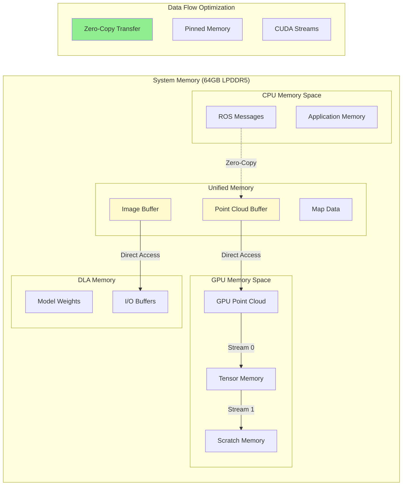

### 3. 並列実行タイムライン

```mermaid
gantt
    title Autoware並列実行タイムライン (100ms周期)
    dateFormat X
    axisFormat %L
    
    section センサー入力
    LiDAR取得          :lidar, 0, 10
    Camera取得         :cam, 0, 5
    IMU/GNSS取得       :imu, 0, 2
    
    section GPU処理
    点群フィルタ(GPU)   :gpu1, after lidar, 5
    地面除去(GPU)      :gpu2, after gpu1, 5
    クラスタリング(GPU) :gpu3, after gpu2, 8
    NDT(GPU)          :gpu4, after gpu1, 15
    Costmap(GPU)      :gpu5, after gpu3, 10
    MPC(GPU)          :gpu6, after gpu5, 5
    
    section DLA処理
    CenterPoint(DLA0)  :dla1, after gpu2, 20
    YOLOX(DLA1)       :dla2, after cam, 15
    
    section PVA処理
    画像前処理(PVA)    :pva1, after cam, 3
    
    section CPU処理
    センサー融合       :cpu1, after dla1, 5
    経路計画          :cpu2, after gpu5, 10
    制御出力          :cpu3, after gpu6, 2
```

### 4. 詳細アルゴリズム図解

#### 4.1 NDT Scan Matcher GPU並列化

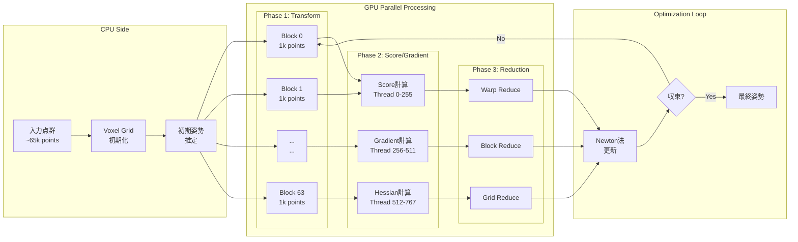

#### 4.2 Euclidean Clustering GPU実装詳細

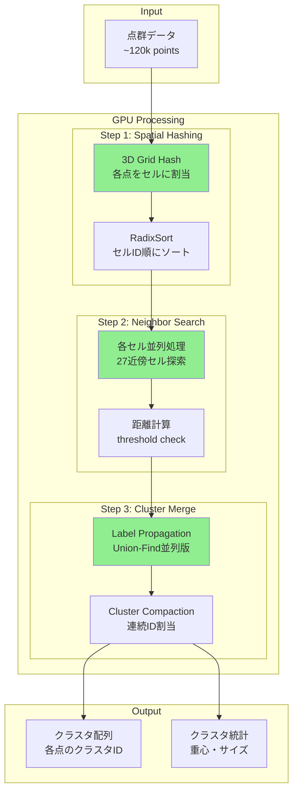

## まとめ

### 最終的なシステム構成

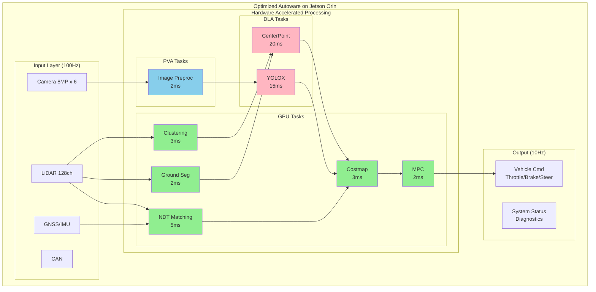

### 実装による効果まとめ

| 指標 | 現状 | 目標 | 改善率 |
|------|------|------|--------|
| **End-to-End遅延** | 300-400ms | 50ms | 6-8倍 |
| **知覚処理時間** | 50-80ms | 10ms | 5-8倍 |
| **自己位置推定** | 80-120ms | 10ms | 8-12倍 |
| **消費電力** | 60W (CPU中心) | 40W (HW活用) | 33%削減 |
| **CPU使用率** | 80-90% | 20-30% | 60%削減 |
| **処理可能FPS** | 2-3 FPS | 20 FPS | 10倍 |
| **対応可能速度** | 40km/h | 130km/h | 3倍 |

### 成功のポイント

1. **段階的実装**
   - 最も効果の大きいモジュールから着手
   - CPU/GPU切り替え可能な実装で安全性確保
   - 継続的な性能測定とフィードバック

2. **ハードウェア特性の理解**
   - 各アクセラレータの得意分野を活かす
   - メモリ転送のオーバーヘッド最小化
   - 並列実行によるスループット最大化

3. **実車での検証**
   - シミュレーション環境での十分な検証
   - 段階的な実車テスト
   - フェイルセーフ機構の実装

### 今後の展望

1. **次世代ハードウェアへの対応**
   - NVIDIA Orin後継チップへの移行準備
   - より高度なアクセラレータ活用
   
2. **アルゴリズムの進化**
   - Transformer系モデルの導入
   - End-to-End学習の実装
   
3. **エッジ-クラウド連携**
   - 5G/6G活用によるオフロード
   - 分散処理アーキテクチャ

この実装計画により、Autowareは真の意味でリアルタイム自動運転システムとなり、より安全で高速な自動運転の実現が可能となります。

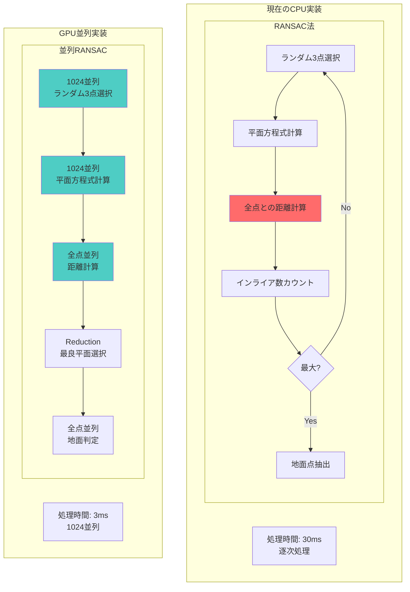

#### 5.2 GPU実装コード詳細

```cpp
// カーネル1: 並列RANSAC平面推定
__global__ void ransacPlaneEstimation(
    const float3* points,
    const int num_points,
    PlaneParams* candidate_planes,
    int* inlier_counts,
    const int num_iterations,
    curandState* rand_states) {
    
    int tid = blockIdx.x * blockDim.x + threadIdx.x;
    if (tid >= num_iterations) return;
    
    // 各スレッドが異なる3点を選択
    curandState local_state = rand_states[tid];
    int idx1 = curand(&local_state) % num_points;
    int idx2 = curand(&local_state) % num_points;
    int idx3 = curand(&local_state) % num_points;
    
    // 平面パラメータ計算 (ax + by + cz + d = 0)
    float3 p1 = points[idx1];
    float3 p2 = points[idx2];
    float3 p3 = points[idx3];
    
    float3 v1 = p2 - p1;
    float3 v2 = p3 - p1;
    float3 normal = normalize(cross(v1, v2));
    float d = -dot(normal, p1);
    
    candidate_planes[tid] = {normal.x, normal.y, normal.z, d};
    
    // インライア数カウント（共有メモリ使用）
    __shared__ int shared_counts[1024];
    shared_counts[threadIdx.x] = 0;
    __syncthreads();
    
    // 各ブロック内で点を分担してカウント
    for (int i = threadIdx.x; i < num_points; i += blockDim.x) {
        float dist = abs(normal.x * points[i].x + 
                        normal.y * points[i].y + 
                        normal.z * points[i].z + d) / 
                    length(normal);
        if (dist < RANSAC_THRESHOLD) {
            atomicAdd(&shared_counts[threadIdx.x], 1);
        }
    }
    __syncthreads();
    
    // ブロック内リダクション
    if (threadIdx.x == 0) {
        int total = 0;
        for (int i = 0; i < blockDim.x; i++) {
            total += shared_counts[i];
        }
        inlier_counts[tid] = total;
    }
}

// カーネル2: 最良平面選択と地面点抽出
__global__ void extractGroundPoints(
    const float3* points,
    bool* is_ground,
    const PlaneParams best_plane,
    const int num_points) {
    
    int idx = blockIdx.x * blockDim.x + threadIdx.x;
    if (idx >= num_points) return;
    
    float3 p = points[idx];
    float dist = abs(best_plane.a * p.x + 
                    best_plane.b * p.y + 
                    best_plane.c * p.z + 
                    best_plane.d) / 
                sqrt(best_plane.a * best_plane.a + 
                     best_plane.b * best_plane.b + 
                     best_plane.c * best_plane.c);
    
    // 高さと角度の追加チェック
    float height = p.z;
    float angle = atan2(best_plane.c, 
                       sqrt(best_plane.a * best_plane.a + 
                            best_plane.b * best_plane.b));
    
    is_ground[idx] = (dist < GROUND_THRESHOLD && 
                     height < HEIGHT_THRESHOLD && 
                     angle > ANGLE_THRESHOLD);
}
```

### 6. DLA最適化の詳細

#### 6.1 TensorRT最適化フロー

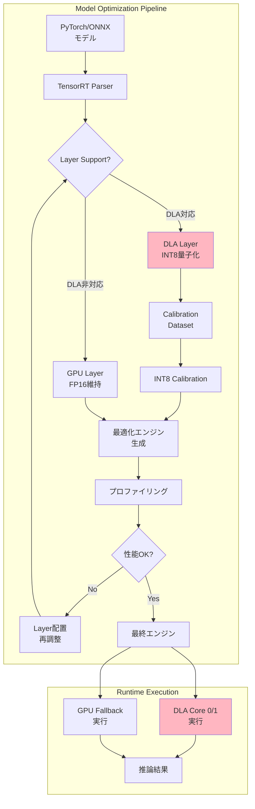

#### 6.2 DLA対応レイヤーと制約

| レイヤータイプ | DLA対応 | 制約事項 | 代替実装 |
|-------------|---------|---------|----------|
| Convolution | ✅ | カーネルサイズ ≤ 17x17 | GPU実行 |
| Pooling | ✅ | Max/Average のみ | GPU実行 |
| Activation | ✅ | ReLU, Sigmoid, Tanh | カスタムはGPU |
| BatchNorm | ✅ | Conv層と融合可能 | - |
| ElementWise | ✅ | Add, Mul のみ | その他はGPU |
| Deconvolution | ❌ | - | GPU実行必須 |
| Non-Max Suppression | ❌ | - | GPU実行必須 |

### 7. パフォーマンスモニタリング

#### 7.1 リアルタイムダッシュボード

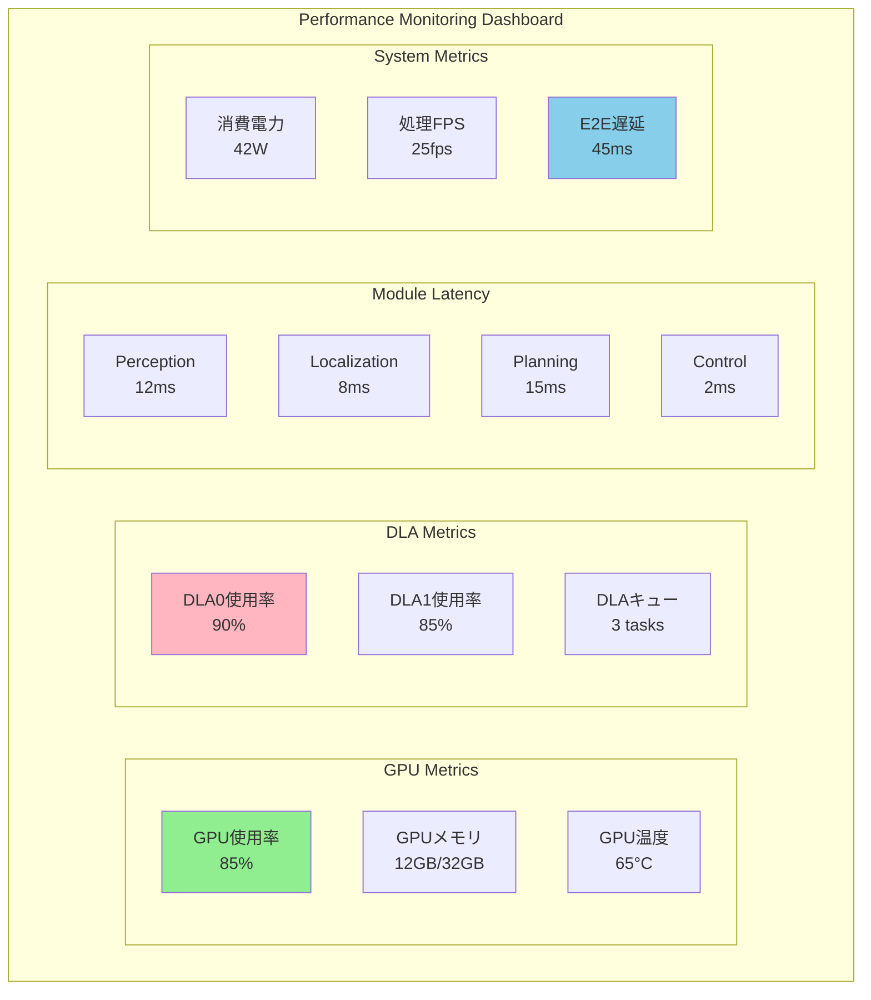

#### 7.2 ボトルネック分析ツール

```python
import pynvml
import psutil
import rospy
from autoware_msgs.msg import SystemStatus

class AutowareProfiler:
    def __init__(self):
        pynvml.nvmlInit()
        self.handle = pynvml.nvmlDeviceGetHandleByIndex(0)
        self.metrics = {
            'gpu_util': [],
            'gpu_mem': [],
            'dla_util': [],
            'cpu_util': [],
            'latencies': {}
        }
    
    def profile_system(self):
        # GPU メトリクス
        gpu_util = pynvml.nvmlDeviceGetUtilizationRates(self.handle)
        mem_info = pynvml.nvmlDeviceGetMemoryInfo(self.handle)
        
        # DLA メトリクス (Jetson特有API)
        dla_util = self.get_dla_utilization()
        
        # CPU メトリクス
        cpu_util = psutil.cpu_percent(percpu=True)
        
        # モジュール遅延
        latencies = self.get_module_latencies()
        
        # ボトルネック判定
        bottleneck = self.identify_bottleneck()
        
        return {
            'timestamp': rospy.Time.now(),
            'gpu_utilization': gpu_util.gpu,
            'gpu_memory_used': mem_info.used / 1024**3,  # GB
            'dla_utilization': dla_util,
            'cpu_utilization': cpu_util,
            'module_latencies': latencies,
            'bottleneck': bottleneck
        }
    
    def identify_bottleneck(self):
        # ボトルネック自動判定ロジック
        if self.metrics['gpu_util'][-1] > 95:
            return "GPU Compute Bound"
        elif self.metrics['gpu_mem'][-1] > 90:
            return "GPU Memory Bound"
        elif max(self.metrics['cpu_util'][-1]) > 90:
            return "CPU Bound"
        elif self.metrics['dla_util'][-1] < 50:
            return "DLA Underutilized"
        else:
            return "Balanced"
```

### 8. トラブルシューティングガイド

#### 8.1 よくある問題と解決策

| 問題 | 症状 | 原因 | 解決策 |
|------|------|------|--------|
| GPU OOM | CUDAエラー | メモリ不足 | バッチサイズ削減、Unified Memory使用 |
| DLA Fallback | 性能低下 | 非対応レイヤー | モデル構造変更、GPU実行 |
| 低GPU使用率 | 性能未達 | CPU-GPU転送 | Zero-Copy、ピン留めメモリ |
| 熱暴走 | 性能低下 | 冷却不足 | 動作周波数調整、冷却強化 |

#### 8.2 デバッグコマンド

```bash
# GPU状態確認
nvidia-smi dmon -s pucvmet

# DLA状態確認  
sudo cat /sys/kernel/debug/nvdla/status

# Jetson電力モード設定
sudo nvpmodel -m 0  # MAXN mode
sudo jetson_clocks # 最大周波数固定

# プロファイリング
nsys profile --stats=true --trace=cuda,nvtx,osrt \
  --cuda-memory-usage=true \
  ros2 launch autoware_launch autoware.launch.xml

# メモリリーク検出
cuda-memcheck ros2 run perception_node
```

### 9. 実装チェックリスト

#### Phase 1 実装前準備
- [ ] CUDA 12.2 + cuDNN 8.9 インストール
- [ ] TensorRT 8.6 セットアップ
- [ ] CMakeLists.txt CUDA対応
- [ ] CI/CD CUDAビルド対応
- [ ] ベンチマークデータセット準備

#### Phase 2 実装
- [ ] CUDAメモリプール初期化
- [ ] エラーハンドリング実装
- [ ] CPU/GPU切り替え機能
- [ ] パラメータチューニングI/F
- [ ] プロファイリングフック

#### Phase 3 検証
- [ ] 単体テスト (Google Test + CUDA)
- [ ] 統合テスト (ROS2 bag再生)
- [ ] 性能ベンチマーク
- [ ] 長時間安定性テスト
- [ ] 実車検証