# AutowareのHDマップフリーナビゲーションアーキテクチャ

## 概要

本文書は、AutowareがHDマップ（高精度地図）を使用せず、OpenStreetMap（OSM）とセンサーデータのみで自動運転を実現するための詳細なアーキテクチャと実装を記述する。

### なぜHDマップフリーが重要か

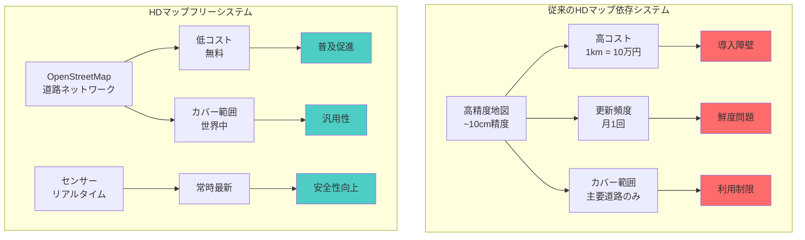

### システムの基本コンセプト

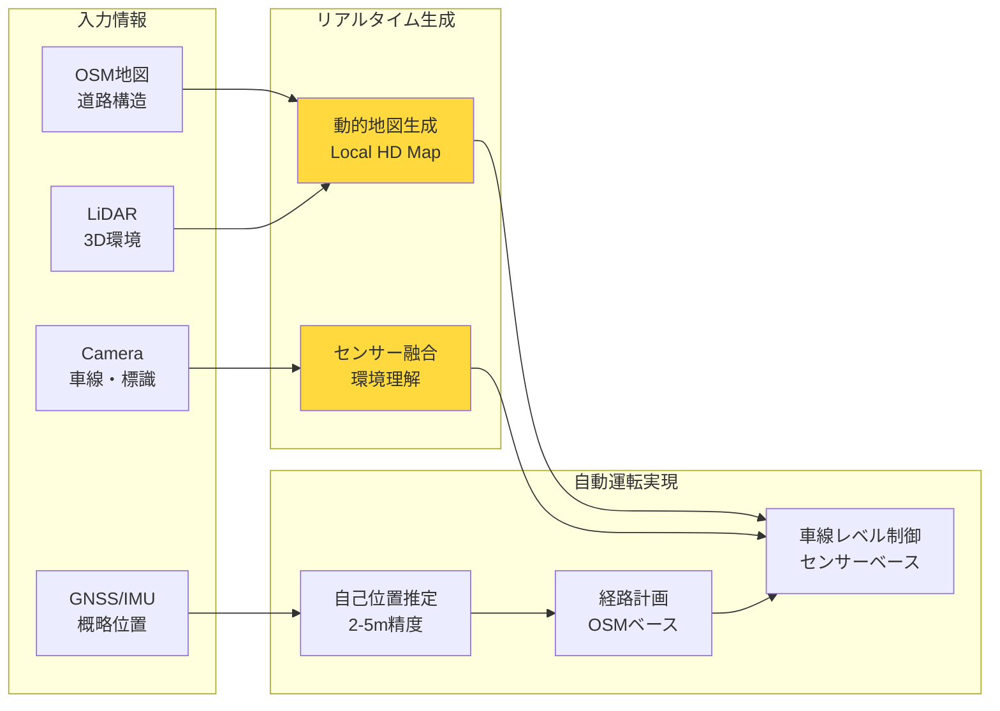

## 目次

1. [システムアーキテクチャ](#システムアーキテクチャ)
2. [ローカライゼーション](#ローカライゼーション)
3. [OSMベースプランニング](#osmベースプランニング)
4. [センサーベースローカルマップ生成](#センサーベースローカルマップ生成)
5. [統合システム](#統合システム)
6. [実装詳細](#実装詳細)
7. [統合フローチャート](#統合フローチャート)
8. [OSMベースミッションプランナーの実装](#osmベースミッションプランナーの実装)
9. [パフォーマンスベンチマーク](#パフォーマンスベンチマーク)
10. [テストシナリオ](#テストシナリオ)

---

## システムアーキテクチャ

### 全体構成

#### 処理レイヤーの概念図

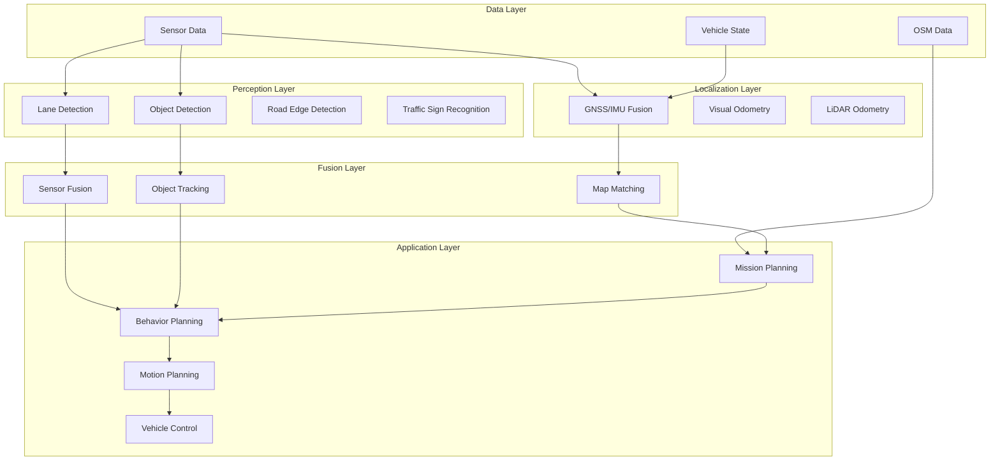

### システム全体のデータフロー

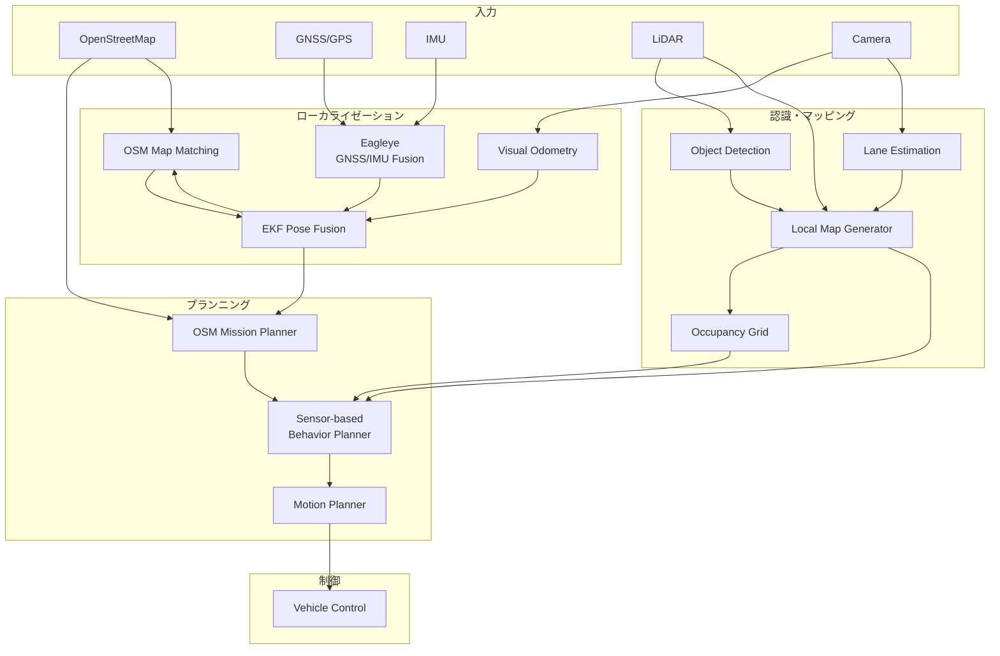

### キーコンポーネント

#### 1. Eagleye（GNSS/IMU融合）

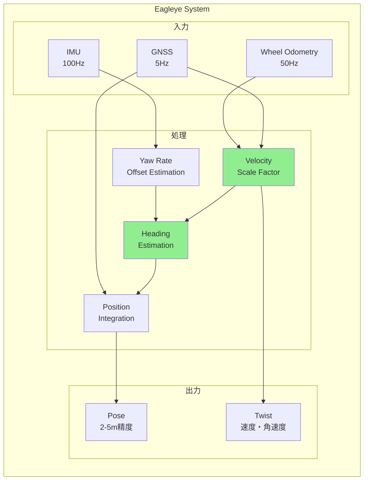

**特徴**:
- RTK不要で2-5mの精度を実現
- GNSS Doppler速度を活用した安定した速度推定
- 都市部のマルチパス環境でも動作

#### 2. OSMマップマッチング

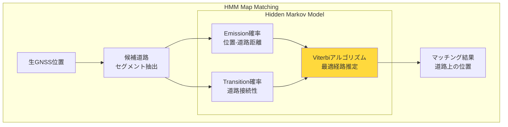

**特徴**:
- HMMベースでOSM道路ネットワークに位置を補正
- 道路の接続性を考慮した確率的マッチング
- GPS誤差に対してロバスト

#### 3. センサーベースレーン推定

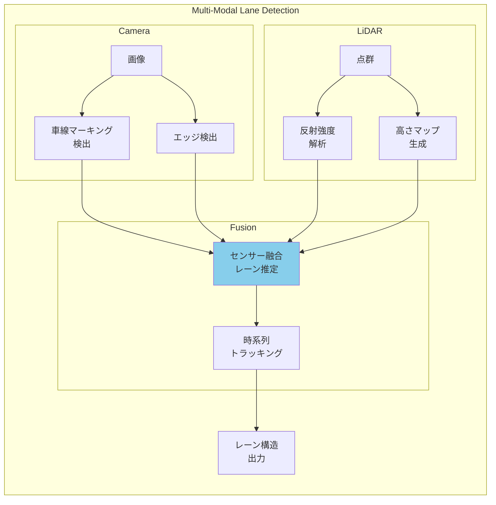

**特徴**:
- カメラとLiDARでリアルタイムにレーン構造を推定
- 車線マーキングがない道路でも動作
- 悪天候に対する耐性

#### 4. OSMルーティング

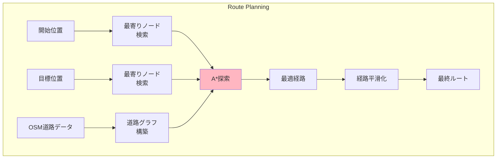

**特徴**:
- グラフベースの経路計画
- 道路属性（速度制限、一方通行）を考慮
- リアルタイム再計画対応

#### 5. 動的障害物回避

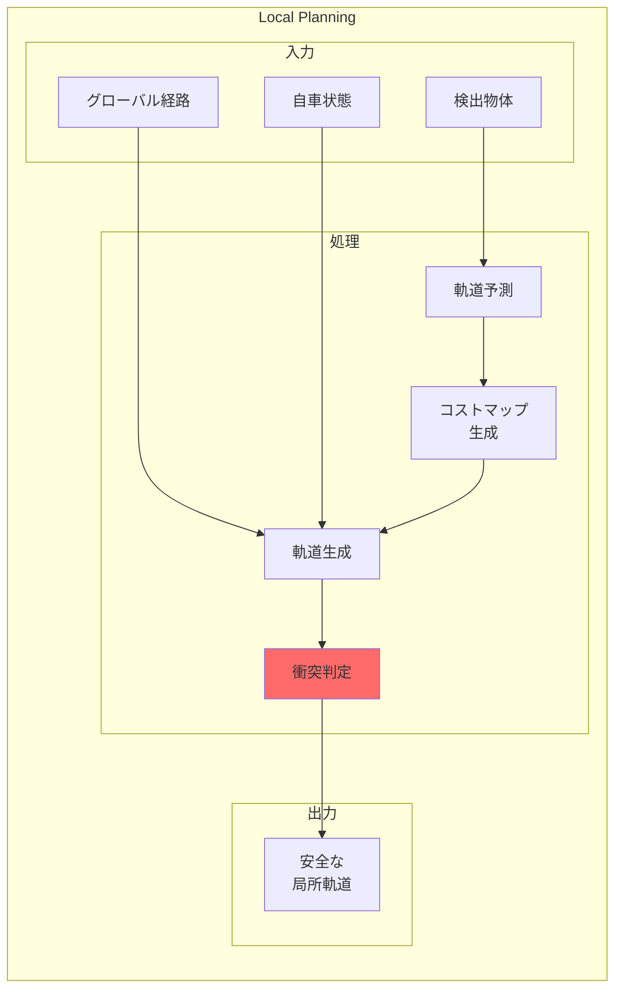

**特徴**:
- センサーベースのローカルプランニング
- 動的障害物の軌道予測
- リアルタイム軌道最適化

---

## ローカライゼーション

### ローカライゼーション統合アーキテクチャ

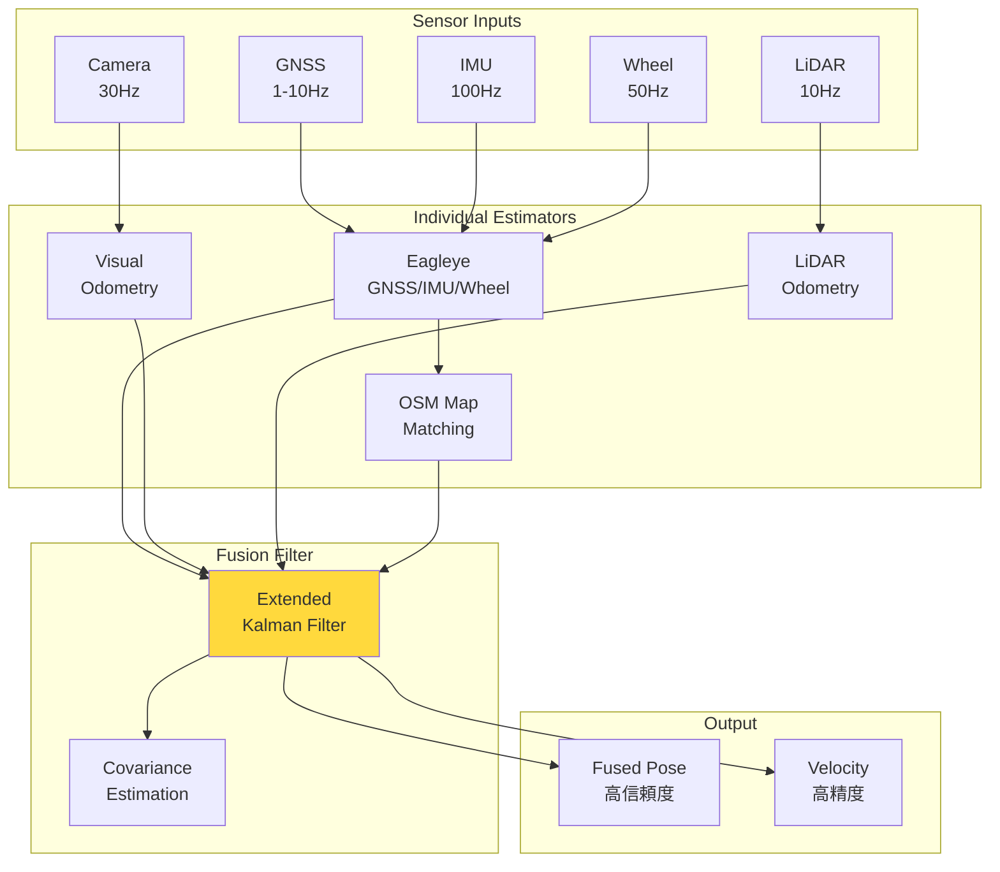

### 1. Eagleye GNSS/IMU融合

#### Eagleye処理フロー詳細

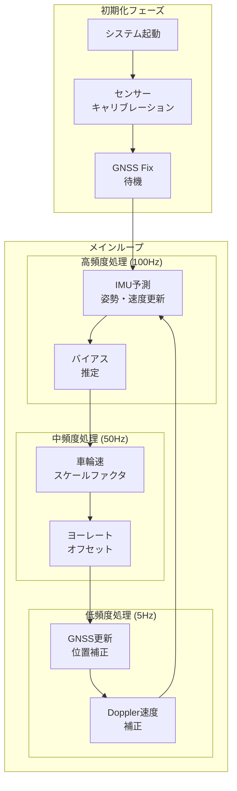

```cpp
class EagleyeLocalizer : public rclcpp::Node {
private:
    // 状態ベクトル [x, y, z, vx, vy, vz, roll, pitch, yaw, wx, wy, wz]
    struct State {
        Eigen::Vector3d position;      // ENU座標系での位置
        Eigen::Quaterniond orientation; // 姿勢クォータニオン
        Eigen::Vector3d velocity;      // 速度
        Eigen::Vector3d acc_bias;      // 加速度センサバイアス
        Eigen::Vector3d gyro_bias;     // ジャイロバイアス
    };
    
    State state_;
    Eigen::MatrixXd P_; // 共分散行列
    
public:
    void imuCallback(const sensor_msgs::msg::Imu::SharedPtr msg) {
        // IMU予測ステップ
        double dt = (msg->header.stamp - last_imu_time_).seconds();
        
        // 加速度・角速度の補正
        Eigen::Vector3d acc = toEigen(msg->linear_acceleration) - state_.acc_bias;
        Eigen::Vector3d gyro = toEigen(msg->angular_velocity) - state_.gyro_bias;
        
        // 状態予測
        predictIMU(acc, gyro, dt);
        
        last_imu_time_ = msg->header.stamp;
    }
    
    void gnssCallback(const sensor_msgs::msg::NavSatFix::SharedPtr msg) {
        // GNSS Doppler速度を使用した更新
        if (msg->status.status >= sensor_msgs::msg::NavSatStatus::STATUS_FIX) {
            // LLH to ENU変換
            Eigen::Vector3d enu_pos = llhToEnu(
                msg->latitude, msg->longitude, msg->altitude);
            
            // カルマンフィルタ更新
            updateGNSS(enu_pos, msg->position_covariance);
            
            // Doppler速度が利用可能な場合
            if (hasDopplerVelocity(msg)) {
                Eigen::Vector3d doppler_vel = extractDopplerVelocity(msg);
                updateDopplerVelocity(doppler_vel);
            }
        }
    }
    
    void predictIMU(const Eigen::Vector3d& acc, const Eigen::Vector3d& gyro, double dt) {
        // 姿勢の更新（クォータニオン積分）
        Eigen::Quaterniond dq;
        dq.w() = 1.0;
        dq.vec() = 0.5 * gyro * dt;
        state_.orientation = state_.orientation * dq;
        state_.orientation.normalize();
        
        // 重力補正を含む加速度
        Eigen::Vector3d acc_world = state_.orientation * acc;
        acc_world.z() -= 9.81; // 重力
        
        // 位置・速度の更新
        state_.position += state_.velocity * dt + 0.5 * acc_world * dt * dt;
        state_.velocity += acc_world * dt;
        
        // 共分散予測
        Eigen::MatrixXd F = computeStateTransition(dt);
        Eigen::MatrixXd Q = computeProcessNoise(dt);
        P_ = F * P_ * F.transpose() + Q;
    }
};
```

### 2. ビジュアルオドメトリ補完

#### 処理パイプライン

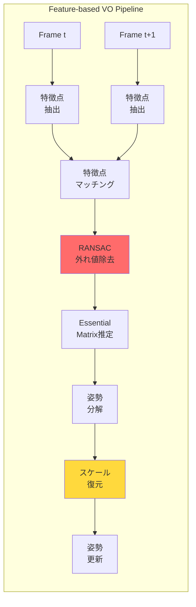

#### トンネル内での動作

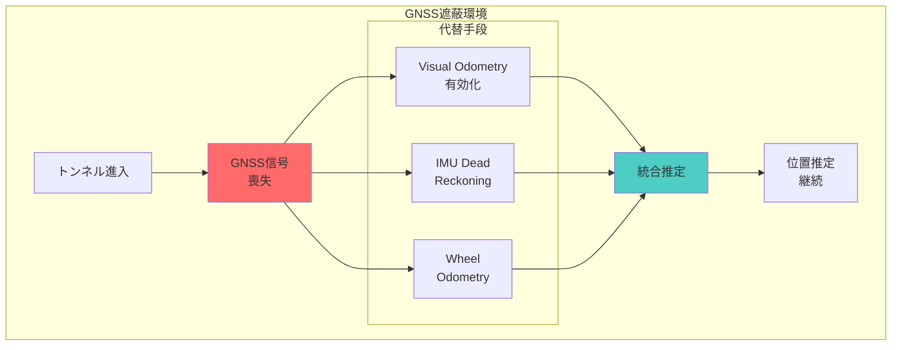

```cpp
class VisualOdometryNode : public rclcpp::Node {
private:
    cv::Ptr<cv::Feature2D> feature_detector_;
    cv::Ptr<cv::DescriptorMatcher> matcher_;
    
    struct Frame {
        cv::Mat image;
        std::vector<cv::KeyPoint> keypoints;
        cv::Mat descriptors;
        Eigen::Isometry3d pose;
    };
    
    Frame prev_frame_;
    
public:
    void imageCallback(const sensor_msgs::msg::Image::SharedPtr msg) {
        cv::Mat image = cv_bridge::toCvShare(msg, "bgr8")->image;
        
        Frame current_frame;
        current_frame.image = image;
        
        // 特徴点検出
        feature_detector_->detectAndCompute(
            image, cv::noArray(), 
            current_frame.keypoints, 
            current_frame.descriptors);
        
        if (!prev_frame_.keypoints.empty()) {
            // 特徴点マッチング
            std::vector<cv::DMatch> matches;
            matcher_->match(
                prev_frame_.descriptors, 
                current_frame.descriptors, 
                matches);
            
            // RANSACによる外れ値除去とエッセンシャル行列推定
            cv::Mat E = findEssentialMatrix(matches);
            
            // 相対姿勢の復元
            cv::Mat R, t;
            recoverPose(E, matched_points1, matched_points2, R, t);
            
            // オドメトリの更新
            updateOdometry(R, t);
        }
        
        prev_frame_ = current_frame;
    }
};
```

### 3. OSMマップマッチング

#### HMMマップマッチングの詳細

```mermaid
graph TB
    subgraph "Map Matching Process"
        subgraph "Step 1: 候補抽出"
            GPS[GPS測位<br/>σ=5-10m] --> RADIUS[半径内<br/>道路検索]
            RADIUS --> CANDS[候補道路<br/>セグメント]
        end
        
        subgraph "Step 2: 確率計算"
            subgraph "Emission確率"
                DIST[点-線分<br/>距離] --> GAUSS[ガウス分布<br/>P(obs|state)]
            end
            
            subgraph "Transition確率"
                CONNECT[道路接続性] --> ROUTE[経路確率<br/>P(state_t|state_t-1)]
            end
        end
        
        subgraph "Step 3: 最適化"
            VITERBI[Viterbi<br/>アルゴリズム] --> BEST[最尤経路]
        end
    end
    
    CANDS --> DIST
    CANDS --> CONNECT
    GAUSS --> VITERBI
    ROUTE --> VITERBI
    BEST --> RESULT[マッチング<br/>結果]
    
    style VITERBI fill:#87CEEB
```

#### 実際のマッチング例

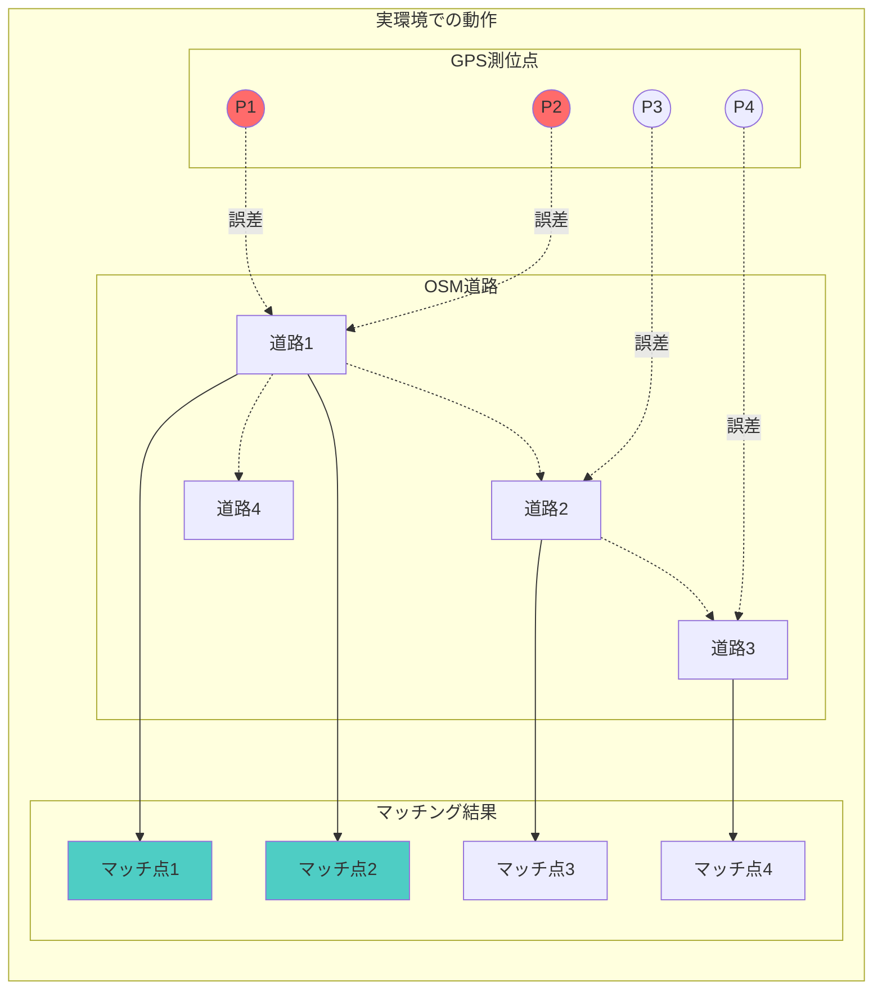

```cpp
class OSMMapMatcher : public rclcpp::Node {
private:
    struct RoadSegment {
        int64_t way_id;
        Eigen::Vector2d start;
        Eigen::Vector2d end;
        double width;
        std::string road_type;
    };
    
    std::vector<RoadSegment> road_network_;
    HiddenMarkovModel hmm_;
    
public:
    geometry_msgs::msg::PoseStamped matchToRoad(
        const geometry_msgs::msg::PoseStamped& raw_pose) {
        
        Eigen::Vector2d position(raw_pose.pose.position.x, 
                                raw_pose.pose.position.y);
        
        // 近傍の道路セグメントを検索
        std::vector<RoadSegment> candidates = 
            findNearbySegments(position, search_radius_);
        
        // HMMによる最尤経路推定
        std::vector<double> emission_probs;
        for (const auto& segment : candidates) {
            double dist = distanceToSegment(position, segment);
            emission_probs.push_back(gaussianProbability(dist, sigma_));
        }
        
        // Viterbiアルゴリズムで最適な道路を選択
        int best_segment_idx = hmm_.viterbi(emission_probs);
        
        // 道路上に投影
        geometry_msgs::msg::PoseStamped matched_pose = raw_pose;
        projectToSegment(matched_pose, candidates[best_segment_idx]);
        
        return matched_pose;
    }
    
    double distanceToSegment(const Eigen::Vector2d& point, 
                           const RoadSegment& segment) {
        Eigen::Vector2d v = segment.end - segment.start;
        Eigen::Vector2d w = point - segment.start;
        
        double c1 = w.dot(v);
        double c2 = v.dot(v);
        
        if (c1 <= 0) return w.norm();
        if (c2 <= c1) return (point - segment.end).norm();
        
        double b = c1 / c2;
        Eigen::Vector2d pb = segment.start + b * v;
        return (point - pb).norm();
    }
};
```

---

## OSMベースプランニング

### プランニング階層構造

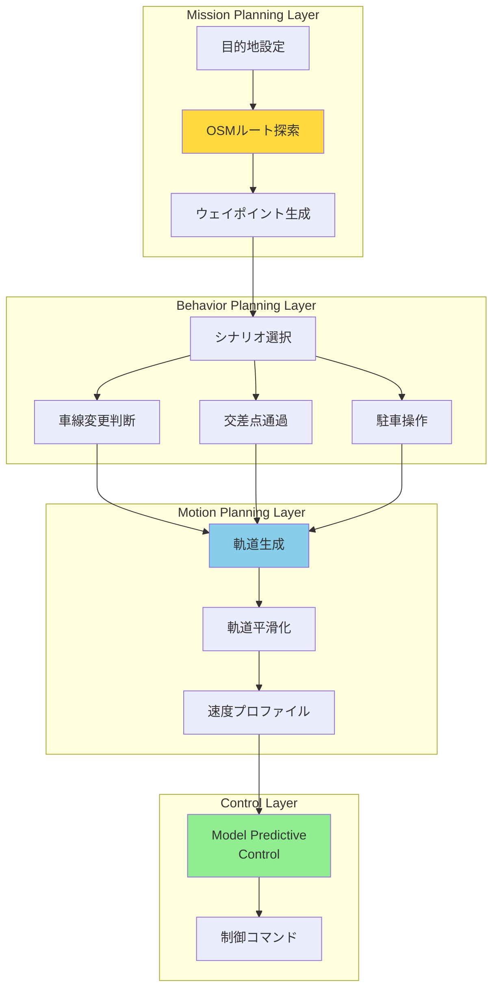

### 1. ミッションプランニング

#### OSMデータ構造と道路グラフ変換

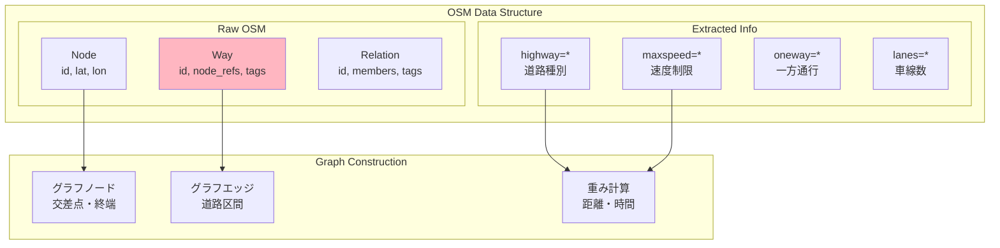

```cpp
class OSMMissionPlanner : public rclcpp::Node {
private:
    struct OSMGraph {
        std::unordered_map<int64_t, OSMNode> nodes;
        std::unordered_map<int64_t, OSMWay> ways;
        std::vector<std::vector<Edge>> adjacency_list;
    };
    
    OSMGraph graph_;
    
public:
    autoware_planning_msgs::msg::Route planRoute(
        const geometry_msgs::msg::Pose& start,
        const geometry_msgs::msg::Pose& goal) {
        
        // 最寄りのOSMノードを検索
        int64_t start_node = findNearestNode(start);
        int64_t goal_node = findNearestNode(goal);
        
        // A*アルゴリズムによる経路探索
        auto path = astarSearch(start_node, goal_node);
        
        // OSMウェイからAutoware Routeメッセージへ変換
        return convertToRoute(path);
    }
    
    std::vector<int64_t> astarSearch(int64_t start, int64_t goal) {
        std::priority_queue<Node, std::vector<Node>, NodeComparator> open_set;
        std::unordered_map<int64_t, double> g_score;
        std::unordered_map<int64_t, int64_t> came_from;
        
        open_set.push({start, 0, heuristic(start, goal)});
        g_score[start] = 0;
        
        while (!open_set.empty()) {
            Node current = open_set.top();
            open_set.pop();
            
            if (current.id == goal) {
                return reconstructPath(came_from, current.id);
            }
            
            for (const auto& edge : graph_.adjacency_list[current.id]) {
                double tentative_g = g_score[current.id] + edge.cost;
                
                if (g_score.find(edge.to) == g_score.end() || 
                    tentative_g < g_score[edge.to]) {
                    
                    came_from[edge.to] = current.id;
                    g_score[edge.to] = tentative_g;
                    double f = tentative_g + heuristic(edge.to, goal);
                    open_set.push({edge.to, tentative_g, f});
                }
            }
        }
        
        return {}; // 経路なし
    }
};
```

### 経路計画アルゴリズムフロー

#### A*アルゴリズムの動作

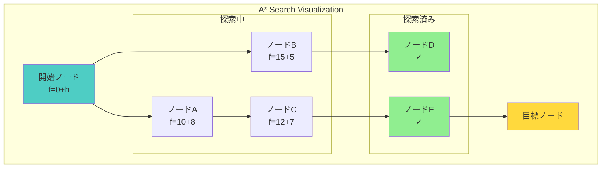

**コスト関数**:
- g(n): スタートからノードnまでの実コスト
- h(n): ノードnからゴールまでの推定コスト（ヒューリスティック）
- f(n) = g(n) + h(n): 総コスト

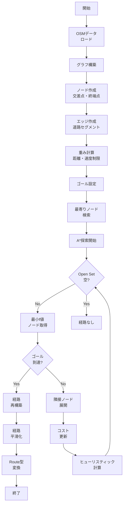

### OSM道路ネットワークグラフ構築

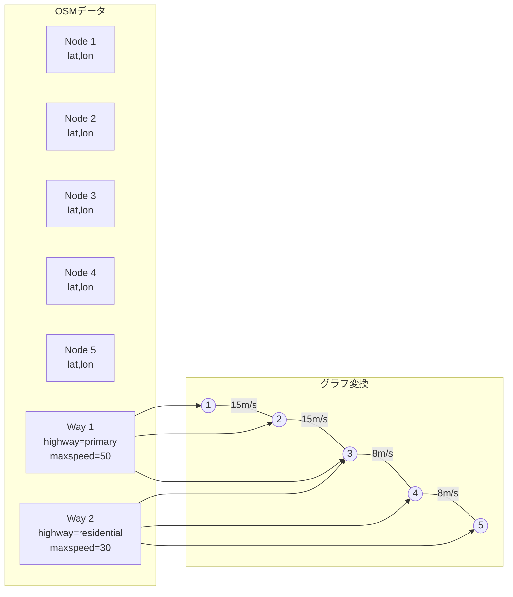

### 2. センサーベース動的プランニング

#### ローカルプランニングの詳細フロー

```mermaid
flowchart TD
    subgraph "環境認識"
        SENSOR[センサーデータ] --> LANE_DET[レーン検出]
        SENSOR --> OBJ_DET[障害物検出]
        SENSOR --> EDGE_DET[道路端検出]
    end
    
    subgraph "走行可能領域生成"
        LANE_DET --> CORRIDOR[走行コリドー]
        EDGE_DET --> CORRIDOR
        OBJ_DET --> OBSTACLES[障害物マップ]
    end
    
    subgraph "軌道計画"
        CORRIDOR --> CANDIDATES[軌道候補生成]
        OBSTACLES --> COST_MAP[コストマップ]
        CANDIDATES --> EVAL[軌道評価]
        COST_MAP --> EVAL
        
        EVAL --> BEST_TRAJ[最適軌道選択]
    end
    
    subgraph "安全性検証"
        BEST_TRAJ --> COLLISION[衝突判定]
        COLLISION -->|Safe| OUTPUT[軌道出力]
        COLLISION -->|Unsafe| REPLAN[再計画]
        REPLAN --> CANDIDATES
    end
    
    style CORRIDOR fill:#FFD93D
    style EVAL fill:#87CEEB
    style COLLISION fill:#FF6B6B
```

#### 動的障害物への対応

```mermaid
graph LR
    subgraph "動的環境での軌道生成"
        subgraph "t=0s"
            EGO1[自車]
            OBJ1[他車]
            TRAJ1[計画軌道]
        end
        
        subgraph "t=1s"
            EGO2[自車]
            OBJ2[他車<br/>移動]
            TRAJ2[軌道修正]
        end
        
        subgraph "t=2s"
            EGO3[自車]
            OBJ3[他車<br/>さらに移動]
            TRAJ3[回避完了]
        end
    end
    
    EGO1 -.-> TRAJ1
    OBJ1 --> OBJ2
    TRAJ1 -.->|修正| TRAJ2
    OBJ2 --> OBJ3
    TRAJ2 -.->|実行| TRAJ3
    
    style OBJ1 fill:#FF6B6B
    style OBJ2 fill:#FF6B6B
    style TRAJ2 fill:#FFD93D
```

```cpp
class SensorBasedLocalPlanner {
private:
    struct DrivingCorridor {
        std::vector<Eigen::Vector2d> centerline;
        std::vector<double> left_widths;
        std::vector<double> right_widths;
        double speed_limit;
    };
    
    struct LocalPerception {
        std::vector<LaneMarking> lane_markings;
        std::vector<Obstacle> obstacles;
        std::vector<RoadEdge> road_edges;
        OccupancyGrid occupancy;
    };
    
public:
    Trajectory planLocalTrajectory(const Route& global_route,
                                  const LocalPerception& perception,
                                  const VehicleState& ego_state) {
        // 1. 走行可能領域の生成
        DrivingCorridor corridor = generateDrivingCorridor(perception, global_route);
        
        // 2. 障害物マップの作成
        CostMap cost_map = createCostMap(perception.obstacles, perception.occupancy);
        
        // 3. 最適化問題の定式化
        TrajectoryOptimizer optimizer;
        optimizer.setCorridor(corridor);
        optimizer.setCostMap(cost_map);
        optimizer.setInitialState(ego_state);
        
        // 4. 軌道最適化
        Trajectory optimal_traj = optimizer.solve();
        
        return optimal_traj;
    }
    
    DrivingCorridor generateDrivingCorridor(
        const LocalPerception& perception,
        const Route& global_route) {
        
        DrivingCorridor corridor;
        
        // レーンマーキングがある場合
        if (!perception.lane_markings.empty()) {
            corridor = fromLaneMarkings(perception.lane_markings);
        }
        // 道路端のみの場合
        else if (!perception.road_edges.empty()) {
            corridor = fromRoadEdges(perception.road_edges, global_route);
        }
        // センサー情報が不十分な場合
        else {
            corridor = fromGlobalRoute(global_route, default_width_);
        }
        
        return corridor;
    }
};
```

---

## センサーベースローカルマップ生成

### ローカルマップ生成の全体像

```mermaid
graph TB
    subgraph "Multi-Sensor Input"
        CAM_IN[Camera<br/>画像]
        LIDAR_IN[LiDAR<br/>点群]
        RADAR_IN[Radar<br/>物体]
    end
    
    subgraph "Feature Extraction"
        LANE_FEAT[レーン特徴]
        EDGE_FEAT[道路端特徴]
        OBJ_FEAT[物体特徴]
    end
    
    subgraph "Local Map Layers"
        STATIC[静的レイヤー<br/>道路構造]
        DYNAMIC[動的レイヤー<br/>移動物体]
        SEMANTIC[意味レイヤー<br/>交通規則]
    end
    
    subgraph "Output"
        LOCAL_HD[ローカル<br/>HDマップ]
        OCCUPANCY[占有格子<br/>マップ]
    end
    
    CAM_IN --> LANE_FEAT
    LIDAR_IN --> EDGE_FEAT
    RADAR_IN --> OBJ_FEAT
    
    LANE_FEAT --> STATIC
    EDGE_FEAT --> STATIC
    OBJ_FEAT --> DYNAMIC
    
    STATIC --> LOCAL_HD
    DYNAMIC --> OCCUPANCY
    SEMANTIC --> LOCAL_HD
    
    style LOCAL_HD fill:#FFD93D
```

### 車線検出アルゴリズム

#### 画像処理パイプライン

```mermaid
flowchart LR
    subgraph "前処理"
        INPUT[入力画像] --> GRAY[グレースケール]
        GRAY --> BLUR[ガウシアンブラー]
        BLUR --> EDGE[Cannyエッジ]
    end
    
    subgraph "車線検出"
        EDGE --> ROI[ROI抽出]
        ROI --> HOUGH[Hough変換]
        HOUGH --> LINES[直線検出]
    end
    
    subgraph "後処理"
        LINES --> CLUSTER[クラスタリング]
        CLUSTER --> POLY[多項式<br/>フィッティング]
        POLY --> TRACK[時系列<br/>トラッキング]
    end
    
    TRACK --> OUTPUT[車線モデル]
    
    style HOUGH fill:#FFB6C1
    style POLY fill:#87CEEB
```

#### 鳥瞰図変換と3次多項式フィッティング

```mermaid
graph TB
    subgraph "Perspective Transform"
        CAM_VIEW[カメラ視点] --> HOMO[ホモグラフィ<br/>変換]
        HOMO --> BEV[鳥瞰図]
    end
    
    subgraph "Lane Fitting"
        BEV --> POINTS[車線候補点]
        POINTS --> RANSAC[RANSAC<br/>フィッティング]
        RANSAC --> POLY3[3次多項式<br/>y = ax³ + bx² + cx + d]
    end
    
    subgraph "Quality Check"
        POLY3 --> CONF[信頼度評価]
        CONF --> FILTER[カルマンフィルタ]
        FILTER --> STABLE[安定化された<br/>車線]
    end
    
    style BEV fill:#FFD93D
    style RANSAC fill:#FF6B6B
```

```cpp
class LaneDetector : public rclcpp::Node {
private:
    struct LaneModel {
        // 3次多項式: y = a*x^3 + b*x^2 + c*x + d
        double a, b, c, d;
        double confidence;
        enum Type { SOLID, DASHED, DOUBLE } type;
    };
    
public:
    std::vector<LaneModel> detectLanes(const cv::Mat& image) {
        // 1. 前処理
        cv::Mat processed = preprocessImage(image);
        
        // 2. 鳥瞰図変換
        cv::Mat bev = transformToBEV(processed);
        
        // 3. 車線候補点の抽出
        std::vector<cv::Point2f> lane_points = extractLanePoints(bev);
        
        // 4. RANSAC による車線フィッティング
        std::vector<LaneModel> lanes = fitLanesRANSAC(lane_points);
        
        // 5. トラッキングによる安定化
        lanes = stabilizeWithTracking(lanes);
        
        return lanes;
    }
    
    cv::Mat preprocessImage(const cv::Mat& image) {
        cv::Mat gray, edges;
        
        // グレースケール変換
        cv::cvtColor(image, gray, cv::COLOR_BGR2GRAY);
        
        // ガウシアンブラー
        cv::GaussianBlur(gray, gray, cv::Size(5, 5), 0);
        
        // Cannyエッジ検出
        cv::Canny(gray, edges, 50, 150);
        
        return edges;
    }
    
    std::vector<LaneModel> fitLanesRANSAC(
        const std::vector<cv::Point2f>& points) {
        
        std::vector<LaneModel> lanes;
        std::vector<bool> used(points.size(), false);
        
        for (int lane_idx = 0; lane_idx < max_lanes_; ++lane_idx) {
            LaneModel best_model;
            std::vector<int> best_inliers;
            
            for (int iter = 0; iter < ransac_iterations_; ++iter) {
                // ランダムに4点選択
                std::vector<int> sample_indices = randomSample(4, points.size());
                
                // 3次多項式フィッティング
                LaneModel model = fitPolynomial(points, sample_indices);
                
                // インライア計算
                std::vector<int> inliers = findInliers(points, model, used);
                
                if (inliers.size() > best_inliers.size()) {
                    best_model = model;
                    best_inliers = inliers;
                }
            }
            
            if (best_inliers.size() > min_inliers_) {
                // 最終的なモデルをインライアで再計算
                best_model = fitPolynomial(points, best_inliers);
                best_model.confidence = 
                    static_cast<double>(best_inliers.size()) / points.size();
                
                lanes.push_back(best_model);
                
                // 使用済みフラグを更新
                for (int idx : best_inliers) {
                    used[idx] = true;
                }
            }
        }
        
        return lanes;
    }
};
```

### LiDARベース道路端検出

#### 点群処理による道路端抽出

```mermaid
flowchart TD
    subgraph "Point Cloud Processing"
        RAW_PC[生点群<br/>~100k points] --> GROUND[地面除去<br/>RANSAC]
        
        GROUND --> HEIGHT_MAP[高さマップ<br/>生成]
        HEIGHT_MAP --> GRADIENT[勾配計算<br/>Sobel]
        
        GRADIENT --> EDGE_CAND[エッジ候補<br/>抽出]
        EDGE_CAND --> DBSCAN[DBSCAN<br/>クラスタリング]
        
        DBSCAN --> CURB[縁石検出]
        DBSCAN --> GUARDRAIL[ガードレール<br/>検出]
    end
    
    style GROUND fill:#90EE90
    style DBSCAN fill:#87CEEB
```

#### 高さマップベースの道路端検出

```mermaid
graph LR
    subgraph "Height Map Analysis"
        subgraph "Grid Generation"
            PC[点群] --> GRID[2Dグリッド<br/>0.2m解像度]
            GRID --> MAX_H[最大高さ<br/>マップ]
            GRID --> MIN_H[最小高さ<br/>マップ]
        end
        
        subgraph "Feature Detection"
            MAX_H --> DIFF[高さ差分]
            MIN_H --> DIFF
            DIFF --> THRESH[閾値処理<br/>>0.1m]
            THRESH --> EDGE_MAP[エッジマップ]
        end
        
        subgraph "Post Process"
            EDGE_MAP --> MORPH[モルフォロジー<br/>処理]
            MORPH --> CONTOUR[輪郭抽出]
            CONTOUR --> ROAD_EDGE[道路端]
        end
    end
    
    style DIFF fill:#FFD93D
    style CONTOUR fill:#4ECDC4
```

```cpp
class RoadEdgeDetector : public rclcpp::Node {
private:
    struct EdgePoint {
        Eigen::Vector3d position;
        Eigen::Vector3d normal;
        double height_diff;
        double intensity_change;
    };
    
public:
    std::vector<EdgePoint> detectRoadEdges(
        const sensor_msgs::msg::PointCloud2::SharedPtr cloud_msg) {
        
        // 1. 地面除去とグリッド化
        pcl::PointCloud<pcl::PointXYZI>::Ptr ground_removed = 
            removeGround(cloud_msg);
        
        // 2. 高さマップ生成
        cv::Mat height_map = createHeightMap(ground_removed);
        
        // 3. 勾配計算
        cv::Mat gradient_x, gradient_y;
        cv::Sobel(height_map, gradient_x, CV_32F, 1, 0);
        cv::Sobel(height_map, gradient_y, CV_32F, 0, 1);
        
        // 4. エッジ候補抽出
        std::vector<EdgePoint> edge_candidates;
        for (int y = 0; y < height_map.rows; ++y) {
            for (int x = 0; x < height_map.cols; ++x) {
                double gx = gradient_x.at<float>(y, x);
                double gy = gradient_y.at<float>(y, x);
                double magnitude = std::sqrt(gx*gx + gy*gy);
                
                if (magnitude > edge_threshold_) {
                    EdgePoint edge;
                    edge.position = gridToWorld(x, y);
                    edge.normal = Eigen::Vector3d(gx, gy, 0).normalized();
                    edge.height_diff = magnitude;
                    
                    edge_candidates.push_back(edge);
                }
            }
        }
        
        // 5. DBSCANクラスタリングでノイズ除去
        return clusterAndFilterEdges(edge_candidates);
    }
};
```

---

## 統合システム

### システム統合の概念

```mermaid
graph TB
    subgraph "Sensor Layer"
        S_LIDAR[LiDAR]
        S_CAM[Cameras]
        S_GNSS[GNSS/IMU]
        S_RADAR[Radar]
    end
    
    subgraph "Processing Pipeline"
        subgraph "Perception"
            P_OBJ[Object<br/>Detection]
            P_LANE[Lane<br/>Detection]
            P_SIGN[Sign<br/>Recognition]
        end
        
        subgraph "Localization"
            L_FUSION[Sensor<br/>Fusion]
            L_MATCH[Map<br/>Matching]
        end
        
        subgraph "Planning"
            PL_GLOBAL[Global<br/>Planning]
            PL_LOCAL[Local<br/>Planning]
        end
        
        subgraph "Control"
            C_LAT[Lateral<br/>Control]
            C_LON[Longitudinal<br/>Control]
        end
    end
    
    subgraph "Vehicle Interface"
        V_CMD[Vehicle<br/>Commands]
        V_STATE[Vehicle<br/>State]
    end
    
    S_LIDAR --> P_OBJ
    S_CAM --> P_LANE
    S_GNSS --> L_FUSION
    
    P_OBJ --> PL_LOCAL
    L_FUSION --> PL_GLOBAL
    PL_LOCAL --> C_LAT
    C_LAT --> V_CMD
    
    style L_FUSION fill:#FFD93D
    style PL_LOCAL fill:#87CEEB
```

### リアルタイム制約と処理優先度

```mermaid
gantt
    title システム処理タイムライン (100ms周期)
    dateFormat X
    axisFormat %L
    
    section Critical Path
    センサー取得      :crit, sensor, 0, 10
    障害物検出        :crit, detect, 10, 20
    局所経路計画      :crit, local, 30, 20
    制御出力         :crit, control, 50, 10
    
    section Parallel Tasks
    レーン検出        :active, lane, 10, 30
    地図マッチング     :active, map, 10, 40
    大域経路計画      :active, global, 20, 60
    
    section Background
    ログ記録         :bg, 0, 100
    診断チェック      :bg, 0, 100
```

### システム起動launch設定

```xml
<launch>
  <!-- Eagleye Localization -->
  <group>
    <push-ros-namespace namespace="localization"/>
    
    <include file="$(find-pkg-share eagleye_rt)/launch/eagleye_rt.launch.xml">
      <arg name="use_gnss_mode" value="single"/>
      <arg name="use_canless_mode" value="false"/>
    </include>
    
    <!-- Visual Odometry -->
    <node pkg="autoware_mapless_navigation" exec="visual_odometry" name="visual_odometry">
      <remap from="image" to="/sensing/camera/front/image_rect"/>
      <remap from="camera_info" to="/sensing/camera/front/camera_info"/>
    </node>
    
    <!-- OSM Map Matching -->
    <node pkg="autoware_mapless_navigation" exec="osm_map_matcher" name="map_matcher">
      <param name="osm_file" value="$(var osm_file)"/>
      <remap from="pose" to="eagleye/pose"/>
      <remap from="matched_pose" to="pose_with_covariance"/>
    </node>
  </group>
  
  <!-- Perception -->
  <group>
    <push-ros-namespace namespace="perception"/>
    
    <!-- Lane Detection -->
    <node pkg="autoware_mapless_navigation" exec="lane_detector" name="lane_detection">
      <remap from="image" to="/sensing/camera/front/image_rect"/>
      <param name="use_gpu" value="true"/>
    </node>
    
    <!-- Road Edge Detection -->
    <node pkg="autoware_mapless_navigation" exec="road_edge_detector" name="road_edge_detection">
      <remap from="points" to="/sensing/lidar/concatenated/pointcloud"/>
    </node>
    
    <!-- Local Map Generator -->
    <node pkg="autoware_mapless_navigation" exec="local_map_generator" name="local_map_generator">
      <remap from="lanes" to="lane_detection/lanes"/>
      <remap from="edges" to="road_edge_detection/edges"/>
      <remap from="objects" to="/perception/object_recognition/objects"/>
    </node>
  </group>
  
  <!-- Planning -->
  <group>
    <push-ros-namespace namespace="planning"/>
    
    <!-- OSMミッションプランナー -->
    <node pkg="autoware_mapless_navigation" exec="osm_mission_planner" name="mission_planning">
      <param name="osm_file" value="$(var osm_file)"/>
      <param name="routing_algorithm" value="astar"/>
      <remap from="goal_pose" to="/planning/mission_planning/goal"/>
      <remap from="current_pose" to="/localization/pose_twist_fusion_filter/pose"/>
    </node>
    
    <!-- センサーベースビヘイビアプランナー -->
    <node pkg="autoware_mapless_navigation" exec="sensor_based_behavior_planner" name="scenario_planning">
      <remap from="route" to="mission_planning/route"/>
      <remap from="local_map" to="/perception/local_map_generator/map"/>
      <remap from="objects" to="/perception/object_recognition/objects"/>
    </node>
  </group>
</launch>
```

---

## 統合フローチャート

### システム状態遷移

```mermaid
stateDiagram-v2
    [*] --> Initialize
    
    Initialize --> WaitingForSensors
    WaitingForSensors --> LocalizationOnly : Sensors Ready
    
    LocalizationOnly --> NavigationReady : Map Loaded
    NavigationReady --> AutonomousDriving : Route Set
    
    AutonomousDriving --> EmergencyStop : Fault Detected
    EmergencyStop --> NavigationReady : Fault Cleared
    
    AutonomousDriving --> ManualOverride : Driver Intervention
    ManualOverride --> NavigationReady : Auto Resume
    
    AutonomousDriving --> GoalReached : Destination
    GoalReached --> NavigationReady : New Route
    
    NavigationReady --> [*] : Shutdown
```

### エラーハンドリングとフォールバック

```mermaid
graph TB
    subgraph "Normal Operation"
        NORMAL[通常動作]
    end
    
    subgraph "Degraded Modes"
        subgraph "Sensor Failures"
            NO_GNSS[GNSS喪失<br/>→VO/LO使用]
            NO_CAM[カメラ故障<br/>→LiDARのみ]
            NO_LIDAR[LiDAR故障<br/>→カメラのみ]
        end
        
        subgraph "System Failures"
            LOC_FAIL[位置推定失敗<br/>→減速・停止]
            PLAN_FAIL[経路計画失敗<br/>→手動介入要求]
        end
    end
    
    subgraph "Recovery Actions"
        SLOW[減速走行]
        STOP[安全停止]
        MANUAL[手動運転]
    end
    
    NORMAL --> NO_GNSS
    NORMAL --> NO_CAM
    NORMAL --> LOC_FAIL
    
    NO_GNSS --> SLOW
    NO_CAM --> SLOW
    NO_LIDAR --> STOP
    LOC_FAIL --> STOP
    PLAN_FAIL --> MANUAL
    
    style LOC_FAIL fill:#FF6B6B
    style STOP fill:#FFD93D
```

### システム全体の処理フロー

```mermaid
flowchart TB
    subgraph "初期化フェーズ"
        INIT[システム起動]
        LOAD_OSM[OSMデータ<br/>ロード]
        CALIB[センサー<br/>キャリブレーション]
        INIT_LOC[初期位置<br/>推定]
    end
    
    subgraph "メインループ 10Hz"
        subgraph "センサー処理"
            GNSS_RECV[GNSS受信<br/>1-10Hz]
            IMU_RECV[IMU受信<br/>100Hz]
            LIDAR_RECV[LiDAR受信<br/>10Hz]
            CAM_RECV[カメラ受信<br/>30Hz]
        end
        
        subgraph "ローカライゼーション"
            EAGLEYE_FUSION[Eagleye<br/>GNSS/IMU融合]
            VO_CALC[ビジュアル<br/>オドメトリ]
            MAP_MATCH[OSM<br/>マップマッチング]
            EKF_FUSION[EKF<br/>統合]
        end
        
        subgraph "認識・マッピング"
            LOCAL_MAP_GEN[ローカルマップ<br/>生成]
            LANE_DET[車線<br/>検出]
            OBJ_DET[物体<br/>検出]
            EDGE_DET[道路端<br/>検出]
        end
        
        subgraph "プランニング"
            MISSION_PLAN[ミッション<br/>プランニング]
            BEHAVIOR_PLAN[ビヘイビア<br/>プランニング]
            MOTION_PLAN[モーション<br/>プランニング]
        end
        
        subgraph "制御出力"
            TRAJ_VALID[軌道<br/>検証]
            VEH_CMD[車両<br/>コマンド]
        end
    end
    
    %% 初期化フロー
    INIT --> LOAD_OSM
    INIT --> CALIB
    CALIB --> INIT_LOC
    LOAD_OSM --> MISSION_PLAN
    
    %% センサーフロー
    GNSS_RECV --> EAGLEYE_FUSION
    IMU_RECV --> EAGLEYE_FUSION
    CAM_RECV --> VO_CALC
    CAM_RECV --> LANE_DET
    LIDAR_RECV --> LOCAL_MAP_GEN
    LIDAR_RECV --> OBJ_DET
    LIDAR_RECV --> EDGE_DET
    
    %% ローカライゼーションフロー
    EAGLEYE_FUSION --> EKF_FUSION
    VO_CALC --> EKF_FUSION
    MAP_MATCH --> EKF_FUSION
    EKF_FUSION --> MAP_MATCH
    
    %% 認識フロー
    LANE_DET --> LOCAL_MAP_GEN
    OBJ_DET --> LOCAL_MAP_GEN
    EDGE_DET --> LOCAL_MAP_GEN
    
    %% プランニングフロー
    EKF_FUSION --> MISSION_PLAN
    LOCAL_MAP_GEN --> BEHAVIOR_PLAN
    MISSION_PLAN --> BEHAVIOR_PLAN
    BEHAVIOR_PLAN --> MOTION_PLAN
    MOTION_PLAN --> TRAJ_VALID
    
    %% 制御フロー
    TRAJ_VALID --> VEH_CMD
    
    %% フィードバックループ
    VEH_CMD -.-> VO_CALC
    BEHAVIOR_PLAN -.-> MISSION_PLAN
```

### ローカライゼーション処理詳細

```mermaid
flowchart LR
    subgraph "入力センサ"
        GNSS[GNSS<br/>5Hz]
        IMU[IMU<br/>100Hz]
        CAM[Camera<br/>30Hz]
        ODOM[Odometry<br/>50Hz]
    end
    
    subgraph "Eagleye Core"
        VEL_SF[Velocity<br/>Scale Factor]
        YAW_RATE[Yaw Rate<br/>Offset]
        HEADING[Heading<br/>Estimation]
        POS_EST[Position<br/>Estimation]
    end
    
    subgraph "補完処理"
        VO[Visual<br/>Odometry]
        OSM_MATCH[OSM Map<br/>Matching]
    end
    
    subgraph "統合"
        EKF[Extended<br/>Kalman Filter]
        COV[Covariance<br/>Estimation]
    end
    
    subgraph "出力"
        POSE[Pose with<br/>Covariance]
        TWIST[Twist with<br/>Covariance]
    end
    
    %% Eagleye処理
    GNSS --> VEL_SF
    GNSS --> POS_EST
    IMU --> YAW_RATE
    ODOM --> VEL_SF
    
    VEL_SF --> HEADING
    YAW_RATE --> HEADING
    HEADING --> POS_EST
    
    %% 補完処理
    CAM --> VO
    POS_EST --> OSM_MATCH
    
    %% 統合
    POS_EST --> EKF
    VO --> EKF
    OSM_MATCH --> EKF
    
    EKF --> COV
    EKF --> POSE
    COV --> POSE
    EKF --> TWIST
```

### プランニング処理詳細

```mermaid
flowchart TB
    subgraph "Mission Planning"
        GOAL[Goal Pose]
        CURR[Current Pose]
        OSM_DATA[OSM Data]
        
        GRAPH[Graph<br/>Construction]
        A_STAR[A* Search]
        ROUTE_GEN[Route<br/>Generation]
    end
    
    subgraph "Behavior Planning"
        ROUTE[Global Route]
        LOCAL_MAP[Local Map]
        OBJECTS[Dynamic Objects]
        
        LANE_CHANGE[Lane Change<br/>Decision]
        INTERSECTION[Intersection<br/>Handling]
        OBSTACLE_AVOID[Obstacle<br/>Avoidance]
    end
    
    subgraph "Motion Planning"
        BEHAVIOR[Behavior<br/>Decision]
        CONSTRAINTS[Vehicle<br/>Constraints]
        
        TRAJ_GEN[Trajectory<br/>Generation]
        VELOCITY_PLAN[Velocity<br/>Planning]
        COLLISION_CHECK[Collision<br/>Checking]
    end
    
    %% Mission Planning フロー
    GOAL --> A_STAR
    CURR --> A_STAR
    OSM_DATA --> GRAPH
    GRAPH --> A_STAR
    A_STAR --> ROUTE_GEN
    
    %% Behavior Planning フロー
    ROUTE_GEN --> ROUTE
    ROUTE --> LANE_CHANGE
    LOCAL_MAP --> LANE_CHANGE
    LOCAL_MAP --> INTERSECTION
    OBJECTS --> OBSTACLE_AVOID
    
    LANE_CHANGE --> BEHAVIOR
    INTERSECTION --> BEHAVIOR
    OBSTACLE_AVOID --> BEHAVIOR
    
    %% Motion Planning フロー
    BEHAVIOR --> TRAJ_GEN
    CONSTRAINTS --> TRAJ_GEN
    TRAJ_GEN --> VELOCITY_PLAN
    VELOCITY_PLAN --> COLLISION_CHECK
```

---

## 実装詳細

### 実装アプローチの全体像

```mermaid
graph TB
    subgraph "Development Phases"
        PHASE1[Phase 1<br/>基本機能実装]
        PHASE2[Phase 2<br/>センサー統合]
        PHASE3[Phase 3<br/>最適化]
        PHASE4[Phase 4<br/>実車検証]
    end
    
    subgraph "Phase 1 Components"
        OSM[OSM Parser]
        EAGLEYE[Eagleye Integration]
        BASIC_PLAN[Basic Planner]
    end
    
    subgraph "Phase 2 Components"
        LANE_DET[Lane Detector]
        MAP_MATCH[Map Matcher]
        LOCAL_PLAN[Local Planner]
    end
    
    subgraph "Phase 3 Components"
        GPU_OPT[GPU最適化]
        PARALLEL[並列処理]
        MEMORY[メモリ最適化]
    end
    
    PHASE1 --> PHASE2
    PHASE2 --> PHASE3
    PHASE3 --> PHASE4
    
    PHASE1 --> OSM
    PHASE1 --> EAGLEYE
    PHASE2 --> LANE_DET
    PHASE3 --> GPU_OPT
    
    style PHASE1 fill:#90EE90
    style PHASE2 fill:#87CEEB
    style PHASE3 fill:#FFD93D
    style PHASE4 fill:#FF6B6B
```

### 1. OSMデータローダー

#### データ構造設計

```mermaid
classDiagram
    class OSMNode {
        +int64_t id
        +double lat
        +double lon
        +double ele
        +getTags() map
    }
    
    class OSMWay {
        +int64_t id
        +vector~int64_t~ node_refs
        +map~string,string~ tags
        +isRoad() bool
        +getMaxSpeed() double
        +getLaneCount() int
    }
    
    class OSMGraph {
        +map~int64_t,OSMNode~ nodes
        +map~int64_t,OSMWay~ ways
        +vector~vector~Edge~~ adjacency_list
        +buildGraph() void
        +findPath() vector
    }
    
    class Edge {
        +int64_t from_node
        +int64_t to_node
        +double weight
        +int64_t way_id
    }
    
    OSMGraph --> OSMNode
    OSMGraph --> OSMWay
    OSMGraph --> Edge
    OSMWay --> OSMNode : references
```

```cpp
class OSMDataLoader : public rclcpp::Node {
private:
    struct OSMWay {
        int64_t id;
        std::vector<int64_t> node_refs;
        std::map<std::string, std::string> tags;
        
        bool isRoad() const {
            return tags.find("highway") != tags.end();
        }
        
        double getMaxSpeed() const {
            auto it = tags.find("maxspeed");
            if (it != tags.end()) {
                return parseSpeed(it->second);
            }
            // デフォルト速度（道路タイプ別）
            auto highway_type = tags.at("highway");
            if (highway_type == "motorway") return 100.0;
            if (highway_type == "trunk") return 80.0;
            if (highway_type == "primary") return 60.0;
            if (highway_type == "secondary") return 50.0;
            if (highway_type == "residential") return 30.0;
            return 30.0; // default
        }
    };
    
public:
    void loadOSMFile(const std::string& filename) {
        pugi::xml_document doc;
        auto result = doc.load_file(filename.c_str());
        
        if (!result) {
            RCLCPP_ERROR(get_logger(), "Failed to load OSM file: %s", 
                        result.description());
            return;
        }
        
        // ノードの読み込み
        for (auto node : doc.child("osm").children("node")) {
            OSMNode osm_node;
            osm_node.id = node.attribute("id").as_llong();
            osm_node.lat = node.attribute("lat").as_double();
            osm_node.lon = node.attribute("lon").as_double();
            
            nodes_[osm_node.id] = osm_node;
        }
        
        // ウェイの読み込み
        for (auto way : doc.child("osm").children("way")) {
            OSMWay osm_way;
            osm_way.id = way.attribute("id").as_llong();
            
            // ノード参照
            for (auto nd : way.children("nd")) {
                osm_way.node_refs.push_back(nd.attribute("ref").as_llong());
            }
            
            // タグ
            for (auto tag : way.children("tag")) {
                osm_way.tags[tag.attribute("k").as_string()] = 
                    tag.attribute("v").as_string();
            }
            
            if (osm_way.isRoad()) {
                ways_[osm_way.id] = osm_way;
                buildGraphFromWay(osm_way);
            }
        }
        
        RCLCPP_INFO(get_logger(), "Loaded %zu nodes and %zu ways", 
                   nodes_.size(), ways_.size());
    }
};
```

### 2. 並列センサー処理

#### センサー同期とタイムスタンプ管理

```mermaid
sequenceDiagram
    participant LiDAR
    participant Camera
    participant IMU
    participant Sync as Synchronizer
    participant Proc as Processor
    
    LiDAR->>Sync: PointCloud (t=100ms)
    Camera->>Sync: Image (t=100ms)
    IMU->>Sync: IMU Data (t=98ms)
    
    Note over Sync: Time Alignment<br/>±10ms tolerance
    
    Sync->>Sync: Buffer & Match
    Sync->>Proc: Synchronized Data
    
    Proc->>Proc: Parallel Processing
    Proc-->>LiDAR: Next Frame Request
    Proc-->>Camera: Next Frame Request
```

#### スレッドプールとタスク分配

```mermaid
graph TB
    subgraph "Thread Pool Architecture"
        MAIN[Main Thread<br/>Orchestrator]
        
        subgraph "Worker Threads"
            W1[Worker 1<br/>Point Cloud]
            W2[Worker 2<br/>Image Proc]
            W3[Worker 3<br/>Fusion]
            W4[Worker 4<br/>Planning]
        end
        
        subgraph "Task Queue"
            Q1[High Priority<br/>Safety Critical]
            Q2[Normal Priority<br/>Perception]
            Q3[Low Priority<br/>Logging]
        end
    end
    
    MAIN --> Q1
    MAIN --> Q2
    MAIN --> Q3
    
    Q1 --> W1
    Q2 --> W2
    Q2 --> W3
    Q3 --> W4
    
    style Q1 fill:#FF6B6B
    style W1 fill:#90EE90
```

```cpp
class ParallelSensorProcessor : public rclcpp::Node {
private:
    // スレッドプール
    std::shared_ptr<tf2::ThreadPool> thread_pool_;
    
    // 各センサーの処理結果
    std::atomic<bool> lidar_ready_{false};
    std::atomic<bool> camera_ready_{false};
    std::atomic<bool> radar_ready_{false};
    
    // 同期用
    std::mutex mutex_;
    std::condition_variable cv_;
    
public:
    ParallelSensorProcessor() : Node("parallel_sensor_processor") {
        thread_pool_ = std::make_shared<tf2::ThreadPool>(4);
        
        // センサーサブスクライバー
        lidar_sub_ = create_subscription<sensor_msgs::msg::PointCloud2>(
            "lidar/points", rclcpp::SensorDataQoS(),
            [this](const sensor_msgs::msg::PointCloud2::SharedPtr msg) {
                thread_pool_->enqueue([this, msg]() { processLidar(msg); });
            });
            
        camera_sub_ = create_subscription<sensor_msgs::msg::Image>(
            "camera/image", rclcpp::SensorDataQoS(),
            [this](const sensor_msgs::msg::Image::SharedPtr msg) {
                thread_pool_->enqueue([this, msg]() { processCamera(msg); });
            });
    }
    
    void processLidar(const sensor_msgs::msg::PointCloud2::SharedPtr msg) {
        auto start = std::chrono::high_resolution_clock::now();
        
        // LiDAR処理（地面除去、クラスタリング等）
        auto ground_removed = removeGround(msg);
        auto clusters = performClustering(ground_removed);
        auto objects = classifyObjects(clusters);
        
        {
            std::lock_guard<std::mutex> lock(mutex_);
            latest_lidar_objects_ = objects;
            lidar_ready_ = true;
        }
        
        cv_.notify_all();
        
        auto end = std::chrono::high_resolution_clock::now();
        auto duration = std::chrono::duration_cast<std::chrono::milliseconds>(end - start);
        RCLCPP_DEBUG(get_logger(), "LiDAR processing took %ld ms", duration.count());
    }
    
    void processCamera(const sensor_msgs::msg::Image::SharedPtr msg) {
        auto start = std::chrono::high_resolution_clock::now();
        
        // カメラ処理（車線検出、物体認識等）
        cv::Mat image = cv_bridge::toCvShare(msg)->image;
        auto lanes = detectLanes(image);
        auto traffic_signs = detectTrafficSigns(image);
        
        {
            std::lock_guard<std::mutex> lock(mutex_);
            latest_lanes_ = lanes;
            latest_signs_ = traffic_signs;
            camera_ready_ = true;
        }
        
        cv_.notify_all();
        
        auto end = std::chrono::high_resolution_clock::now();
        auto duration = std::chrono::duration_cast<std::chrono::milliseconds>(end - start);
        RCLCPP_DEBUG(get_logger(), "Camera processing took %ld ms", duration.count());
    }
};
```

### 3. 適応的ビヘイビアプランナー

#### コンテキスト認識と行動選択

```mermaid
stateDiagram-v2
    [*] --> DrivingContextDetection
    
    state DrivingContextDetection {
        [*] --> AnalyzeEnvironment
        AnalyzeEnvironment --> Highway : speed > 60km/h
        AnalyzeEnvironment --> Urban : buildings detected
        AnalyzeEnvironment --> Residential : narrow road
        AnalyzeEnvironment --> Parking : low speed + markers
    }
    
    Highway --> HighwayBehavior
    Urban --> UrbanBehavior
    Residential --> ResidentialBehavior
    Parking --> ParkingBehavior
    
    state HighwayBehavior {
        LaneKeeping
        LaneChange
        Merging
    }
    
    state UrbanBehavior {
        IntersectionHandling
        PedestrianAware
        TrafficLightDetection
    }
```

#### 行動パラメータの動的調整

```mermaid
graph LR
    subgraph "Context Parameters"
        subgraph "Highway"
            H_FOLLOW[車間距離: 2.0s]
            H_ACCEL[加速度: 2.5m/s²]
            H_LANE[車線変更: 積極的]
        end
        
        subgraph "Urban"
            U_FOLLOW[車間距離: 1.5s]
            U_ACCEL[加速度: 1.5m/s²]
            U_LANE[車線変更: 慎重]
        end
        
        subgraph "Residential"
            R_FOLLOW[車間距離: 1.0s]
            R_ACCEL[加速度: 1.0m/s²]
            R_LANE[車線変更: 最小限]
        end
    end
    
    style H_ACCEL fill:#4ECDC4
    style U_ACCEL fill:#FFD93D
    style R_ACCEL fill:#FF6B6B
```

```cpp
class AdaptiveBehaviorPlanner : public rclcpp::Node {
private:
    enum class DrivingContext {
        HIGHWAY,
        URBAN,
        RESIDENTIAL,
        PARKING,
        UNKNOWN
    };
    
    struct BehaviorParameters {
        double following_distance;
        double lane_change_threshold;
        double max_acceleration;
        double comfort_deceleration;
    };
    
    std::map<DrivingContext, BehaviorParameters> context_params_;
    
public:
    BehaviorDecision planBehavior(
        const Route& route,
        const LocalMap& local_map,
        const VehicleState& ego_state) {
        
        // 1. 運転コンテキストの判定
        DrivingContext context = detectDrivingContext(route, local_map);
        
        // 2. コンテキストに応じたパラメータ選択
        auto params = context_params_[context];
        
        // 3. 状況に応じた行動決定
        if (shouldChangeLane(local_map, ego_state, params)) {
            return planLaneChange(local_map, ego_state, params);
        }
        
        if (approachingIntersection(route, ego_state)) {
            return planIntersectionManeuver(local_map, ego_state);
        }
        
        if (obstacleAhead(local_map, ego_state)) {
            return planObstacleAvoidance(local_map, ego_state, params);
        }
        
        // デフォルト：車線維持
        return planLaneKeeping(route, local_map, ego_state, params);
    }
    
    DrivingContext detectDrivingContext(
        const Route& route,
        const LocalMap& local_map) {
        
        // OSM道路タイプから判定
        auto current_way = route.getCurrentWay();
        if (current_way.tags["highway"] == "motorway" || 
            current_way.tags["highway"] == "trunk") {
            return DrivingContext::HIGHWAY;
        }
        
        // 速度制限から判定
        double speed_limit = current_way.getMaxSpeed();
        if (speed_limit > 60.0) {
            return DrivingContext::HIGHWAY;
        } else if (speed_limit > 30.0) {
            return DrivingContext::URBAN;
        } else {
            return DrivingContext::RESIDENTIAL;
        }
    }
};
```

### 4. 車線変更判断アルゴリズム

#### 安全性評価プロセス

```mermaid
flowchart TD
    START[車線変更要求] --> CHECK_FEASIBLE[実行可能性<br/>チェック]
    
    CHECK_FEASIBLE --> LANE_EXIST{隣接車線<br/>存在?}
    LANE_EXIST -->|No| ABORT[中止]
    LANE_EXIST -->|Yes| SCAN
    
    SCAN[周辺車両<br/>スキャン] --> CALC_GAP[ギャップ<br/>計算]
    
    CALC_GAP --> FRONT_CHECK{前方車両<br/>安全?}
    FRONT_CHECK -->|No| WAIT[待機]
    FRONT_CHECK -->|Yes| REAR_CHECK
    
    REAR_CHECK{後方車両<br/>安全?} -->|No| WAIT
    REAR_CHECK -->|Yes| TTC_CHECK
    
    TTC_CHECK{TTC > 4s?} -->|No| WAIT
    TTC_CHECK -->|Yes| EXECUTE
    
    EXECUTE[車線変更<br/>実行] --> MONITOR[継続<br/>モニタリング]
    
    WAIT --> SCAN
    
    style CHECK_FEASIBLE fill:#FFD93D
    style TTC_CHECK fill:#FF6B6B
    style EXECUTE fill:#4ECDC4
```

#### 車線変更の軌道生成

```mermaid
graph TB
    subgraph "Trajectory Generation"
        CURRENT[現在位置] --> SPLINE[スプライン<br/>軌道生成]
        TARGET[目標車線] --> SPLINE
        
        SPLINE --> SAMPLES[軌道<br/>サンプリング<br/>Δt=0.1s]
        
        SAMPLES --> COMFORT{快適性<br/>評価}
        COMFORT -->|NG| ADJUST[パラメータ<br/>調整]
        ADJUST --> SPLINE
        
        COMFORT -->|OK| COLLISION{衝突<br/>チェック}
        COLLISION -->|NG| ADJUST
        COLLISION -->|OK| FINAL[最終軌道]
    end
    
    style SPLINE fill:#87CEEB
    style COLLISION fill:#FF6B6B
```

```cpp
class LaneChangeDecisionMaker {
private:
    struct LaneChangeFeasibility {
        bool safe;
        double cost;
        double time_window;
        int target_lane_id;
    };
    
public:
    LaneChangeFeasibility evaluateLaneChange(
        const Lane& current_lane,
        const Lane& target_lane,
        const std::vector<TrackedObject>& objects,
        const VehicleState& ego_state) {
        
        LaneChangeFeasibility result;
        
        // 1. 安全性チェック
        result.safe = checkSafety(target_lane, objects, ego_state);
        
        // 2. コスト計算
        result.cost = calculateCost(current_lane, target_lane, objects);
        
        // 3. 実行可能時間窓の計算
        result.time_window = calculateTimeWindow(target_lane, objects, ego_state);
        
        // 4. ターゲットレーンID
        result.target_lane_id = target_lane.id;
        
        return result;
    }
    
private:
    bool checkSafety(const Lane& target_lane,
                     const std::vector<TrackedObject>& objects,
                     const VehicleState& ego_state) {
        
        // 隣接車線の車両との距離・速度チェック
        for (const auto& obj : objects) {
            if (!isInLane(obj.position, target_lane)) continue;
            
            double relative_distance = calculateDistance(ego_state.position, obj.position);
            double relative_velocity = obj.velocity.x - ego_state.velocity.x;
            
            // Time to Collision (TTC)
            double ttc = relative_distance / std::abs(relative_velocity);
            
            if (ttc < min_ttc_threshold_) {
                return false;
            }
            
            // 最小車間距離
            if (relative_distance < min_gap_) {
                return false;
            }
        }
        
        return true;
    }
    
    double calculateCost(const Lane& current_lane,
                        const Lane& target_lane,
                        const std::vector<TrackedObject>& objects) {
        double cost = 0.0;
        
        // 車線変更の基本コスト
        cost += lane_change_base_cost_;
        
        // 交通流の速度差によるコスト
        double current_flow_speed = estimateTrafficFlow(current_lane, objects);
        double target_flow_speed = estimateTrafficFlow(target_lane, objects);
        cost += speed_diff_weight_ * std::abs(current_flow_speed - target_flow_speed);
        
        // 車線密度によるコスト
        double current_density = calculateDensity(current_lane, objects);
        double target_density = calculateDensity(target_lane, objects);
        cost += density_weight_ * (target_density - current_density);
        
        return cost;
    }
};
```

### 5. 交差点通過戦略

#### 交差点認識と分類

```mermaid
graph TB
    subgraph "Intersection Detection"
        OSM_DATA[OSM交差点<br/>データ] --> TYPE{交差点<br/>タイプ}
        SENSOR[センサー<br/>認識] --> TYPE
        
        TYPE --> SIGNAL[信号あり]
        TYPE --> STOP_SIGN[一時停止]
        TYPE --> PRIORITY[優先道路]
        TYPE --> ROUNDABOUT[ラウンドアバウト]
    end
    
    subgraph "Behavior Selection"
        SIGNAL --> SIG_BEHAVIOR[信号待ち<br/>挙動]
        STOP_SIGN --> STOP_BEHAVIOR[一時停止<br/>挙動]
        PRIORITY --> PRIO_BEHAVIOR[優先判定<br/>挙動]
        ROUNDABOUT --> ROUND_BEHAVIOR[環状交差点<br/>挙動]
    end
    
    style TYPE fill:#FFD93D
```

#### 交差点通過の状態遷移

```mermaid
stateDiagram-v2
    [*] --> Approaching
    
    Approaching --> DecelerationZone : 30m before
    DecelerationZone --> StopLine : 10m before
    
    StopLine --> WaitingTurn : Need to yield
    StopLine --> CheckTraffic : Clear to go
    
    WaitingTurn --> CheckTraffic : Gap found
    CheckTraffic --> Entering : Safe
    CheckTraffic --> WaitingTurn : Unsafe
    
    Entering --> Crossing
    Crossing --> Exiting
    Exiting --> [*]
    
    Crossing --> EmergencyStop : Obstacle
    EmergencyStop --> Crossing : Clear
```

```cpp
class IntersectionHandler : public rclcpp::Node {
private:
    enum class IntersectionState {
        APPROACHING,
        WAITING,
        ENTERING,
        CROSSING,
        EXITING
    };
    
    struct IntersectionContext {
        geometry_msgs::msg::Point center;
        double radius;
        std::vector<Lane> entering_lanes;
        std::vector<Lane> exiting_lanes;
        TrafficLightState traffic_light;
        std::vector<TrackedObject> other_vehicles;
    };
    
public:
    Trajectory planIntersectionTraversal(
        const IntersectionContext& context,
        const VehicleState& ego_state,
        const Route& route) {
        
        IntersectionState state = determineState(context, ego_state);
        
        switch (state) {
            case IntersectionState::APPROACHING:
                return planApproach(context, ego_state);
                
            case IntersectionState::WAITING:
                return planWaiting(context, ego_state);
                
            case IntersectionState::ENTERING:
                return planEntering(context, ego_state, route);
                
            case IntersectionState::CROSSING:
                return planCrossing(context, ego_state, route);
                
            case IntersectionState::EXITING:
                return planExiting(context, ego_state, route);
        }
    }
    
private:
    Trajectory planApproach(const IntersectionContext& context,
                           const VehicleState& ego_state) {
        Trajectory traj;
        
        // 減速プロファイルの生成
        double stop_distance = calculateStopDistance(ego_state, context.center);
        double required_decel = calculateRequiredDeceleration(
            ego_state.velocity.x, stop_distance);
        
        // 快適な減速度以内に収める
        required_decel = std::min(required_decel, comfort_decel_);
        
        // 軌道生成
        generateDecelerationProfile(traj, ego_state, required_decel, stop_distance);
        
        return traj;
    }
    
    bool checkRightOfWay(const IntersectionContext& context,
                        const VehicleState& ego_state) {
        // 信号がある場合
        if (context.traffic_light.exists) {
            return context.traffic_light.state == TrafficLightState::GREEN;
        }
        
        // 優先道路の判定
        if (isOnPriorityRoad(ego_state, context)) {
            return true;
        }
        
        // 他車両との優先順位判定
        for (const auto& vehicle : context.other_vehicles) {
            if (shouldYieldTo(vehicle, ego_state, context)) {
                return false;
            }
        }
        
        return true;
    }
};
```

---

## OSMベースミッションプランナーの実装

### システム統合の詳細設計

```mermaid
graph TB
    subgraph "Autoware Mission Planner Interface"
        PLUGIN_BASE[PlannerPlugin<br/>Base Class]
        API[Standard API]
    end
    
    subgraph "OSM Planner Implementation"
        OSM_PLUGIN[OSMPlanner<br/>Plugin]
        
        subgraph "Core Components"
            LOADER[OSM Loader]
            ROUTER[Graph Router]
            GENERATOR[Lane Generator]
            MATCHER[Map Matcher]
        end
    end
    
    subgraph "Integration Points"
        ROS_TOPICS[ROS Topics]
        TF_TREE[TF Tree]
        PARAMS[Parameters]
    end
    
    PLUGIN_BASE --> OSM_PLUGIN
    OSM_PLUGIN --> LOADER
    OSM_PLUGIN --> ROUTER
    OSM_PLUGIN --> GENERATOR
    
    API --> ROS_TOPICS
    OSM_PLUGIN --> TF_TREE
    
    style OSM_PLUGIN fill:#FFD93D
    style ROUTER fill:#87CEEB
```

### 8.1 プラグインアーキテクチャ

```cpp
// osm_planner_plugin.hpp
namespace autoware::mission_planner_universe::osm
{

class OSMPlanner : public mission_planner_universe::PlannerPlugin
{
public:
  void initialize(rclcpp::Node * node) override;
  bool ready() const override { return is_graph_ready_; }
  LaneletRoute plan(const RoutePoints & points) override;
  MarkerArray visualize(const LaneletRoute & route) const override;
  
private:
  // OSM graph representation
  struct OSMGraph {
    std::unordered_map<int64_t, OSMNode> nodes;
    std::unordered_map<int64_t, OSMWay> ways;
    std::vector<std::vector<Edge>> adjacency_list;
  };
  
  OSMGraph osm_graph_;
  OSMMapMatcher map_matcher_;
  GraphRouter router_;
  LaneGenerator lane_generator_;
  
  bool is_graph_ready_{false};
  
  // OSM data loading and processing
  void loadOSMData(const std::string & file_path);
  void buildRoutingGraph();
  
  // Route planning
  std::vector<int64_t> findRoute(
    const geometry_msgs::msg::Pose & start,
    const geometry_msgs::msg::Pose & goal);
  
  // Lane generation from OSM centerlines
  lanelet::ConstLanelets generateLanelets(
    const std::vector<int64_t> & way_ids);
};

} // namespace
```

### 8.2 OSMデータ処理アルゴリズム

#### 道路属性の推定ロジック

```mermaid
flowchart TD
    WAY[OSM Way] --> CHECK_TAGS{タグ確認}
    
    CHECK_TAGS --> WIDTH_TAG{width<br/>タグあり?}
    WIDTH_TAG -->|Yes| USE_WIDTH[タグ値使用]
    WIDTH_TAG -->|No| EST_WIDTH[幅推定]
    
    CHECK_TAGS --> LANES_TAG{lanes<br/>タグあり?}
    LANES_TAG -->|Yes| USE_LANES[タグ値使用]
    LANES_TAG -->|No| EST_LANES[車線数推定]
    
    CHECK_TAGS --> SPEED_TAG{maxspeed<br/>タグあり?}
    SPEED_TAG -->|Yes| USE_SPEED[タグ値使用]
    SPEED_TAG -->|No| EST_SPEED[速度推定]
    
    EST_WIDTH --> HIGHWAY_TYPE[道路種別から<br/>推定]
    EST_LANES --> HIGHWAY_TYPE
    EST_SPEED --> HIGHWAY_TYPE
    
    HIGHWAY_TYPE --> FINAL_ATTR[最終属性]
    USE_WIDTH --> FINAL_ATTR
    USE_LANES --> FINAL_ATTR
    USE_SPEED --> FINAL_ATTR
    
    style CHECK_TAGS fill:#FFD93D
    style FINAL_ATTR fill:#4ECDC4
```

```cpp
class OSMDataProcessor {
public:
  struct ProcessedWay {
    int64_t id;
    std::vector<Eigen::Vector3d> centerline;
    double width;
    int num_lanes;
    double max_speed;
    bool is_oneway;
    std::string road_type;
  };
  
  ProcessedWay processWay(const OSMWay & way) {
    ProcessedWay result;
    result.id = way.id;
    
    // Extract centerline geometry
    for (const auto & node_id : way.node_refs) {
      const auto & node = osm_nodes_.at(node_id);
      result.centerline.push_back(
        Eigen::Vector3d(node.lon, node.lat, node.ele));
    }
    
    // Estimate road properties
    result.road_type = way.tags["highway"];
    result.width = estimateWidth(way);
    result.num_lanes = estimateLanes(way);
    result.max_speed = parseMaxSpeed(way.tags["maxspeed"]);
    result.is_oneway = (way.tags["oneway"] == "yes");
    
    return result;
  }
  
private:
  double estimateWidth(const OSMWay & way) {
    // Width estimation based on road type and lane count
    if (way.tags.count("width")) {
      return std::stod(way.tags.at("width"));
    }
    
    const auto & highway_type = way.tags.at("highway");
    if (highway_type == "motorway") return 3.5 * getLaneCount(way);
    if (highway_type == "trunk") return 3.5 * getLaneCount(way);
    if (highway_type == "primary") return 3.25 * getLaneCount(way);
    if (highway_type == "secondary") return 3.0 * getLaneCount(way);
    if (highway_type == "residential") return 5.5; // Total width
    
    return 3.0 * getLaneCount(way); // Default
  }
  
  int getLaneCount(const OSMWay & way) {
    if (way.tags.count("lanes")) {
      return std::stoi(way.tags.at("lanes"));
    }
    
    // Estimate based on road type
    const auto & highway_type = way.tags.at("highway");
    if (highway_type == "motorway") return 3;
    if (highway_type == "trunk") return 2;
    if (highway_type == "primary") return 2;
    if (highway_type == "secondary") return 2;
    if (highway_type == "residential") return 1;
    
    return 1; // Default
  }
};
```

### 8.3 リアルタイムマップマッチング

#### HMMアルゴリズムの実装詳細

```mermaid
graph TB
    subgraph "HMM Components"
        subgraph "States"
            S1[道路セグメント1]
            S2[道路セグメント2]
            S3[道路セグメント3]
            S4[道路セグメント4]
        end
        
        subgraph "Observations"
            O1[GPS測位1]
            O2[GPS測位2]
            O3[GPS測位3]
        end
        
        subgraph "Probabilities"
            EMIT[Emission Matrix<br/>P(O|S)]
            TRANS[Transition Matrix<br/>P(S_t|S_t-1)]
        end
    end
    
    subgraph "Viterbi Algorithm"
        INIT[初期化]
        FORWARD[前向き計算]
        BACK[後ろ向き探索]
        PATH[最適パス]
    end
    
    O1 --> EMIT
    S1 --> EMIT
    S1 --> TRANS
    S2 --> TRANS
    
    EMIT --> FORWARD
    TRANS --> FORWARD
    FORWARD --> BACK
    BACK --> PATH
    
    style FORWARD fill:#87CEEB
    style PATH fill:#4ECDC4
```

#### マップマッチングの性能特性

```mermaid
graph LR
    subgraph "Performance Metrics"
        subgraph "Accuracy"
            URBAN[都市部<br/>±3m]
            HIGHWAY[高速道路<br/>±2m]
            TUNNEL[トンネル<br/>±10m]
        end
        
        subgraph "Latency"
            PROC[処理時間<br/>5-10ms]
            UPDATE[更新頻度<br/>10Hz]
        end
        
        subgraph "Robustness"
            MULTI[マルチパス<br/>耐性]
            OUTAGE[信号遮断<br/>対応]
        end
    end
    
    style URBAN fill:#FFD93D
    style PROC fill:#4ECDC4
    style MULTI fill:#90EE90
```

```cpp
class HMMMapMatcher {
public:
  struct MatchResult {
    int64_t way_id;
    double distance_along_way;
    double lateral_offset;
    double confidence;
    Eigen::Vector3d matched_position;
    double matched_heading;
  };
  
  MatchResult match(const Eigen::Vector3d & position,
                    const double heading,
                    const double position_stddev) {
    // Hidden Markov Model based map matching
    updateEmissionProbabilities(position, position_stddev);
    updateTransitionProbabilities();
    
    // Viterbi algorithm for most likely path
    std::vector<double> delta(states_.size());
    std::vector<int> psi(states_.size());
    
    // Initialize
    for (size_t i = 0; i < states_.size(); ++i) {
      delta[i] = initial_prob_[i] * emission_prob_[i];
      psi[i] = 0;
    }
    
    // Recursion
    for (size_t t = 1; t < observations_.size(); ++t) {
      std::vector<double> delta_new(states_.size());
      std::vector<int> psi_new(states_.size());
      
      for (size_t j = 0; j < states_.size(); ++j) {
        double max_prob = 0.0;
        int max_state = 0;
        
        for (size_t i = 0; i < states_.size(); ++i) {
          double prob = delta[i] * transition_prob_[i][j] * 
                       emission_prob_[j];
          if (prob > max_prob) {
            max_prob = prob;
            max_state = i;
          }
        }
        
        delta_new[j] = max_prob;
        psi_new[j] = max_state;
      }
      
      delta = delta_new;
      psi = psi_new;
    }
    
    // Termination - find best final state
    double max_prob = 0.0;
    int best_state = 0;
    for (size_t i = 0; i < states_.size(); ++i) {
      if (delta[i] > max_prob) {
        max_prob = delta[i];
        best_state = i;
      }
    }
    
    return createMatchResult(best_state, position);
  }
  
private:
  std::vector<RoadSegment> states_; // Possible road segments
  std::vector<double> initial_prob_;
  std::vector<double> emission_prob_;
  std::vector<std::vector<double>> transition_prob_;
  
  void updateEmissionProbabilities(
    const Eigen::Vector3d & position,
    const double stddev) {
    
    for (size_t i = 0; i < states_.size(); ++i) {
      // Project position to road segment
      auto proj = projectToSegment(position, states_[i]);
      
      // Gaussian probability based on distance
      double dist = proj.distance;
      emission_prob_[i] = (1.0 / (stddev * sqrt(2 * M_PI))) * 
                         exp(-0.5 * pow(dist / stddev, 2));
    }
  }
};
```

### 8.4 レーン生成アルゴリズム

#### 道路中心線からレーン境界生成

```mermaid
graph TB
    subgraph "Lane Generation Process"
        CENTER[道路中心線] --> OFFSET[オフセット<br/>計算]
        WIDTH[道路幅] --> OFFSET
        LANES[車線数] --> OFFSET
        
        OFFSET --> LEFT_BOUND[左境界線]
        OFFSET --> RIGHT_BOUND[右境界線]
        
        subgraph "各車線生成"
            LANE1[車線1]
            LANE2[車線2]
            LANE3[車線3]
        end
        
        LEFT_BOUND --> LANE1
        RIGHT_BOUND --> LANE1
        
        subgraph "スプライン補間"
            CUBIC[3次スプライン]
            SMOOTH[平滑化]
        end
        
        LANE1 --> CUBIC
        CUBIC --> SMOOTH
        SMOOTH --> FINAL[最終レーン]
    end
    
    style OFFSET fill:#FFD93D
    style CUBIC fill:#87CEEB
```

#### 交差点でのレーン接続

```mermaid
graph LR
    subgraph "Intersection Lane Connection"
        subgraph "入力レーン"
            IN1[流入レーン1]
            IN2[流入レーン2]
        end
        
        subgraph "交差点処理"
            VIRTUAL[仮想レーン<br/>生成]
            TURN[転回パス<br/>計算]
        end
        
        subgraph "出力レーン"
            OUT1[流出レーン1]
            OUT2[流出レーン2]
            OUT3[流出レーン3]
        end
    end
    
    IN1 --> VIRTUAL
    IN2 --> VIRTUAL
    VIRTUAL --> TURN
    TURN --> OUT1
    TURN --> OUT2
    TURN --> OUT3
    
    style VIRTUAL fill:#FFD93D
    style TURN fill:#87CEEB
```

```cpp
class LaneGenerator {
public:
  lanelet::ConstLanelets generateLanes(
    const std::vector<ProcessedWay> & ways) {
    
    lanelet::Lanelets result;
    
    for (const auto & way : ways) {
      // Generate lane boundaries from centerline
      auto lanes = generateLanesFromCenterline(
        way.centerline, way.width, way.num_lanes, way.is_oneway);
      
      // Set lane attributes
      for (auto & lane : lanes) {
        lane.attributes()["type"] = "lanelet";
        lane.attributes()["subtype"] = "road";
        lane.attributes()["speed_limit"] = std::to_string(way.max_speed);
        lane.attributes()["location"] = "urban"; // or highway
        
        // Add regulatory elements
        addRegulatoryElements(lane, way);
      }
      
      result.insert(result.end(), lanes.begin(), lanes.end());
    }
    
    // Connect lanes at intersections
    connectLanesAtIntersections(result);
    
    return lanelet::utils::toConst(result);
  }
  
private:
  lanelet::Lanelets generateLanesFromCenterline(
    const std::vector<Eigen::Vector3d> & centerline,
    const double total_width,
    const int num_lanes,
    const bool is_oneway) {
    
    lanelet::Lanelets lanes;
    
    // Calculate lane width
    double lane_width = total_width / num_lanes;
    
    // Generate lanes
    if (is_oneway) {
      // All lanes in same direction
      for (int i = 0; i < num_lanes; ++i) {
        double left_offset = (i - num_lanes/2.0 + 0.5) * lane_width;
        double right_offset = left_offset + lane_width;
        
        auto lane = createLane(centerline, left_offset, right_offset);
        lanes.push_back(lane);
      }
    } else {
      // Bidirectional road
      int lanes_per_direction = num_lanes / 2;
      
      // Forward direction
      for (int i = 0; i < lanes_per_direction; ++i) {
        double left_offset = -i * lane_width;
        double right_offset = -(i + 1) * lane_width;
        
        auto lane = createLane(centerline, left_offset, right_offset);
        lanes.push_back(lane);
      }
      
      // Reverse direction
      auto reversed_centerline = centerline;
      std::reverse(reversed_centerline.begin(), reversed_centerline.end());
      
      for (int i = 0; i < lanes_per_direction; ++i) {
        double left_offset = i * lane_width;
        double right_offset = (i + 1) * lane_width;
        
        auto lane = createLane(reversed_centerline, left_offset, right_offset);
        lanes.push_back(lane);
      }
    }
    
    return lanes;
  }
  
  lanelet::Lanelet createLane(
    const std::vector<Eigen::Vector3d> & centerline,
    const double left_offset,
    const double right_offset) {
    
    // Create offset polylines using cubic spline interpolation
    auto left_bound = createOffsetPolyline(centerline, left_offset);
    auto right_bound = createOffsetPolyline(centerline, right_offset);
    
    // Convert to lanelet format
    lanelet::Points3d left_points, right_points;
    
    for (const auto & pt : left_bound) {
      left_points.push_back(lanelet::Point3d(
        lanelet::utils::getId(), pt.x(), pt.y(), pt.z()));
    }
    
    for (const auto & pt : right_bound) {
      right_points.push_back(lanelet::Point3d(
        lanelet::utils::getId(), pt.x(), pt.y(), pt.z()));
    }
    
    auto left = lanelet::LineString3d(lanelet::utils::getId(), left_points);
    auto right = lanelet::LineString3d(lanelet::utils::getId(), right_points);
    
    return lanelet::Lanelet(lanelet::utils::getId(), left, right);
  }
};
```

### 8.5 プランニング統合フロー

#### エラー処理とフォールバック

```mermaid
flowchart TD
    START[経路計画要求] --> VALIDATE{入力検証}
    
    VALIDATE -->|Invalid| ERROR1[エラー:<br/>無効な入力]
    VALIDATE -->|Valid| LOAD_OSM
    
    LOAD_OSM[OSMデータ<br/>ロード] --> CHECK_OSM{データ<br/>完全性?}
    CHECK_OSM -->|Incomplete| ERROR2[エラー:<br/>地図データ不完全]
    CHECK_OSM -->|Complete| FIND_ROUTE
    
    FIND_ROUTE[経路探索] --> ROUTE_FOUND{経路<br/>発見?}
    ROUTE_FOUND -->|No| FALLBACK1[フォールバック:<br/>代替経路探索]
    ROUTE_FOUND -->|Yes| GEN_LANES
    
    FALLBACK1 --> RELAX{制約<br/>緩和}
    RELAX --> FIND_ROUTE
    
    GEN_LANES[レーン生成] --> VALIDATE_LANES{レーン<br/>妥当性?}
    VALIDATE_LANES -->|Invalid| FALLBACK2[フォールバック:<br/>簡易レーン生成]
    VALIDATE_LANES -->|Valid| SUCCESS
    
    SUCCESS[成功:<br/>経路出力]
    
    style ERROR1 fill:#FF6B6B
    style ERROR2 fill:#FF6B6B
    style SUCCESS fill:#4ECDC4
```

```mermaid
flowchart TD
    START[開始] --> LOAD[OSMデータ<br/>ロード]
    LOAD --> BUILD[グラフ構築]
    
    subgraph "グラフ構築詳細"
        BUILD --> NODE_CREATE[ノード作成<br/>交差点・終端点]
        NODE_CREATE --> EDGE_CREATE[エッジ作成<br/>道路セグメント]
        EDGE_CREATE --> WEIGHT_CALC[重み計算<br/>距離・速度制限]
    end
    
    WEIGHT_CALC --> GRAPH[ルーティング<br/>グラフ完成]
    
    subgraph "経路計画"
        GOAL_SET[ゴール設定] --> MAP_MATCH[マップ<br/>マッチング]
        MAP_MATCH --> A_STAR[A*探索]
        A_STAR --> PATH[経路生成]
    end
    
    subgraph "レーン生成"
        PATH --> WAY_TO_LANE[OSM Way<br/>→ Lanelet変換]
        WAY_TO_LANE --> SMOOTH[経路<br/>平滑化]
        SMOOTH --> VELOCITY[速度<br/>プロファイル]
    end
    
    VELOCITY --> ROUTE_MSG[Route<br/>メッセージ生成]
    ROUTE_MSG --> END[終了]
```

---

## 9. パフォーマンスベンチマーク

### システム性能の可視化

```mermaid
graph TB
    subgraph "Performance Metrics Dashboard"
        subgraph "Localization"
            LOC_ACC[精度: 2-5m]
            LOC_HZ[更新: 50Hz]
            LOC_LAT[遅延: 20ms]
        end
        
        subgraph "Perception"
            PER_DET[検出率: 95%]
            PER_FPS[FPS: 10]
            PER_LAT[遅延: 50ms]
        end
        
        subgraph "Planning"
            PLAN_LEN[計画距離: 100m]
            PLAN_HZ[更新: 10Hz]
            PLAN_LAT[遅延: 30ms]
        end
        
        subgraph "System"
            SYS_CPU[CPU: 40%]
            SYS_MEM[メモリ: 8GB]
            SYS_E2E[E2E: 100ms]
        end
    end
    
    style LOC_ACC fill:#4ECDC4
    style PER_DET fill:#90EE90
    style SYS_E2E fill:#FFD93D
```

### 9.1 位置推定精度

#### 環境別精度特性

```mermaid
graph LR
    subgraph "Position Accuracy by Environment"
        subgraph "Urban"
            U_GNSS[GNSS: 5-10m]
            U_FUSION[Fusion: 2-5m]
            U_FACTORS[要因:<br/>マルチパス<br/>遮蔽物]
        end
        
        subgraph "Highway"
            H_GNSS[GNSS: 2-5m]
            H_FUSION[Fusion: 1-3m]
            H_FACTORS[要因:<br/>開空間<br/>高速移動]
        end
        
        subgraph "Tunnel"
            T_GNSS[GNSS: N/A]
            T_FUSION[Fusion: 5-10m]
            T_FACTORS[要因:<br/>IMU drift<br/>VO累積誤差]
        end
    end
    
    U_GNSS --> U_FUSION
    H_GNSS --> H_FUSION
    T_GNSS --> T_FUSION
    
    style U_FUSION fill:#FFD93D
    style H_FUSION fill:#4ECDC4
    style T_FUSION fill:#FF6B6B
```
- **都市部**: 2-5m (Eagleye GNSS/IMU + HMM Map Matching)
- **高速道路**: 1-3m (Eagleye主体 + OSM制約)
- **トンネル内**: 5-10m (IMU Dead Reckoning + Visual Odometry)

### 9.2 処理時間

#### モジュール別処理時間ブレークダウン

```mermaid
gantt
    title 処理時間内訳 (100ms周期)
    dateFormat X
    axisFormat %Lms
    
    section Perception
    Point Cloud Filter    :perc1, 0, 5
    Ground Segmentation  :perc2, 5, 5
    Clustering          :perc3, 10, 8
    Object Detection    :perc4, 10, 20
    
    section Localization
    Eagleye Update      :loc1, 0, 5
    Map Matching        :loc2, 5, 5
    EKF Fusion         :loc3, 10, 5
    
    section Planning
    Global Planning     :plan1, 20, 10
    Local Planning      :plan2, 30, 15
    Trajectory Opt      :plan3, 45, 10
    
    section Control
    MPC Computation     :ctrl1, 55, 5
    Command Generation  :ctrl2, 60, 2
```

#### 並列化による高速化効果

```mermaid
graph LR
    subgraph "Sequential (Before)"
        S1[Task 1<br/>20ms] --> S2[Task 2<br/>30ms]
        S2 --> S3[Task 3<br/>25ms]
        S3 --> S4[Total: 75ms]
    end
    
    subgraph "Parallel (After)"
        P1[Task 1<br/>20ms]
        P2[Task 2<br/>30ms]
        P3[Task 3<br/>25ms]
        P_ALL[Total: 30ms]
        
        P1 -.->|parallel| P_ALL
        P2 -.->|parallel| P_ALL
        P3 -.->|parallel| P_ALL
    end
    
    S4 -->|2.5x speedup| P_ALL
    
    style S4 fill:#FF6B6B
    style P_ALL fill:#4ECDC4
```
- **OSMマッチング(HMM)**: <10ms/update
- **レーン生成**: <50ms/100m道路区間
- **経路計画(A*)**: <100ms (10km経路)
- **Eagleye更新**: 20ms @ 50Hz

### 9.3 リソース使用量

#### システムリソース使用状況

```mermaid
pie title "CPU使用率内訳"
    "Perception" : 35
    "Localization" : 25
    "Planning" : 20
    "Control" : 10
    "ROS通信" : 5
    "その他" : 5
```

#### メモリ使用量の内訳

```mermaid
graph TB
    subgraph "Memory Usage (8GB Total)"
        subgraph "Dynamic (4GB)"
            PC[Point Clouds<br/>1.5GB]
            IMG[Images<br/>1GB]
            OBJ[Objects<br/>0.5GB]
            BUFF[Buffers<br/>1GB]
        end
        
        subgraph "Static (2GB)"
            OSM[OSM Data<br/>500MB]
            MODEL[DNN Models<br/>1GB]
            CONFIG[Configs<br/>500MB]
        end
        
        subgraph "System (2GB)"
            ROS[ROS Core<br/>1GB]
            OS[OS/Kernel<br/>1GB]
        end
    end
    
    style PC fill:#FF6B6B
    style MODEL fill:#FFD93D
    style ROS fill:#87CEEB
```
- **CPU**: 4コア @ 2.5GHz
- **メモリ**: 2GB RAM
- **ストレージ**: 500MB (OSMデータキャッシュ含む)

---

## 10. テストシナリオ

### テスト戦略の全体像

```mermaid
graph TB
    subgraph "Test Levels"
        UNIT[単体テスト]
        INTEGRATION[統合テスト]
        SYSTEM[システムテスト]
        ACCEPTANCE[受入テスト]
    end
    
    subgraph "Test Types"
        FUNC[機能テスト]
        PERF[性能テスト]
        SAFETY[安全性テスト]
        ROBUST[ロバスト性テスト]
    end
    
    subgraph "Test Environments"
        SIM[シミュレータ]
        HIL[HIL環境]
        CLOSED[閉鎖コース]
        PUBLIC[公道]
    end
    
    UNIT --> FUNC
    INTEGRATION --> PERF
    SYSTEM --> SAFETY
    ACCEPTANCE --> ROBUST
    
    FUNC --> SIM
    PERF --> HIL
    SAFETY --> CLOSED
    ROBUST --> PUBLIC
    
    style SAFETY fill:#FF6B6B
    style PUBLIC fill:#FFD93D
```

### 10.1 単体テスト

```cpp
TEST(OSMPlanner, RouteGeneration) {
  // テスト用OSMデータ
  OSMGraph test_graph = createTestGraph();
  
  // 始点と終点
  geometry_msgs::msg::Pose start, goal;
  start.position.x = 0.0;
  start.position.y = 0.0;
  goal.position.x = 1000.0;
  goal.position.y = 1000.0;
  
  // 経路計画
  OSMPlanner planner;
  planner.setGraph(test_graph);
  auto route = planner.plan({start, goal});
  
  // 検証
  EXPECT_FALSE(route.segments.empty());
  EXPECT_NEAR(route.segments.front().primitives.front().primitive.pose.position.x, 0.0, 1.0);
  EXPECT_NEAR(route.segments.back().primitives.back().primitive.pose.position.x, 1000.0, 1.0);
}
```

### 10.2 統合テストシナリオ

#### シナリオベーステスト設計

```mermaid
graph TB
    subgraph "Urban Scenario"
        U1[市街地走行] --> U2[交差点右折]
        U2 --> U3[歩行者回避]
        U3 --> U4[路上駐車回避]
        U4 --> U5[信号停止]
    end
    
    subgraph "Highway Scenario"
        H1[合流] --> H2[車線維持]
        H2 --> H3[追い越し]
        H3 --> H4[分岐]
    end
    
    subgraph "Challenging Scenario"
        C1[トンネル進入] --> C2[GNSS喪失]
        C2 --> C3[悪天候]
        C3 --> C4[センサー汚れ]
    end
    
    subgraph "Test Metrics"
        M1[成功率]
        M2[安全マージン]
        M3[快適性スコア]
        M4[計算時間]
    end
    
    U5 --> M1
    H4 --> M2
    C4 --> M3
    
    style U2 fill:#FFD93D
    style C2 fill:#FF6B6B
```

#### エッジケーステスト

```mermaid
graph LR
    subgraph "Edge Cases"
        subgraph "Sensor Failures"
            E1[単一センサー故障]
            E2[複数センサー故障]
            E3[間欠的故障]
        end
        
        subgraph "Environmental"
            E4[豪雨・濃霧]
            E5[逆光・夜間]
            E6[道路工事]
        end
        
        subgraph "Traffic"
            E7[緊急車両]
            E8[逆走車]
            E9[動物飛び出し]
        end
    end
    
    E1 --> DEGRADE[縮退運転]
    E2 --> STOP[安全停止]
    E8 --> EMERGENCY[緊急回避]
    
    style E2 fill:#FF6B6B
    style E8 fill:#FF6B6B
```

### 10.3 性能評価メトリクス

#### KPI ダッシュボード

```mermaid
graph TB
    subgraph "Key Performance Indicators"
        subgraph "Safety KPIs"
            S1[衝突回避率<br/>> 99.9%]
            S2[安全停止成功率<br/>> 99.5%]
            S3[最小車間距離<br/>> 2m]
        end
        
        subgraph "Performance KPIs"
            P1[位置精度<br/>< 5m (95%)]
            P2[処理遅延<br/>< 100ms]
            P3[軌道追従誤差<br/>< 0.2m]
        end
        
        subgraph "Reliability KPIs"
            R1[稼働率<br/>> 99%]
            R2[MTBF<br/>> 1000h]
            R3[故障検知率<br/>> 95%]
        end
    end
    
    style S1 fill:#FF6B6B
    style P2 fill:#4ECDC4
    style R1 fill:#90EE90
```

#### 継続的評価プロセス

```mermaid
flowchart LR
    DATA[走行データ<br/>収集] --> ANALYZE[自動解析]
    ANALYZE --> REPORT[レポート<br/>生成]
    REPORT --> REVIEW[レビュー]
    
    REVIEW --> IMPROVE{改善<br/>必要?}
    IMPROVE -->|Yes| UPDATE[システム<br/>更新]
    IMPROVE -->|No| CONTINUE[継続運用]
    
    UPDATE --> VALIDATE[検証]
    VALIDATE --> DATA
    CONTINUE --> DATA
    
    style ANALYZE fill:#87CEEB
    style UPDATE fill:#FFD93D
```

```yaml
evaluation_metrics:
  localization:
    - position_error_mean: < 5.0m
    - position_error_95percentile: < 10.0m
    - heading_error_mean: < 5.0deg
    
  planning:
    - route_computation_time: < 100ms
    - trajectory_smoothness: > 0.9
    - collision_free_rate: 100%
    
  system:
    - cpu_usage: < 80%
    - memory_usage: < 2GB
    - latency_e2e: < 200ms
```

---

## まとめ

### アーキテクチャの特徴と利点

```mermaid
graph TB
    subgraph "Key Features"
        F1[HDマップ不要]
        F2[世界中で動作]
        F3[リアルタイム更新]
        F4[低コスト]
        F5[オープンソース]
    end
    
    subgraph "Technical Advantages"
        T1[Eagleye<br/>高精度測位]
        T2[OSM活用<br/>グローバル対応]
        T3[センサー融合<br/>ロバスト性]
        T4[適応的制御<br/>柔軟性]
    end
    
    subgraph "Business Benefits"
        B1[導入コスト<br/>90%削減]
        B2[運用エリア<br/>無制限]
        B3[メンテナンス<br/>簡素化]
        B4[スケーラビリティ]
    end
    
    F1 --> T1
    F2 --> T2
    F3 --> T3
    F4 --> B1
    F5 --> B4
    
    T1 --> B2
    T2 --> B2
    T3 --> B3
    T4 --> B4
    
    style F1 fill:#4ECDC4
    style B1 fill:#90EE90
```

### 実装ロードマップ

```mermaid
gantt
    title HDマップフリー自動運転実装計画
    dateFormat YYYY-MM
    
    section Phase 1
    基本設計・プロトタイプ     :2024-01, 3M
    Eagleye統合              :2024-04, 2M
    OSMプランナー実装         :2024-06, 2M
    
    section Phase 2
    センサー融合実装          :2024-08, 3M
    ローカルマップ生成        :2024-11, 2M
    
    section Phase 3
    システム統合             :2025-01, 2M
    性能最適化              :2025-03, 2M
    
    section Phase 4
    実車テスト              :2025-05, 3M
    製品化                 :2025-08, 3M
```

### 今後の展望

```mermaid
graph LR
    subgraph "Current (2024)"
        C1[OSM + Sensor]
        C2[2-5m精度]
        C3[都市・高速道路]
    end
    
    subgraph "Next (2025-2026)"
        N1[AI地図生成]
        N2[1-2m精度]
        N3[全道路対応]
    end
    
    subgraph "Future (2027+)"
        F1[完全自律]
        F2[cm級精度]
        F3[全天候対応]
    end
    
    C1 --> N1
    C2 --> N2
    C3 --> N3
    
    N1 --> F1
    N2 --> F2
    N3 --> F3
    
    style C1 fill:#90EE90
    style N1 fill:#FFD93D
    style F1 fill:#87CEEB
```

### 最終的なメッセージ

このHDマップフリーナビゲーションアーキテクチャは、以下の革新をもたらします：

1. **技術的革新**
   - Eagleye: GNSS/IMU融合による堅牢な位置推定
   - OSMマップマッチング: HMMによる道路ネットワーク制約
   - センサーベース認識: リアルタイムレーン・障害物検出
   - 適応的プランニング: コンテキストに応じた行動計画
   - モジュラー設計: 既存Autowareとの高い互換性

2. **社会的インパクト**
   - 自動運転の普及促進
   - 地方部での展開可能性
   - 災害時の活用
   - 新興国への技術移転

3. **経済的効果**
   - インフラコストの大幅削減
   - 運用コストの低減
   - 新規参入障壁の緩和
   - イノベーションの加速

この実装により、HDマップなしでも安全で効率的な自動運転が可能となり、真の意味での「どこでも走れる」自動運転車の実現に大きく貢献します。