# Autoware MRM（Minimum Risk Maneuver）詳細ドキュメント

## 1. MRM（最小リスク操作）の概要

MRM（Minimum Risk Maneuver）は、自動運転システムが正常に動作できなくなった場合に、車両を安全な状態に移行させるための重要な安全機能です。Autowareでは、システムの故障レベルや状況に応じて、複数のMRM戦略を実装しています。

### 1.1 MRMの基本概念

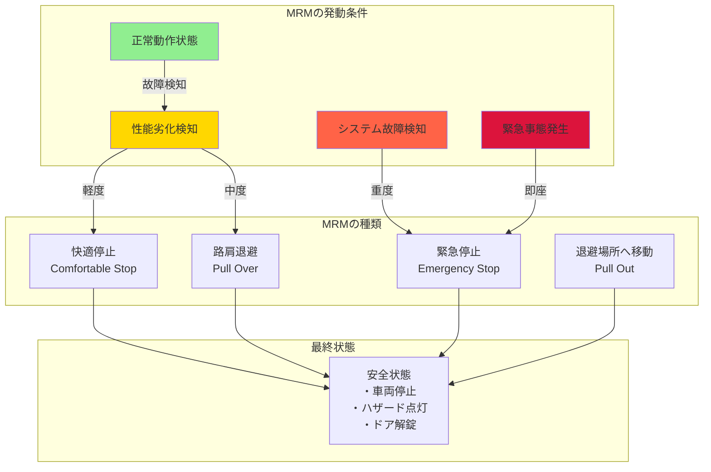

## 2. MRMの階層的アーキテクチャ

### 2.1 システム全体構成

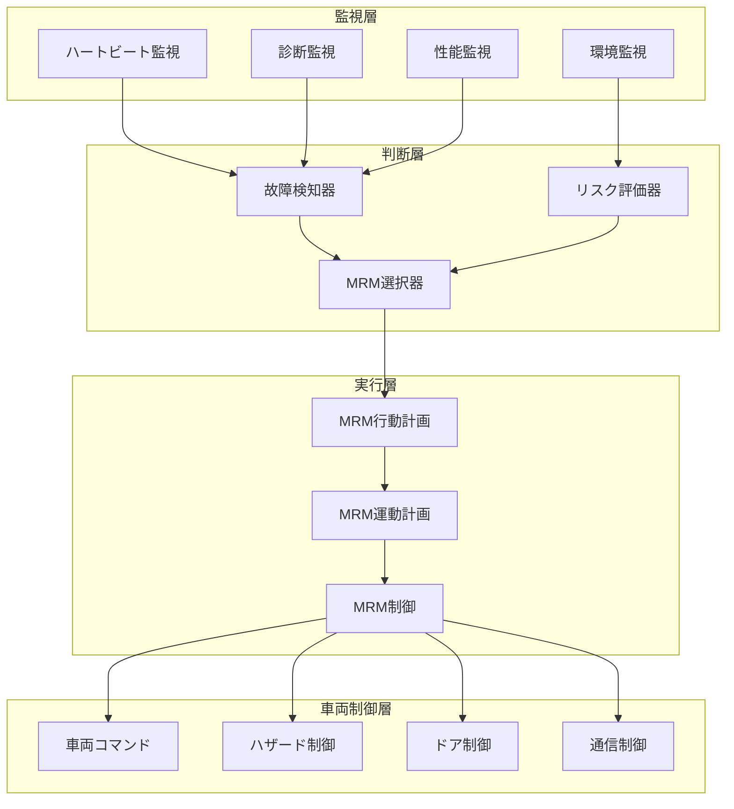

### 2.2 故障検知メカニズム

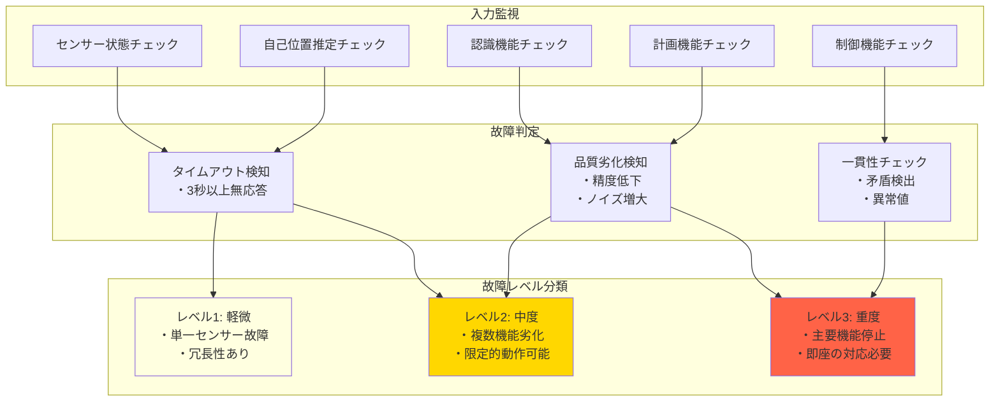

## 3. MRMの種類と実行詳細

### 3.1 快適停止（Comfortable Stop）

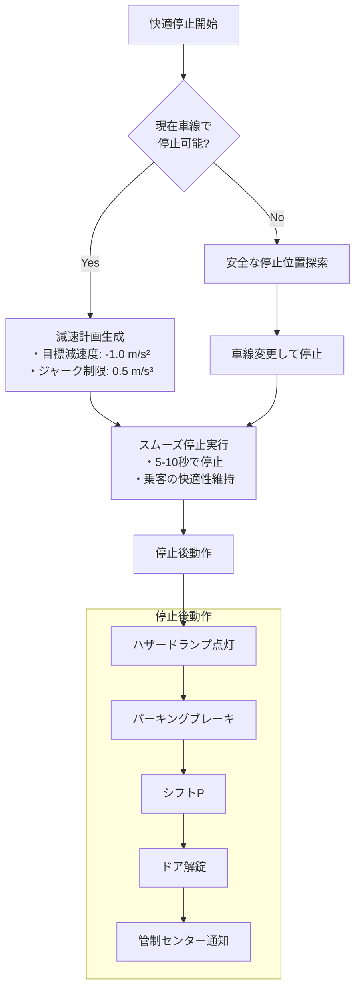

### 3.2 緊急停止（Emergency Stop）

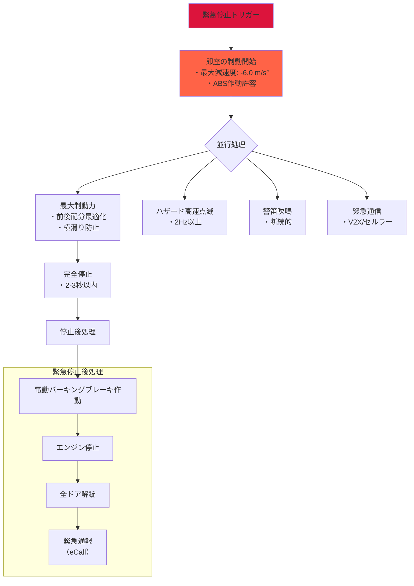

### 3.3 路肩退避（Pull Over）

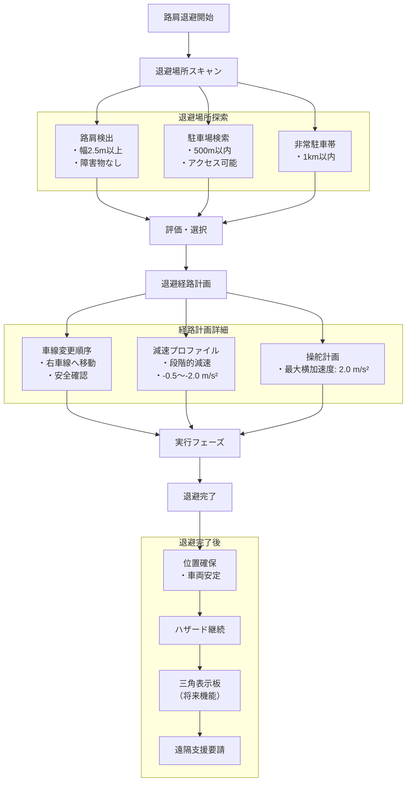

## 4. MRM選択ロジック

### 4.1 状況別MRM選択フロー

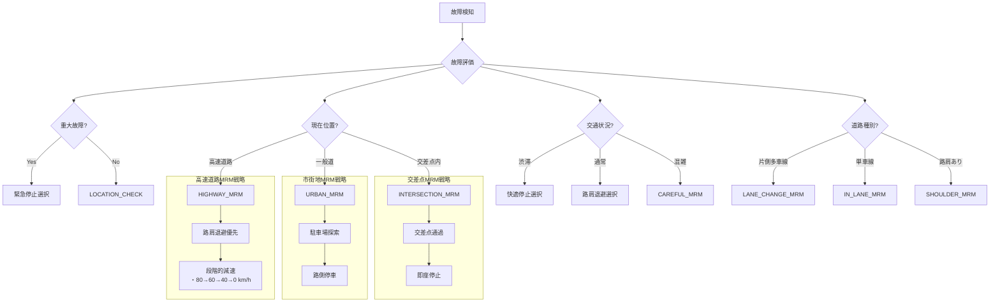

### 4.2 MRM優先度マトリクス

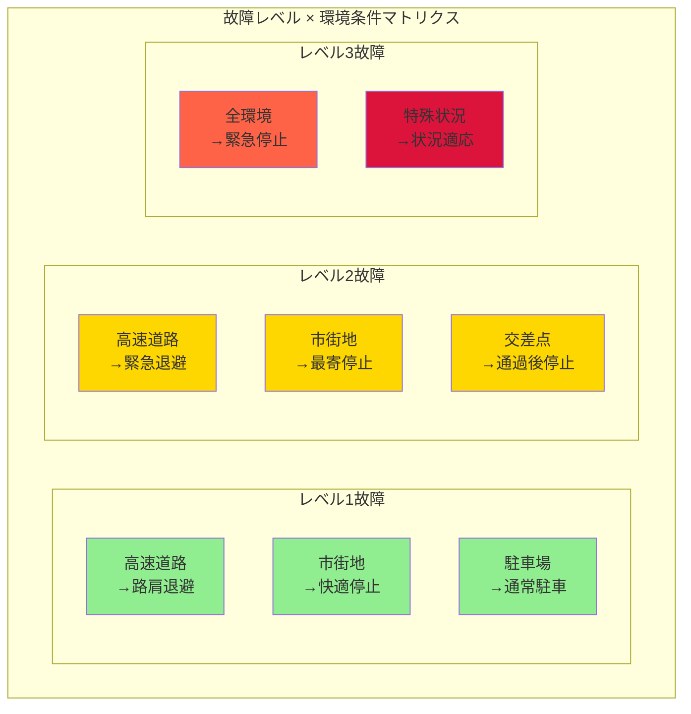

## 5. MRM実行時のシステム動作

### 5.1 MRM実行シーケンス

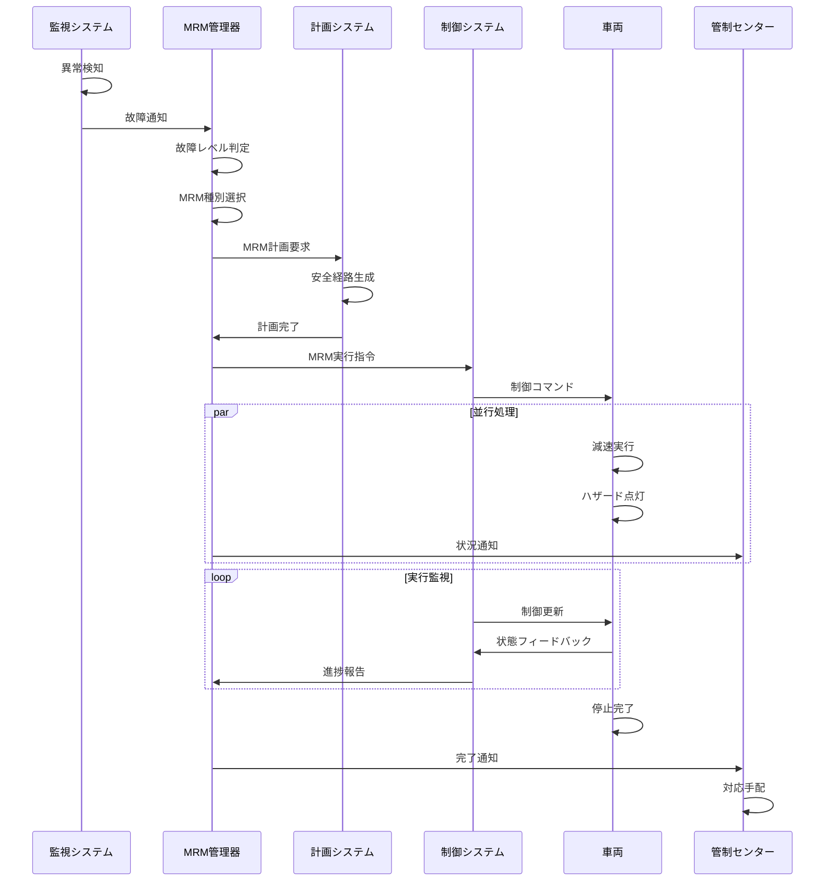

### 5.2 MRM中の機能制限

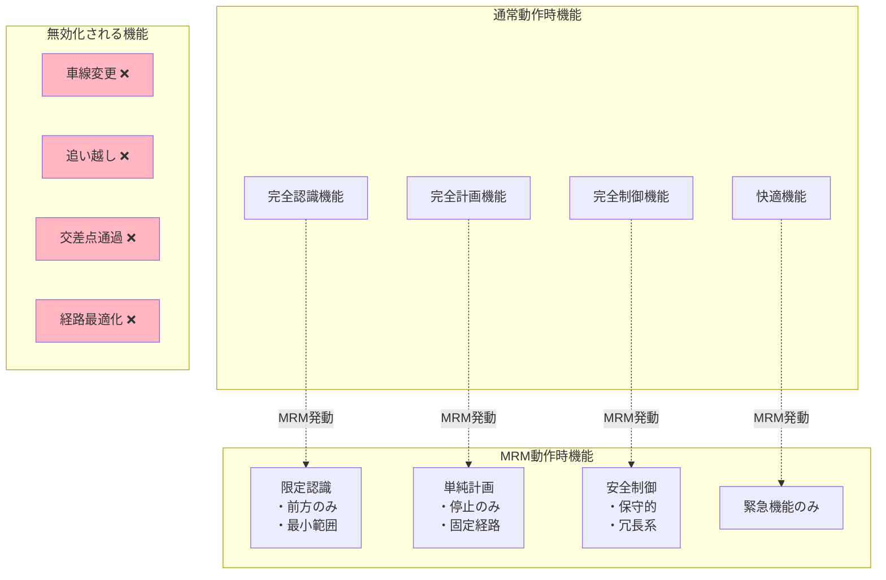

## 6. 実装詳細

### 6.1 MRMステートマシン

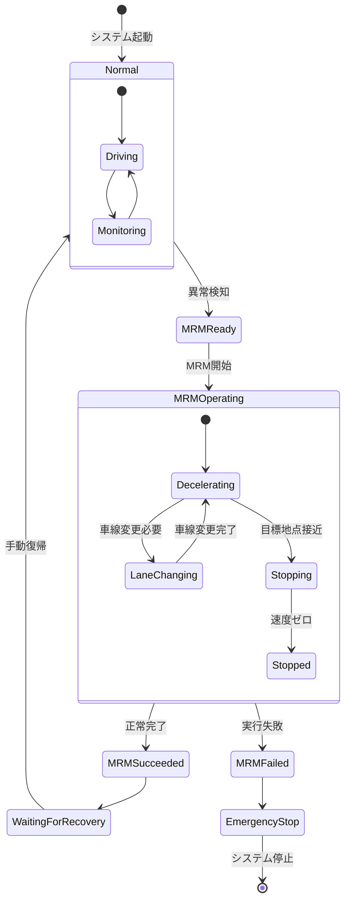

### 6.2 MRM動作パラメータ

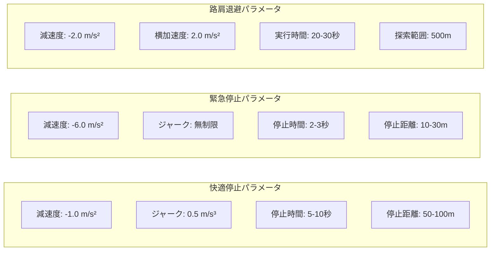

## 7. 安全性保証

### 7.1 MRMの冗長性設計

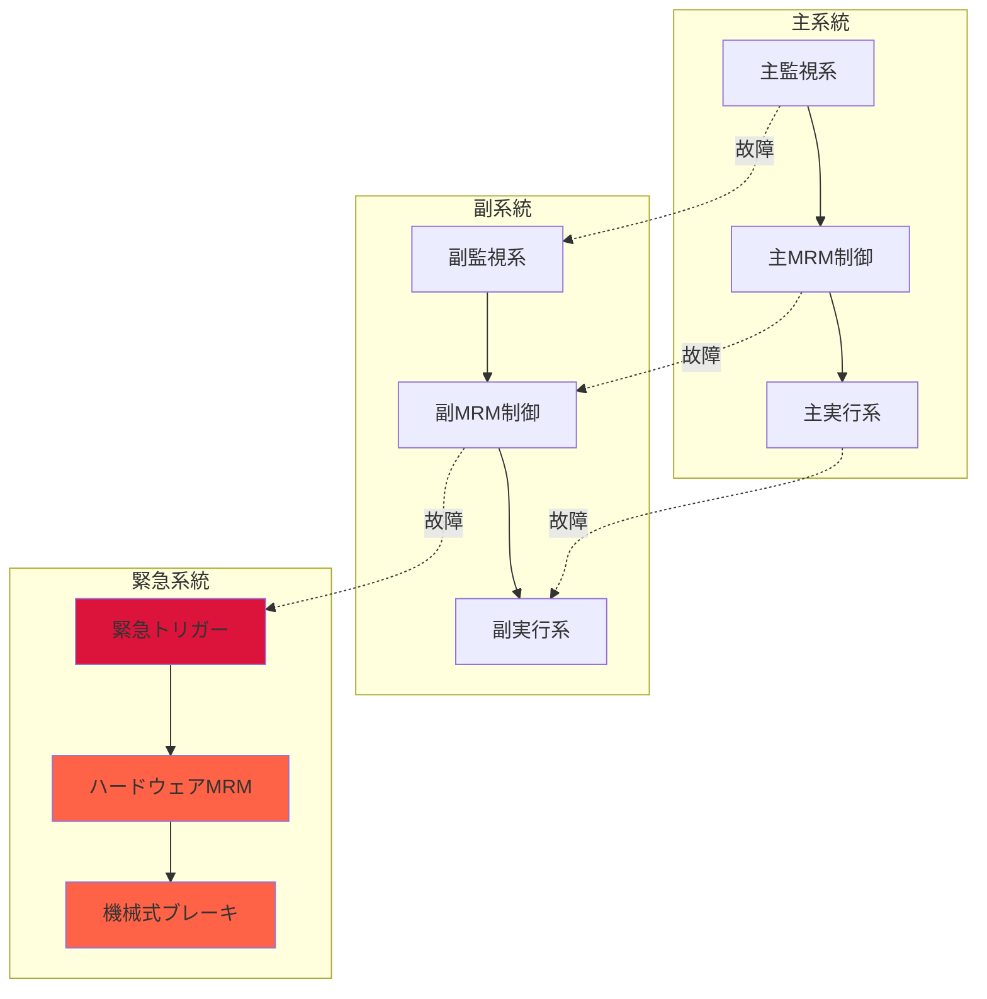

### 7.2 フェイルセーフ機構

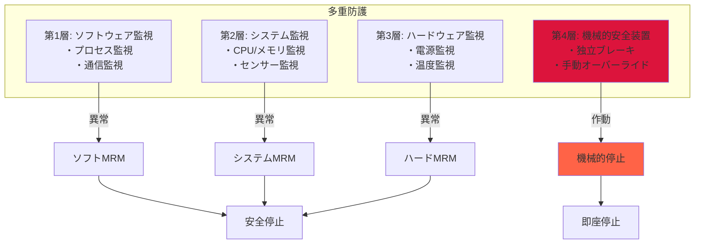

## 8. 実環境でのMRM事例

### 8.1 高速道路でのMRM実行例

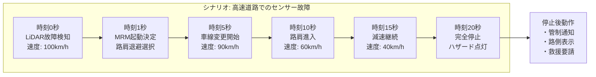

### 8.2 市街地でのMRM実行例

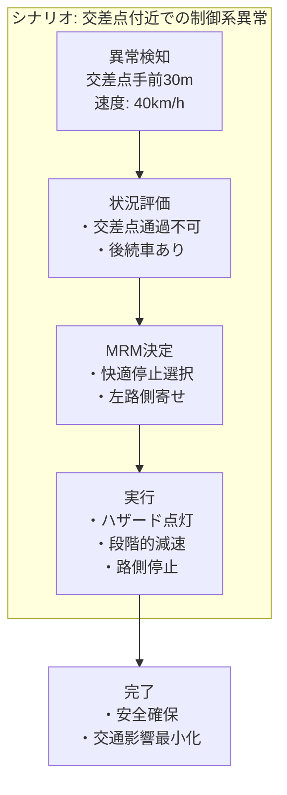

## 9. まとめ

AutowareのMRMシステムは、自動運転車両の安全性を確保する最後の砦として機能します。故障の種類と深刻度、環境条件、交通状況を総合的に判断し、最適な安全行動を選択・実行します。

### 主要な特徴：
- **多層防護**: ソフトウェアからハードウェアまでの多重安全機構
- **状況適応**: 環境に応じた柔軟なMRM戦略
- **段階的対応**: 故障レベルに応じた適切な対応
- **冗長性確保**: 主系統故障時のバックアップ機能
- **完全性**: 停止後の安全確保まで含む包括的システム

このMRMシステムにより、Autowareは高い安全性と信頼性を持つ自動運転を実現しています。