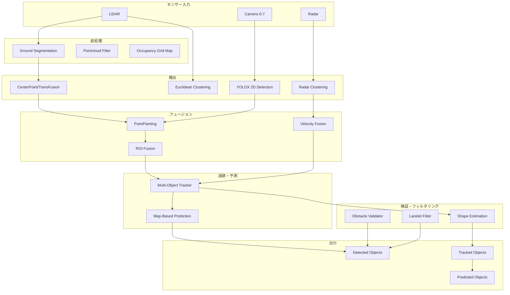
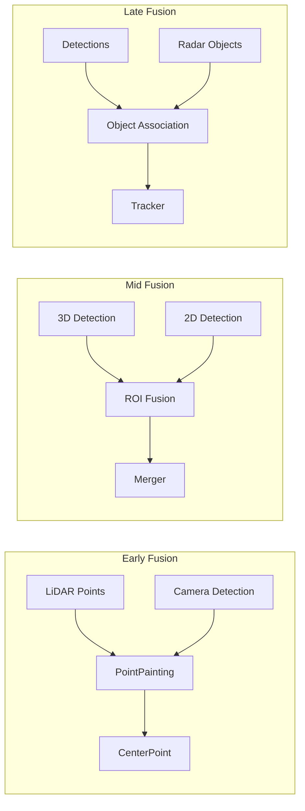
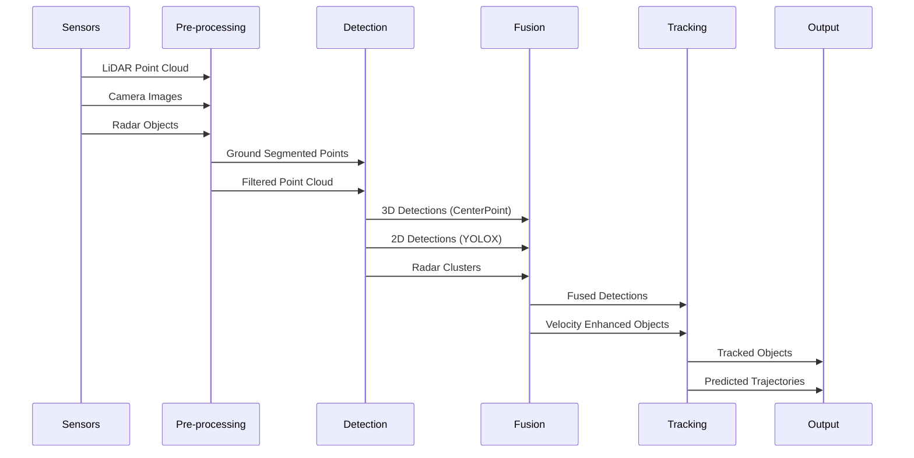

# Autoware Perception System 詳細解析

## 目次
1. [概要](#概要)
2. [システムアーキテクチャ](#システムアーキテクチャ)
3. [主要アルゴリズム](#主要アルゴリズム)
4. [センサーフュージョン](#センサーフュージョン)
5. [処理フローとデータパイプライン](#処理フローとデータパイプライン)
6. [計算性能と処理速度](#計算性能と処理速度)
7. [技術的課題と改善点](#技術的課題と改善点)

## 概要

Autowareのperceptionシステムは、自動運転車両の周囲環境を理解するための包括的なセンシング・認識システムです。LiDAR、カメラ、レーダーといった複数のセンサーからのデータを統合し、物体検出、追跡、予測を行います。

### 主な特徴
- **マルチモーダルセンサーフュージョン**: LiDAR、カメラ、レーダーの統合
- **リアルタイム処理**: TensorRTによるGPU最適化
- **モジュラー設計**: 柔軟な構成とスケーラビリティ
- **ロバスト性**: 複数のフォールバックメカニズム

## システムアーキテクチャ

### モジュール構成



### 主要コンポーネント

#### 1. **検出モジュール**
- **autoware_lidar_centerpoint**: PointPillarsベースの3D物体検出
- **autoware_lidar_transfusion**: Transformerベースの3D検出
- **autoware_bevfusion**: カメラ・LiDAR統合BEV検出
- **autoware_euclidean_cluster**: ルールベースクラスタリング
- **autoware_tensorrt_yolox**: カメラ2D物体検出

#### 2. **追跡モジュール**
- **autoware_multi_object_tracker**: EKFベース多物体追跡
- **autoware_radar_object_tracker**: レーダー専用追跡
- **autoware_bytetrack**: ビジュアル物体追跡

#### 3. **予測モジュール**
- **autoware_map_based_prediction**: HDマップを利用した軌道予測

#### 4. **フュージョンモジュール**
- **autoware_image_projection_based_fusion**: 画像投影ベースフュージョン
- **autoware_radar_fusion_to_detected_object**: レーダー速度情報統合
- **autoware_tracking_object_merger**: 追跡結果の統合

## 主要アルゴリズム

### 1. CenterPoint（3D物体検出）

#### アーキテクチャ
```
Point Cloud → Voxelization → Pillar Feature Network → 2D CNN Backbone → Detection Head
```

#### 技術仕様
- **ボクセル化**:
  - ボクセルサイズ: [0.32m, 0.32m, 10.0m]
  - 最大ボクセル数: 40,000
  - 検出範囲: [-76.8m, -76.8m, -4.0m] ～ [76.8m, 76.8m, 6.0m]

- **特徴エンコーディング**:
  - 入力特徴: x, y, z, intensity + 計算特徴
  - Pillar Feature Network (PFN)による特徴抽出
  - エンコーダ入力特徴次元: 9

- **検出ヘッド**:
  - ヒートマップ予測（物体中心）
  - 3Dバウンディングボックス回帰
  - 方向予測（sin/cos表現）
  - 速度予測（オプション）
  - 不確実性予測（オプション）

- **後処理**:
  - Sigmoid活性化
  - Circle-based NMS（IoU閾値: 0.1）
  - スコア閾値: 0.4

### 2. Multi-Object Tracker（多物体追跡）

#### データアソシエーション
```
Detection → Cost Matrix → muSSP Assignment → Track Update
```

- **アルゴリズム**: muSSP（min-cost max-flow）
- **コスト計算**:
  - マハラノビス距離
  - 2D IoU（Intersection over Union）
  - 最大距離ゲート
  - クラス別閾値

#### 運動モデル

##### a) Constant Velocity (CV) Model
```
状態ベクトル: [x, y, vx, vy]
状態遷移: 線形運動仮定
```

##### b) Constant Turn Rate and Velocity (CTRV) Model
```
状態ベクトル: [x, y, ψ, v, ψ̇]
状態遷移: 非線形（曲線軌道考慮）
```

##### c) Bicycle Model
```
状態ベクトル: [x, y, ψ, v, β]
特徴: 低速時の安定性、スリップ角考慮
```

#### EKF実装
- 予測ステップ（プロセスノイズ共分散）
- 更新ステップ（観測ノイズ共分散）
- アンカーポイントベース追跡
- Pose/Velocity更新サポート

### 3. Image Projection Based Fusion

#### PointPainting Fusion
```
3D Points → Camera Projection → 2D Score Append → Enhanced Point Cloud
```

処理フロー:
1. カメラキャリブレーション行列による投影
2. ポイント・ピクセル対応
3. 2D検出スコアの付加
4. 拡張点群を3D検出器へ

#### ROIベースフュージョン
- **ROI Cluster Fusion**: 2D ROI重複によるクラスタラベル付け
- **ROI Object Fusion**: 2D検出による3D物体分類更新
- **ROI PointCloud Fusion**: ROIマッチングによる未知物体検出

### 4. Ground Segmentation（地面分離）

#### Ray Ground Filter
```
Points → Radial Separation → Sequential Classification → Ground/Non-ground
```

分類基準:
- 連続点間距離
- 垂直角度閾値
- 高さ差

#### Scan Ground Filter（拡張版）
```
Points → Azimuth Rays → Grid Mapping → Slope Analysis → Classification
```

処理ステップ:
1. 方位角ベースのレイ分割
2. 放射距離によるソート
3. グリッドベース標高マッピング
4. 局所スロープ解析

#### RANSAC Ground Filter
- 平面フィッティング
- 反復的外れ値除去
- 不整地対応

### 5. Shape Estimation（形状推定）

#### L-Shape Fitting
```
Points → Yaw Search → 2D Projection → Min Area Rectangle → Shape
```

最適化:
- Closeness基準最適化
- オプション: Boostオプティマイザ

#### ML-Based Shape Estimation
```
Points → STN Alignment → PointNet → Regression Heads → Box Parameters
```

アーキテクチャ:
- Spatial Transformer Network (STN)
- PointNet特徴抽出
- 12-bin方向分類 + 残差

## センサーフュージョン

### フュージョンモード

1. **camera_lidar_radar_fusion**: 全センサー統合
2. **camera_lidar_fusion**: カメラ・LiDAR統合
3. **lidar_radar_fusion**: LiDAR・レーダー統合
4. **lidar**: LiDARのみ
5. **radar**: レーダーのみ

### フュージョン戦略

#### 検出レベルフュージョン



#### 追跡レベルフュージョン

##### Multi-Channel Tracker Merger
入力チャンネル:
- LiDARクラスタリング
- LiDAR DNN（CenterPoint等）
- カメラ・LiDARフュージョン結果
- Detection by Tracker
- レーダー近距離/遠距離物体

各チャンネル信頼度設定:
- 新規トラッカー生成
- 存在確率
- 物体拡張
- 分類
- 方向

### 同期メカニズム

#### 時間同期
```yaml
# タイムスタンプオフセット例
rois_timestamp_offsets: [0.098, 0.147, 0.078, 0.062, 0.115, 0.132]
rois_timeout_sec: 0.5
msg3d_timeout_sec: 0.05
```

#### マッチング戦略
- 高度マッチング（タイミングノイズウィンドウ考慮）
- 3Dメッセージノイズウィンドウ: 0.02秒
- ROIタイムスタンプノイズウィンドウ: カメラ毎設定可能

## 処理フローとデータパイプライン

### Camera-LiDAR-Radar Fusion Pipeline



### データトピック構造

入力トピック:
- `/sensing/lidar/concatenated/pointcloud`
- `/sensing/camera/camera[0-7]/image_rect_color`
- `/sensing/radar/detected_objects`

出力トピック:
- `/perception/object_recognition/objects`
- `/perception/object_recognition/tracking/objects`
- `/perception/object_recognition/objects_with_prediction`

## 計算性能と処理速度

### リアルタイム処理要件

| モジュール | 最大処理時間 | 連続遅延許容 |
|-----------|------------|-------------|
| LiDAR CenterPoint | 200ms | 1000ms |
| Map-based Prediction | 500ms | 1.0s |
| Occupancy Grid Map | 50ms | 1000ms |
| Ground Segmentation | 設定可能 | 設定可能 |

### GPU/TensorRT最適化

#### 深層学習モデル
1. **CenterPoint**
   - fp16/fp32精度サポート
   - 2段階アーキテクチャ: VoxelFeatureEncoder + DetectionHead
   - モデル: CenterPoint, CenterPoint-tiny

2. **TransFusion**
   - Transformerベース3D検出
   - 詳細なタイミング分析（前処理、推論、後処理）

3. **YOLOX**
   - マルチヘッダー構造（検出+セグメンテーション）
   - 初回TensorRTエンジン変換: 10-20分
   - int8量子化サポート

### パフォーマンスボトルネック

1. **計算ボトルネック**
   - モデル変換オーバーヘッド（初回実行時）
   - マルチセンサーフュージョン同期（LiDAR: 0ms, カメラ: 10-93ms遅延）
   - 高密度点群処理

2. **スケーラビリティ課題**
   - muSSPアルゴリズム（行列サイズ>100で高速化）
   - データアソシエーション（検出物体数に依存）
   - 密度化処理（1-N フレーム処理）

3. **メモリ・リソース制約**
   - ボクセル制限: 最大40,000
   - 大規模検出範囲（-76.8m ～ 76.8m）
   - 複数モデル同時実行

### 最適化技術

#### アルゴリズム最適化
- **muSSP**: 95%スパース性での高速化
- **ボクセルベース処理**: 点群データ次元削減
- **EfficientNMS_TRT**: ハードウェア加速NMS

#### 精度最適化
- fp16推論（半精度）
- int8量子化（YOLOXモデル）
- モデル別精度設定

#### 処理パイプライン
- 並列処理機能
- 更新レート・タイマー間隔設定可能
- 処理時間監視デバッグモード

## 技術的課題と改善点

### 既知の制限事項

#### 1. ハードウェア依存性
- CUDA対応GPU必須（TensorRT）
- GPU性能への強い依存
- 深層学習モデルのCPUフォールバックなし

#### 2. センサー同期
- カメラ・LiDARタイムスタンプ差異
- 非同期センサーでのデータアソシエーション課題

#### 3. 環境制約
- 特定データセット（nuScenes, Argoverse2, TIER IV）での学習
- 学習データと異なるセンサーモダリティでの性能低下
- 固定入力フォーマット要件

### パフォーマンス監視インフラ

- 各コンポーネント処理時間パブリッシャー
- 処理遅延閾値超過時の診断メッセージ
- 処理遅延ベースの警告/エラー状態設定
- デバッグ可視化オプション（性能影響あり）

### 改善推奨事項

1. **TensorRTエンジン事前構築**: 実行時変換遅延回避
2. **センサー構成最適化**: カメラ・LiDARタイムスタンプ差最小化
3. **処理パラメータ調整**: 用途別ボクセルサイズ・検出範囲調整
4. **ハードウェア選定**: リアルタイム性能に適したGPU選択
5. **選択的モジュール有効化**: シナリオ別不要モジュール無効化

### 将来の拡張性

1. **新センサーモダリティ対応**
   - 4Dレーダー統合
   - サーマルカメラサポート
   - V2X通信統合

2. **アルゴリズム改善**
   - Transformer系モデルの更なる活用
   - エンドツーエンド学習アプローチ
   - 自己教師あり学習

3. **システム最適化**
   - エッジコンピューティング対応
   - 分散処理アーキテクチャ
   - 動的リソース割り当て

## まとめ

Autowareのperceptionシステムは、最先端の深層学習アルゴリズムと古典的手法を組み合わせた、包括的な自動運転認識システムです。モジュラー設計により、様々なセンサー構成と運用シナリオに対応可能で、リアルタイム性能と精度のバランスを実現しています。

継続的な改善により、より高速で正確な環境認識が可能となり、安全で信頼性の高い自動運転の実現に貢献しています。