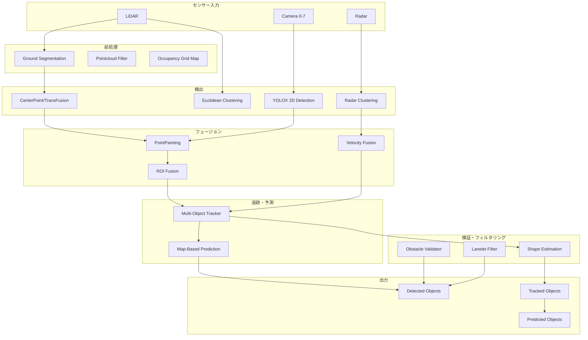
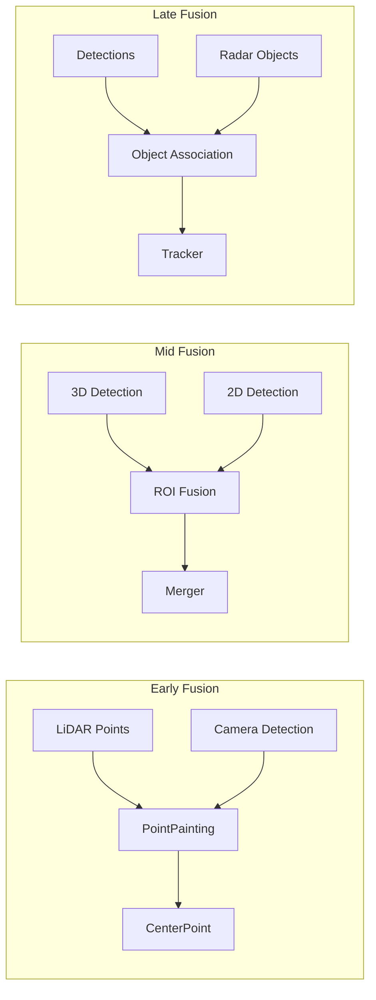
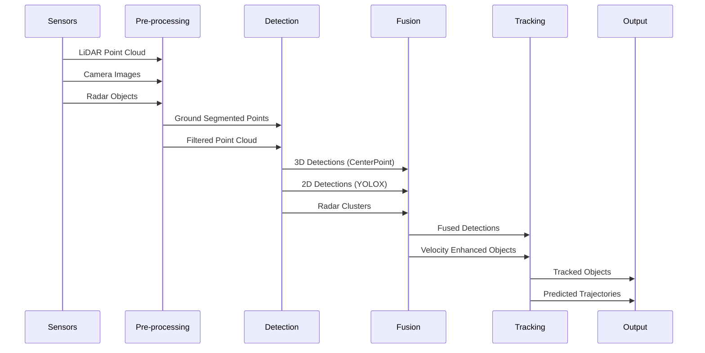
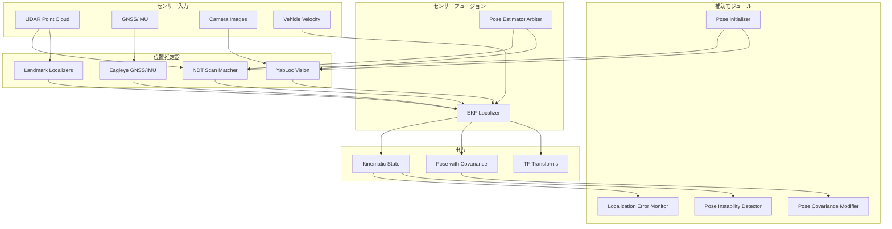
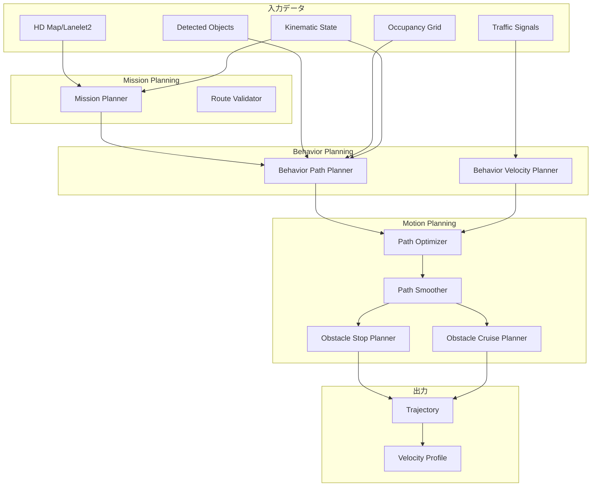
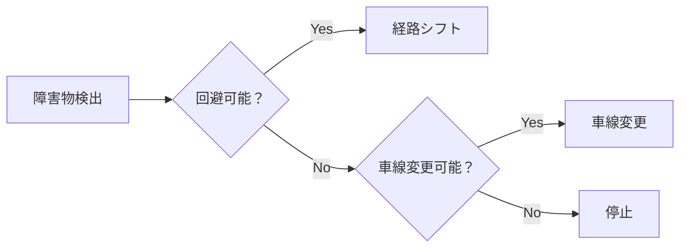
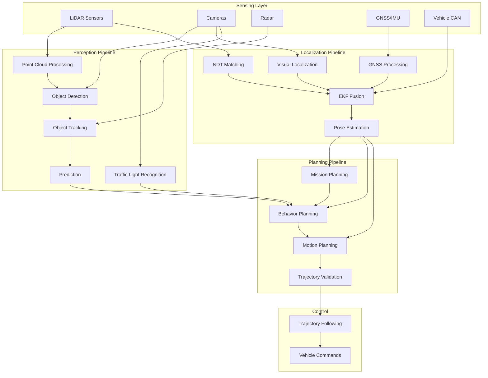

# Autoware Perception System 詳細解析

## 目次
1. [概要](#概要)
2. [システムアーキテクチャ](#システムアーキテクチャ)
3. [主要アルゴリズム](#主要アルゴリズム)
4. [センサーフュージョン](#センサーフュージョン)
5. [処理フローとデータパイプライン](#処理フローとデータパイプライン)
6. [計算性能と処理速度](#計算性能と処理速度)
7. [技術的課題と改善点](#技術的課題と改善点)
8. [ローカライゼーションシステム](#ローカライゼーションシステム)
9. [プランニングシステム](#プランニングシステム)
10. [統合システムアーキテクチャ](#統合システムアーキテクチャ)

## 概要

Autowareのperceptionシステムは、自動運転車両の周囲環境を理解するための包括的なセンシング・認識システムです。LiDAR、カメラ、レーダーといった複数のセンサーからのデータを統合し、物体検出、追跡、予測を行います。

### 主な特徴
- **マルチモーダルセンサーフュージョン**: LiDAR、カメラ、レーダーの統合
- **リアルタイム処理**: TensorRTによるGPU最適化
- **モジュラー設計**: 柔軟な構成とスケーラビリティ
- **ロバスト性**: 複数のフォールバックメカニズム

## システムアーキテクチャ

### モジュール構成



### 主要コンポーネント

#### 1. **検出モジュール**
- **autoware_lidar_centerpoint**: PointPillarsベースの3D物体検出
- **autoware_lidar_transfusion**: Transformerベースの3D検出
- **autoware_bevfusion**: カメラ・LiDAR統合BEV検出
- **autoware_euclidean_cluster**: ルールベースクラスタリング
- **autoware_tensorrt_yolox**: カメラ2D物体検出

#### 2. **追跡モジュール**
- **autoware_multi_object_tracker**: EKFベース多物体追跡
- **autoware_radar_object_tracker**: レーダー専用追跡
- **autoware_bytetrack**: ビジュアル物体追跡

#### 3. **予測モジュール**
- **autoware_map_based_prediction**: HDマップを利用した軌道予測

#### 4. **フュージョンモジュール**
- **autoware_image_projection_based_fusion**: 画像投影ベースフュージョン
- **autoware_radar_fusion_to_detected_object**: レーダー速度情報統合
- **autoware_tracking_object_merger**: 追跡結果の統合

## 主要アルゴリズム

### 1. CenterPoint（3D物体検出）

#### アーキテクチャ
```
Point Cloud → Voxelization → Pillar Feature Network → 2D CNN Backbone → Detection Head
```

#### 技術仕様
- **ボクセル化**:
  - ボクセルサイズ: [0.32m, 0.32m, 10.0m]
  - 最大ボクセル数: 40,000
  - 検出範囲: [-76.8m, -76.8m, -4.0m] ～ [76.8m, 76.8m, 6.0m]

- **特徴エンコーディング**:
  - 入力特徴: x, y, z, intensity + 計算特徴
  - Pillar Feature Network (PFN)による特徴抽出
  - エンコーダ入力特徴次元: 9

- **検出ヘッド**:
  - ヒートマップ予測（物体中心）
  - 3Dバウンディングボックス回帰
  - 方向予測（sin/cos表現）
  - 速度予測（オプション）
  - 不確実性予測（オプション）

- **後処理**:
  - Sigmoid活性化
  - Circle-based NMS（IoU閾値: 0.1）
  - スコア閾値: 0.4

### 2. Multi-Object Tracker（多物体追跡）

#### データアソシエーション
```
Detection → Cost Matrix → muSSP Assignment → Track Update
```

- **アルゴリズム**: muSSP（min-cost max-flow）
- **コスト計算**:
  - マハラノビス距離
  - 2D IoU（Intersection over Union）
  - 最大距離ゲート
  - クラス別閾値

#### 運動モデル

##### a) Constant Velocity (CV) Model
```
状態ベクトル: [x, y, vx, vy]
状態遷移: 線形運動仮定
```

##### b) Constant Turn Rate and Velocity (CTRV) Model
```
状態ベクトル: [x, y, ψ, v, ψ̇]
状態遷移: 非線形（曲線軌道考慮）
```

##### c) Bicycle Model
```
状態ベクトル: [x, y, ψ, v, β]
特徴: 低速時の安定性、スリップ角考慮
```

#### EKF実装
- 予測ステップ（プロセスノイズ共分散）
- 更新ステップ（観測ノイズ共分散）
- アンカーポイントベース追跡
- Pose/Velocity更新サポート

### 3. Image Projection Based Fusion

#### PointPainting Fusion
```
3D Points → Camera Projection → 2D Score Append → Enhanced Point Cloud
```

処理フロー:
1. カメラキャリブレーション行列による投影
2. ポイント・ピクセル対応
3. 2D検出スコアの付加
4. 拡張点群を3D検出器へ

#### ROIベースフュージョン
- **ROI Cluster Fusion**: 2D ROI重複によるクラスタラベル付け
- **ROI Object Fusion**: 2D検出による3D物体分類更新
- **ROI PointCloud Fusion**: ROIマッチングによる未知物体検出

### 4. Ground Segmentation（地面分離）

#### Ray Ground Filter
```
Points → Radial Separation → Sequential Classification → Ground/Non-ground
```

分類基準:
- 連続点間距離
- 垂直角度閾値
- 高さ差

#### Scan Ground Filter（拡張版）
```
Points → Azimuth Rays → Grid Mapping → Slope Analysis → Classification
```

処理ステップ:
1. 方位角ベースのレイ分割
2. 放射距離によるソート
3. グリッドベース標高マッピング
4. 局所スロープ解析

#### RANSAC Ground Filter
- 平面フィッティング
- 反復的外れ値除去
- 不整地対応

### 5. Shape Estimation（形状推定）

#### L-Shape Fitting
```
Points → Yaw Search → 2D Projection → Min Area Rectangle → Shape
```

最適化:
- Closeness基準最適化
- オプション: Boostオプティマイザ

#### ML-Based Shape Estimation
```
Points → STN Alignment → PointNet → Regression Heads → Box Parameters
```

アーキテクチャ:
- Spatial Transformer Network (STN)
- PointNet特徴抽出
- 12-bin方向分類 + 残差

## センサーフュージョン

### フュージョンモード

1. **camera_lidar_radar_fusion**: 全センサー統合
2. **camera_lidar_fusion**: カメラ・LiDAR統合
3. **lidar_radar_fusion**: LiDAR・レーダー統合
4. **lidar**: LiDARのみ
5. **radar**: レーダーのみ

### フュージョン戦略

#### 検出レベルフュージョン



#### 追跡レベルフュージョン

##### Multi-Channel Tracker Merger
入力チャンネル:
- LiDARクラスタリング
- LiDAR DNN（CenterPoint等）
- カメラ・LiDARフュージョン結果
- Detection by Tracker
- レーダー近距離/遠距離物体

各チャンネル信頼度設定:
- 新規トラッカー生成
- 存在確率
- 物体拡張
- 分類
- 方向

### 同期メカニズム

#### 時間同期
```yaml
# タイムスタンプオフセット例
rois_timestamp_offsets: [0.098, 0.147, 0.078, 0.062, 0.115, 0.132]
rois_timeout_sec: 0.5
msg3d_timeout_sec: 0.05
```

#### マッチング戦略
- 高度マッチング（タイミングノイズウィンドウ考慮）
- 3Dメッセージノイズウィンドウ: 0.02秒
- ROIタイムスタンプノイズウィンドウ: カメラ毎設定可能

## 処理フローとデータパイプライン

### Camera-LiDAR-Radar Fusion Pipeline



### データトピック構造

入力トピック:
- `/sensing/lidar/concatenated/pointcloud`
- `/sensing/camera/camera[0-7]/image_rect_color`
- `/sensing/radar/detected_objects`

出力トピック:
- `/perception/object_recognition/objects`
- `/perception/object_recognition/tracking/objects`
- `/perception/object_recognition/objects_with_prediction`

## 計算性能と処理速度

### リアルタイム処理要件

| モジュール | 最大処理時間 | 連続遅延許容 |
|-----------|------------|-------------|
| LiDAR CenterPoint | 200ms | 1000ms |
| Map-based Prediction | 500ms | 1.0s |
| Occupancy Grid Map | 50ms | 1000ms |
| Ground Segmentation | 設定可能 | 設定可能 |

### GPU/TensorRT最適化

#### 深層学習モデル
1. **CenterPoint**
   - fp16/fp32精度サポート
   - 2段階アーキテクチャ: VoxelFeatureEncoder + DetectionHead
   - モデル: CenterPoint, CenterPoint-tiny

2. **TransFusion**
   - Transformerベース3D検出
   - 詳細なタイミング分析（前処理、推論、後処理）

3. **YOLOX**
   - マルチヘッダー構造（検出+セグメンテーション）
   - 初回TensorRTエンジン変換: 10-20分
   - int8量子化サポート

### パフォーマンスボトルネック

1. **計算ボトルネック**
   - モデル変換オーバーヘッド（初回実行時）
   - マルチセンサーフュージョン同期（LiDAR: 0ms, カメラ: 10-93ms遅延）
   - 高密度点群処理

2. **スケーラビリティ課題**
   - muSSPアルゴリズム（行列サイズ>100で高速化）
   - データアソシエーション（検出物体数に依存）
   - 密度化処理（1-N フレーム処理）

3. **メモリ・リソース制約**
   - ボクセル制限: 最大40,000
   - 大規模検出範囲（-76.8m ～ 76.8m）
   - 複数モデル同時実行

### 最適化技術

#### アルゴリズム最適化
- **muSSP**: 95%スパース性での高速化
- **ボクセルベース処理**: 点群データ次元削減
- **EfficientNMS_TRT**: ハードウェア加速NMS

#### 精度最適化
- fp16推論（半精度）
- int8量子化（YOLOXモデル）
- モデル別精度設定

#### 処理パイプライン
- 並列処理機能
- 更新レート・タイマー間隔設定可能
- 処理時間監視デバッグモード

## 技術的課題と改善点

### 既知の制限事項

#### 1. ハードウェア依存性
- CUDA対応GPU必須（TensorRT）
- GPU性能への強い依存
- 深層学習モデルのCPUフォールバックなし

#### 2. センサー同期
- カメラ・LiDARタイムスタンプ差異
- 非同期センサーでのデータアソシエーション課題

#### 3. 環境制約
- 特定データセット（nuScenes, Argoverse2, TIER IV）での学習
- 学習データと異なるセンサーモダリティでの性能低下
- 固定入力フォーマット要件

### パフォーマンス監視インフラ

- 各コンポーネント処理時間パブリッシャー
- 処理遅延閾値超過時の診断メッセージ
- 処理遅延ベースの警告/エラー状態設定
- デバッグ可視化オプション（性能影響あり）

### 改善推奨事項

1. **TensorRTエンジン事前構築**: 実行時変換遅延回避
2. **センサー構成最適化**: カメラ・LiDARタイムスタンプ差最小化
3. **処理パラメータ調整**: 用途別ボクセルサイズ・検出範囲調整
4. **ハードウェア選定**: リアルタイム性能に適したGPU選択
5. **選択的モジュール有効化**: シナリオ別不要モジュール無効化

### 将来の拡張性

1. **新センサーモダリティ対応**
   - 4Dレーダー統合
   - サーマルカメラサポート
   - V2X通信統合

2. **アルゴリズム改善**
   - Transformer系モデルの更なる活用
   - エンドツーエンド学習アプローチ
   - 自己教師あり学習

3. **システム最適化**
   - エッジコンピューティング対応
   - 分散処理アーキテクチャ
   - 動的リソース割り当て

## まとめ

Autowareのperceptionシステムは、最先端の深層学習アルゴリズムと古典的手法を組み合わせた、包括的な自動運転認識システムです。モジュラー設計により、様々なセンサー構成と運用シナリオに対応可能で、リアルタイム性能と精度のバランスを実現しています。

継続的な改善により、より高速で正確な環境認識が可能となり、安全で信頼性の高い自動運転の実現に貢献しています。

## ローカライゼーションシステム

### 概要

Autowareのローカライゼーションシステムは、車両の位置と姿勢を高精度に推定するための多層アプローチを採用しています。複数の位置推定手法とセンサーフュージョンにより、ロバストな自己位置推定を実現します。

### ローカライゼーションアーキテクチャ



### 主要ローカライゼーションアルゴリズム

#### 1. NDT Scan Matcher（主要LiDAR基盤手法）

**アルゴリズム詳細**:
- **Normal Distributions Transform (NDT)**: 点群を正規分布の集合として表現
- **動的マップローディング**: 大規模環境対応
- **共分散推定手法**:
  - LAPLACE_APPROXIMATION: ヘッセ行列による近似
  - MULTI_NDT: 複数初期値からの推定
  - MULTI_NDT_SCORE: スコアベース重み付け

**処理フロー**:
```
Point Cloud → Transform to Base Link → Crop Box Filter → Voxel Grid Downsample → NDT Alignment → Pose Estimation
```

**主要パラメータ**:
- 収束判定閾値: 0.01
- 最大反復回数: 30
- ステップサイズ: 0.1
- 解像度: 2.0m

#### 2. YabLoc（ビジョンベースローカライゼーション）

**特徴**:
- LiDARや点群地図不要
- 道路標示とベクトル地図（Lanelet2）のマッチング
- パーティクルフィルタによる位置推定

**処理パイプライン**:
```
Camera Image → Graph Segmentation → Line Detection → Particle Filter → Pose Estimation
```

**アルゴリズム構成**:
1. グラフベースセグメンテーション
2. 線分抽出・変換
3. パーティクル予測・補正
4. カメラ観測による重み更新

#### 3. Eagleye（GNSS/IMU融合）

**特徴**:
- GNSS/IMU/車両オドメトリの統合
- 車両運動を利用した初期化
- 軽量計算

**融合データ**:
- GNSS位置・速度
- IMU角速度・加速度
- 車速パルス

#### 4. EKF Localizer（中央融合コンポーネント）

**拡張カルマンフィルタ実装**:

**状態ベクトル**:
```
x = [x, y, θ, b_θ, v_x, v_y, ω]
```
- 位置 (x, y)
- ヨー角 (θ)
- ヨーバイアス (b_θ)
- 速度 (v_x, v_y)
- ヨーレート (ω)

**2D車両ダイナミクスモデル**:
```
x(t+1) = f(x(t), u(t)) + w(t)
z(t) = h(x(t)) + v(t)
```

**主要機能**:
- 時間遅延補償
- 自動ヨーバイアス推定
- マハラノビス距離によるゲーティング
- スムーズ更新メカニズム

### パーセプションとの連携

#### 1. 点群データフロー

```
Perception → Localization:
/sensing/lidar/concatenated/pointcloud → NDT Scan Matcher (as points_raw)
```

**点群前処理**:
1. センサーフレームからbase_linkフレームへの変換
2. クロップボックスフィルタリング
3. ボクセルグリッドダウンサンプリング
4. ランダムダウンサンプリング（オプション）

#### 2. 座標変換の提供

```
Localization → Perception:
map → base_link transformation (via TF)
```

これにより、パーセプションモジュールは検出物体をグローバル座標系で扱うことが可能。

### 計算性能と最適化

**NDT最適化技術**:
- OpenMPによる並列化
- マルチグリッドNDT
- 適応的解像度
- PCLのGPU実装（オプション）

**リアルタイム性能**:
- NDT: 10-100ms（点群サイズ依存）
- YabLoc: 50-100ms
- EKF: <10ms
- 全体システム: 10Hz以上

## プランニングシステム

### 概要

Autowareのプランニングシステムは、3層階層アーキテクチャを採用し、グローバルな経路計画から局所的な軌道生成まで、安全で効率的な走行計画を実現します。

### プランニングアーキテクチャ



### プランニング階層

#### 1. Mission Planning（高レベル）

**目的**: 現在地から目的地までのグローバル経路計算

**主要機能**:
- Lanelet2形式のベクトル地図を使用
- ダイクストラ法による最短経路探索
- 経由地点サポート
- 動的再経路計画（リルーティング）
- MRM（Minimum Risk Maneuver）経路管理

**アルゴリズム**:
```cpp
// Lanelet routing graph
RoutingGraph graph = buildRoutingGraph(lanelet_map);
Route route = graph.getRoute(current_pose, goal_pose);
```

#### 2. Behavior Planning（中レベル）

**Behavior Path Planner機能**:
- **車線追従**: スムーズな車線中央走行
- **静的障害物回避**: 車線内シフト/車線変更
- **動的障害物回避**: 予測軌道考慮
- **車線変更**: 通常/回避/外部要求
- **ゴール計画**: 駐車操作
- **スタート計画**: 発進操作

**Behavior Velocity Planner機能**:
- 信号機対応
- 横断歩道/交差点処理
- 速度制限遵守
- 死角/見通し不良対応

**アルゴリズム例（車線変更）**:
```
1. 安全性チェック（RSS: Responsibility-Sensitive Safety）
2. パス生成（Constant Jerk Profile）
3. 衝突判定（Predicted Path Overlap）
4. 実行可能性確認
```

#### 3. Motion Planning（低レベル）

**Path Optimizer (MPC)**:
- Model Predictive Control使用
- 車両ダイナミクス考慮
- 障害物回避制約

**最適化問題定式化**:
```
min J = Σ(||x - x_ref||²_Q + ||u||²_R + ρε²)
s.t. x(k+1) = f(x(k), u(k))
     h(x(k)) ≤ 0 (collision avoidance)
     u_min ≤ u ≤ u_max
```

**Path Smoother (Elastic Band)**:
- 経路の滑らかさ向上
- 曲率制約満足
- リアルタイム性能

### パーセプション・ローカライゼーションとの連携

#### 1. パーセプションデータの活用

**動的物体情報**:
```yaml
PredictedObjects:
  - id: unique_identifier
  - classification: VEHICLE/PEDESTRIAN/BICYCLE
  - pose: position and orientation
  - shape: bounding box/cylinder
  - predicted_paths: future trajectories
```

**使用箇所**:
- 衝突チェック
- 安全検証
- 適応クルーズコントロール
- 緊急ブレーキ

#### 2. ローカライゼーションデータの活用

**車両状態**:
```yaml
Kinematic State:
  - pose: current position/orientation
  - twist: linear/angular velocity
  - acceleration: linear/angular acceleration
```

**使用箇所**:
- 軌道生成の初期条件
- 経路トリミング
- 速度プロファイル生成

### 障害物回避戦略

#### 1. 静的障害物



#### 2. 動的障害物

**予測的衝突回避**:
1. 将来軌道予測（1-3秒先）
2. 時空間衝突判定
3. 速度調整/経路変更
4. 最小安全距離維持

**TTC（Time-to-Collision）計算**:
```
TTC = distance / relative_velocity
if TTC < threshold:
    execute_avoidance()
```

### 安全メカニズム

**多層防御**:
1. **計画層**: 安全な軌道生成
2. **検証層**: 軌道の妥当性確認
3. **実行層**: リアルタイム障害物チェック
4. **緊急層**: 即時停止機能

**制約条件**:
- 最大加速度: 2.0 m/s²
- 最大減速度: -5.0 m/s²
- 最大ジャーク: 2.0 m/s³
- 最大横加速度: 2.0 m/s²

## 統合システムアーキテクチャ

### 全体データフロー



### 主要インターフェース

#### 1. トピック通信

**Perception → Planning**:
- `/perception/object_recognition/objects`: 検出・予測物体
- `/perception/obstacle_segmentation/pointcloud`: 障害物点群
- `/perception/traffic_light_recognition/traffic_signals`: 信号状態

**Localization → Planning**:
- `/localization/kinematic_state`: 車両位置・速度
- `/localization/acceleration`: 車両加速度
- `/tf`: 座標変換

**Planning → Control**:
- `/planning/scenario_planning/trajectory`: 目標軌道
- `/planning/scenario_planning/status`: 計画状態

#### 2. 座標系とTF

```
map (global fixed frame)
 └── base_link (vehicle frame)
      ├── sensor frames (lidar, camera, radar)
      └── local planning frame
```

### リアルタイム性能要件

| コンポーネント | 更新頻度 | レイテンシ要件 |
|-------------|---------|------------|
| Perception | 10 Hz | < 100 ms |
| Localization | 50-100 Hz | < 20 ms |
| Planning | 10 Hz | < 100 ms |
| Control | 50 Hz | < 20 ms |

### システム統合の課題と対策

#### 1. 時間同期

**課題**: センサー間のタイムスタンプずれ
**対策**: 
- NTPによる時刻同期
- タイムスタンプベースのデータアソシエーション
- 補間・外挿アルゴリズム

#### 2. 計算リソース管理

**課題**: 複数の重い処理の同時実行
**対策**:
- コンテナベース並列処理
- 優先度ベーススケジューリング
- 動的リソース割り当て

#### 3. フェイルセーフ設計

**課題**: 単一障害点の排除
**対策**:
- 冗長センサー構成
- 複数ローカライゼーション手法
- デグレード運転モード

### 統合システムの利点

1. **モジュラリティ**: 各コンポーネントの独立開発・更新
2. **スケーラビリティ**: センサー追加・削除の容易性
3. **ロバスト性**: 多重化による信頼性向上
4. **拡張性**: 新技術の統合が容易

これらの統合により、Autowareは複雑な実世界環境での安全で効率的な自動運転を実現します。