# Autoware Planning Architecture - 技術詳解

> **対象読者**: プリンシパルエンジニア、自動運転システムアーキテクト
> **最終更新**: 2025年10月
> **Autowareバージョン**: main branch (2025年10月時点)

## 目次

1. [概要](#1-概要)
2. [プランニングアーキテクチャの全体像](#2-プランニングアーキテクチャの全体像)
3. [Mission Planning - 大域経路計画](#3-mission-planning---大域経路計画)
4. [Scenario Planning - シナリオベース計画](#4-scenario-planning---シナリオベース計画)
5. [Behavior Path Planner - 行動経路計画](#5-behavior-path-planner---行動経路計画)
6. [Behavior Velocity Planner - 行動速度計画](#6-behavior-velocity-planner---行動速度計画)
7. [Motion Planning - 運動計画](#7-motion-planning---運動計画)
8. [Velocity Smoother - 速度プロファイル最適化](#8-velocity-smoother---速度プロファイル最適化)
9. [データフローとメッセージ仕様](#9-データフローとメッセージ仕様)
10. [パフォーマンスと最適化](#10-パフォーマンスと最適化)

---

## 1. 概要

Autowareのプランニングシステムは、自動運転車両の経路と速度を決定する中核的なコンポーネント群である。本ドキュメントでは、各モジュールのアルゴリズム詳細、数理的基礎、実装上の考慮事項を技術的深度をもって解説する。

### 1.1 設計哲学

Autowareのプランニングは以下の原則に基づいて設計されている:

- **階層的分離**: ミッション、シナリオ、行動、運動の各レイヤーで責任を明確に分離
- **モジュール性**: 各機能をプラグインとして実装し、構成可能性を最大化
- **安全性優先**: RSS (Responsibility-Sensitive Safety) に基づく衝突回避
- **リアルタイム性**: 100Hz以上の制御周期に対応可能な計算効率

### 1.2 アーキテクチャ階層

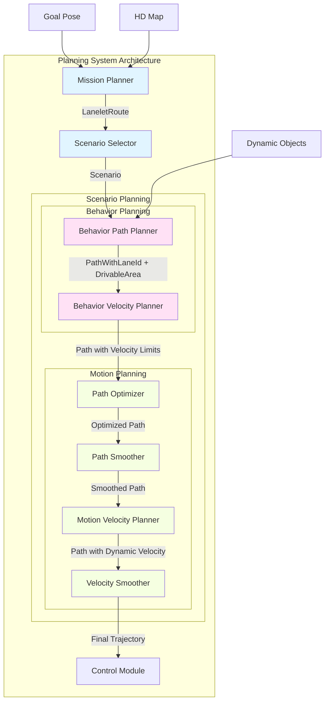

---

## 2. プランニングアーキテクチャの全体像

### 2.1 実行フロー全体像

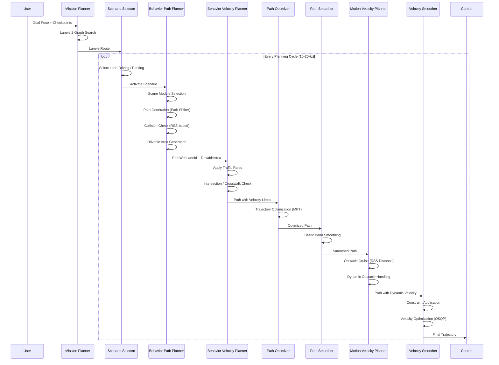

### 2.2 データフロー詳細

各モジュール間で受け渡されるデータ構造:

| From → To | Data Type | Key Information | Update Rate |
|-----------|-----------|-----------------|-------------|
| Mission Planner → Scenario Selector | `LaneletRoute` | レーンシーケンス、優先レーン | Event-driven |
| Behavior Path → Behavior Velocity | `PathWithLaneId` | 経路点、レーンID、走行可能エリア | 10-20Hz |
| Behavior Velocity → Path Optimizer | `Path` | 速度制限適用済み経路 | 10-20Hz |
| Path Optimizer → Path Smoother | `Path` | 最適化された経路 | 10-20Hz |
| Motion Velocity → Velocity Smoother | `Trajectory` | 動的速度調整済み軌道 | 10-20Hz |
| Velocity Smoother → Control | `Trajectory` | 最終軌道 (速度+加速度) | 10-20Hz |

---

## 3. Mission Planning - 大域経路計画

### 3.1 役割と責務

Mission Plannerは、スタート地点からゴール地点までの**静的な大域経路**を計画する。動的障害物や交通状況は考慮せず、純粋にHDマップ上での経路探索を行う。

### 3.2 アルゴリズム: Lanelet2 Graph Search

#### 3.2.1 グラフ構築

Lanelet2形式のHDマップから、以下の要素でグラフを構築:

- **ノード**: 各Lanelet (車線セグメント)
- **エッジ**: レーン間の接続関係 (following, adjacent, merging)
- **コスト**: 距離、車線変更コスト、turn_direction によるペナルティ

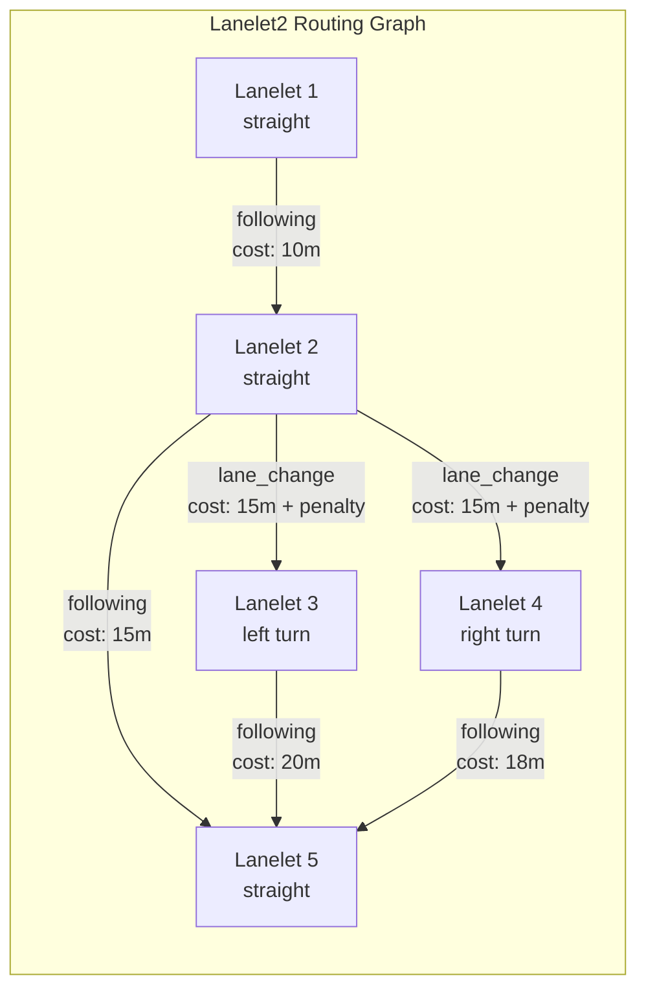

#### 3.2.2 経路探索アルゴリズム

A*アルゴリズムによる最短経路探索:

```
function planRoute(start_pose, goal_pose, routing_graph):
    start_lanelet = findClosestLanelet(start_pose)
    goal_lanelet = findClosestLanelet(goal_pose)

    // A* search
    open_set = PriorityQueue()
    open_set.push(start_lanelet, heuristic(start_lanelet, goal_lanelet))

    came_from = {}
    g_score = {start_lanelet: 0}

    while not open_set.empty():
        current = open_set.pop()

        if current == goal_lanelet:
            return reconstructPath(came_from, current)

        for neighbor in getNeighbors(current, routing_graph):
            tentative_g = g_score[current] + cost(current, neighbor)

            if tentative_g < g_score.get(neighbor, INFINITY):
                came_from[neighbor] = current
                g_score[neighbor] = tentative_g
                f_score = tentative_g + heuristic(neighbor, goal_lanelet)
                open_set.push(neighbor, f_score)

    return null  // No path found
```

#### 3.2.3 Route Section の生成

探索された経路を、車線変更可能な区間ごとに分割:

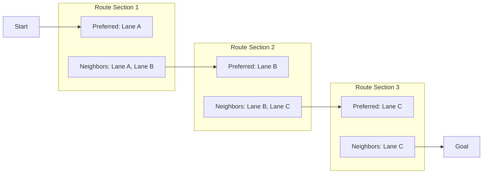

### 3.3 ゴール検証

ゴール姿勢の妥当性を以下の基準で検証:

1. **角度チェック**: ゴール姿勢とレーンの向きの差 < `goal_angle_threshold` (デフォルト: π/4)
2. **フットプリントチェック**: 車両のフットプリントがレーン境界内に収まるか

```cpp
bool validateGoal(Pose goal_pose, Lanelet goal_lanelet, VehicleInfo vehicle_info) {
    // 1. Angle check
    double lanelet_yaw = getLaneletYaw(goal_lanelet, goal_pose.position);
    double yaw_diff = std::abs(normalizeAngle(goal_pose.yaw - lanelet_yaw));
    if (yaw_diff > goal_angle_threshold) {
        return false;
    }

    // 2. Footprint check
    Polygon vehicle_footprint = createFootprint(goal_pose, vehicle_info);
    Polygon lanelet_polygon = goal_lanelet.polygon2d();

    if (!boost::geometry::within(vehicle_footprint, lanelet_polygon)) {
        return false;
    }

    return true;
}
```

---

## 4. Scenario Planning - シナリオベース計画

### 4.1 Scenario Selector

現在の状況に応じて、適切なプランニングシナリオを選択:

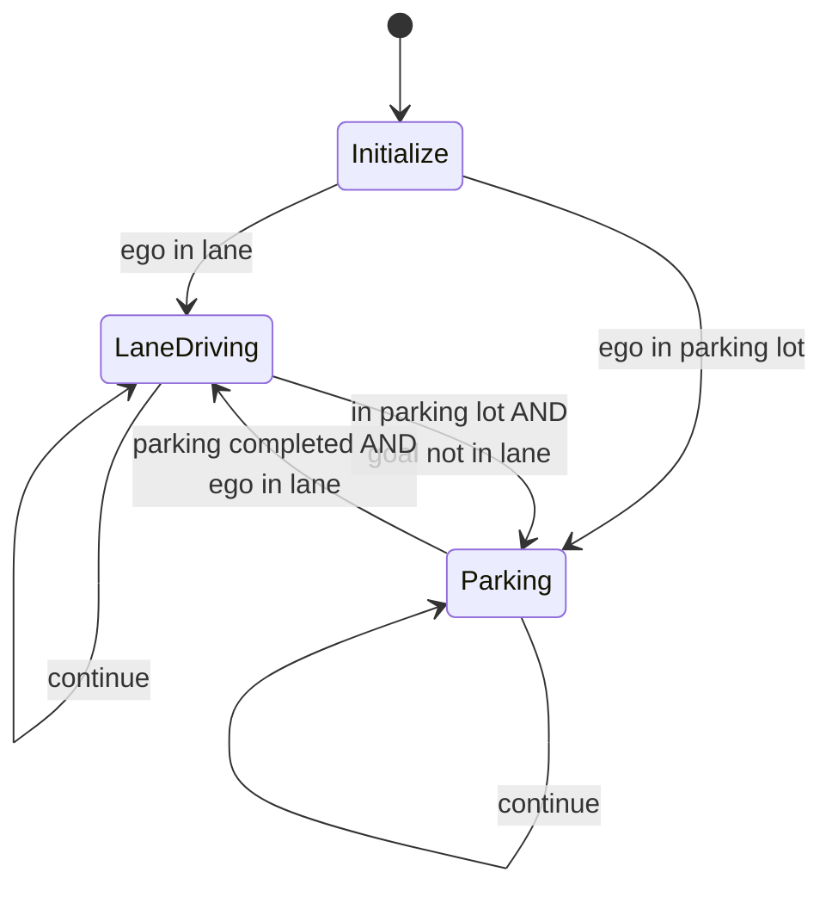

#### 4.1.1 シナリオ判定ロジック

```cpp
Scenario selectScenario(
    Pose ego_pose,
    Pose goal_pose,
    LaneletRoute route,
    bool is_parking_completed
) {
    bool ego_in_lane = isInLane(ego_pose, route);
    bool goal_in_lane = isInLane(goal_pose, route);
    bool in_parking_lot = isInParkingLot(ego_pose);

    // Initial scenario
    if (current_scenario == Scenario::EMPTY) {
        return ego_in_lane ? Scenario::LANE_DRIVING : Scenario::PARKING;
    }

    // Transition from LaneDriving to Parking
    if (current_scenario == Scenario::LANE_DRIVING) {
        if (in_parking_lot && !goal_in_lane) {
            return Scenario::PARKING;
        }
    }

    // Transition from Parking to LaneDriving
    if (current_scenario == Scenario::PARKING) {
        if (is_parking_completed && ego_in_lane) {
            return Scenario::LANE_DRIVING;
        }
    }

    return current_scenario;  // Continue current scenario
}
```

---

## 5. Behavior Path Planner - 行動経路計画

### 5.1 アーキテクチャ概要

Behavior Path Plannerは、交通状況に応じた**経路生成**、**走行可能エリア**、**ターンシグナル指令**を生成する。

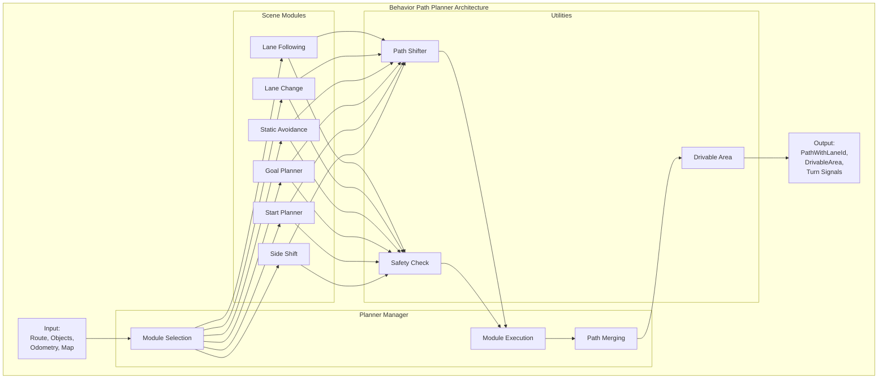

### 5.2 Planner Manager - モジュール管理

#### 5.2.1 モジュールライフサイクル

各シーンモジュールは以下の状態遷移を持つ:

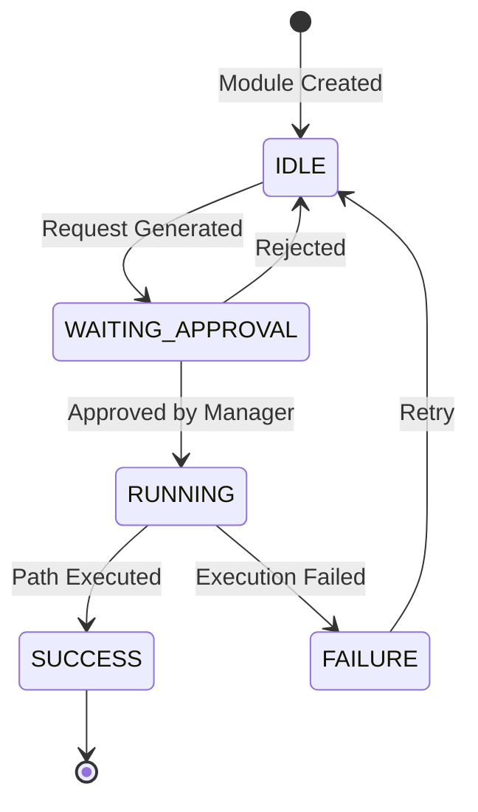

#### 5.2.2 モジュール優先度と実行順序

複数のモジュールが同時にアクティブになる場合、以下の優先順位で実行:

```cpp
enum ModulePriority {
    START_PLANNER = 0,      // 最高優先度
    GOAL_PLANNER = 1,
    LANE_CHANGE = 2,
    STATIC_AVOIDANCE = 3,
    DYNAMIC_AVOIDANCE = 4,
    LANE_FOLLOWING = 5      // 最低優先度 (デフォルト)
};

Path selectModulePath(std::vector<SceneModule*> active_modules) {
    // Sort by priority
    std::sort(active_modules.begin(), active_modules.end(),
              [](SceneModule* a, SceneModule* b) {
                  return a->getPriority() < b->getPriority();
              });

    // Execute highest priority module
    for (auto* module : active_modules) {
        if (module->getStatus() == ModuleStatus::RUNNING) {
            Path path = module->generatePath();
            if (isSafe(path)) {
                return path;
            }
        }
    }

    // Fallback to lane following
    return lane_following_module->generatePath();
}
```

### 5.3 Path Shifter - 経路シフト生成

#### 5.3.1 Constant-Jerk Profile

車線変更や障害物回避時の横方向シフトは、**constant-jerk profile**を使用して滑らかに生成される。

**数理的定式化**:

横方向ジャーク $l'''(s)$ を一定として、横方向の位置 $l(s)$、速度 $l'(s)$、加速度 $l''(s)$ を計算:

$$
\begin{align}
l(t) &= l_0 + l'_0 t + \frac{1}{2} l''_0 t^2 + \frac{1}{6} j t^3 \\
l'(t) &= l'_0 + l''_0 t + \frac{1}{2} j t^2 \\
l''(t) &= l''_0 + j t
\end{align}
$$

**7フェーズ構成**:

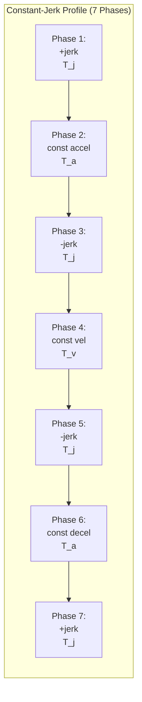

各フェーズでのシフト量:

$$
\begin{align}
l_1 &= \frac{1}{6}jT_j^3 \\
l_2 &= \frac{1}{6}j T_j^3 + \frac{1}{2} j T_a T_j^2 + \frac{1}{2} j T_a^2 T_j \\
l_3 &= j  T_j^3 + \frac{3}{2} j T_a T_j^2 + \frac{1}{2} j T_a^2 T_j \\
l_4 &= j T_j^3 + \frac{3}{2} j T_a T_j^2 + \frac{1}{2} j T_a^2 T_j + j(T_a + T_j)T_j T_v \\
l_7 &= 2 j T_j^3 + 3 j T_a T_j^2 + j T_a^2 T_j + j(T_a + T_j)T_j T_v
\end{align}
$$

#### 5.3.2 制約条件からのパラメータ計算

**ケース1: 横加速度制限のみ (T_v = 0)**

最大横加速度 $a_{\max}^{\text{lat}}$ が与えられた場合:

$$
\begin{align}
T_j &= \frac{T_{\text{total}}}{2} - \frac{2L}{a_{\max}^{\text{lat}} T_{\text{total}}} \\
T_a &= \frac{4L}{a_{\max}^{\text{lat}} T_{\text{total}}} - \frac{T_{\text{total}}}{2} \\
j &= \frac{2a_{\max}^2 T_{\text{total}}}{a_{\max}^{\text{lat}} T_{\text{total}}^2 - 4L}
\end{align}
$$

**ケース2: 制約なし**

横加速度・横速度に制約がない場合、最大横加速度は:

$$
a_{\max}^{\text{lat}} = \frac{8L}{T_{\text{total}}^2}
$$

#### 5.3.3 実装例

```cpp
struct ShiftLine {
    geometry_msgs::Point start_point;      // 絶対座標
    geometry_msgs::Point end_point;        // 絶対座標
    double start_shift_length;              // 基準経路からのシフト量 [m]
    double end_shift_length;                // 基準経路からのシフト量 [m]
    size_t start_idx;                       // 基準経路上のインデックス
    size_t end_idx;                         // 基準経路上のインデックス
};

class PathShifter {
public:
    void addShiftLine(const ShiftLine& shift_line) {
        shift_lines_.push_back(shift_line);
    }

    Path generateShiftedPath(
        const Path& reference_path,
        double lateral_acc_limit,
        double lateral_jerk_limit
    ) {
        Path shifted_path = reference_path;

        for (const auto& shift_line : shift_lines_) {
            // Calculate shift parameters
            double L = shift_line.end_shift_length - shift_line.start_shift_length;
            double s_total = calcArcLength(reference_path,
                                          shift_line.start_idx,
                                          shift_line.end_idx);

            // Compute T_j, T_a, jerk from constraints
            double T_total = s_total / ego_velocity;
            auto [T_j, T_a, jerk] = calcShiftParams(
                L, T_total, lateral_acc_limit, lateral_jerk_limit
            );

            // Apply shift to each point
            for (size_t i = shift_line.start_idx; i <= shift_line.end_idx; ++i) {
                double s = calcArcLength(reference_path, shift_line.start_idx, i);
                double shift = calcShiftAtDistance(s, T_j, T_a, jerk);
                shifted_path.points[i] = applyLateralShift(
                    reference_path.points[i],
                    shift
                );
            }
        }

        return shifted_path;
    }

private:
    std::vector<ShiftLine> shift_lines_;
};
```

### 5.4 Safety Check - 衝突判定

#### 5.4.1 RSS (Responsibility-Sensitive Safety) ベース

安全距離は以下のRSS式で計算:

$$
d_{\text{rss}} = v_{\text{rear}} (t_{\text{reaction}} + t_{\text{margin}}) + \frac{v_{\text{rear}}^2}{2|a_{\text{rear, decel}}|} - \frac{v_{\text{front}}^2}{2|a_{\text{front, decel}}|}
$$

ここで:
- $v_{\text{rear}}$, $v_{\text{front}}$: 後続車・先行車の速度
- $t_{\text{reaction}}$: 反応時間 (通常 1.0s)
- $t_{\text{margin}}$: 安全時間マージン (通常 1.0s)
- $a_{\text{rear, decel}}$, $a_{\text{front, decel}}$: 後続車・先行車の減速度

#### 5.4.2 衝突判定フロー

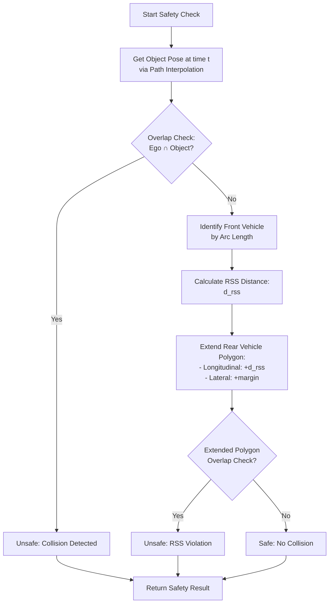

#### 5.4.3 実装例

```cpp
bool isSafe(
    const PredictedPath& ego_path,
    const PredictedObject& object,
    const RSSParameters& rss_params
) {
    for (size_t i = 0; i < ego_path.points.size(); ++i) {
        double t = ego_path.points[i].time;

        // 1. Get object pose at time t
        auto object_pose = interpolatePose(object.predicted_paths, t);
        if (!object_pose) continue;

        // 2. Overlap check
        Polygon ego_polygon = createPolygon(ego_path.points[i], vehicle_info_);
        Polygon obj_polygon = createPolygon(*object_pose, object.shape);

        if (boost::geometry::intersects(ego_polygon, obj_polygon)) {
            return false;  // Direct collision
        }

        // 3. Determine front/rear
        double ego_arc = calcArcLength(ego_path, 0, i);
        double obj_arc = calcArcLength(object.predicted_paths[0], 0,
                                       findClosestIndex(object.predicted_paths[0], *object_pose));

        bool ego_is_rear = (ego_arc < obj_arc);

        // 4. Calculate RSS distance
        double v_rear = ego_is_rear ? ego_path.points[i].velocity : object.velocity;
        double v_front = ego_is_rear ? object.velocity : ego_path.points[i].velocity;
        double a_rear = rss_params.rear_decel;
        double a_front = rss_params.front_decel;

        double d_rss = v_rear * (rss_params.reaction_time + rss_params.margin_time)
                     + (v_rear * v_rear) / (2.0 * std::abs(a_rear))
                     - (v_front * v_front) / (2.0 * std::abs(a_front));

        // 5. Extend rear polygon
        Polygon rear_polygon = ego_is_rear ? ego_polygon : obj_polygon;
        Polygon front_polygon = ego_is_rear ? obj_polygon : ego_polygon;

        Polygon extended_rear = extendPolygon(
            rear_polygon,
            d_rss,  // longitudinal
            rss_params.lateral_margin  // lateral
        );

        // 6. Final overlap check
        if (boost::geometry::intersects(extended_rear, front_polygon)) {
            return false;  // RSS violation
        }
    }

    return true;  // Safe
}
```

### 5.5 Drivable Area Generation - 走行可能エリア

#### 5.5.1 Static Drivable Area

各シーンモジュールは、必要な走行エリアのみを含むDrivable Areaを生成:

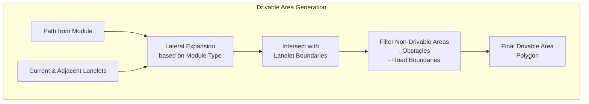

#### 5.5.2 Dynamic Expansion

動的障害物を避けるため、リアルタイムでDrivable Areaを拡張:

```cpp
Polygon expandDrivableArea(
    const Polygon& static_area,
    const PredictedObjects& objects,
    const Path& ego_path
) {
    Polygon expanded_area = static_area;

    for (const auto& obj : objects) {
        // Check if object might cut-in
        if (mightCutIn(obj, ego_path)) {
            // Expand drivable area to allow avoidance
            double expansion_width = obj.shape.dimensions.y + lateral_margin_;
            expanded_area = expandPolygon(expanded_area, expansion_width, Side::LEFT);
        }
    }

    return expanded_area;
}
```

---

## 6. Behavior Velocity Planner - 行動速度計画

### 6.1 役割

交通ルール (信号、横断歩道、交差点など) に基づく**速度制限**を経路に適用する。

### 6.2 モジュール構成

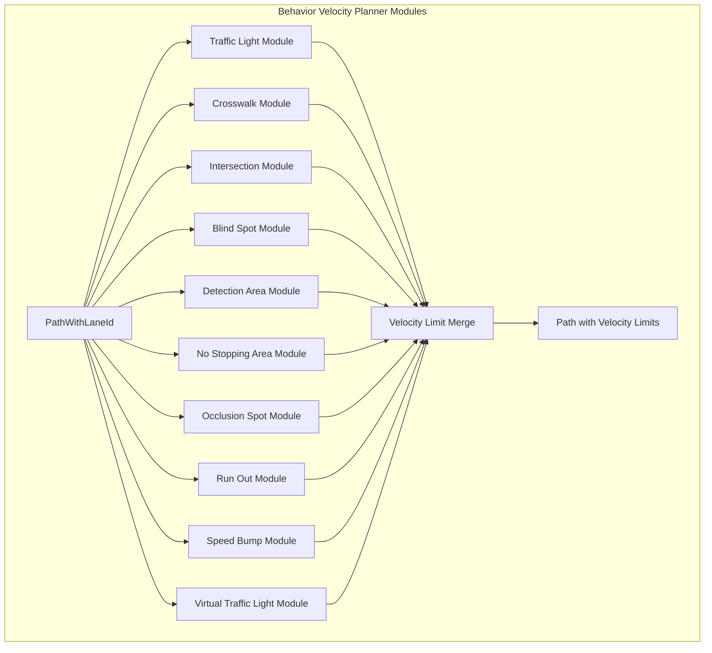

### 6.3 主要モジュール詳細

#### 6.3.1 Intersection Module - 交差点処理

**状態遷移**:

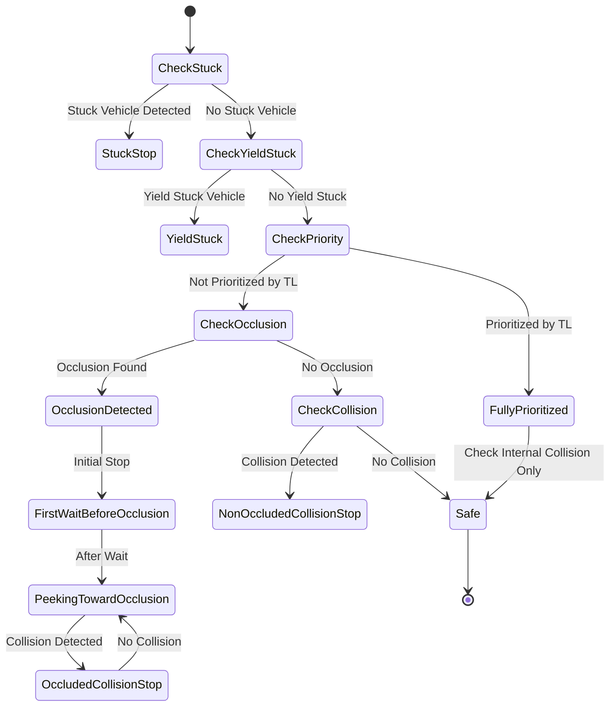

**Attention Area の定義**:

```cpp
AttentionArea generateAttentionArea(
    const Lanelet& ego_lane,
    const LaneletRoute& route,
    const HDMap& map
) {
    AttentionArea attention;

    // 1. Find conflicting lanes
    auto conflicting_lanes = findConflictingLanes(ego_lane, map);

    // 2. Apply RightOfWay filtering
    if (use_map_right_of_way_) {
        auto yield_lanes = ego_lane.regulatoryElements<RightOfWay>();
        conflicting_lanes = filterByYieldLanes(conflicting_lanes, yield_lanes);
    }

    // 3. Extend to preceding lanes
    for (const auto& lane : conflicting_lanes) {
        auto preceding = map.previous(lane);
        double length = 0.0;
        while (preceding && length < attention_area_length_) {
            attention.lanes.push_back(*preceding);
            length += lanelet::geometry::length2d(*preceding);
            preceding = map.previous(*preceding);
        }
    }

    // 4. Generate polygon
    attention.polygon = createPolygonFromLanes(attention.lanes);

    return attention;
}
```

**衝突判定**:

TTC (Time-To-Collision) とTTV (Time-To-Vehicle) を使用:

$$
\begin{align}
\text{TTC} &= \frac{d_{\text{ego\_to\_collision}}}{v_{\text{ego}}} \\
\text{TTV} &= \frac{d_{\text{object\_to\_collision}}}{v_{\text{object}}}
\end{align}
$$

衝突判定条件:

$$
|\text{TTC} - \text{TTV}| < t_{\text{margin}} \quad \text{かつ} \quad \text{TTC} < t_{\text{max}}
$$

```cpp
bool checkCollision(
    const Path& ego_path,
    const PredictedObject& object,
    const AttentionArea& attention,
    const CollisionParams& params
) {
    // 1. Find first intersection with attention area
    auto ego_collision_point = findIntersection(ego_path, attention.polygon);
    if (!ego_collision_point) return false;

    // 2. Calculate TTC
    double d_ego = calcDistance(ego_path, ego_collision_point);
    double v_ego = ego_path.current_velocity;
    double TTC = d_ego / v_ego;

    // 3. Calculate TTV for each predicted path
    for (const auto& pred_path : object.predicted_paths) {
        auto obj_collision_point = findIntersection(pred_path, attention.polygon);
        if (!obj_collision_point) continue;

        double d_obj = calcDistance(pred_path, obj_collision_point);
        double v_obj = object.velocity;
        double TTV = d_obj / v_obj;

        // 4. Check collision condition
        if (std::abs(TTC - TTV) < params.collision_margin_time &&
            TTC < params.collision_max_time) {
            return true;  // Collision detected
        }
    }

    return false;
}
```

#### 6.3.2 Crosswalk Module - 横断歩道処理

**Yield Decision フロー**:

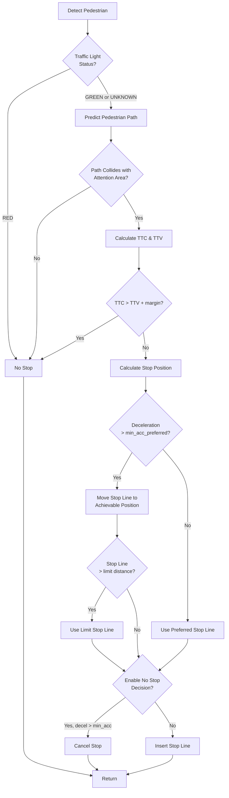

**Stop Position Calculation**:

```cpp
StopPosition calculateStopPosition(
    const Path& path,
    const Crosswalk& crosswalk,
    const Pedestrian& ped,
    const CrosswalkParams& params
) {
    // 1. Preferred stop positions
    std::vector<double> candidates;

    // 1-1. Explicit stop line on map
    if (crosswalk.stopline) {
        candidates.push_back(calcDistance(path, crosswalk.stopline));
    } else {
        // Virtual stop line
        candidates.push_back(
            calcDistance(path, crosswalk.entry) - params.stop_distance_from_crosswalk
        );
    }

    // 1-2. Stop before predicted collision
    auto collision_point = findCollision(path, ped.predicted_path, crosswalk.attention_area);
    if (collision_point) {
        candidates.push_back(
            calcDistance(path, collision_point) - params.stop_distance_from_object_preferred
        );
    }

    // 2. Select closest candidate
    double preferred_stop = *std::min_element(candidates.begin(), candidates.end());

    // 3. Check deceleration feasibility
    double v_current = path.current_velocity;
    double decel_required = (v_current * v_current) / (2.0 * preferred_stop);

    double actual_stop;
    if (decel_required <= params.min_acc_preferred) {
        actual_stop = preferred_stop;
    } else {
        // Move stop line to achievable position
        actual_stop = (v_current * v_current) / (2.0 * params.min_acc_preferred);
    }

    // 4. Apply limit distance constraint
    double limit_stop = calcDistance(path, crosswalk.entry) - params.stop_distance_from_crosswalk_limit;
    if (actual_stop > limit_stop) {
        actual_stop = limit_stop;
    }

    // 5. No-stop decision
    if (params.enable_no_stop_decision) {
        double final_decel = (v_current * v_current) / (2.0 * actual_stop);
        if (final_decel > params.no_stop_min_acc) {
            return StopPosition::CANCEL;
        }
    }

    return StopPosition{actual_stop};
}
```

---

## 7. Motion Planning - 運動計画

### 7.1 Path Optimizer

#### 7.1.1 役割

走行可能エリア内で**運動学的に実行可能**かつ**衝突回避**を満たす軌道を最適化。

#### 7.1.2 Model Predictive Trajectory (MPT) 最適化

**目的関数**:

$$
\min \sum_{i=1}^{N} \left( w_1 \| \mathbf{x}_i - \mathbf{x}_{\text{ref},i} \|^2 + w_2 \| \mathbf{u}_i \|^2 + w_3 \| \Delta \mathbf{u}_i \|^2 \right)
$$

subject to:

$$
\begin{align}
\mathbf{x}_{i+1} &= f(\mathbf{x}_i, \mathbf{u}_i) \quad \text{(Vehicle Kinematics)} \\
\mathbf{x}_i &\in \text{DrivableArea} \quad \text{(Spatial Constraint)} \\
|\mathbf{u}_i| &\leq \mathbf{u}_{\max} \quad \text{(Control Limit)} \\
|\Delta \mathbf{u}_i| &\leq \Delta \mathbf{u}_{\max} \quad \text{(Control Rate Limit)}
\end{align}
$$

ここで:
- $\mathbf{x}_i = [x, y, \theta, v]^T$: 状態ベクトル (位置、姿勢、速度)
- $\mathbf{u}_i = [\delta, a]^T$: 制御入力 (ステアリング角、加速度)
- $w_1, w_2, w_3$: 重み係数

### 7.2 Path Smoother

#### 7.2.1 Elastic Band Algorithm

経路を**弾性バンド**とみなし、障害物から遠ざかり、かつ経路長を最小化:

$$
E_{\text{total}} = E_{\text{internal}} + E_{\text{external}}
$$

$$
\begin{align}
E_{\text{internal}} &= \sum_{i=1}^{N-1} k_{\text{spring}} \| \mathbf{p}_{i+1} - \mathbf{p}_i \|^2 \\
E_{\text{external}} &= \sum_{i=1}^{N} \sum_{j} k_{\text{repulsive}} \frac{1}{d(\mathbf{p}_i, \mathbf{obs}_j)^2}
\end{align}
$$

勾配降下法で最適化:

$$
\mathbf{p}_i^{(k+1)} = \mathbf{p}_i^{(k)} - \alpha \nabla E_{\text{total}}(\mathbf{p}_i^{(k)})
$$

### 7.3 Motion Velocity Planner

#### 7.3.1 Obstacle Cruise Module

**RSS Distance Calculation**:

$$
d_{\text{rss}} = v_{\text{ego}} t_{\text{idling}} + \frac{v_{\text{ego}}^2}{2 a_{\text{ego}}} - \frac{v_{\text{obstacle}}^2}{2 a_{\text{obstacle}}} + l_{\text{margin}}
$$

**PID-based Velocity Control**:

$$
\begin{align}
d_{\text{error}} &= d - d_{\text{rss}} \\
d_{\text{normalized}} &= \text{lpf}\left( \frac{d_{\text{error}}}{d_{\text{obstacle}}} \right) \\
d_{\text{quad}} &= \text{sign}(d_{\text{normalized}}) \cdot d_{\text{normalized}}^2 \\
v_{\text{pid}} &= K_p d_{\text{quad}} + K_i \int d_{\text{quad}} \, dt + K_d \frac{d}{dt} d_{\text{quad}} \\
v_{\text{add}} &= \begin{cases}
v_{\text{pid}} \cdot w_{\text{acc}} & \text{if } v_{\text{pid}} > 0 \\
v_{\text{pid}} & \text{otherwise}
\end{cases} \\
v_{\text{target}} &= \max(v_{\text{ego}} + v_{\text{add}}, v_{\text{min, cruise}})
\end{align}
$$

```cpp
double calculateCruiseVelocity(
    double current_distance,
    double rss_distance,
    double obstacle_velocity,
    PIDController& pid
) {
    // 1. Normalize error
    double d_error = current_distance - rss_distance;
    double d_normalized = low_pass_filter(d_error / current_distance);

    // 2. Quadratic transformation for better response
    double d_quad = std::copysign(d_normalized * d_normalized, d_normalized);

    // 3. PID control
    double v_pid = pid.calculate(d_quad);

    // 4. Acceleration asymmetry
    double v_add = (v_pid > 0.0) ? v_pid * output_ratio_during_accel_ : v_pid;

    // 5. Apply to ego velocity
    double v_target = std::max(ego_velocity_ + v_add, min_cruise_target_vel_);

    return v_target;
}
```

---

## 8. Velocity Smoother - 速度プロファイル最適化

### 8.1 役割

速度、加速度、ジャークの制約下で、**最大速度**と**乗り心地**を両立する速度プロファイルを生成。

### 8.2 アルゴリズムフロー

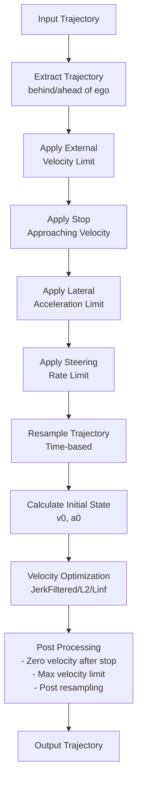

### 8.3 最適化アルゴリズム

#### 8.3.1 JerkFiltered Algorithm

**目的関数**:

$$
\min \sum_{i=1}^{N} \left( -w_v v_i^2 + w_j j_i^2 + w_{v,over} \max(0, v_i - v_{\max,i})^2 + w_{a,over} \max(0, |a_i| - a_{\max})^2 \right)
$$

subject to:

$$
\begin{align}
v_{i+1} &= v_i + a_i \Delta t \\
a_{i+1} &= a_i + j_i \Delta t \\
v_{\min} \leq v_i &\leq v_{\max,i} \\
a_{\min} \leq a_i &\leq a_{\max} \\
j_{\min} \leq j_i &\leq j_{\max}
\end{align}
$$

- $w_v$: 速度最大化の重み (負の値で最大化)
- $w_j$: ジャーク最小化の重み (乗り心地)
- $w_{v,over}, w_{a,over}$: 制約違反のペナルティ重み

#### 8.3.2 L2 Algorithm

疑似ジャーク $\tilde{j}_i = \frac{a_{i+1} - a_i}{\Delta t}$ を使用し、L2ノルムで最適化:

$$
\min \sum_{i=1}^{N} \left( -w_v v_i^2 + w_{\tilde{j}} \tilde{j}_i^2 + w_{v,over} \max(0, v_i - v_{\max,i})^2 + w_{a,over} \max(0, |a_i| - a_{\max})^2 \right)
$$

#### 8.3.3 Linf Algorithm

疑似ジャークの最大値を最小化:

$$
\min \left( -w_v \sum_{i=1}^{N} v_i^2 + w_{\tilde{j}} \max_{i} |\tilde{j}_i| + \sum_{i=1}^{N} \left( w_{v,over} \max(0, v_i - v_{\max,i})^2 + w_{a,over} \max(0, |a_i| - a_{\max})^2 \right) \right)
$$

### 8.4 OSQP Solver による実装

**QP問題への変換**:

上記の最適化問題を以下の標準的なQP形式に変換:

$$
\begin{align}
\min_{\mathbf{x}} \quad & \frac{1}{2} \mathbf{x}^T \mathbf{P} \mathbf{x} + \mathbf{q}^T \mathbf{x} \\
\text{subject to} \quad & \mathbf{l} \leq \mathbf{A} \mathbf{x} \leq \mathbf{u}
\end{align}
$$

ここで:
- $\mathbf{x} = [v_1, a_1, j_1, v_2, a_2, j_2, \ldots, v_N, a_N, j_N]^T$
- $\mathbf{P}$: ヘッセ行列 (速度、加速度、ジャークの重み)
- $\mathbf{q}$: 線形項 (速度最大化)
- $\mathbf{A}$, $\mathbf{l}$, $\mathbf{u}$: 制約行列と上下限

```cpp
Trajectory smoothVelocity(
    const Trajectory& input_traj,
    const VelocitySmootherParams& params
) {
    // 1. Setup optimization variables
    size_t N = input_traj.points.size();
    Eigen::VectorXd x(3 * N);  // [v, a, j] for each point

    // 2. Setup objective function (P matrix, q vector)
    Eigen::SparseMatrix<double> P = setupObjectiveMatrix(N, params);
    Eigen::VectorXd q = setupObjectiveVector(N, params);

    // 3. Setup constraints (A matrix, l/u bounds)
    auto [A, l, u] = setupConstraints(input_traj, params);

    // 4. Solve with OSQP
    OSQPSolver solver;
    solver.setObjective(P, q);
    solver.setConstraints(A, l, u);

    OSQPResult result = solver.solve();

    if (result.status != OSQPStatus::SOLVED) {
        return input_traj;  // Fallback to input
    }

    // 5. Extract velocity profile
    Trajectory output_traj = input_traj;
    for (size_t i = 0; i < N; ++i) {
        output_traj.points[i].longitudinal_velocity_mps = result.solution[3 * i];
        output_traj.points[i].acceleration_mps2 = result.solution[3 * i + 1];
    }

    return output_traj;
}
```

### 8.5 Lateral Acceleration Limit

カーブでの横加速度制限を適用:

$$
v_{\max,\text{curve}}(i) = \sqrt{\frac{a_{\text{lat,max}}}{\kappa(i)}}
$$

ここで:
- $\kappa(i)$: 経路点 $i$ での曲率
- $a_{\text{lat,max}}$: 最大横加速度 (速度に依存)

```cpp
void applyLateralAccelerationLimit(
    Trajectory& traj,
    const std::vector<double>& lat_acc_limits,
    const std::vector<double>& velocity_thresholds,
    double min_curve_velocity
) {
    for (size_t i = 0; i < traj.points.size(); ++i) {
        // Calculate curvature
        double curvature = calcCurvature(traj, i);
        if (std::abs(curvature) < 1e-6) continue;

        // Get lateral acceleration limit for current velocity
        double v_current = traj.points[i].longitudinal_velocity_mps;
        double lat_acc_limit = interpolate(velocity_thresholds, lat_acc_limits, v_current);

        // Calculate max velocity for this curve
        double v_max_curve = std::sqrt(lat_acc_limit / std::abs(curvature));
        v_max_curve = std::max(v_max_curve, min_curve_velocity);

        // Apply limit
        if (traj.points[i].longitudinal_velocity_mps > v_max_curve) {
            // Decelerate before curve
            size_t start_decel = findPointAtDistance(traj, i, -decel_distance_before_curve_);
            applyDecelerationProfile(traj, start_decel, i, v_max_curve);
        }
    }
}
```

---

## 9. データフローとメッセージ仕様

### 9.1 主要メッセージ型

#### 9.1.1 LaneletRoute

```cpp
// autoware_planning_msgs/msg/LaneletRoute
struct LaneletRoute {
    Header header;
    UUID uuid;
    Pose start_pose;
    Pose goal_pose;
    LaneletSegment[] segments;  // Route sections
};

struct LaneletSegment {
    LaneletPrimitive preferred_primitive;
    LaneletPrimitive[] primitives;  // All lane-changeable lanes
};

struct LaneletPrimitive {
    int64 id;           // Lanelet ID
    string primitive_type;  // "lane", "parking_lot", etc.
};
```

#### 9.1.2 PathWithLaneId

```cpp
// autoware_internal_planning_msgs/msg/PathWithLaneId
struct PathWithLaneId {
    Header header;
    PathPointWithLaneId[] points;
    DrivableArea left_bound;
    DrivableArea right_bound;
};

struct PathPointWithLaneId {
    Pose pose;
    float longitudinal_velocity_mps;
    float lateral_velocity_mps;
    float heading_rate_rps;
    int64[] lane_ids;  // Associated lanelet IDs
};
```

#### 9.1.3 Trajectory

```cpp
// autoware_planning_msgs/msg/Trajectory
struct Trajectory {
    Header header;
    TrajectoryPoint[] points;
};

struct TrajectoryPoint {
    Duration time_from_start;
    Pose pose;
    float longitudinal_velocity_mps;
    float lateral_velocity_mps;
    float acceleration_mps2;
    float heading_rate_rps;
    float front_wheel_angle_rad;
    float rear_wheel_angle_rad;
};
```

### 9.2 トピック構成

```mermaid
graph LR
    subgraph "Mission Planning"
        MP[mission_planner] -->|/planning/mission_planning/route| SS
    end

    subgraph "Behavior Planning"
        SS[scenario_selector] -->|/planning/scenario_planning/scenario| BPP
        BPP[behavior_path_planner] -->|/planning/scenario_planning/lane_driving/behavior_planning/path| BVP
        BVP[behavior_velocity_planner] -->|/planning/scenario_planning/lane_driving/behavior_planning/path_with_lane_id| PO
    end

    subgraph "Motion Planning"
        PO[path_optimizer] -->|/planning/scenario_planning/lane_driving/motion_planning/path| PS
        PS[path_smoother] -->|/planning/scenario_planning/lane_driving/motion_planning/path| MVP
        MVP[motion_velocity_planner] -->|/planning/scenario_planning/trajectory| VS
        VS[velocity_smoother] -->|/planning/scenario_planning/trajectory| Control
    end

    Perception[/perception/object_recognition/objects] -.->|PredictedObjects| BPP
    Perception -.-> MVP
    Localization[/localization/kinematic_state] -.->|Odometry| BPP
    Localization -.-> VS
```

---

## 10. パフォーマンスと最適化

### 10.1 計算量分析

| Module | Algorithm | Complexity | Typical Cycle Time | Critical Path |
|--------|-----------|------------|-------------------|---------------|
| Mission Planner | A* Search | O(E log V) | 100-500ms | Event-driven |
| Behavior Path | Path Shifter | O(N) | 50-100ms | Module selection |
| Behavior Path | Safety Check | O(N × M × K) | 20-50ms | RSS calculation |
| Path Optimizer | QP (OSQP) | O(N³) | 10-30ms | Matrix operations |
| Path Smoother | Elastic Band | O(N × I) | 5-10ms | Gradient descent |
| Motion Velocity | PID Control | O(N) | 5-10ms | Distance calc |
| Velocity Smoother | QP (OSQP) | O(N³) | 10-20ms | OSQP solve |

ここで:
- N: 経路点数 (通常 100-500)
- M: 動的障害物数 (通常 10-50)
- K: 予測経路数/障害物 (通常 3-5)
- I: 反復回数 (通常 10-50)
- E: エッジ数、V: ノード数 (HDマップ)

### 10.2 最適化手法

#### 10.2.1 並列化

```cpp
// Parallel safety check for multiple objects
bool checkSafetyParallel(
    const Path& ego_path,
    const PredictedObjects& objects,
    const RSSParameters& rss_params
) {
    std::atomic<bool> is_safe{true};

    // Parallel execution
    std::for_each(std::execution::par, objects.begin(), objects.end(),
        [&](const PredictedObject& obj) {
            if (!is_safe.load()) return;  // Early exit

            if (!isSafe(ego_path, obj, rss_params)) {
                is_safe.store(false);
            }
        }
    );

    return is_safe.load();
}
```

#### 10.2.2 空間インデックス

```cpp
// Use R-tree for efficient spatial queries
class SpatialIndex {
public:
    void insert(const PredictedObject& obj) {
        BoundingBox bbox = calcBoundingBox(obj);
        rtree_.insert(std::make_pair(bbox, obj.uuid));
    }

    std::vector<PredictedObject> query(const Polygon& area) {
        std::vector<Value> results;
        rtree_.query(bgi::intersects(area), std::back_inserter(results));

        std::vector<PredictedObject> objects;
        for (const auto& result : results) {
            objects.push_back(object_map_[result.second]);
        }
        return objects;
    }

private:
    using Value = std::pair<BoundingBox, UUID>;
    bgi::rtree<Value, bgi::quadratic<16>> rtree_;
    std::unordered_map<UUID, PredictedObject> object_map_;
};
```

#### 10.2.3 キャッシング

```cpp
// Cache expensive calculations
class PathCache {
public:
    double getArcLength(size_t from_idx, size_t to_idx) {
        CacheKey key = {from_idx, to_idx};

        auto it = arc_length_cache_.find(key);
        if (it != arc_length_cache_.end()) {
            return it->second;
        }

        double length = calcArcLengthImpl(from_idx, to_idx);
        arc_length_cache_[key] = length;
        return length;
    }

    void clear() {
        arc_length_cache_.clear();
    }

private:
    struct CacheKey {
        size_t from;
        size_t to;

        bool operator==(const CacheKey& other) const {
            return from == other.from && to == other.to;
        }
    };

    struct CacheKeyHash {
        size_t operator()(const CacheKey& key) const {
            return std::hash<size_t>()(key.from) ^ (std::hash<size_t>()(key.to) << 1);
        }
    };

    std::unordered_map<CacheKey, double, CacheKeyHash> arc_length_cache_;
};
```

### 10.3 リアルタイム性保証

#### 10.3.1 Watchdog タイマー

```cpp
template<typename Func>
std::optional<typename std::invoke_result<Func>::type>
executeWithTimeout(Func&& func, std::chrono::milliseconds timeout) {
    std::promise<typename std::invoke_result<Func>::type> promise;
    auto future = promise.get_future();

    std::thread worker([&promise, &func]() {
        try {
            promise.set_value(func());
        } catch (...) {
            promise.set_exception(std::current_exception());
        }
    });

    if (future.wait_for(timeout) == std::future_status::timeout) {
        worker.detach();  // Let it finish in background
        return std::nullopt;
    }

    worker.join();
    return future.get();
}

// Usage
auto result = executeWithTimeout(
    [&]() { return path_optimizer.optimize(path); },
    std::chrono::milliseconds(30)
);

if (!result) {
    // Use previous path as fallback
    return previous_path_;
}
```

#### 10.3.2 Graceful Degradation

```cpp
Path planWithDegradation(const PlannerInput& input) {
    // Try full optimization
    auto optimized = executeWithTimeout(
        [&]() { return fullOptimization(input); },
        std::chrono::milliseconds(50)
    );

    if (optimized) {
        return *optimized;
    }

    // Fallback: Fast approximation
    auto approximate = executeWithTimeout(
        [&]() { return fastApproximation(input); },
        std::chrono::milliseconds(20)
    );

    if (approximate) {
        return *approximate;
    }

    // Last resort: Use previous path
    RCLCPP_WARN(logger_, "Planning timeout, using previous path");
    return previous_path_;
}
```

---

## 11. まとめ

Autowareのプランニングシステムは、以下の特徴により高度な自動運転を実現している:

1. **階層的アーキテクチャ**: ミッション、シナリオ、行動、運動の各レイヤーで責任を分離
2. **モジュール化**: プラグインベースの設計により、カスタマイズと拡張が容易
3. **数理的厳密性**: RSS、QP最適化など、理論的に裏付けられたアルゴリズム
4. **リアルタイム性**: 並列化、キャッシング、Graceful Degradationによる高速化
5. **安全性優先**: 多層的な衝突回避機構とフェイルセーフ設計

プリンシパルエンジニアとして、これらの詳細を理解することで、Autowareの拡張、最適化、問題解決が可能になる。

---

## 参考文献

1. Autoware Foundation. "Autoware Documentation." https://autowarefoundation.github.io/autoware-documentation/
2. Shimizu, Y., et al. "Jerk Constrained Velocity Planning for an Autonomous Vehicle: Linear Programming Approach." ICRA 2022.
3. Shalev-Shwartz, S., et al. "On a Formal Model of Safe and Scalable Self-driving Cars." arXiv:1708.06374, 2017.
4. Stellato, B., et al. "OSQP: An Operator Splitting Solver for Quadratic Programs." Mathematical Programming Computation, 2020.
5. Quinlan, S., and Khatib, O. "Elastic Bands: Connecting Path Planning and Control." IEEE ICRA, 1993.
