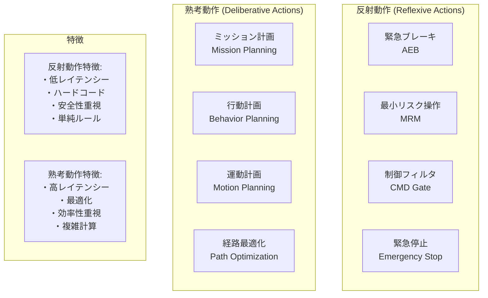
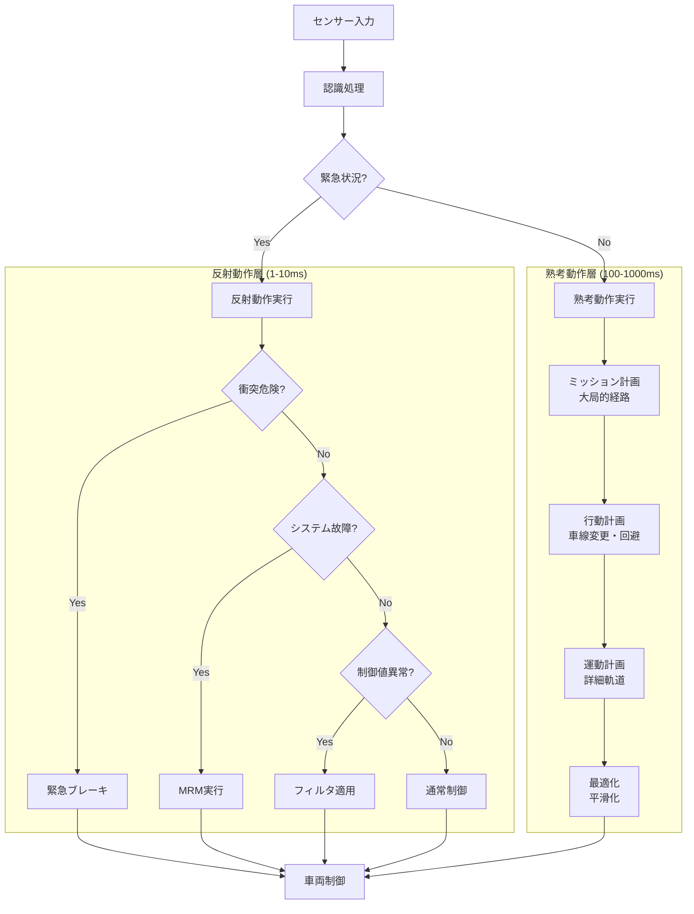
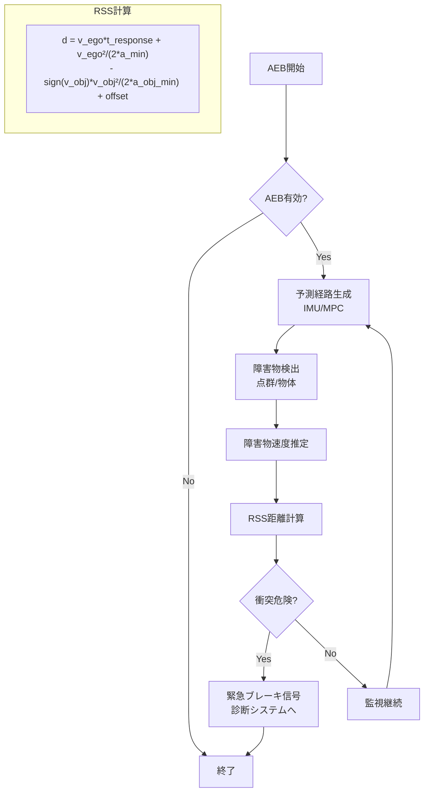
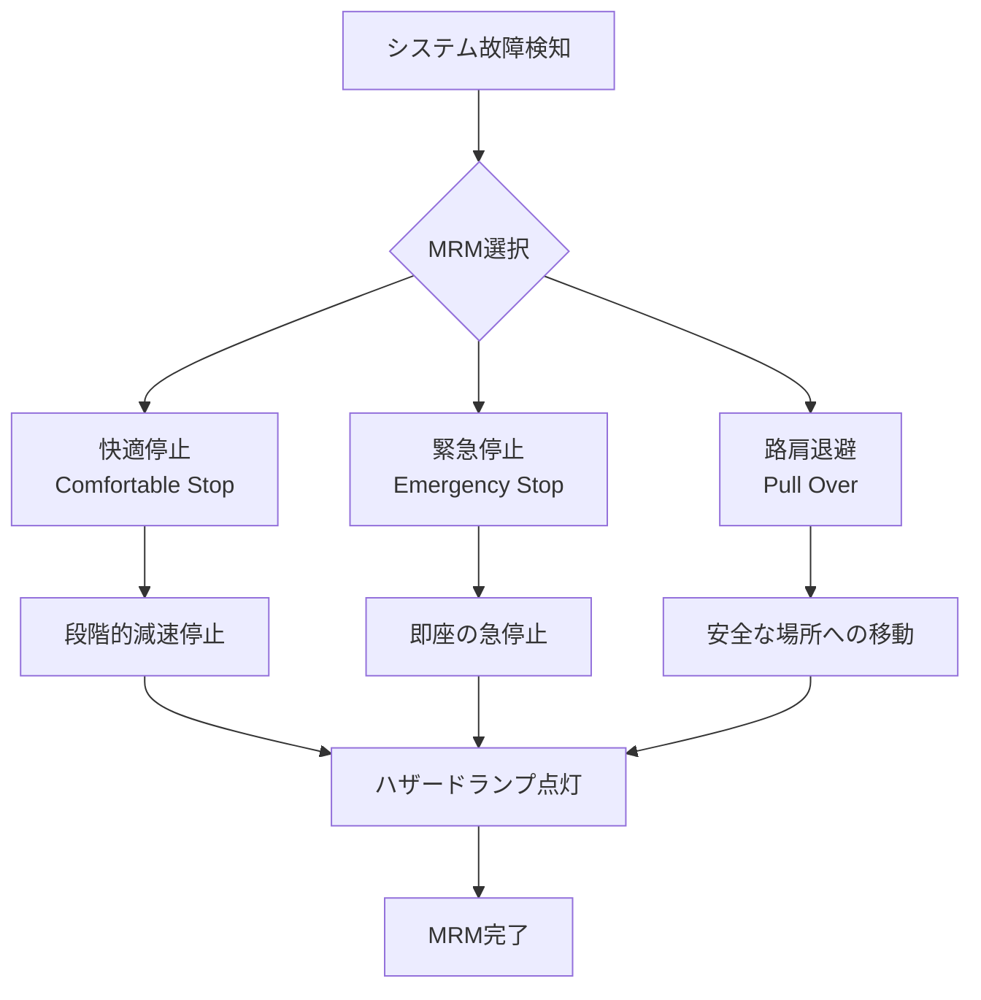
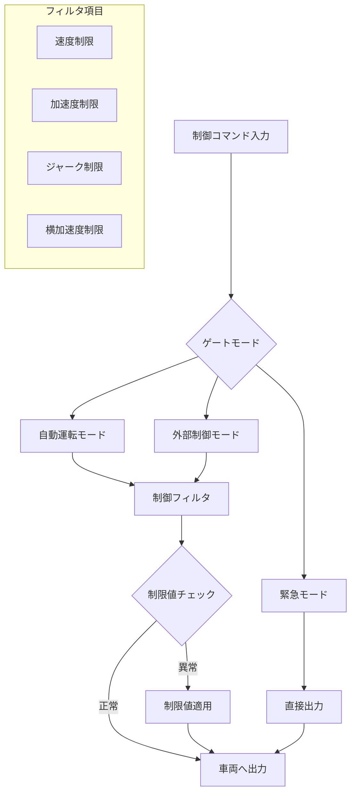
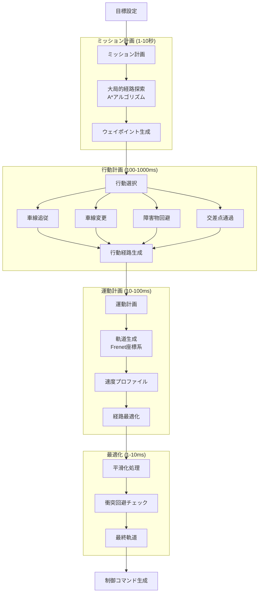
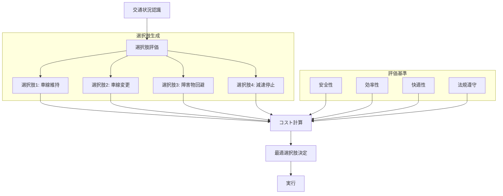
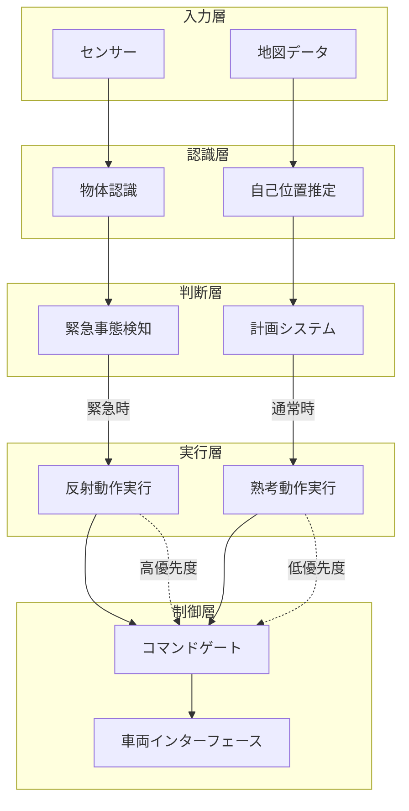

# Autoware 反射動作と熟考動作の実装

## 概要

Autowareは安全で効率的な自動運転を実現するため、**反射動作（Reflexive Actions）**と**熟考動作（Deliberative Actions）**を階層的に実装しています。

## 反射動作と熟考動作の分類

## 階層的意思決定システム

## 反射動作の詳細実装

### 1. AEB (Autonomous Emergency Braking)

**特徴**:
- **応答時間**: 1-10ms
- **判断基準**: RSS距離による厳密な計算
- **動作**: 即座の緊急ブレーキ

### 2. MRM (Minimum Risk Maneuver)

**特徴**:
- **応答時間**: 10-100ms
- **判断基準**: システム故障の種類と重要度
- **動作**: 状況に応じた最小リスク行動

### 3. Vehicle Command Gate

**特徴**:
- **応答時間**: < 1ms
- **判断基準**: 事前定義された制限値
- **動作**: 異常値の補正・制限

## 熟考動作の詳細実装

### 階層的計画システム

### 意思決定プロセス

## 統合システムアーキテクチャ

## 時間スケールと優先度

| レベル | 動作タイプ | 応答時間 | 優先度 | 主要機能 |
|--------|------------|----------|--------|----------|
| 1 | 反射動作 | 1-10ms | 最高 | AEB, 緊急停止 |
| 2 | 安全制御 | 10-100ms | 高 | MRM, フィルタ |
| 3 | 運動制御 | 100ms | 中 | 軌道追従 |
| 4 | 行動制御 | 1秒 | 中 | 車線変更, 回避 |
| 5 | 計画制御 | 10秒 | 低 | 経路計画 |

この階層的なアーキテクチャにより、Autowareは緊急時の即座の対応と、通常時の最適な計画を両立しています。