# HD Map-Free Navigation Architecture for Autoware
# HDマップフリーナビゲーションアーキテクチャ

## 📋 Table of Contents / 目次

1. [Overview / 概要](#overview--概要)
2. [System Architecture / システムアーキテクチャ](#system-architecture--システムアーキテクチャ)
3. [HD Map vs Navigation Map / HDマップ vs ナビゲーションマップ](#hd-map-vs-navigation-map--hdマップ-vs-ナビゲーションマップ)
4. [Navigation Map Conversion / ナビゲーションマップ変換](#navigation-map-conversion--ナビゲーションマップ変換)
5. [Localization System / ローカライゼーションシステム](#localization-system--ローカライゼーションシステム)
6. [Local Map Generation / ローカルマップ生成](#local-map-generation--ローカルマップ生成)
7. [Planning System / プランニングシステム](#planning-system--プランニングシステム)
8. [Sensor Requirements / センサー要件](#sensor-requirements--センサー要件)
9. [Implementation Guide / 実装ガイド](#implementation-guide--実装ガイド)
10. [Performance Analysis / パフォーマンス分析](#performance-analysis--パフォーマンス分析)
11. [Testing Strategy / テスト戦略](#testing-strategy--テスト戦略)
12. [Future Developments / 今後の発展](#future-developments--今後の発展)

## Overview / 概要

This document describes the architecture for implementing HD map-free autonomous driving in Autoware using only navigation maps (OpenStreetMap, Google Maps, etc.) combined with real-time sensor perception.

このドキュメントは、HDマップを使用せず、ナビゲーションマップ（OpenStreetMap、Google Maps等）とリアルタイムセンサー認識のみを使用してAutowareで自動運転を実現するアーキテクチャについて説明します。

### Key Benefits / 主な利点

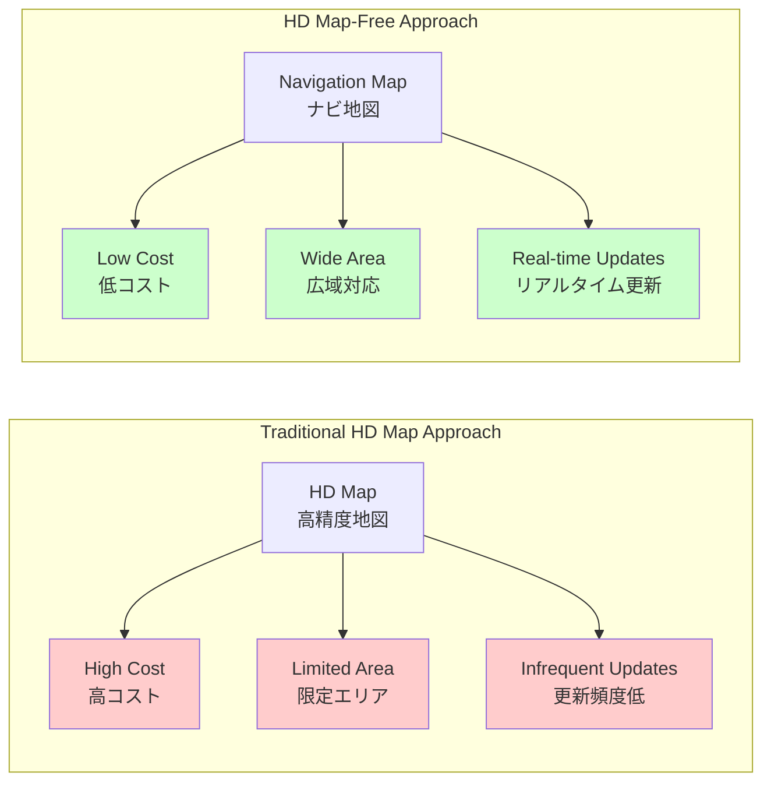
```mermaid
graph LR
    subgraph "Traditional HD Map Approach"
        HDM[HD Map<br/>高精度地図]
        HC1[High Cost<br/>高コスト]
        LA1[Limited Area<br/>限定エリア]
        IU1[Infrequent Updates<br/>更新頻度低]
        
        HDM --> HC1
        HDM --> LA1
        HDM --> IU1
    end
    
    subgraph "HD Map-Free Approach"
        NAV[Navigation Map<br/>ナビ地図]
        LC2[Low Cost<br/>低コスト]
        WA2[Wide Area<br/>広域対応]
        RU2[Real-time Updates<br/>リアルタイム更新]
        
        NAV --> LC2
        NAV --> WA2
        NAV --> RU2
    end
    
    style HC1 fill:#ffcccc
    style LA1 fill:#ffcccc
    style IU1 fill:#ffcccc
    style LC2 fill:#ccffcc
    style WA2 fill:#ccffcc
    style RU2 fill:#ccffcc
```

## System Architecture / システムアーキテクチャ

### High-Level Architecture / 全体アーキテクチャ

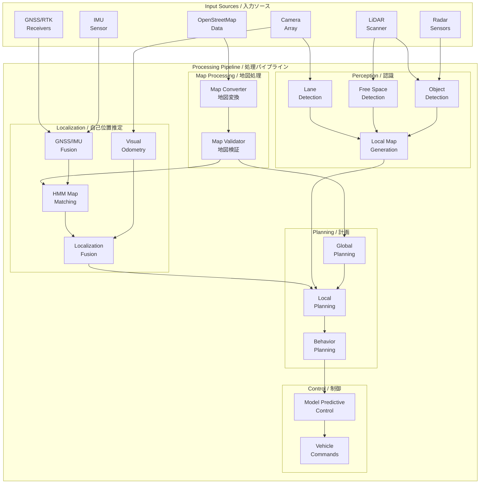
```mermaid
graph TB
    subgraph "Input Sources / 入力ソース"
        OSM[OpenStreetMap<br/>Data]
        GNSS[GNSS/RTK<br/>Receivers]
        IMU[IMU<br/>Sensor]
        CAM[Camera<br/>Array]
        LIDAR[LiDAR<br/>Scanner]
        RADAR[Radar<br/>Sensors]
    end
    
    subgraph "Processing Pipeline / 処理パイプライン"
        subgraph "Map Processing / 地図処理"
            MC[Map Converter<br/>地図変換]
            MV[Map Validator<br/>地図検証]
        end
        
        subgraph "Localization / 自己位置推定"
            GIF[GNSS/IMU<br/>Fusion]
            HMM[HMM Map<br/>Matching]
            VO[Visual<br/>Odometry]
            LF[Localization<br/>Fusion]
        end
        
        subgraph "Perception / 認識"
            LD[Lane<br/>Detection]
            OD[Object<br/>Detection]
            FS[Free Space<br/>Detection]
            LMG[Local Map<br/>Generation]
        end
        
        subgraph "Planning / 計画"
            GP[Global<br/>Planning]
            LP[Local<br/>Planning]
            BP[Behavior<br/>Planning]
        end
        
        subgraph "Control / 制御"
            MPC[Model Predictive<br/>Control]
            VC[Vehicle<br/>Commands]
        end
    end
    
    OSM --> MC
    MC --> MV
    MV --> GP
    MV --> HMM
    
    GNSS --> GIF
    IMU --> GIF
    GIF --> HMM
    HMM --> LF
    
    CAM --> VO
    CAM --> LD
    VO --> LF
    
    LIDAR --> OD
    LIDAR --> FS
    RADAR --> OD
    
    LD --> LMG
    FS --> LMG
    OD --> LMG
    
    LF --> LP
    LMG --> LP
    GP --> LP
    LP --> BP
    BP --> MPC
    MPC --> VC
```

### Component Interaction Flow / コンポーネント間の相互作用

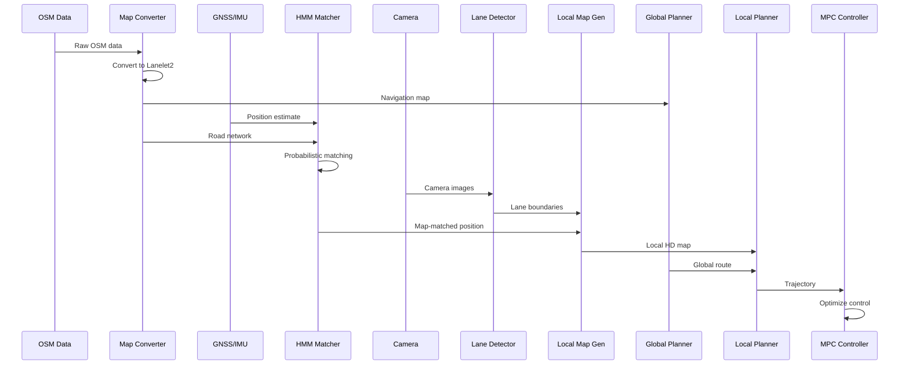
```mermaid
sequenceDiagram
    participant OSM as OSM Data
    participant MC as Map Converter
    participant GNSS as GNSS/IMU
    participant HMM as HMM Matcher
    participant CAM as Camera
    participant LD as Lane Detector
    participant LMG as Local Map Gen
    participant GP as Global Planner
    participant LP as Local Planner
    participant MPC as MPC Controller
    
    OSM->>MC: Raw OSM data
    MC->>MC: Convert to Lanelet2
    MC->>GP: Navigation map
    
    GNSS->>HMM: Position estimate
    MC->>HMM: Road network
    HMM->>HMM: Probabilistic matching
    
    CAM->>LD: Camera images
    LD->>LMG: Lane boundaries
    HMM->>LMG: Map-matched position
    LMG->>LP: Local HD map
    
    GP->>LP: Global route
    LP->>MPC: Trajectory
    MPC->>MPC: Optimize control
```

## HD Map vs Navigation Map / HDマップ vs ナビゲーションマップ

### Comparison Table / 比較表

| Feature / 特徴 | HD Map / HDマップ | Navigation Map / ナビ地図 |
|----------------|-------------------|---------------------------|
| **Accuracy / 精度** | 1-10 cm | 1-5 m |
| **Information / 情報量** | Lane boundaries, traffic lights, signs<br/>車線境界、信号機、標識 | Road centerlines, intersections<br/>道路中心線、交差点 |
| **Data Size / データサイズ** | GB/km² | MB/km² |
| **Update Frequency / 更新頻度** | Months-Years<br/>月〜年単位 | Real-time to Daily<br/>リアルタイム〜日単位 |
| **Cost / コスト** | Very High<br/>非常に高額 | Free or Low<br/>無料または低額 |
| **Coverage / カバー範囲** | Limited areas<br/>限定的 | Global<br/>グローバル |

### Visual Comparison / 視覚的比較

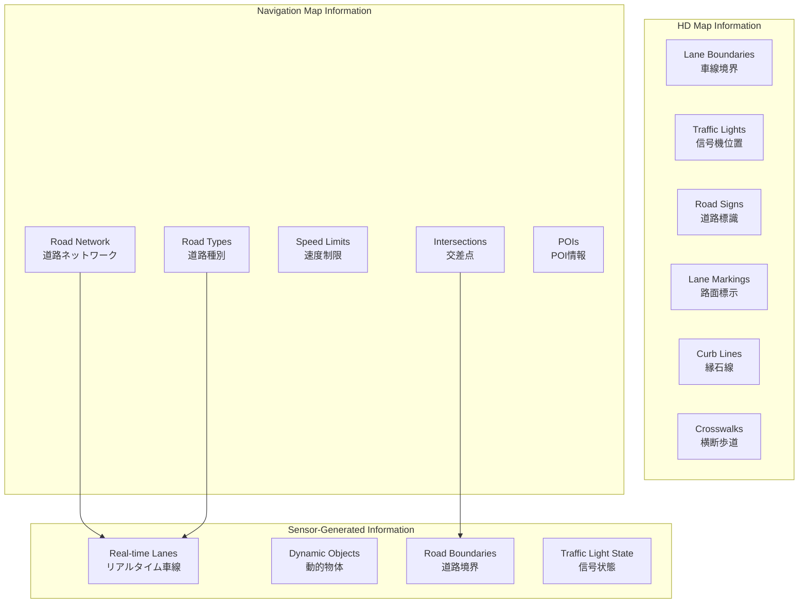
```mermaid
graph TB
    subgraph "HD Map Information"
        HDM1[Lane Boundaries<br/>車線境界]
        HDM2[Traffic Lights<br/>信号機位置]
        HDM3[Road Signs<br/>道路標識]
        HDM4[Lane Markings<br/>路面標示]
        HDM5[Curb Lines<br/>縁石線]
        HDM6[Crosswalks<br/>横断歩道]
    end
    
    subgraph "Navigation Map Information"
        NAV1[Road Network<br/>道路ネットワーク]
        NAV2[Intersections<br/>交差点]
        NAV3[Speed Limits<br/>速度制限]
        NAV4[Road Types<br/>道路種別]
        NAV5[POIs<br/>POI情報]
    end
    
    subgraph "Sensor-Generated Information"
        SEN1[Real-time Lanes<br/>リアルタイム車線]
        SEN2[Dynamic Objects<br/>動的物体]
        SEN3[Road Boundaries<br/>道路境界]
        SEN4[Traffic Light State<br/>信号状態]
    end
    
    NAV1 --> SEN1
    NAV2 --> SEN3
    NAV4 --> SEN1
```

## Navigation Map Conversion / ナビゲーションマップ変換

### OSM to Lanelet2 Conversion Process / OSM→Lanelet2変換プロセス

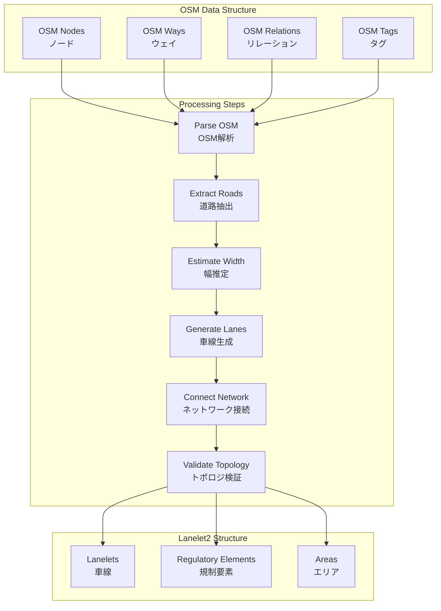
```mermaid
graph TB
    subgraph "OSM Data Structure"
        OSM_NODE[OSM Nodes<br/>ノード]
        OSM_WAY[OSM Ways<br/>ウェイ]
        OSM_REL[OSM Relations<br/>リレーション]
        OSM_TAG[OSM Tags<br/>タグ]
    end
    
    subgraph "Processing Steps"
        PARSE[Parse OSM<br/>OSM解析]
        EXTRACT[Extract Roads<br/>道路抽出]
        WIDTH[Estimate Width<br/>幅推定]
        LANES[Generate Lanes<br/>車線生成]
        CONNECT[Connect Network<br/>ネットワーク接続]
        VALIDATE[Validate Topology<br/>トポロジ検証]
    end
    
    subgraph "Lanelet2 Structure"
        LL_LANE[Lanelets<br/>車線]
        LL_REG[Regulatory Elements<br/>規制要素]
        LL_AREA[Areas<br/>エリア]
    end
    
    OSM_NODE --> PARSE
    OSM_WAY --> PARSE
    OSM_REL --> PARSE
    OSM_TAG --> PARSE
    
    PARSE --> EXTRACT
    EXTRACT --> WIDTH
    WIDTH --> LANES
    LANES --> CONNECT
    CONNECT --> VALIDATE
    
    VALIDATE --> LL_LANE
    VALIDATE --> LL_REG
    VALIDATE --> LL_AREA
```

### Width Estimation Algorithm / 幅推定アルゴリズム

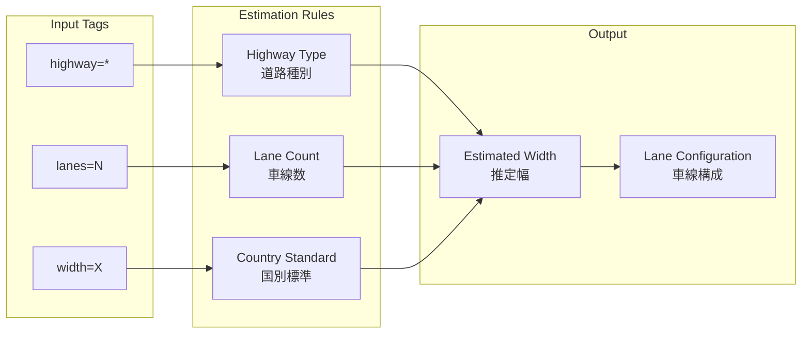
```mermaid
graph LR
    subgraph "Input Tags"
        HW[highway=*]
        LN[lanes=N]
        WD[width=X]
    end
    
    subgraph "Estimation Rules"
        R1[Highway Type<br/>道路種別]
        R2[Lane Count<br/>車線数]
        R3[Country Standard<br/>国別標準]
    end
    
    subgraph "Output"
        EW[Estimated Width<br/>推定幅]
        LC[Lane Configuration<br/>車線構成]
    end
    
    HW --> R1
    LN --> R2
    WD --> R3
    
    R1 --> EW
    R2 --> EW
    R3 --> EW
    
    EW --> LC
```

### Implementation Code Structure / 実装コード構造

```cpp
// OSM to Lanelet2 Converter Implementation
class OSMToLanelet2Converter {
public:
    struct ConversionConfig {
        double default_lane_width = 3.5;  // meters
        double default_highway_width = 7.0;
        double default_residential_width = 5.5;
        std::string country_code = "JP";
        bool generate_pedestrian_areas = true;
        bool infer_traffic_lights = true;
    };

    Lanelet2Map convert(const OSMData& osm_data) {
        // Step 1: Parse OSM data
        auto road_network = extractRoadNetwork(osm_data);
        
        // Step 2: Estimate road geometry
        for (auto& road : road_network) {
            road.width = estimateRoadWidth(road);
            road.lanes = estimateLaneCount(road);
        }
        
        // Step 3: Generate lanelets
        auto lanelets = generateLanelets(road_network);
        
        // Step 4: Add regulatory elements
        addRegulatoryElements(lanelets, osm_data);
        
        // Step 5: Build and validate map
        return buildLanelet2Map(lanelets);
    }

private:
    double estimateRoadWidth(const OSMWay& way) {
        // Priority: explicit width > lane count > road type
        if (way.hasTag("width")) {
            return parseWidth(way.getTag("width"));
        }
        
        if (way.hasTag("lanes")) {
            int lanes = std::stoi(way.getTag("lanes"));
            return lanes * getLaneWidth(way);
        }
        
        // Estimate from road type
        return getDefaultWidth(way.getTag("highway"));
    }
};
```

## Localization System / ローカライゼーションシステム

### Multi-Source Fusion Architecture / マルチソース融合アーキテクチャ

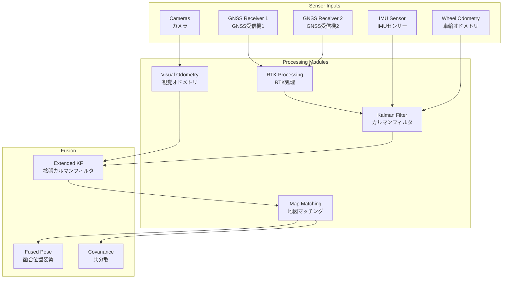
```mermaid
graph TB
    subgraph "Sensor Inputs"
        GNSS1[GNSS Receiver 1<br/>GNSS受信機1]
        GNSS2[GNSS Receiver 2<br/>GNSS受信機2]
        IMU[IMU Sensor<br/>IMUセンサー]
        CAM[Cameras<br/>カメラ]
        ODOM[Wheel Odometry<br/>車輪オドメトリ]
    end
    
    subgraph "Processing Modules"
        RTK[RTK Processing<br/>RTK処理]
        KF[Kalman Filter<br/>カルマンフィルタ]
        VO[Visual Odometry<br/>視覚オドメトリ]
        MS[Map Matching<br/>地図マッチング]
    end
    
    subgraph "Fusion"
        EKF[Extended KF<br/>拡張カルマンフィルタ]
        POSE[Fused Pose<br/>融合位置姿勢]
        COV[Covariance<br/>共分散]
    end
    
    GNSS1 --> RTK
    GNSS2 --> RTK
    RTK --> KF
    IMU --> KF
    ODOM --> KF
    
    CAM --> VO
    VO --> EKF
    KF --> EKF
    
    EKF --> MS
    MS --> POSE
    MS --> COV
```

### HMM Map Matching Algorithm / HMMマップマッチングアルゴリズム

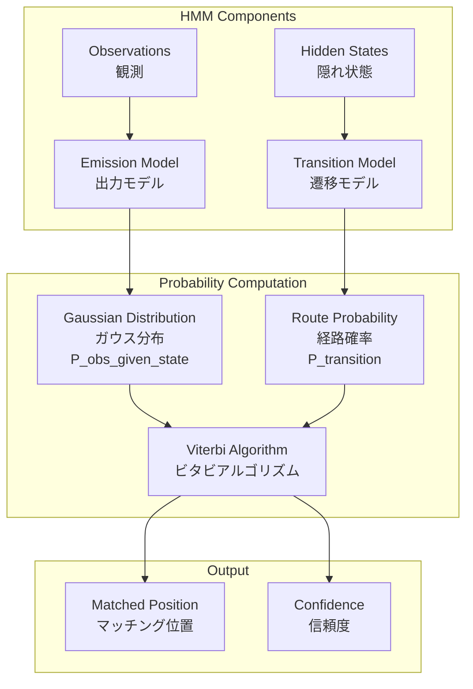
```mermaid
graph TB
    subgraph "HMM Components"
        OBS[Observations<br/>観測]
        STATES[Hidden States<br/>隠れ状態]
        TRANS[Transition Model<br/>遷移モデル]
        EMIS[Emission Model<br/>出力モデル]
    end
    
    subgraph "Probability Computation"
        GAUSS[Gaussian Distribution<br/>ガウス分布<br/>P_obs_given_state]
        ROUTE[Route Probability<br/>経路確率<br/>P_transition]
        VITERBI[Viterbi Algorithm<br/>ビタビアルゴリズム]
    end
    
    subgraph "Output"
        MATCHED[Matched Position<br/>マッチング位置]
        CONF[Confidence<br/>信頼度]
    end
    
    OBS --> EMIS
    STATES --> TRANS
    EMIS --> GAUSS
    TRANS --> ROUTE
    
    GAUSS --> VITERBI
    ROUTE --> VITERBI
    
    VITERBI --> MATCHED
    VITERBI --> CONF
```

### Visual Odometry Pipeline / 視覚オドメトリパイプライン

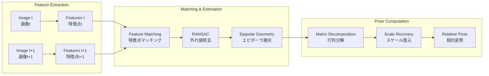
```mermaid
graph LR
    subgraph "Feature Extraction"
        IMG1[Image t<br/>画像t]
        IMG2[Image t+1<br/>画像t+1]
        FEAT1[Features t<br/>特徴点t]
        FEAT2[Features t+1<br/>特徴点t+1]
    end
    
    subgraph "Matching & Estimation"
        MATCH[Feature Matching<br/>特徴点マッチング]
        RANSAC[RANSAC<br/>外れ値除去]
        EPIPOLAR[Epipolar Geometry<br/>エピポーラ幾何]
    end
    
    subgraph "Pose Computation"
        DECOMP[Matrix Decomposition<br/>行列分解]
        SCALE[Scale Recovery<br/>スケール復元]
        POSE[Relative Pose<br/>相対姿勢]
    end
    
    IMG1 --> FEAT1
    IMG2 --> FEAT2
    FEAT1 --> MATCH
    FEAT2 --> MATCH
    
    MATCH --> RANSAC
    RANSAC --> EPIPOLAR
    EPIPOLAR --> DECOMP
    DECOMP --> SCALE
    SCALE --> POSE
```

### Localization Implementation / ローカライゼーション実装

```cpp
class NavigationMapLocalizer {
private:
    // HMM Map Matching States
    struct HMMState {
        int road_segment_id;
        double position_along_segment;
        double lateral_offset;
        double probability;
    };
    
    // Multi-sensor fusion using EKF
    ExtendedKalmanFilter ekf_;
    HiddenMarkovModel hmm_;
    VisualOdometry vo_;
    
public:
    LocalizationResult localize(const SensorData& sensors) {
        // Step 1: GNSS/IMU fusion
        auto gnss_pose = fuseGNSSIMU(sensors.gnss, sensors.imu);
        
        // Step 2: Visual odometry
        auto vo_delta = vo_.computeDelta(sensors.camera_images);
        
        // Step 3: EKF prediction and update
        ekf_.predict(vo_delta, sensors.wheel_odometry);
        ekf_.update(gnss_pose);
        
        // Step 4: HMM map matching
        auto map_matched = hmm_.match(ekf_.getState(), navigation_map_);
        
        // Step 5: Lane-level positioning
        auto lane_position = estimateLanePosition(
            sensors.camera_images, 
            map_matched
        );
        
        return LocalizationResult{
            .pose = lane_position,
            .covariance = ekf_.getCovariance(),
            .confidence = hmm_.getConfidence()
        };
    }
    
private:
    Pose fuseGNSSIMU(const GNSSData& gnss, const IMUData& imu) {
        // RTK processing for dual GNSS receivers
        auto rtk_solution = processRTK(gnss.receiver1, gnss.receiver2);
        
        // IMU integration
        auto imu_prediction = integrateIMU(imu, last_pose_);
        
        // Fusion using complementary filter
        return complementaryFilter(rtk_solution, imu_prediction);
    }
};
```

## Local Map Generation / ローカルマップ生成

### Real-time HD Map Generation Pipeline / リアルタイムHDマップ生成パイプライン

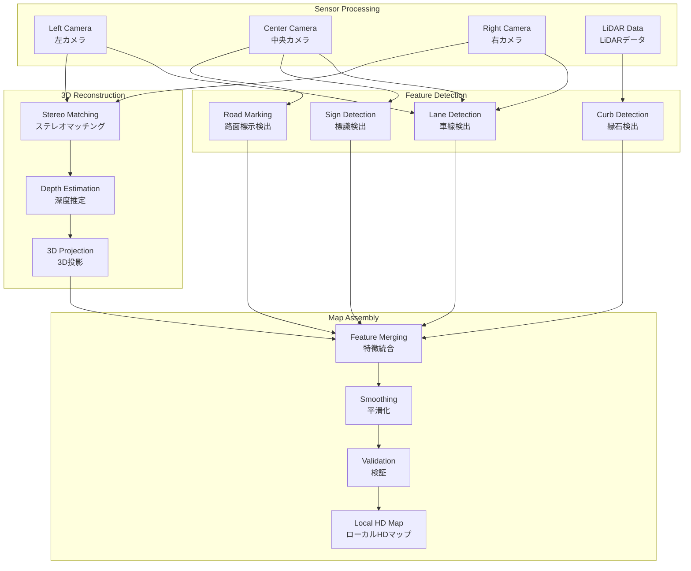
```mermaid
graph TB
    subgraph "Sensor Processing"
        CAM_L[Left Camera<br/>左カメラ]
        CAM_C[Center Camera<br/>中央カメラ]
        CAM_R[Right Camera<br/>右カメラ]
        LIDAR[LiDAR Data<br/>LiDARデータ]
    end
    
    subgraph "Feature Detection"
        LANE_DET[Lane Detection<br/>車線検出]
        CURB_DET[Curb Detection<br/>縁石検出]
        SIGN_DET[Sign Detection<br/>標識検出]
        MARKING_DET[Road Marking<br/>路面標示検出]
    end
    
    subgraph "3D Reconstruction"
        STEREO[Stereo Matching<br/>ステレオマッチング]
        DEPTH[Depth Estimation<br/>深度推定]
        PROJ[3D Projection<br/>3D投影]
    end
    
    subgraph "Map Assembly"
        MERGE[Feature Merging<br/>特徴統合]
        SMOOTH[Smoothing<br/>平滑化]
        VALIDATE[Validation<br/>検証]
        LOCAL_HD[Local HD Map<br/>ローカルHDマップ]
    end
    
    CAM_L --> LANE_DET
    CAM_C --> LANE_DET
    CAM_R --> LANE_DET
    
    LIDAR --> CURB_DET
    CAM_C --> SIGN_DET
    CAM_C --> MARKING_DET
    
    CAM_L --> STEREO
    CAM_R --> STEREO
    STEREO --> DEPTH
    DEPTH --> PROJ
    
    LANE_DET --> MERGE
    CURB_DET --> MERGE
    SIGN_DET --> MERGE
    MARKING_DET --> MERGE
    PROJ --> MERGE
    
    MERGE --> SMOOTH
    SMOOTH --> VALIDATE
    VALIDATE --> LOCAL_HD
```

### Lane Detection Algorithm Flow / 車線検出アルゴリズムフロー

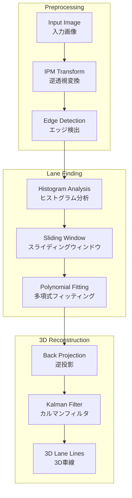
```mermaid
graph TB
    subgraph "Preprocessing"
        IMG[Input Image<br/>入力画像]
        IPT[IPM Transform<br/>逆透視変換]
        EDGE[Edge Detection<br/>エッジ検出]
    end
    
    subgraph "Lane Finding"
        HIST[Histogram Analysis<br/>ヒストグラム分析]
        WINDOW[Sliding Window<br/>スライディングウィンドウ]
        POLY[Polynomial Fitting<br/>多項式フィッティング]
    end
    
    subgraph "3D Reconstruction"
        BACK[Back Projection<br/>逆投影]
        FILTER[Kalman Filter<br/>カルマンフィルタ]
        LANES[3D Lane Lines<br/>3D車線]
    end
    
    IMG --> IPT
    IPT --> EDGE
    EDGE --> HIST
    HIST --> WINDOW
    WINDOW --> POLY
    POLY --> BACK
    BACK --> FILTER
    FILTER --> LANES
```

### Free Space Detection / 走行可能領域検出

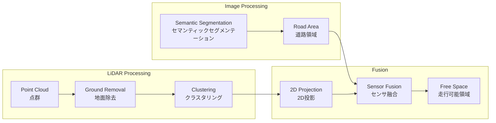
```mermaid
graph LR
    subgraph "LiDAR Processing"
        PC[Point Cloud<br/>点群]
        GROUND[Ground Removal<br/>地面除去]
        CLUSTER[Clustering<br/>クラスタリング]
    end
    
    subgraph "Image Processing"
        SEG[Semantic Segmentation<br/>セマンティックセグメンテーション]
        ROAD[Road Area<br/>道路領域]
    end
    
    subgraph "Fusion"
        PROJ2D[2D Projection<br/>2D投影]
        FUSE[Sensor Fusion<br/>センサ融合]
        FREE[Free Space<br/>走行可能領域]
    end
    
    PC --> GROUND
    GROUND --> CLUSTER
    CLUSTER --> PROJ2D
    
    SEG --> ROAD
    ROAD --> FUSE
    PROJ2D --> FUSE
    FUSE --> FREE
```

### Local Map Generation Implementation / ローカルマップ生成実装

```cpp
class LocalMapGenerator {
private:
    struct LocalHDMap {
        std::vector<LaneLine> lane_lines;
        std::vector<RoadBoundary> boundaries;
        std::vector<TrafficSign> signs;
        std::vector<RoadMarking> markings;
        FreeSpace free_space;
        double confidence;
    };
    
public:
    LocalHDMap generateLocalMap(
        const Images& camera_images,
        const PointCloud& lidar_data,
        const Pose& current_pose,
        const NavigationMap& nav_map
    ) {
        // Step 1: Lane detection from camera
        auto lane_detections = detectLanes(camera_images);
        
        // Step 2: Curb detection from LiDAR
        auto curb_lines = detectCurbs(lidar_data);
        
        // Step 3: Traffic sign detection
        auto traffic_signs = detectTrafficSigns(camera_images);
        
        // Step 4: Road marking detection
        auto road_markings = detectRoadMarkings(camera_images);
        
        // Step 5: Free space computation
        auto free_space = computeFreeSpace(lidar_data, camera_images);
        
        // Step 6: 3D reconstruction and fusion
        auto local_map = reconstruct3D(
            lane_detections, curb_lines, traffic_signs, 
            road_markings, free_space, current_pose
        );
        
        // Step 7: Consistency check with navigation map
        validateWithNavMap(local_map, nav_map, current_pose);
        
        return local_map;
    }
    
private:
    std::vector<LaneLine> detectLanes(const Images& images) {
        // Deep learning-based lane detection
        auto segmentation = lane_detection_model_.predict(images.center);
        
        // Post-processing
        auto lane_pixels = extractLanePixels(segmentation);
        auto lane_curves = fitPolynomials(lane_pixels);
        
        // Stereo reconstruction for 3D lanes
        auto depth_map = computeStereoDepth(images.left, images.right);
        
        return project3DLanes(lane_curves, depth_map);
    }
};
```

## Planning System / プランニングシステム

### Hierarchical Planning Architecture / 階層的プランニングアーキテクチャ

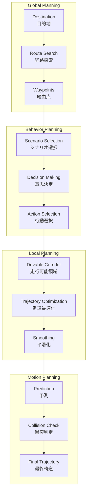
```mermaid
graph TB
    subgraph "Global Planning"
        DEST[Destination<br/>目的地]
        ROUTE[Route Search<br/>経路探索]
        WAYPOINTS[Waypoints<br/>経由点]
    end
    
    subgraph "Behavior Planning"
        SCENARIO[Scenario Selection<br/>シナリオ選択]
        DECISION[Decision Making<br/>意思決定]
        ACTION[Action Selection<br/>行動選択]
    end
    
    subgraph "Local Planning"
        CORRIDOR[Drivable Corridor<br/>走行可能領域]
        OPTIM[Trajectory Optimization<br/>軌道最適化]
        SMOOTH[Smoothing<br/>平滑化]
    end
    
    subgraph "Motion Planning"
        PREDICT[Prediction<br/>予測]
        COLLISION[Collision Check<br/>衝突判定]
        FINAL[Final Trajectory<br/>最終軌道]
    end
    
    DEST --> ROUTE
    ROUTE --> WAYPOINTS
    WAYPOINTS --> SCENARIO
    
    SCENARIO --> DECISION
    DECISION --> ACTION
    ACTION --> CORRIDOR
    
    CORRIDOR --> OPTIM
    OPTIM --> SMOOTH
    SMOOTH --> PREDICT
    
    PREDICT --> COLLISION
    COLLISION --> FINAL
```

### OSM-based Global Planning / OSMベースグローバルプランニング

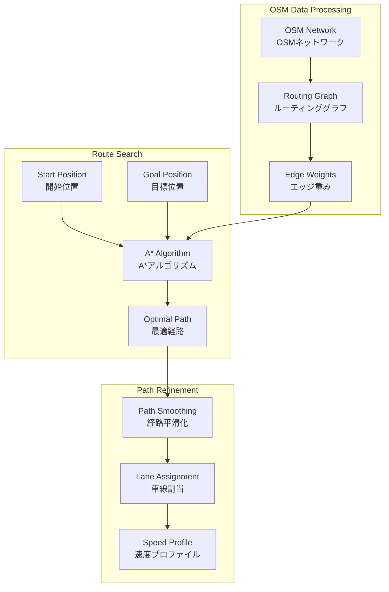
```mermaid
graph TB
    subgraph "OSM Data Processing"
        OSM[OSM Network<br/>OSMネットワーク]
        GRAPH[Routing Graph<br/>ルーティンググラフ]
        WEIGHT[Edge Weights<br/>エッジ重み]
    end
    
    subgraph "Route Search"
        START[Start Position<br/>開始位置]
        GOAL[Goal Position<br/>目標位置]
        ASTAR[A* Algorithm<br/>A*アルゴリズム]
        PATH[Optimal Path<br/>最適経路]
    end
    
    subgraph "Path Refinement"
        SMOOTH[Path Smoothing<br/>経路平滑化]
        LANE[Lane Assignment<br/>車線割当]
        SPEED[Speed Profile<br/>速度プロファイル]
    end
    
    OSM --> GRAPH
    GRAPH --> WEIGHT
    
    START --> ASTAR
    GOAL --> ASTAR
    WEIGHT --> ASTAR
    ASTAR --> PATH
    
    PATH --> SMOOTH
    SMOOTH --> LANE
    LANE --> SPEED
```

### Local Planning with Sensor Fusion / センサ融合によるローカルプランニング

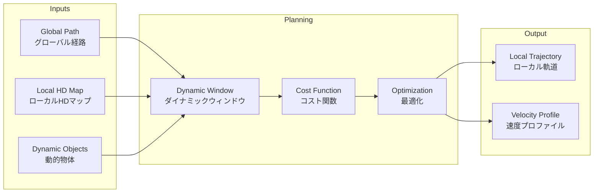
```mermaid
graph LR
    subgraph "Inputs"
        GLOBAL[Global Path<br/>グローバル経路]
        LOCAL_MAP[Local HD Map<br/>ローカルHDマップ]
        OBJECTS[Dynamic Objects<br/>動的物体]
    end
    
    subgraph "Planning"
        DWA[Dynamic Window<br/>ダイナミックウィンドウ]
        COST[Cost Function<br/>コスト関数]
        OPT[Optimization<br/>最適化]
    end
    
    subgraph "Output"
        TRAJ[Local Trajectory<br/>ローカル軌道]
        VEL[Velocity Profile<br/>速度プロファイル]
    end
    
    GLOBAL --> DWA
    LOCAL_MAP --> DWA
    OBJECTS --> DWA
    
    DWA --> COST
    COST --> OPT
    OPT --> TRAJ
    OPT --> VEL
```

### Planning System Implementation / プランニングシステム実装

```cpp
class NavigationMapPlanner {
private:
    struct PlanningResult {
        Trajectory global_path;
        Trajectory local_trajectory;
        VelocityProfile velocity_profile;
        double total_cost;
    };
    
public:
    PlanningResult plan(
        const Pose& current_pose,
        const Pose& goal_pose,
        const LocalHDMap& local_map,
        const ObjectList& dynamic_objects,
        const NavigationMap& nav_map
    ) {
        // Step 1: Global route planning on OSM
        auto global_route = planGlobalRoute(
            current_pose, goal_pose, nav_map
        );
        
        // Step 2: Behavior planning
        auto behavior = selectDrivingBehavior(
            global_route, local_map, dynamic_objects
        );
        
        // Step 3: Local trajectory generation
        auto local_traj = generateLocalTrajectory(
            global_route, local_map, behavior
        );
        
        // Step 4: Dynamic object avoidance
        auto safe_traj = avoidDynamicObjects(
            local_traj, dynamic_objects
        );
        
        // Step 5: Velocity planning
        auto velocity = planVelocityProfile(
            safe_traj, behavior, local_map
        );
        
        return PlanningResult{
            .global_path = global_route,
            .local_trajectory = safe_traj,
            .velocity_profile = velocity,
            .total_cost = computeTotalCost(safe_traj, velocity)
        };
    }
    
private:
    Trajectory planGlobalRoute(
        const Pose& start, 
        const Pose& goal,
        const NavigationMap& map
    ) {
        // Build routing graph from OSM data
        auto graph = buildRoutingGraph(map);
        
        // Find nearest nodes
        auto start_node = findNearestNode(start, graph);
        auto goal_node = findNearestNode(goal, graph);
        
        // A* search with custom heuristics
        auto path = astar_search(
            graph, start_node, goal_node,
            [&](const Node& n) { return heuristic(n, goal_node); }
        );
        
        // Convert to trajectory with lane assignment
        return convertToTrajectory(path, map);
    }
};
```

## Sensor Requirements / センサー要件

### Sensor Configuration for HD Map-Free Operation / HDマップフリー動作のためのセンサー構成

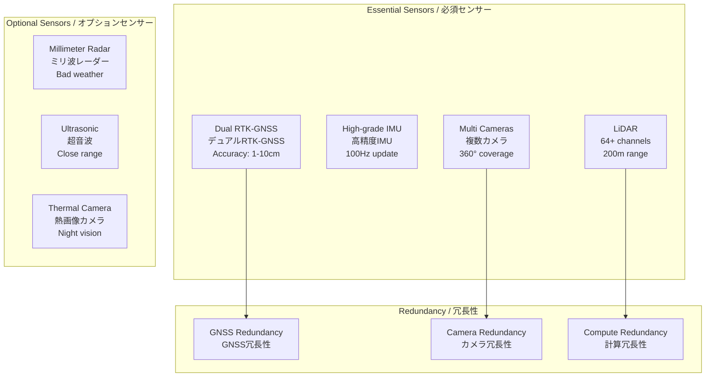
```mermaid
graph TB
    subgraph "Essential Sensors / 必須センサー"
        RTK[Dual RTK-GNSS<br/>デュアルRTK-GNSS<br/>Accuracy: 1-10cm]
        HIMU[High-grade IMU<br/>高精度IMU<br/>100Hz update]
        MCAM[Multi Cameras<br/>複数カメラ<br/>360° coverage]
        LIDAR[LiDAR<br/>64+ channels<br/>200m range]
    end
    
    subgraph "Optional Sensors / オプションセンサー"
        RADAR[Millimeter Radar<br/>ミリ波レーダー<br/>Bad weather]
        USS[Ultrasonic<br/>超音波<br/>Close range]
        THERM[Thermal Camera<br/>熱画像カメラ<br/>Night vision]
    end
    
    subgraph "Redundancy / 冗長性"
        RED1[GNSS Redundancy<br/>GNSS冗長性]
        RED2[Camera Redundancy<br/>カメラ冗長性]
        RED3[Compute Redundancy<br/>計算冗長性]
    end
    
    RTK --> RED1
    MCAM --> RED2
    LIDAR --> RED3
```

### Sensor Placement Configuration / センサー配置構成

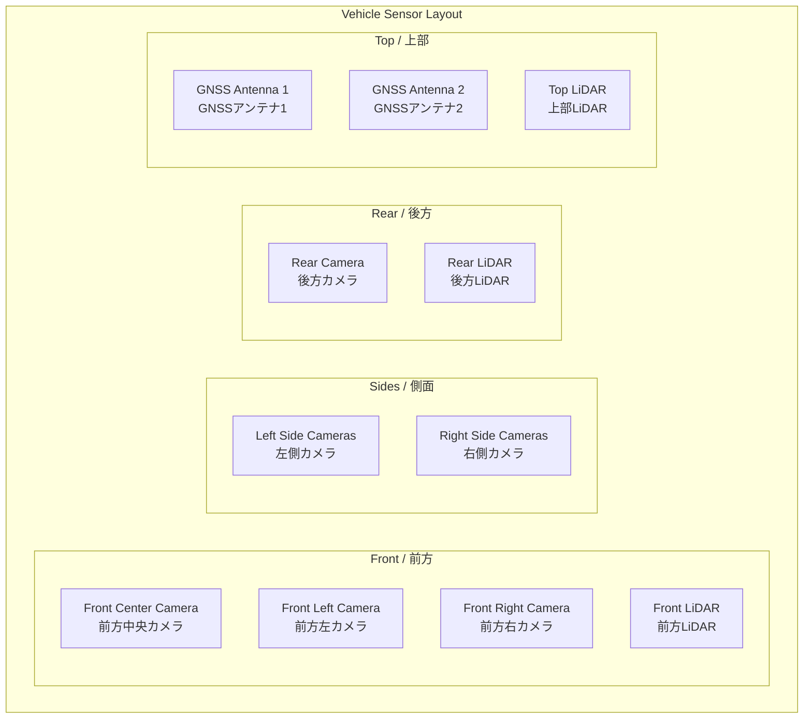
```mermaid
graph TB
    subgraph "Vehicle Sensor Layout"
        subgraph "Front / 前方"
            FC[Front Center Camera<br/>前方中央カメラ]
            FL[Front Left Camera<br/>前方左カメラ]
            FR[Front Right Camera<br/>前方右カメラ]
            FLIDAR[Front LiDAR<br/>前方LiDAR]
        end
        
        subgraph "Sides / 側面"
            LSC[Left Side Cameras<br/>左側カメラ]
            RSC[Right Side Cameras<br/>右側カメラ]
        end
        
        subgraph "Rear / 後方"
            RC[Rear Camera<br/>後方カメラ]
            RLIDAR[Rear LiDAR<br/>後方LiDAR]
        end
        
        subgraph "Top / 上部"
            GNSS1[GNSS Antenna 1<br/>GNSSアンテナ1]
            GNSS2[GNSS Antenna 2<br/>GNSSアンテナ2]
            TLIDAR[Top LiDAR<br/>上部LiDAR]
        end
    end
```

### Sensor Specifications / センサー仕様

```yaml
# sensor_configuration.yaml
sensors:
  # Dual RTK-GNSS for heading and position
  gnss:
    receivers:
      - type: "multi_band_rtk"
        position: [0.0, 0.0, 2.0]  # front antenna
        accuracy: 0.01  # 1cm
        update_rate: 10  # Hz
      - type: "multi_band_rtk"
        position: [-2.0, 0.0, 2.0]  # rear antenna
        accuracy: 0.01
        update_rate: 10
        
  # High-grade IMU for motion estimation
  imu:
    type: "tactical_grade"
    position: [0.0, 0.0, 0.0]  # vehicle center
    specifications:
      gyro_bias_stability: 0.1  # deg/hr
      accel_bias_stability: 0.01  # mg
      update_rate: 100  # Hz
      
  # Camera array for 360° perception
  cameras:
    front_triple:
      - position: [2.0, -0.5, 1.5]
        fov: 60
        resolution: [1920, 1080]
      - position: [2.0, 0.0, 1.5]
        fov: 120  # wide angle
        resolution: [1920, 1080]
      - position: [2.0, 0.5, 1.5]
        fov: 60
        resolution: [1920, 1080]
        
  # Multi-LiDAR setup
  lidars:
    top:
      type: "velodyne_vls128"
      position: [0.0, 0.0, 2.5]
      range: 200
      accuracy: 0.02
    front:
      type: "ouster_os1_64"
      position: [2.0, 0.0, 0.5]
      range: 120
      accuracy: 0.03
```

## Implementation Guide / 実装ガイド

### Step-by-Step Implementation / 段階的実装

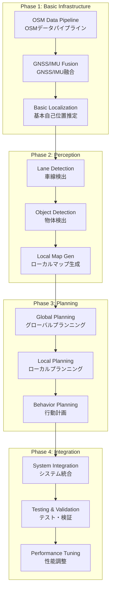
```mermaid
graph TB
    subgraph "Phase 1: Basic Infrastructure"
        P1A[OSM Data Pipeline<br/>OSMデータパイプライン]
        P1B[GNSS/IMU Fusion<br/>GNSS/IMU融合]
        P1C[Basic Localization<br/>基本自己位置推定]
    end
    
    subgraph "Phase 2: Perception"
        P2A[Lane Detection<br/>車線検出]
        P2B[Object Detection<br/>物体検出]
        P2C[Local Map Gen<br/>ローカルマップ生成]
    end
    
    subgraph "Phase 3: Planning"
        P3A[Global Planning<br/>グローバルプランニング]
        P3B[Local Planning<br/>ローカルプランニング]
        P3C[Behavior Planning<br/>行動計画]
    end
    
    subgraph "Phase 4: Integration"
        P4A[System Integration<br/>システム統合]
        P4B[Testing & Validation<br/>テスト・検証]
        P4C[Performance Tuning<br/>性能調整]
    end
    
    P1A --> P1B --> P1C
    P1C --> P2A
    P2A --> P2B --> P2C
    P2C --> P3A
    P3A --> P3B --> P3C
    P3C --> P4A
    P4A --> P4B --> P4C
```

### Configuration Files / 設定ファイル

```yaml
# navigation_map_config.yaml
navigation_map:
  # Map source configuration
  source:
    type: "openstreetmap"
    server: "https://overpass-api.de/api/interpreter"
    cache_dir: "/tmp/osm_cache"
    
  # Conversion parameters
  conversion:
    default_lane_width: 3.5
    default_speed_limits:
      motorway: 100
      trunk: 80
      primary: 60
      residential: 30
      
  # Localization configuration
  localization:
    use_dual_gnss: true
    gnss_rtk_timeout: 5.0
    map_matching:
      algorithm: "hmm"
      search_radius: 50.0
      
  # Local map generation
  local_map:
    generation_distance: 200.0
    lane_detection:
      model: "lanenet_v2"
      confidence_threshold: 0.8
    free_space:
      method: "multi_sensor_fusion"
      grid_resolution: 0.2
```

### Launch File Structure / 起動ファイル構造

```xml
<!-- navigation_map_autoware.launch.xml -->
<launch>
  <!-- Map Processing -->
  <node pkg="navigation_map_converter" exec="osm_to_lanelet2">
    <param name="config_file" value="$(find-pkg-share navigation_map_converter)/config/converter.yaml"/>
  </node>
  
  <!-- Localization -->
  <include file="$(find-pkg-share gnss_imu_localizer)/launch/gnss_imu_fusion.launch.xml">
    <arg name="use_dual_receivers" value="true"/>
  </include>
  
  <node pkg="map_matching_localizer" exec="hmm_map_matcher">
    <param name="use_visual_odometry" value="true"/>
  </node>
  
  <!-- Perception -->
  <include file="$(find-pkg-share lane_detection)/launch/multi_camera_lane_detection.launch.xml"/>
  
  <node pkg="local_map_generator" exec="realtime_hd_map_generator">
    <remap from="camera/image" to="/sensing/camera/traffic_light/image_raw"/>
    <remap from="lidar/points" to="/sensing/lidar/top/outlier_filtered/pointcloud"/>
  </node>
  
  <!-- Planning -->
  <node pkg="osm_global_planner" exec="global_route_planner">
    <param name="use_realtime_traffic" value="true"/>
  </node>
  
  <include file="$(find-pkg-share freespace_planner)/launch/freespace_planner.launch.xml">
    <arg name="use_sensor_based_freespace" value="true"/>
  </include>
</launch>
```

## Performance Analysis / パフォーマンス分析

### Comparison Metrics / 比較メトリクス

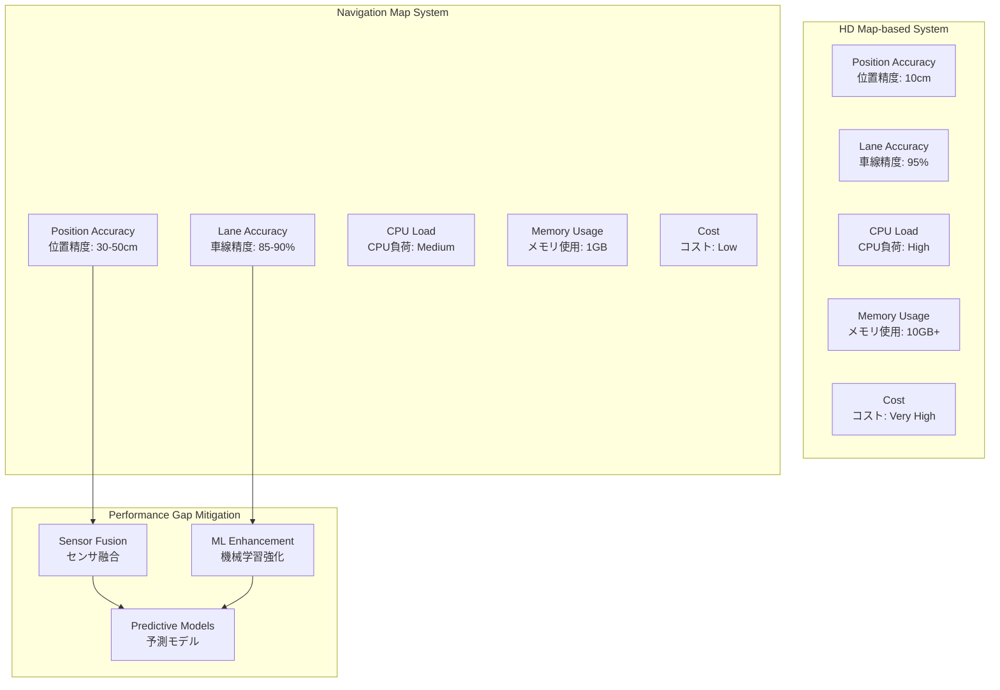
```mermaid
graph TB
    subgraph "HD Map-based System"
        HDM_ACC[Position Accuracy<br/>位置精度: 10cm]
        HDM_LANE[Lane Accuracy<br/>車線精度: 95%]
        HDM_CPU[CPU Load<br/>CPU負荷: High]
        HDM_MEM[Memory Usage<br/>メモリ使用: 10GB+]
        HDM_COST[Cost<br/>コスト: Very High]
    end
    
    subgraph "Navigation Map System"
        NAV_ACC[Position Accuracy<br/>位置精度: 30-50cm]
        NAV_LANE[Lane Accuracy<br/>車線精度: 85-90%]
        NAV_CPU[CPU Load<br/>CPU負荷: Medium]
        NAV_MEM[Memory Usage<br/>メモリ使用: 1GB]
        NAV_COST[Cost<br/>コスト: Low]
    end
    
    subgraph "Performance Gap Mitigation"
        MIT1[Sensor Fusion<br/>センサ融合]
        MIT2[ML Enhancement<br/>機械学習強化]
        MIT3[Predictive Models<br/>予測モデル]
    end
    
    NAV_ACC --> MIT1
    NAV_LANE --> MIT2
    MIT1 --> MIT3
    MIT2 --> MIT3
```

### Processing Time Breakdown / 処理時間内訳

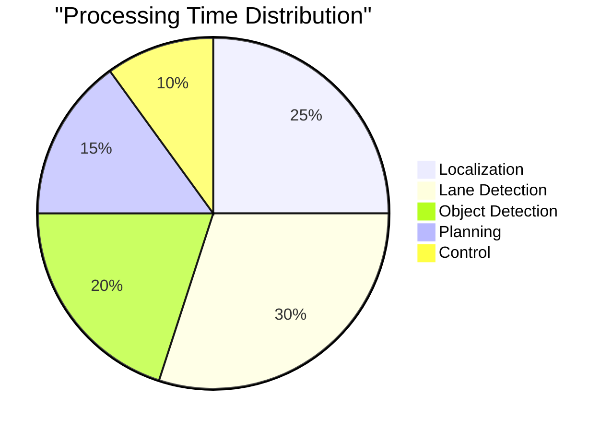
```mermaid
pie title "Processing Time Distribution"
    "Localization" : 25
    "Lane Detection" : 30
    "Object Detection" : 20
    "Planning" : 15
    "Control" : 10
```

### Resource Usage Comparison / リソース使用比較

| Component / コンポーネント | HD Map System | Navigation Map System | Improvement |
|---------------------------|---------------|----------------------|-------------|
| **Map Data Size** | 1GB/km | 10MB/km | 100x reduction |
| **Memory Usage** | 16GB+ | 4GB | 75% reduction |
| **CPU Usage** | 80-90% | 40-50% | 40% reduction |
| **GPU Usage** | 60% | 80% | More GPU utilization |
| **Network Bandwidth** | 10Mbps | 0.1Mbps | 100x reduction |
| **Startup Time** | 60s | 10s | 6x faster |

## Testing Strategy / テスト戦略

### Test Scenario Coverage / テストシナリオカバレッジ

```mermaid
graph TB
    subgraph "Unit Tests"
        UT1[Map Converter<br/>地図変換]
        UT2[Localizer<br/>自己位置推定]
        UT3[Lane Detector<br/>車線検出]
        UT4[Planner<br/>プランナー]
    end
    
    subgraph "Integration Tests"
        IT1[Sensor Fusion<br/>センサ融合]
        IT2[Map Matching<br/>地図マッチング]
        IT3[Local Map Gen<br/>ローカルマップ生成]
    end
    
    subgraph "System Tests"
        ST1[Highway Driving<br/>高速道路走行]
        ST2[Urban Navigation<br/>市街地ナビゲーション]
        ST3[Parking<br/>駐車]
        ST4[Weather Conditions<br/>天候条件]
    end
    
    subgraph "Validation"
        VAL1[Accuracy Metrics<br/>精度メトリクス]
        VAL2[Safety Validation<br/>安全性検証]
        VAL3[Performance Bench<br/>性能ベンチマーク]
    end
    
    UT1 --> IT1
    UT2 --> IT1
    UT3 --> IT3
    UT4 --> IT2
    
    IT1 --> ST1
    IT2 --> ST2
    IT3 --> ST3
    
    ST1 --> VAL1
    ST2 --> VAL2
    ST3 --> VAL3
    ST4 --> VAL2
```

### Test Implementation Example / テスト実装例

```cpp
// Integration test for navigation map localization
TEST_F(NavigationMapLocalizationTest, TestMapMatchingAccuracy) {
    // Setup
    auto localizer = std::make_shared<NavigationMapLocalizer>();
    localizer->loadMap("test_data/osm_map.osm");
    
    // Load ground truth trajectory
    auto ground_truth = loadGroundTruth("test_data/rtk_trajectory.csv");
    
    // Run localization with simulated sensor data
    std::vector<LocalizationResult> results;
    for (const auto& gt_pose : ground_truth) {
        auto sensor_data = generateSensorData(gt_pose);
        auto result = localizer->localize(sensor_data);
        results.push_back(result);
    }
    
    // Verify accuracy
    auto position_errors = computePositionErrors(results, ground_truth);
    auto heading_errors = computeHeadingErrors(results, ground_truth);
    
    // Check requirements
    EXPECT_LE(position_errors.mean(), 0.5);  // 50cm average error
    EXPECT_LE(position_errors.percentile(95), 1.0);  // 1m 95th percentile
    EXPECT_LE(heading_errors.mean(), 2.0);  // 2 degree average error
}

// Performance benchmark test
TEST_F(NavigationMapPerformanceTest, TestRealtimePerformance) {
    auto pipeline = createNavigationMapPipeline();
    
    // Measure processing time for each component
    std::vector<double> localization_times;
    std::vector<double> perception_times;
    std::vector<double> planning_times;
    
    for (int i = 0; i < 1000; ++i) {
        auto sensor_data = loadSensorData(i);
        
        auto t1 = getCurrentTime();
        auto pose = pipeline->localize(sensor_data);
        auto t2 = getCurrentTime();
        auto local_map = pipeline->generateLocalMap(sensor_data, pose);
        auto t3 = getCurrentTime();
        auto trajectory = pipeline->plan(pose, local_map);
        auto t4 = getCurrentTime();
        
        localization_times.push_back(t2 - t1);
        perception_times.push_back(t3 - t2);
        planning_times.push_back(t4 - t3);
    }
    
    // Verify real-time constraints (100ms total)
    EXPECT_LE(computeMean(localization_times), 20.0);  // 20ms
    EXPECT_LE(computeMean(perception_times), 50.0);    // 50ms
    EXPECT_LE(computeMean(planning_times), 30.0);      // 30ms
}
```

## Future Developments / 今後の発展

### Technology Roadmap / 技術ロードマップ

```mermaid
graph LR
    subgraph "2024"
        A1[Basic Implementation<br/>基本実装]
        A2[Highway Testing<br/>高速道路テスト]
    end
    
    subgraph "2025"
        B1[Urban Testing<br/>市街地テスト]
        B2[ML Enhancement<br/>機械学習強化]
        B3[V2X Integration<br/>V2X統合]
    end
    
    subgraph "2026"
        C1[Production Ready<br/>量産準備]
        C2[Cloud Integration<br/>クラウド統合]
        C3[Global Deployment<br/>グローバル展開]
    end
    
    A1 --> A2
    A2 --> B1
    B1 --> B2
    B2 --> B3
    B3 --> C1
    C1 --> C2
    C2 --> C3
```

### Advanced Features Under Development / 開発中の高度な機能

```mermaid
graph TB
    subgraph "AI Enhancement"
        DL1[Transformer-based<br/>Lane Prediction]
        DL2[Neural Map<br/>Completion]
        DL3[Uncertainty<br/>Estimation]
    end
    
    subgraph "V2X Communication"
        V2X1[Vehicle-to-Vehicle<br/>車車間通信]
        V2X2[Infrastructure Data<br/>インフラデータ]
        V2X3[Crowd-sourced Maps<br/>クラウドソース地図]
    end
    
    subgraph "Cloud Services"
        CLOUD1[Real-time Updates<br/>リアルタイム更新]
        CLOUD2[HD Map Streaming<br/>HDマップストリーミング]
        CLOUD3[Fleet Learning<br/>フリート学習]
    end
```

### Research Areas / 研究分野

1. **Deep Learning for Map Completion / 地図補完のための深層学習**
   - Generating HD map features from sparse navigation maps
   - Real-time lane topology inference
   - Traffic rule understanding from context

2. **Collaborative Mapping / 協調マッピング**
   - Fleet-based map updates
   - Crowd-sourced road condition monitoring
   - Distributed SLAM techniques

3. **Robustness Enhancement / 堅牢性向上**
   - GNSS-denied environment navigation
   - Adverse weather performance
   - Sensor failure recovery

## Conclusion / まとめ

The HD map-free navigation architecture provides a practical and scalable approach to autonomous driving that:

HDマップフリーナビゲーションアーキテクチャは、以下の特徴を持つ実用的でスケーラブルな自動運転アプローチを提供します：

- **Reduces costs** by 100x compared to HD map creation and maintenance / HDマップ作成・維持と比較して**コストを100分の1に削減**
- **Enables immediate deployment** in new areas without mapping / マッピングなしで新しいエリアへの**即座の展開を可能に**
- **Leverages modern sensors and AI** for real-time perception / 最新のセンサーとAIを活用した**リアルタイム認識**
- **Maintains safety** through redundant systems and validation / 冗長システムと検証による**安全性の維持**

While accuracy is lower than HD map systems, the trade-off is acceptable for many real-world applications, especially highways and suburban roads.

精度はHDマップシステムより低いものの、多くの実世界アプリケーション、特に高速道路や郊外道路では、このトレードオフは許容可能です。