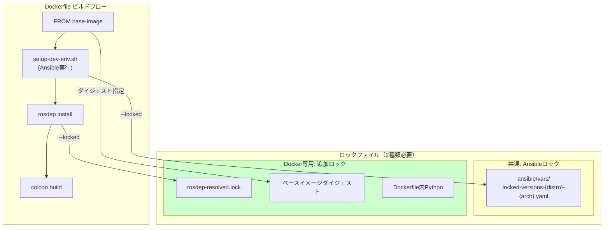

# 依存パッケージバージョン固定: Dockerコンテナ版

本ドキュメントでは、Dockerコンテナセットアップにおけるロックファイル方式（アプローチA）の詳細な実装計画を記載する。

概要・比較については [dependency-pinning-plan.md](./dependency-pinning-plan.md) を参照。

---

## アーキテクチャ

**重要**: Dockerビルド時には`setup-dev-env.sh`が実行され、Ansibleによるパッケージインストールが行われる。そのため、**ネイティブ版と共通のAnsibleロック**も必要となる。



### ネイティブ版との共通部分

Docker版もネイティブ版も、フルセットアップでは同じ依存関係インストールフローを経る。そのため、以下はネイティブ版と共通:

- `ansible/vars/locked-versions-*.yaml` - Ansibleロックファイル
- `lockfiles/*/rosdep-resolved.lock` - rosdepロックファイル
- `.env`ファイルのバージョン定義（CUDA、TensorRT、ros_apt_source_version等）
- Ansibleロールの`--locked`対応

**Docker版のみの追加ロック:**
- ベースイメージダイジェスト
- Dockerfile内のPythonパッケージ（pip install）

詳細は [dependency-pinning-native.md](./dependency-pinning-native.md) を参照。

---

## 新規ファイル構成

```
autoware/
├── lockfiles/                                 # 共通ロック（ネイティブ版と共用）
│   ├── amd64/
│   │   └── rosdep-resolved.lock              # rosdep解決結果
│   └── arm64/
│       └── rosdep-resolved.lock
├── docker/
│   ├── lockfiles/                             # Docker専用ロック
│   │   ├── amd64/
│   │   │   └── pip-packages.lock             # Dockerfile内Pythonパッケージ
│   │   └── arm64/
│   │       └── pip-packages.lock
│   ├── scripts/
│   │   ├── generate_lockfiles.sh          # ロックファイル生成
│   │   └── install_from_lockfile.sh       # ロックファイルからインストール
│   └── Dockerfile                          # --locked引数対応
├── amd64.env                               # base_image_digest追加
└── arm64.env                               # base_image_digest追加
```

---

## ロックファイルフォーマット

### apt-packages.lock

```
# Generated: 2026-01-23T10:00:00Z
# Platform: amd64
# Base Image: ros:humble-ros-base-jammy@sha256:abc123...
apt-utils=2.4.11
build-essential=12.9ubuntu3
cmake=3.22.1-1ubuntu1.22.04.2
curl=7.81.0-1ubuntu1.18
ros-humble-desktop=0.10.0-1jammy.20250115.123456
ros-humble-rmw-cyclonedds-cpp=1.3.4-1jammy.20250110.054321
python3-colcon-common-extensions=0.3.0-1
...
```

### python-packages.lock

```
# Generated: 2026-01-23T10:00:00Z
# Platform: amd64
ansible==10.7.0
colcon-core==0.16.1
pytest==7.4.3
...
```

### rosdep-resolved.lock

```
# Generated: 2026-01-23T10:00:00Z
# ROS Distro: humble
# Component: universe-common
ros-humble-ament-cmake-auto=1.3.7-1jammy.20250110.123456
ros-humble-rclcpp=21.2.0-1jammy.20250112.234567
ros-humble-tf2-ros=0.31.3-1jammy.20250111.345678
...
```

---

## 実装詳細

### generate_lockfiles.sh

```bash
#!/bin/bash
set -euo pipefail

SCRIPT_DIR="$(cd "$(dirname "$0")" && pwd)"
LOCKFILE_DIR="${SCRIPT_DIR}/../lockfiles"
ARCH=$(dpkg --print-architecture)

# APTパッケージのロックファイル生成
generate_apt_lockfile() {
    local output_file="${LOCKFILE_DIR}/${ARCH}/apt-packages.lock"
    mkdir -p "$(dirname "$output_file")"

    {
        echo "# Generated: $(date -Iseconds)"
        echo "# Platform: ${ARCH}"
        echo "# Base Image: ${BASE_IMAGE:-unknown}"
        dpkg-query -W -f='${Package}=${Version}\n' | sort
    } > "$output_file"

    echo "Generated: $output_file"
}

# Pythonパッケージのロックファイル生成
generate_pip_lockfile() {
    local output_file="${LOCKFILE_DIR}/${ARCH}/python-packages.lock"
    mkdir -p "$(dirname "$output_file")"

    {
        echo "# Generated: $(date -Iseconds)"
        echo "# Platform: ${ARCH}"
        pip3 freeze | sort
    } > "$output_file"

    echo "Generated: $output_file"
}

# rosdep解決結果のロックファイル生成
generate_rosdep_lockfile() {
    local src_path="${1:-/autoware/src}"
    local ros_distro="${ROS_DISTRO:-humble}"
    local output_file="${LOCKFILE_DIR}/${ARCH}/rosdep-resolved.lock"
    mkdir -p "$(dirname "$output_file")"

    {
        echo "# Generated: $(date -Iseconds)"
        echo "# ROS Distro: ${ros_distro}"
        rosdep keys --ignore-src --from-paths "$src_path" 2>/dev/null | \
            xargs -I {} sh -c "rosdep resolve {} --rosdistro $ros_distro 2>/dev/null | tail -1" | \
            xargs dpkg-query -W -f='${Package}=${Version}\n' 2>/dev/null | \
            sort | uniq
    } > "$output_file"

    echo "Generated: $output_file"
}

# メイン処理
main() {
    echo "Generating lockfiles for ${ARCH}..."
    generate_apt_lockfile
    generate_pip_lockfile
    generate_rosdep_lockfile "$@"
    echo "Done."
}

main "$@"
```

### install_from_lockfile.sh

```bash
#!/bin/bash
set -euo pipefail

SCRIPT_DIR="$(cd "$(dirname "$0")" && pwd)"
LOCKFILE_DIR="${SCRIPT_DIR}/../lockfiles"
ARCH=$(dpkg --print-architecture)

# APTパッケージのインストール（ロックファイルから）
install_apt_from_lockfile() {
    local lockfile="${LOCKFILE_DIR}/${ARCH}/apt-packages.lock"

    if [[ ! -f "$lockfile" ]]; then
        echo "Error: Lockfile not found: $lockfile" >&2
        exit 1
    fi

    echo "Installing APT packages from lockfile..."

    # コメント行を除外してインストール
    grep -v '^#' "$lockfile" | grep -v '^$' | \
        xargs apt-get install -y --no-install-recommends --allow-downgrades
}

# Pythonパッケージのインストール（ロックファイルから）
install_pip_from_lockfile() {
    local lockfile="${LOCKFILE_DIR}/${ARCH}/python-packages.lock"

    if [[ ! -f "$lockfile" ]]; then
        echo "Warning: Pip lockfile not found: $lockfile" >&2
        return 0
    fi

    echo "Installing Python packages from lockfile..."

    # コメント行を除外してインストール
    grep -v '^#' "$lockfile" | grep -v '^$' > /tmp/requirements.txt
    pip3 install --no-cache-dir -r /tmp/requirements.txt
    rm /tmp/requirements.txt
}

# メイン処理
main() {
    local mode="${1:-all}"

    case "$mode" in
        apt)
            install_apt_from_lockfile
            ;;
        pip)
            install_pip_from_lockfile
            ;;
        all)
            install_apt_from_lockfile
            install_pip_from_lockfile
            ;;
        *)
            echo "Usage: $0 [apt|pip|all]" >&2
            exit 1
            ;;
    esac
}

main "$@"
```

### Dockerfile変更（差分）

```dockerfile
# ビルド引数追加
ARG USE_LOCKFILE=false

# Ansibleロックファイルコピー（ネイティブ版と共通）
COPY ansible/vars /autoware/ansible/vars

# Docker専用ロックファイルコピー
COPY docker/lockfiles /autoware/lockfiles

# setup-dev-env.sh の実行（--locked オプション追加）
RUN if [ "$USE_LOCKFILE" = "true" ]; then \
        ./setup-dev-env.sh -y --locked --module all --no-nvidia --no-cuda-drivers openadkit; \
    else \
        ./setup-dev-env.sh -y --module all --no-nvidia --no-cuda-drivers openadkit; \
    fi

# rosdep インストール（--locked モード対応）
RUN if [ "$USE_LOCKFILE" = "true" ]; then \
        /autoware/docker/scripts/install_from_lockfile.sh rosdep; \
    else \
        rosdep update && \
        /autoware/resolve_rosdep_keys.sh /autoware/src "${ROS_DISTRO}" | \
        xargs apt-get install -y; \
    fi
```

**注意**: `setup-dev-env.sh --locked`により、Ansibleロックファイル（`ansible/vars/locked-versions-*.yaml`）が参照される。これはネイティブ版と同じ仕組み。

### 環境ファイル変更

```bash
# amd64.env に追加
base_image=ros:humble-ros-base-jammy
base_image_digest=sha256:abc123def456...  # 追加

autoware_base_image=ghcr.io/autowarefoundation/autoware-base:latest
autoware_base_image_digest=sha256:789xyz...  # 追加
```

---

## 追加対応項目

### Dockerベースイメージのダイジェスト固定

**現状の問題:**
```dockerfile
# 現状: latestタグは常に変動
ARG AUTOWARE_BASE_IMAGE=ghcr.io/autowarefoundation/autoware-base:latest
```

**対応後:**
```dockerfile
# ダイジェストで固定
ARG BASE_IMAGE_DIGEST
FROM ghcr.io/autowarefoundation/autoware-base@${BASE_IMAGE_DIGEST}
```

**ダイジェスト取得方法:**
```bash
# GitHub Container Registryからダイジェスト取得
docker pull ghcr.io/autowarefoundation/autoware-base:latest
docker inspect --format='{{index .RepoDigests 0}}' ghcr.io/autowarefoundation/autoware-base:latest
# 出力: ghcr.io/autowarefoundation/autoware-base@sha256:abc123...

# または、GitHub APIから取得
curl -s https://api.github.com/orgs/autowarefoundation/packages/container/autoware-base/versions | jq '.[0].name'
```

### Dockerfile内Pythonパッケージ固定

**現状の問題:**
```dockerfile
# docker/tools/visualizer/Dockerfile
pip install --no-cache-dir yamale xmlschema  # バージョン未指定
```

**対応方法1: インラインでバージョン指定**
```dockerfile
pip install --no-cache-dir yamale==5.2.1 xmlschema==3.4.5
```

**対応方法2: 専用requirements.txtを使用**
```dockerfile
COPY docker/tools/visualizer/requirements.lock /tmp/
pip install --no-cache-dir -r /tmp/requirements.lock
```

**requirements.lock:**
```
# docker/tools/visualizer/requirements.lock
yamale==5.2.1
xmlschema==3.4.5
```

### 改修が必要なDockerfile一覧

| ファイル | 未固定パッケージ | 対応 |
|----------|-----------------|------|
| `docker/tools/visualizer/Dockerfile` | yamale, xmlschema | バージョン指定追加 |
| `docker/tools/scenario-simulator/Dockerfile` | yamale | バージョン指定追加 |

---

## CI/CDワークフロー

### ロックファイル生成ワークフロー

```yaml
# .github/workflows/generate-lockfiles.yaml
name: Generate Lockfiles

on:
  workflow_dispatch:
  schedule:
    - cron: '0 0 * * 0'  # 週次実行

jobs:
  generate:
    strategy:
      matrix:
        arch: [amd64, arm64]
    runs-on: ${{ matrix.arch == 'arm64' && 'self-hosted-arm64' || 'ubuntu-latest' }}
    steps:
      - uses: actions/checkout@v4

      - name: Build and generate lockfiles
        run: |
          docker build -t autoware:lockfile-gen .
          docker run --rm -v $PWD/docker/lockfiles:/output autoware:lockfile-gen \
            /autoware/docker/scripts/generate_lockfiles.sh

      - name: Create PR with updated lockfiles
        uses: peter-evans/create-pull-request@v5
        with:
          title: "chore: update dependency lockfiles"
          branch: chore/update-lockfiles
```

### ロックファイル検証ワークフロー

```yaml
# .github/workflows/validate-lockfiles.yaml
name: Validate Lockfiles

on:
  pull_request:
    paths:
      - 'docker/lockfiles/**'

jobs:
  validate:
    runs-on: ubuntu-latest
    steps:
      - uses: actions/checkout@v4

      - name: Validate lockfile format
        run: |
          ./scripts/validate_lockfiles.sh

      - name: Test locked build
        run: |
          docker build --build-arg USE_LOCKFILE=true -t autoware:locked-test .
```

---

## 使用方法

### 開発ビルド（最新バージョン使用）

```bash
# 通常のビルド（rosdepで動的解決）
docker build -t autoware:dev .
```

### リリースビルド（固定バージョン使用）

```bash
# ロックファイルを使用したビルド
docker build --build-arg USE_LOCKFILE=true -t autoware:release .
```

### ロックファイルの更新

```bash
# コンテナ内でロックファイル生成
docker run --rm -v $PWD/docker/lockfiles:/autoware/lockfiles autoware:dev \
    /autoware/docker/scripts/generate_lockfiles.sh

# 変更をコミット
git add docker/lockfiles/
git commit -m "chore: update dependency lockfiles"
```

### ベースイメージダイジェストの取得

```bash
# ダイジェストを取得
docker pull ros:humble-ros-base-jammy
docker inspect --format='{{index .RepoDigests 0}}' ros:humble-ros-base-jammy

# 出力例: ros@sha256:abc123def456...
```

---

## 注意事項

1. **ロックファイルの互換性**: amd64とarm64で別々のロックファイルが必要（パッケージバージョンが異なる場合がある）

2. **パッケージの可用性**: 古いバージョンのパッケージがリポジトリから削除される可能性があるため、定期的な更新を推奨

3. **セキュリティ更新**: CVEが報告された場合は、該当パッケージのバージョンを手動で更新し、テストを実行

4. **依存関係の競合**: ロックファイルに記載されたバージョン間で依存関係の競合が発生した場合は、`apt-get install -f`で解決を試みるか、ロックファイルを調整
