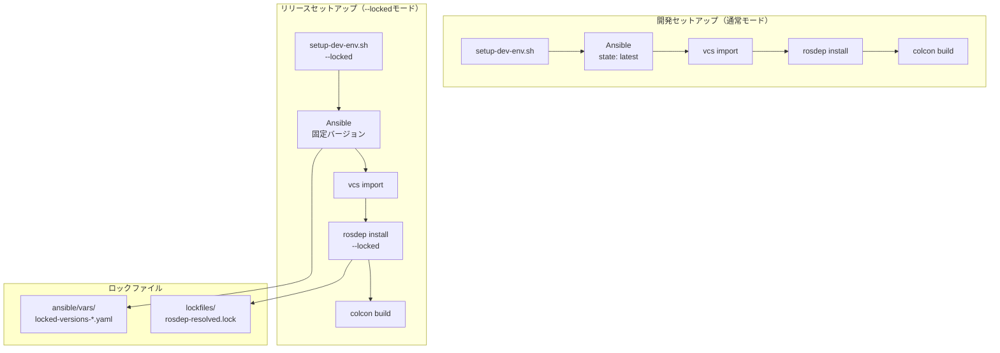

# 依存パッケージバージョン固定: ネイティブセットアップ版

本ドキュメントでは、ネイティブセットアップにおけるAnsibleロックファイル方式（アプローチA）の詳細な実装計画を記載する。

概要・比較については [dependency-pinning-plan.md](./dependency-pinning-plan.md) を参照。

---

## アーキテクチャ

ネイティブ版のフルセットアップ（ソースビルド含む）では、以下の2段階で依存パッケージがインストールされる：

1. **setup-dev-env.sh（Ansible）**: 基本的な開発ツール、ROS2、CUDA等
2. **rosdep install**: Autowareソースコードの依存パッケージ（package.xmlから解決）



---

## 新規ファイル構成

```
autoware/
├── ansible/
│   ├── vars/
│   │   ├── locked-versions-humble-amd64.yaml   # Humble/amd64用
│   │   ├── locked-versions-humble-arm64.yaml   # Humble/arm64用
│   │   ├── locked-versions-jazzy-amd64.yaml    # Jazzy/amd64用
│   │   └── locked-versions-jazzy-arm64.yaml    # Jazzy/arm64用
│   └── roles/
│       └── */tasks/main.yaml                    # バージョン指定対応
├── lockfiles/                                   # rosdepロック（Docker版と共通）
│   ├── amd64/
│   │   └── rosdep-resolved.lock
│   └── arm64/
│       └── rosdep-resolved.lock
├── scripts/
│   ├── generate_ansible_lockfile.sh            # Ansibleロックファイル生成
│   ├── generate_rosdep_lockfile.sh             # rosdepロックファイル生成
│   └── validate_lockfiles.sh                   # ロックファイル検証
└── setup-dev-env.sh                            # --lockedオプション追加
```

**注意**: `lockfiles/`ディレクトリはDocker版と共通で使用される。

---

## ロックファイルフォーマット

### locked-versions-humble-amd64.yaml

```yaml
# Dependency Version Lockfile
# Generated: 2026-01-23T10:00:00Z
# ROS Distro: humble
# Platform: amd64
# Ubuntu: 22.04 (jammy)

# ROS2 packages
ros2_packages:
  ros-humble-desktop: "0.10.0-1jammy.20250115.123456"
  ros-humble-rmw-cyclonedds-cpp: "1.3.4-1jammy.20250110.054321"
  ros-humble-rclcpp: "21.2.0-1jammy.20250112.234567"
  ros-humble-tf2-ros: "0.31.3-1jammy.20250111.345678"

# Development tools
dev_tools_packages:
  python3-colcon-mixin: "0.2.0-1"
  python3-colcon-common-extensions: "0.3.0-1"
  python3-pytest: "7.4.3-1"
  python3-pytest-cov: "4.1.0-1"
  python3-flake8: "5.0.4-4"

# Build tools
build_packages:
  build-essential: "12.9ubuntu3"
  cmake: "3.22.1-1ubuntu1.22.04.2"
  ccache: "4.5.1-1"

# System libraries
system_packages:
  libboost-all-dev: "1.74.0.3ubuntu7"
  libeigen3-dev: "3.4.0-2ubuntu2"
  libpcl-dev: "1.12.1+dfsg-3build1"
  libopencv-dev: "4.5.4+dfsg-9ubuntu4"

# CUDA packages (from env file, reference only)
cuda_packages:
  cuda-command-line-tools-12-8: "12.8.0-1"
  cuda-minimal-build-12-8: "12.8.0-1"
  libcusparse-dev-12-8: "12.8.0.41-1"

# TensorRT packages (from env file, reference only)
tensorrt_packages:
  libnvinfer10: "10.8.0.43-1+cuda12.8"
  libnvinfer-plugin10: "10.8.0.43-1+cuda12.8"
  libnvonnxparsers10: "10.8.0.43-1+cuda12.8"
```

---

## 実装詳細

### setup-dev-env.sh変更（差分）

```bash
# オプション追加
usage() {
    cat << EOF
Usage: $0 [OPTIONS] [TARGET]
...
  --locked              Use locked package versions for reproducible builds
...
EOF
}

# 変数追加
use_locked_versions=false

# オプションパース追加
while [[ $# -gt 0 ]]; do
    case $1 in
        --locked)
            use_locked_versions=true
            shift
            ;;
        # ... 既存オプション
    esac
done

# Ansible実行時に変数を渡す
ansible_args+=("-e" "use_locked_versions=${use_locked_versions}")
if [[ "$use_locked_versions" == "true" ]]; then
    lockfile="ansible/vars/locked-versions-${rosdistro}-$(dpkg --print-architecture).yaml"
    if [[ -f "$lockfile" ]]; then
        ansible_args+=("-e" "@${lockfile}")
    else
        echo "Error: Lockfile not found: $lockfile" >&2
        exit 1
    fi
fi
```

### Ansibleロール変更例（ros2_dev_tools）

```yaml
# ansible/roles/ros2_dev_tools/tasks/main.yaml

- name: Install ROS2 development tools (locked versions)
  become: true
  ansible.builtin.apt:
    name:
      - "python3-colcon-mixin={{ dev_tools_packages['python3-colcon-mixin'] }}"
      - "python3-colcon-common-extensions={{ dev_tools_packages['python3-colcon-common-extensions'] }}"
      - "python3-pytest={{ dev_tools_packages['python3-pytest'] }}"
      - "python3-pytest-cov={{ dev_tools_packages['python3-pytest-cov'] }}"
      - "python3-flake8={{ dev_tools_packages['python3-flake8'] }}"
    state: present
    allow_downgrade: true
  when: use_locked_versions | default(false)

- name: Install ROS2 development tools (latest)
  become: true
  ansible.builtin.apt:
    name:
      - python3-colcon-mixin
      - python3-colcon-common-extensions
      - python3-pytest
      - python3-pytest-cov
      - python3-flake8
    state: latest
    update_cache: true
  when: not (use_locked_versions | default(false))
```

### Ansibleロール変更例（ros2）

```yaml
# ansible/roles/ros2/tasks/main.yaml

- name: Install ROS2 (locked versions)
  become: true
  ansible.builtin.apt:
    name:
      - "ros-{{ rosdistro }}-{{ ros2_installation_type }}={{ ros2_packages['ros-' + rosdistro + '-' + ros2_installation_type] }}"
    state: present
    allow_downgrade: true
  when: use_locked_versions | default(false)

- name: Install ROS2 (latest)
  become: true
  ansible.builtin.apt:
    name: ros-{{ rosdistro }}-{{ ros2_installation_type }}
    state: latest
    update_cache: true
  when: not (use_locked_versions | default(false))
```

### generate_ansible_lockfile.sh

```bash
#!/bin/bash
set -euo pipefail

SCRIPT_DIR="$(cd "$(dirname "$0")" && pwd)"
AUTOWARE_DIR="$(cd "$SCRIPT_DIR/.." && pwd)"
ROS_DISTRO="${ROS_DISTRO:-humble}"
ARCH=$(dpkg --print-architecture)

OUTPUT_FILE="${AUTOWARE_DIR}/ansible/vars/locked-versions-${ROS_DISTRO}-${ARCH}.yaml"

# パッケージカテゴリごとにバージョンを取得
get_package_versions() {
    local category="$1"
    shift
    local packages=("$@")

    echo "${category}:"
    for pkg in "${packages[@]}"; do
        version=$(dpkg-query -W -f='${Version}' "$pkg" 2>/dev/null || echo "not-installed")
        echo "  ${pkg}: \"${version}\""
    done
}

# メイン処理
main() {
    echo "Generating Ansible lockfile: $OUTPUT_FILE"

    mkdir -p "$(dirname "$OUTPUT_FILE")"

    {
        echo "# Dependency Version Lockfile"
        echo "# Generated: $(date -Iseconds)"
        echo "# ROS Distro: ${ROS_DISTRO}"
        echo "# Platform: ${ARCH}"
        echo "# Ubuntu: $(lsb_release -rs) ($(lsb_release -cs))"
        echo ""

        # ROS2パッケージ
        ros2_packages=(
            "ros-${ROS_DISTRO}-desktop"
            "ros-${ROS_DISTRO}-rmw-cyclonedds-cpp"
            "ros-${ROS_DISTRO}-rclcpp"
            "ros-${ROS_DISTRO}-tf2-ros"
            "ros-${ROS_DISTRO}-rviz2"
            "ros-${ROS_DISTRO}-rqt"
        )
        get_package_versions "ros2_packages" "${ros2_packages[@]}"
        echo ""

        # 開発ツール
        dev_tools=(
            "python3-colcon-mixin"
            "python3-colcon-common-extensions"
            "python3-pytest"
            "python3-pytest-cov"
            "python3-flake8"
            "python3-flake8-docstrings"
            "python3-rosdep"
        )
        get_package_versions "dev_tools_packages" "${dev_tools[@]}"
        echo ""

        # ビルドツール
        build_tools=(
            "build-essential"
            "cmake"
            "ccache"
            "ninja-build"
            "git"
            "wget"
            "curl"
        )
        get_package_versions "build_packages" "${build_tools[@]}"
        echo ""

        # システムライブラリ
        system_libs=(
            "libboost-all-dev"
            "libeigen3-dev"
            "libpcl-dev"
            "libopencv-dev"
            "libfmt-dev"
            "librange-v3-dev"
            "libyaml-cpp-dev"
            "nlohmann-json3-dev"
        )
        get_package_versions "system_packages" "${system_libs[@]}"

    } > "$OUTPUT_FILE"

    echo "Generated: $OUTPUT_FILE"
}

main "$@"
```

### validate_ansible_lockfile.sh

```bash
#!/bin/bash
set -euo pipefail

SCRIPT_DIR="$(cd "$(dirname "$0")" && pwd)"
AUTOWARE_DIR="$(cd "$SCRIPT_DIR/.." && pwd)"

# ロックファイルのフォーマット検証
validate_lockfile() {
    local lockfile="$1"

    if [[ ! -f "$lockfile" ]]; then
        echo "Error: Lockfile not found: $lockfile" >&2
        return 1
    fi

    # YAML構文チェック
    if ! python3 -c "import yaml; yaml.safe_load(open('$lockfile'))"; then
        echo "Error: Invalid YAML syntax in $lockfile" >&2
        return 1
    fi

    # 必須キーの存在チェック
    local required_keys=("ros2_packages" "dev_tools_packages" "build_packages" "system_packages")
    for key in "${required_keys[@]}"; do
        if ! grep -q "^${key}:" "$lockfile"; then
            echo "Error: Missing required key '$key' in $lockfile" >&2
            return 1
        fi
    done

    echo "Validated: $lockfile"
    return 0
}

# メイン処理
main() {
    local exit_code=0

    for lockfile in "${AUTOWARE_DIR}"/ansible/vars/locked-versions-*.yaml; do
        if [[ -f "$lockfile" ]]; then
            if ! validate_lockfile "$lockfile"; then
                exit_code=1
            fi
        fi
    done

    return $exit_code
}

main "$@"
```

---

## CI/CDワークフロー

### ロックファイル生成ワークフロー

```yaml
# .github/workflows/generate-ansible-lockfiles.yaml
name: Generate Ansible Lockfiles

on:
  workflow_dispatch:
  schedule:
    - cron: '0 0 * * 0'  # 週次実行

jobs:
  generate:
    strategy:
      matrix:
        rosdistro: [humble, jazzy]
        arch: [amd64, arm64]
    runs-on: ${{ matrix.arch == 'arm64' && 'self-hosted-arm64' || 'ubuntu-latest' }}
    steps:
      - uses: actions/checkout@v4

      - name: Setup environment
        run: |
          ./setup-dev-env.sh -y --module all

      - name: Generate lockfile
        run: |
          ROS_DISTRO=${{ matrix.rosdistro }} ./scripts/generate_ansible_lockfile.sh

      - name: Upload lockfile
        uses: actions/upload-artifact@v4
        with:
          name: lockfile-${{ matrix.rosdistro }}-${{ matrix.arch }}
          path: ansible/vars/locked-versions-*.yaml

  create-pr:
    needs: generate
    runs-on: ubuntu-latest
    steps:
      - uses: actions/checkout@v4

      - name: Download all lockfiles
        uses: actions/download-artifact@v4
        with:
          path: ansible/vars/
          merge-multiple: true

      - name: Create PR with updated lockfiles
        uses: peter-evans/create-pull-request@v5
        with:
          title: "chore: update ansible dependency lockfiles"
          branch: chore/update-ansible-lockfiles
          body: |
            This PR updates the Ansible dependency lockfiles.

            Generated automatically by the weekly lockfile update workflow.
```

### ロックファイル検証ワークフロー

```yaml
# .github/workflows/validate-ansible-lockfiles.yaml
name: Validate Ansible Lockfiles

on:
  pull_request:
    paths:
      - 'ansible/vars/locked-versions-*.yaml'

jobs:
  validate:
    runs-on: ubuntu-latest
    steps:
      - uses: actions/checkout@v4

      - name: Validate lockfile format
        run: |
          ./scripts/validate_ansible_lockfile.sh

      - name: Test locked setup
        run: |
          ./setup-dev-env.sh -y --locked --module base
```

---

## 使用方法

### 開発セットアップ（最新バージョン使用）

```bash
# 通常のセットアップ（最新版をインストール）
./setup-dev-env.sh -y
```

### リリースセットアップ（固定バージョン使用）

```bash
# ロックファイルを使用したセットアップ
./setup-dev-env.sh -y --locked
```

### ロックファイルの更新

```bash
# 環境をセットアップ後、ロックファイルを生成
./setup-dev-env.sh -y
ROS_DISTRO=humble ./scripts/generate_ansible_lockfile.sh

# 変更をコミット
git add ansible/vars/
git commit -m "chore: update ansible dependency lockfiles"
```

### 特定のROSディストリビューション用ロックファイル生成

```bash
# Humble用
ROS_DISTRO=humble ./scripts/generate_ansible_lockfile.sh

# Jazzy用
ROS_DISTRO=jazzy ./scripts/generate_ansible_lockfile.sh
```

---

## 改修が必要なAnsibleロール一覧

| ロール | パッケージカテゴリ | 優先度 |
|--------|------------------|--------|
| ros2 | ros2_packages, **ros_apt_source** | 高 |
| ros2_dev_tools | dev_tools_packages | 高 |
| build_tools | build_packages | 中 |
| system_libs | system_packages | 中 |
| cuda | cuda_packages | 低（既に固定済み） |
| tensorrt | tensorrt_packages | 低（既に固定済み） |

---

## 追加対応項目

### ROS2 APT Sourceバージョン固定

**現状の問題:**
```yaml
# ansible/roles/ros2/tasks/main.yaml
- name: Get latest release information of ros-apt-source package
  ansible.builtin.uri:
    url: https://api.github.com/repos/ros-infrastructure/ros-apt-source/releases/latest
    return_content: true
  register: ros2__ros_apt_release_info
```
→ **GitHub APIで「latest」を動的取得するため、再現性がない**

**対応方法1: .envファイルでバージョン固定**

```bash
# amd64.env に追加
ros_apt_source_version=0.4.1
```

```yaml
# ansible/roles/ros2/tasks/main.yaml（修正後）
- name: Set ros-apt-source version (locked)
  ansible.builtin.set_fact:
    ros2__ros_apt_source_version: "{{ ros_apt_source_version }}"
  when: use_locked_versions | default(false)

- name: Get latest release information of ros-apt-source package
  ansible.builtin.uri:
    url: https://api.github.com/repos/ros-infrastructure/ros-apt-source/releases/latest
    return_content: true
  register: ros2__ros_apt_release_info
  when: not (use_locked_versions | default(false))

- name: Extract latest version of ros-apt-source package
  ansible.builtin.set_fact:
    ros2__ros_apt_source_version: "{{ (ros2__ros_apt_release_info.content | from_json).tag_name }}"
  when: not (use_locked_versions | default(false))
```

**対応方法2: ロックファイルに含める**

```yaml
# ansible/vars/locked-versions-humble-amd64.yaml
ros_apt_source:
  version: "0.4.1"
  url: "https://github.com/ros-infrastructure/ros-apt-source/releases/download/0.4.1/ros-apt-source_0.4.1_all.deb"
  checksum: "sha256:abc123..."  # オプション: チェックサム検証
```

### バージョン確認方法

```bash
# 現在のros-apt-sourceリリース一覧を確認
curl -s https://api.github.com/repos/ros-infrastructure/ros-apt-source/releases | jq '.[].tag_name'

# 最新バージョンを確認
curl -s https://api.github.com/repos/ros-infrastructure/ros-apt-source/releases/latest | jq '.tag_name'
```

---

## 注意事項

1. **ロックファイルの互換性**: ROS distro（humble/jazzy）とアーキテクチャ（amd64/arm64）の組み合わせごとに別々のロックファイルが必要

2. **Ansibleロールの改修順序**: 依存関係のあるロールは、依存先から順に改修する

3. **既存の固定済みパッケージ**: CUDA/TensorRTは既に`.env`ファイルで固定されているため、ロックファイルには参照情報として記載

4. **セキュリティ更新**: CVEが報告された場合は、該当パッケージのバージョンをロックファイルで更新し、テストを実行

5. **部分的な更新**: 特定のパッケージのみ更新したい場合は、ロックファイルの該当行を直接編集可能
