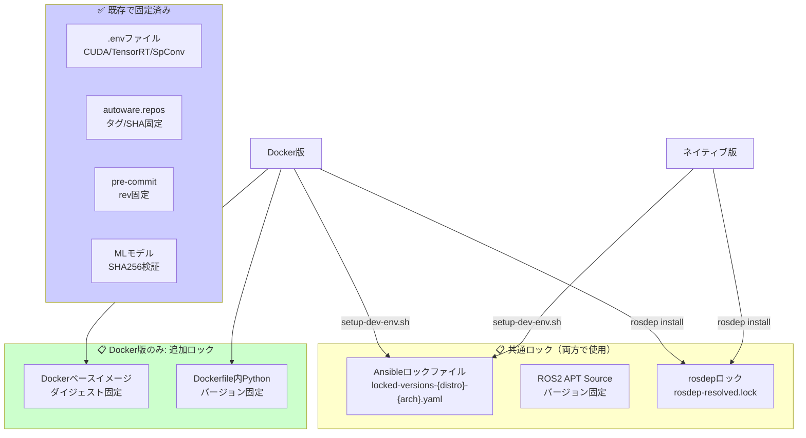

# 依存パッケージバージョン固定 実装計画

## 概要

プロダクトとして頑健なリリース管理を実現するため、APTパッケージおよびPythonパッケージの依存関係をバージョン固定する。本ドキュメントでは、Dockerコンテナセットアップ版とネイティブセットアップ版それぞれについて検討したアプローチと、採用したアプローチの概要を記載する。

## 現状の分析

| カテゴリ | 現状 | 固定度 |
|---------|------|--------|
| CUDA/TensorRT | `.env`ファイルで明示的に固定 | ✅ 固定済み |
| SpConv/CUMM | `.env`ファイルで明示的に固定 | ✅ 固定済み |
| ROS2依存リポジトリ | `autoware.repos`でタグ/SHA固定 | ✅ 固定済み |
| Pre-commit hooks | `.pre-commit-config.yaml`で`rev:`固定 | ✅ 固定済み |
| MLモデル（Artifacts） | SHA256チェックサム検証 | ✅ 固定済み |
| ROSパッケージ (APT) | `rosdep`で動的解決 | ⚠️ 未固定 |
| システムAPTパッケージ | Ansibleで`state: latest` | ⚠️ 未固定 |
| Pythonパッケージ | APT経由またはpipx | ⚠️ 部分的に固定 |
| Dockerベースイメージ | `:latest`タグ使用 | ❌ 未固定 |
| ROS2 APT Source | GitHub API「latest」で動的取得 | ❌ 未固定 |
| Dockerfile内Python | 一部バージョン未指定（yamale等） | ❌ 未固定 |

### 依存関係の全体像



### Docker版とネイティブ版の関係

**重要**: ネイティブ版もDocker版も、フルセットアップ（ソースビルド含む）では同じ依存関係インストールフローを経る。

```
1. setup-dev-env.sh  → Ansible実行 → 基本APTパッケージ
2. vcs import        → ソースコード取得（autoware.repos）
3. rosdep install    → ROS依存パッケージ（package.xmlから解決）
4. colcon build      → ビルド
```

そのため、**Ansibleロック・rosdepロックは両方で共通して使用される**。Docker版のみの追加ロックは、Dockerビルドシステム固有のもの（ベースイメージ、Dockerfile内pip）のみ。

| ロック種別 | ネイティブ版 | Docker版 | 用途 |
|-----------|:------------:|:--------:|------|
| Ansibleロック | ✅ | ✅ | setup-dev-env.sh用 |
| ROS2 APT Source固定 | ✅ | ✅ | Ansible内で使用 |
| rosdepロック | ✅ | ✅ | rosdep install用 |
| Dockerベースイメージダイジェスト | - | ✅ | Docker固有 |
| Dockerfile内Python固定 | - | ✅ | Docker固有 |

---

## Dockerコンテナセットアップ版: アプローチ比較

### アプローチA: ロックファイル方式 ✅ 採用

**概要:**
ビルド時に`dpkg-query`や`pip freeze`を使用してインストール済みパッケージのバージョンを記録し、リリースビルド時にはそのロックファイルを参照して固定バージョンをインストールする方式。

**手法:**
- `dpkg-query -W -f='${Package}=${Version}\n'` でAPTパッケージを記録
- `pip freeze` でPythonパッケージを記録
- `rosdep resolve` の結果をキャッシュ
- Dockerfileに`--build-arg USE_LOCKFILE=true`で切り替え

**メリット:**
- 既存のDockerfile構成を大きく変更せずに導入可能
- ロックファイルはGitで管理でき、差分が明確
- 開発時は最新版、リリース時は固定版と使い分け可能
- CI/CDとの統合が容易

**デメリット:**
- ロックファイルの定期更新が必要
- パッケージの依存関係が複雑な場合、手動調整が必要になることがある

---

### アプローチB: スナップショットリポジトリ方式

**概要:**
UbuntuやROSの公式スナップショットサービスを使用して、特定時点のAPTリポジトリ全体を参照する方式。

**手法:**
- Ubuntu Snapshot Service (`snapshot.ubuntu.com`) を使用
- `sources.list`に特定日時のスナップショットURLを指定
- 例: `deb [snapshot=20260101T000000Z] http://archive.ubuntu.com/ubuntu jammy main`

**メリット:**
- リポジトリ全体が固定されるため、完全な再現性を確保
- 個別パッケージの管理が不要

**デメリット:**
- スナップショットサービスの可用性に依存
- ROSリポジトリのスナップショット対応状況が不明確
- セキュリティパッチの適用が複雑（スナップショット全体の切り替えが必要）
- 特定パッケージのみ更新することが困難

---

### アプローチC: カスタムAPTリポジトリ方式

**概要:**
Artifactory、Nexus、aptlyなどを使用して自前のAPTリポジトリを構築し、必要なパッケージを特定バージョンで保持する方式。

**手法:**
- プライベートAPTリポジトリサーバーを構築
- 必要なパッケージを特定バージョンでミラーリング
- Dockerfileでカスタムリポジトリを参照

**メリット:**
- パッケージの完全な制御が可能
- 社内ネットワークでの高速アクセス
- 外部サービスへの依存なし

**デメリット:**
- インフラ構築・運用コストが高い
- パッケージのミラーリング管理が必要
- セキュリティ更新の追跡と適用が運用負荷になる
- ストレージコストが発生

---

### Dockerコンテナ版: 比較表

| 観点 | A: ロックファイル | B: スナップショット | C: カスタムリポジトリ |
|------|:----------------:|:------------------:|:--------------------:|
| 再現性 | ◎ | ◎ | ◎ |
| 実装難易度 | ◎ 低 | △ 中〜高 | × 高 |
| 既存構成との親和性 | ◎ | ○ | △ |
| 運用コスト | ◎ 低 | ○ 低 | × 高 |
| 外部依存 | ◎ なし | × あり | △ 自前インフラ |
| セキュリティ更新 | ◎ 容易 | △ 複雑 | ○ 中程度 |
| CI/CD統合 | ◎ 容易 | ○ 中程度 | △ 複雑 |
| 導入期間 | ◎ 短い | △ 中程度 | × 長い |
| **総合推奨度** | **★★★** | ★★ | ★ |

---

## ネイティブセットアップ版: アプローチ比較

### アプローチA: Ansibleロックファイル方式 ✅ 採用

**概要:**
Ansibleのタスクでバージョン指定に対応し、`locked-versions.yaml`ファイルで全パッケージのバージョンを一元管理する方式。

**手法:**
- Ansibleロールで`state: present`と明示的バージョン指定を使用
- `locked-versions-{distro}-{arch}.yaml`にバージョン情報を集約
- `setup-dev-env.sh --locked`オプションで切り替え
- `dpkg-query`でインストール済みバージョンを記録

**メリット:**
- 既存のAnsible構成を拡張する形で導入可能
- 開発時は最新版、リリース時は固定版と使い分け可能
- YAMLファイルでバージョン管理でき、可読性が高い
- 部分的なバージョン更新が容易

**デメリット:**
- 全Ansibleロールの改修が必要
- ロックファイルの定期更新が必要

---

### アプローチB: システムイメージ方式

**概要:**
Packer等のツールを使用してVM/コンテナイメージを生成し、構築済みの環境をそのまま配布する方式。

**手法:**
- PackerでUbuntu + ROS2 + Autoware依存関係を含むイメージを作成
- VMware/VirtualBox/QEMU形式でイメージを配布
- ユーザーはイメージをインポートして使用

**メリット:**
- 環境全体が完全に固定される
- ユーザーのセットアップ手順が簡素化
- 環境差異による問題が発生しない

**デメリット:**
- イメージサイズが大きい（数十GB）
- カスタマイズが困難（イメージ全体の再構築が必要）
- 配布インフラのコスト
- 部分的な更新ができない

---

### アプローチC: Nix/Guix方式

**概要:**
Nixパッケージマネージャーを使用して、宣言的に全依存関係を定義し、ビットレベルでの完全な再現性を確保する方式。

**手法:**
- `flake.nix`で全依存関係を宣言的に定義
- `flake.lock`で全パッケージのハッシュを固定
- `nix develop`で開発環境を構築、`nix build`でビルド

**メリット:**
- ビットレベルでの完全な再現性
- ロールバックが容易
- 複数バージョンの共存が可能
- 依存関係の分離が完全

**デメリット:**
- 学習コストが非常に高い
- ROS2との統合が複雑（ros2-nixの成熟度）
- 既存のビルドシステムとの互換性問題
- チーム全体での導入ハードルが高い

---

### ネイティブ版: 比較表

| 観点 | A: Ansibleロック | B: システムイメージ | C: Nix/Guix |
|------|:----------------:|:------------------:|:-----------:|
| 再現性 | ○ | ◎ | ◎ |
| 実装難易度 | ◎ 低〜中 | △ 中 | × 高 |
| 既存構成との親和性 | ◎ | △ | × |
| 運用コスト | ◎ 低 | △ 中 | ○ 低〜中 |
| カスタマイズ性 | ◎ | × | ○ |
| ストレージ要件 | ◎ 小 | × 大 | ○ 中 |
| ROS2統合 | ◎ | ◎ | × |
| 学習コスト | ◎ 低 | ○ 中 | × 高 |
| 導入期間 | ◎ 短い | △ 中程度 | × 長い |
| **総合推奨度** | **★★★** | ★★ | ★ |

---

## 採用アプローチ

| セットアップ種別 | 採用アプローチ | 詳細ドキュメント |
|-----------------|---------------|-----------------|
| Dockerコンテナ版 | アプローチA: ロックファイル方式 | [dependency-pinning-docker.md](./dependency-pinning-docker.md) |
| ネイティブ版 | アプローチA: Ansibleロックファイル方式 | [dependency-pinning-native.md](./dependency-pinning-native.md) |

**採用理由:**
- 既存構成との親和性が最も高い
- 実装・運用コストが低い
- 開発/リリースの使い分けが柔軟
- CI/CDとの統合が容易

---

## 実装フェーズ

### Phase 1: 基盤整備（Week 1-2）

| タスク | 成果物 |
|--------|--------|
| ロックファイルフォーマット策定 | 本ドキュメント |
| Dockerベースイメージダイジェスト固定 | amd64.env, arm64.env |
| ROS2 APT Sourceバージョン固定 | amd64.env, ansible/roles/ros2 |
| ロックファイル生成スクリプト作成 | generate_lockfiles.sh |
| 基本的なCI/CD設定 | .github/workflows/*.yaml |

### Phase 2: Dockerコンテナ版実装（Week 3-4）

| タスク | 成果物 |
|--------|--------|
| Dockerfile改修（--locked対応） | docker/Dockerfile |
| Dockerfile内Pythonパッケージ固定 | docker/tools/*/Dockerfile |
| install_from_lockfile.sh作成 | docker/scripts/ |
| 初回ロックファイル生成 | docker/lockfiles/ |
| ロックビルドのテスト | テスト結果 |

### Phase 3: ネイティブセットアップ版実装（Week 5-6）

| タスク | 成果物 |
|--------|--------|
| setup-dev-env.sh改修 | setup-dev-env.sh |
| Ansibleロール改修（ros2含む） | ansible/roles/*/tasks/main.yaml |
| ロックファイル生成スクリプト | scripts/generate_ansible_lockfile.sh |
| 初回ロックファイル生成 | ansible/vars/*.yaml |

### Phase 4: 運用整備（Week 7-8）

| タスク | 成果物 |
|--------|--------|
| ロックファイル更新ワークフロー整備 | CI/CD設定 |
| セキュリティ更新プロセス策定 | 運用ドキュメント |
| ユーザードキュメント作成 | docs/ |
| リリースプロセスへの統合 | リリース手順書 |

---

## 運用ガイドライン

### ロックファイル更新タイミング

- **定期更新**: 週次で自動生成（CI/CD）
- **手動更新**: セキュリティパッチ適用時
- **リリース時**: リリースブランチでロックファイルを固定

### セキュリティ更新プロセス

1. セキュリティアドバイザリの確認
2. 該当パッケージの新バージョン検証
3. ロックファイルの更新
4. テスト実行
5. リリース

### トラブルシューティング

| 問題 | 対処法 |
|------|--------|
| パッケージが見つからない | リポジトリのスナップショットを確認、代替バージョンを検討 |
| 依存関係の競合 | `apt-get install -f`で依存解決、必要に応じてロックファイル調整 |
| ビルドエラー | 通常モード（非locked）でビルドし、原因特定 |

---

## 参考資料

- [ROS 2 Documentation - rosdep](https://docs.ros.org/en/humble/Tutorials/Intermediate/Rosdep.html)
- [Ansible apt module](https://docs.ansible.com/ansible/latest/collections/ansible/builtin/apt_module.html)
- [Docker Build Cache](https://docs.docker.com/build/cache/)
- [Ubuntu Snapshot Service](https://snapshot.ubuntu.com/)
- [Nix + ROS 2](https://github.com/lopsided98/nix-ros-overlay)
