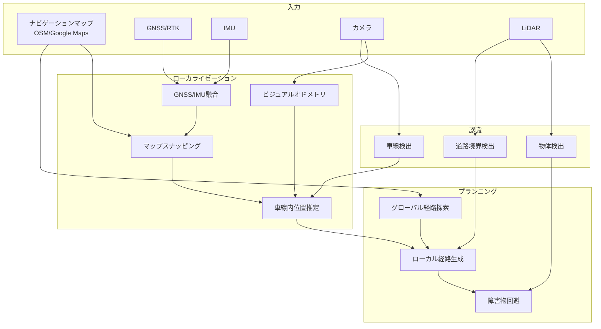

# HDマップなしでのローカライゼーション・プランニング実現方法

## 📌 概要

HDマップ（高精度地図）を使わず、一般的なナビゲーションマップ（Google Maps、OpenStreetMap等）のみで自動運転を実現する方法について説明します。

## 🗺️ HDマップ vs ナビゲーションマップ

### HDマップの特徴
- **精度**: センチメートル級（1-10cm）
- **情報量**: 車線境界、信号機位置、道路標識、路面標示など詳細情報
- **データサイズ**: 1km²あたり数GB
- **更新頻度**: 数ヶ月〜年単位
- **コスト**: 非常に高額（作成・維持）

### ナビゲーションマップの特徴
- **精度**: メートル級（1-5m）
- **情報量**: 道路中心線、交差点、POI（Point of Interest）
- **データサイズ**: 1km²あたり数MB
- **更新頻度**: リアルタイム〜日単位
- **コスト**: 無料または低額

## 🚗 ナビマップのみでの実現方法

### 1. ローカライゼーション（自己位置推定）

#### A. GNSS/IMUベースのローカライゼーション強化

```yaml
# gnss_imu_fusion_localizer.param.yaml
gnss_imu_fusion:
  # 複数GNSS受信機の使用
  multi_gnss:
    enabled: true
    receivers: 2  # RTK対応受信機を2台使用
    
  # IMU融合パラメータ
  imu_fusion:
    use_high_grade_imu: true
    kalman_filter:
      process_noise: 0.01
      measurement_noise: 0.1
```

**実装アプローチ**:
```cpp
class NavigationMapLocalizer {
private:
  // ナビマップからの道路情報
  struct RoadSegment {
    Eigen::Vector2d start;
    Eigen::Vector2d end;
    double width;
    int lanes;
  };
  
public:
  Pose estimatePose(const GNSSData& gnss, const IMUData& imu) {
    // 1. GNSS/IMU融合で粗い位置を取得
    Pose rough_pose = fuseGNSSIMU(gnss, imu);
    
    // 2. ナビマップの道路にスナップ
    RoadSegment nearest_road = findNearestRoad(rough_pose);
    Pose snapped_pose = snapToRoad(rough_pose, nearest_road);
    
    // 3. 車線内位置を推定（画像認識使用）
    double lane_offset = estimateLaneOffset(camera_image);
    
    return adjustPoseWithLaneOffset(snapped_pose, lane_offset);
  }
};
```

#### B. ビジュアルオドメトリの活用

```cpp
class VisualOdometryLocalizer {
  // カメラ画像から特徴点を追跡して移動量を推定
  Pose updatePose(const Image& current, const Image& previous) {
    // ORB特徴点の抽出とマッチング
    auto features_curr = extractORBFeatures(current);
    auto features_prev = extractORBFeatures(previous);
    auto matches = matchFeatures(features_curr, features_prev);
    
    // エピポーラ幾何で移動量計算
    Eigen::Matrix3d E = computeEssentialMatrix(matches);
    Eigen::Vector3d translation;
    Eigen::Matrix3d rotation;
    decomposeEssentialMatrix(E, rotation, translation);
    
    return Pose(rotation, translation);
  }
};
```

### 2. プランニング（経路計画）

#### A. グローバルプランニング（経路探索）

```cpp
class NavigationMapPlanner {
private:
  // OpenStreetMapデータ構造
  struct OSMWay {
    std::vector<int64_t> node_ids;
    std::map<std::string, std::string> tags;  // highway=primary等
    double speed_limit;
    int lanes;
  };
  
public:
  Route planGlobalRoute(const Pose& start, const Pose& goal) {
    // 1. ナビマップ上でA*探索
    auto graph = buildRoutingGraph(osm_data);
    auto path = astar_search(graph, start, goal);
    
    // 2. 経路を実際の走行可能な軌道に変換
    Trajectory trajectory;
    for (const auto& way : path) {
      // 道路幅と車線数から走行位置を推定
      double road_width = estimateRoadWidth(way);
      int lane_count = way.lanes > 0 ? way.lanes : estimateLanes(road_width);
      
      // 右側通行/左側通行に応じて車線位置を決定
      double lane_offset = calculateLaneOffset(lane_count, target_lane);
      
      // スムーズな軌道生成
      auto segment = generateTrajectorySegment(way, lane_offset);
      trajectory.append(segment);
    }
    
    return smoothTrajectory(trajectory);
  }
};
```

#### B. ローカルプランニング（障害物回避）

```cpp
class SensorBasedLocalPlanner {
  Trajectory planLocal(const Trajectory& global_path, 
                      const PointCloud& lidar,
                      const Objects& detected_objects) {
    // 1. センサーデータから走行可能領域を抽出
    auto freespace = extractFreespace(lidar);
    
    // 2. 道路境界を推定（縁石、ガードレール検出）
    auto road_boundaries = detectRoadBoundaries(lidar);
    
    // 3. ダイナミックウィンドウアプローチで局所経路生成
    DynamicWindow dw;
    dw.setGlobalPath(global_path);
    dw.setConstraints(road_boundaries, freespace);
    dw.setObstacles(detected_objects);
    
    return dw.generateTrajectory();
  }
};
```

### 3. 統合システムアーキテクチャ



## 🔧 実装のポイント

### 1. センサー要件の変更

```yaml
# sensor_configuration.yaml
sensors:
  # RTK-GNSS（高精度GNSS）
  gnss:
    type: "multi_band_rtk"
    receivers: 2
    accuracy_target: 0.1  # 10cm
    
  # 高性能IMU
  imu:
    type: "tactical_grade"
    gyro_bias_stability: 0.1  # deg/hr
    
  # カメラ（車線認識用）
  cameras:
    front:
      resolution: [1920, 1080]
      fps: 30
      fov: 120  # 広角
      
  # LiDAR（障害物検出メイン）
  lidar:
    channels: 64
    range: 200
    accuracy: 0.02
```

### 2. アルゴリズムの適応

#### 車線推定アルゴリズム

```python
class LaneEstimator:
    def estimate_lanes_from_road_width(self, road_width, country="JP"):
        # 道路幅から車線数を推定
        if country == "JP":
            # 日本の標準車線幅: 3.0-3.5m
            lane_width = 3.25
        else:
            # 国際標準: 3.5-3.75m
            lane_width = 3.65
            
        estimated_lanes = int(road_width / lane_width)
        
        # 最小1車線、最大6車線
        return max(1, min(6, estimated_lanes))
    
    def find_driving_line(self, lanes, direction="left"):
        # 走行車線の中心線を計算
        if direction == "left":  # 左側通行
            target_lane = lanes - 1  # 最も左の車線
        else:  # 右側通行
            target_lane = 0  # 最も右の車線
            
        return self.calculate_lane_center(target_lane, lanes)
```

### 3. フォールバック戦略

```cpp
class FallbackPlanner {
  enum class DegradedMode {
    FULL_AUTO,      // 通常の自動運転
    LANE_KEEP,      // 車線維持のみ
    EMERGENCY_STOP  // 緊急停止
  };
  
  DegradedMode determineMode(const SystemStatus& status) {
    if (status.gnss_accuracy > 5.0) {  // GNSS精度5m以上
      return DegradedMode::EMERGENCY_STOP;
    }
    else if (status.lane_detection_confidence < 0.7) {
      return DegradedMode::LANE_KEEP;
    }
    else {
      return DegradedMode::FULL_AUTO;
    }
  }
};
```

## 📊 パフォーマンス比較

| 項目 | HDマップあり | ナビマップのみ | 
|------|------------|--------------|
| **位置精度** | 10cm | 30-50cm |
| **車線認識精度** | 95%以上 | 80-90% |
| **計算負荷** | 高 | 中 |
| **データ通信量** | 10MB/km | 0.1MB/km |
| **コスト** | 高額 | 低額 |
| **適用可能エリア** | 限定的 | 広範囲 |

## 🎯 適用シナリオ

### 適している場面
1. **高速道路の自動運転**
   - 道路構造が単純
   - 車線変更が少ない
   - RTK-GNSSの受信状況が良好

2. **郊外の幹線道路**
   - 交通量が少ない
   - 道路幅が広い
   - 障害物が少ない

3. **配送ロボット**
   - 低速走行
   - 歩道や自転車道を使用
   - 精密な位置精度不要

### 適していない場面
1. **都市部の複雑な交差点**
2. **立体駐車場**
3. **トンネル内（GNSS不可）**

## 💡 今後の発展

### 1. AI活用による精度向上
```python
# 深層学習による道路構造推定
class RoadStructureEstimator:
    def __init__(self):
        self.model = load_model("road_structure_cnn.h5")
        
    def estimate_road_structure(self, image, nav_map_context):
        # 画像とナビマップ情報を組み合わせて道路構造を推定
        features = self.extract_features(image)
        map_encoding = self.encode_map_context(nav_map_context)
        
        # 車線数、道路幅、カーブ情報などを推定
        structure = self.model.predict([features, map_encoding])
        
        return structure
```

### 2. V2X通信の活用
- 他車両との位置情報共有
- インフラからの補正情報受信
- リアルタイム地図更新

### 3. クラウドソーシング地図
- 走行データの集約による地図精度向上
- リアルタイム道路状況の共有
- 低コストでの地図更新

## まとめ

HDマップなしでの自動運転は、精度面では劣るものの：
- **低コスト**で実現可能
- **広範囲**に展開可能
- **即座に**開始可能

適切なセンサー構成とアルゴリズムの工夫により、多くの実用的なシナリオで十分な性能を発揮できます。