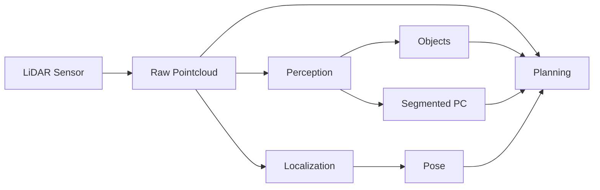
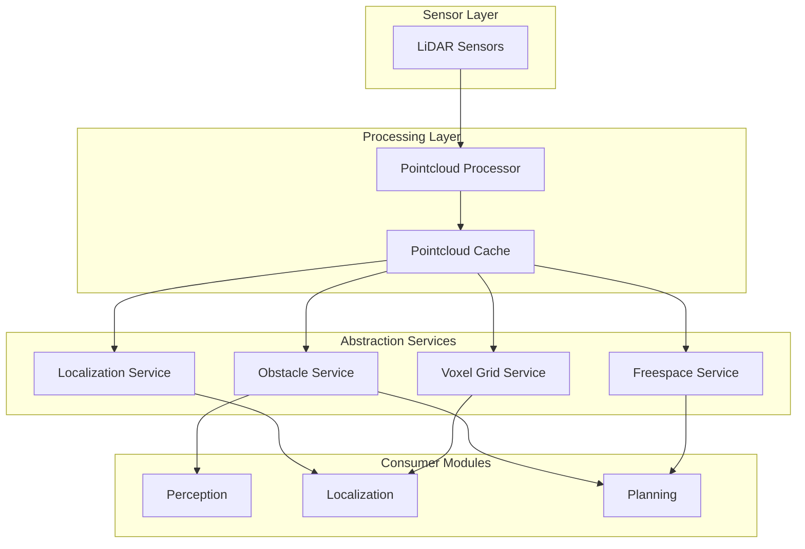

# Pointcloud Decoupling Improvement Plan for Autoware

## Current Architecture Issues

### 1. Dense Communication Problem

Currently, raw pointcloud data flows to multiple components:
- **Perception**: Processes raw pointcloud for object detection, segmentation
- **Localization**: NDT scan matcher uses raw pointcloud for pose estimation  
- **Planning**: Some modules (obstacle_stop_planner, obstacle_cruise_planner) directly consume pointcloud

This creates:
- High bandwidth requirements (pointcloud at 10Hz = ~2MB/frame × 10Hz × 3 consumers = 60MB/s)
- Tight coupling between modules
- Redundant processing of the same data
- Difficulty in distributed deployment

### 2. Current Data Flow



## Proposed Improved Architecture

### 1. Abstraction Layer Design

Introduce abstraction layers to decouple raw sensor data from high-level modules:



### 2. Proposed Abstraction Services

#### A. Localization Service
Instead of raw pointcloud, provide:
- **Feature Pointcloud**: Pre-processed points suitable for matching
  - Edge/corner features extracted
  - Downsampled to optimal resolution
  - Transformed to vehicle frame
- **Scan Matching API**: Request-based matching service
  ```cpp
  service LocalizationScan {
    request: initial_pose, search_range
    response: matched_pose, confidence_score, matched_points
  }
  ```

#### B. Obstacle Service
Replace direct pointcloud access with:
- **Obstacle Grid Map**: 2D/3D occupancy representation
  - Pre-computed from pointcloud
  - Updated at sensor rate
  - Efficient spatial queries
- **Obstacle Query API**:
  ```cpp
  service ObstacleQuery {
    request: query_region (polygon/box)
    response: obstacle_points, obstacle_clusters
  }
  ```

#### C. Freespace Service
Provide planning-specific abstractions:
- **Drivable Area Map**: Binary representation of free/occupied space
- **Distance Field**: Pre-computed distance to nearest obstacle
- **Collision Check API**:
  ```cpp
  service CollisionCheck {
    request: trajectory_points
    response: collision_free (bool), nearest_obstacle_distance
  }
  ```

#### D. Voxel Grid Service
Centralized voxel grid management:
- **Shared Voxel Grid**: Single voxelized representation
- **Multi-resolution Support**: Different resolutions for different use cases
- **Incremental Updates**: Only update changed voxels

### 3. Implementation Strategy

#### Phase 1: Abstraction Layer Introduction
1. Create abstraction service interfaces
2. Implement service providers that consume raw pointcloud
3. Maintain backward compatibility with existing interfaces

#### Phase 2: Module Migration
1. **Planning Migration**:
   - Replace pointcloud subscriptions with service calls
   - Use obstacle grid/freespace maps instead of raw points
   - Implement trajectory-based collision checking

2. **Localization Migration**:
   - Use feature pointcloud service
   - Implement scan matching as a service
   - Cache and reuse processed features

3. **Perception Enhancement**:
   - Become the primary pointcloud processor
   - Publish abstracted representations
   - Provide query-based services

#### Phase 3: Optimization
1. Implement caching strategies
2. Add compression for inter-process communication
3. Support distributed deployment

### 4. Benefits of Proposed Architecture

1. **Reduced Bandwidth**:
   - Raw pointcloud processed once
   - Abstractions are much smaller (KB vs MB)
   - Query-based access reduces unnecessary data transfer

2. **Loose Coupling**:
   - Modules depend on abstractions, not raw data
   - Easy to swap implementations
   - Better testability

3. **Performance**:
   - Centralized processing reduces redundancy
   - Caching improves latency
   - Enables GPU acceleration in one place

4. **Scalability**:
   - Services can run on different machines
   - Load balancing possible
   - Cloud deployment friendly

### 5. Example API Definitions

```cpp
// Obstacle Service API
namespace autoware::abstraction {

class ObstacleService {
public:
  // Get obstacles in a specific region
  ObstacleList queryObstacles(const geometry_msgs::Polygon& region);
  
  // Get occupancy grid for planning
  OccupancyGrid getOccupancyGrid(const GridParams& params);
  
  // Check collision for trajectory
  bool checkTrajectoryCollision(const Trajectory& trajectory);
  
  // Subscribe to obstacle updates in region
  void subscribeToRegion(const geometry_msgs::Polygon& region,
                        ObstacleCallback callback);
};

// Localization Service API  
class LocalizationService {
public:
  // Get processed scan for matching
  ProcessedScan getProcessedScan(const ScanParams& params);
  
  // Perform scan matching
  MatchResult matchScan(const Pose& initial_pose,
                       const ProcessedScan& scan);
  
  // Get feature points for localization
  FeatureCloud getFeatureCloud(const FeatureParams& params);
};

}
```

### 6. Migration Path

1. **Week 1-2**: Design and implement abstraction interfaces
2. **Week 3-4**: Create service implementations with caching
3. **Week 5-8**: Migrate planning modules to use abstractions
4. **Week 9-12**: Migrate localization to use services
5. **Week 13-16**: Optimize and benchmark performance

### 7. Performance Targets

- **Latency**: < 10ms for service queries
- **Bandwidth**: 80% reduction in inter-process communication
- **CPU**: 30% reduction through eliminated redundancy
- **Memory**: Shared memory for large data structures

### 8. Compatibility Considerations

- Maintain existing topics during transition
- Provide adapter nodes for legacy compatibility
- Gradual deprecation of direct pointcloud access
- Configuration flags to enable/disable new architecture

## Conclusion

This decoupling strategy addresses the dense communication problem by:
1. Processing pointcloud data once at the source
2. Providing efficient abstractions for different use cases
3. Enabling query-based access patterns
4. Supporting distributed and scalable deployment

The proposed architecture maintains Autoware's modularity while significantly improving efficiency and reducing coupling between components.