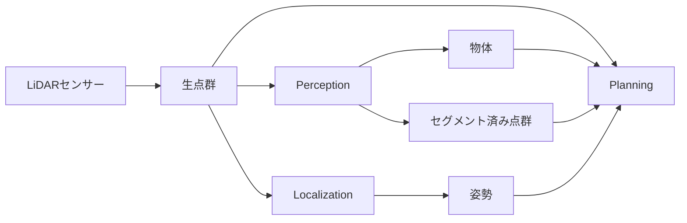
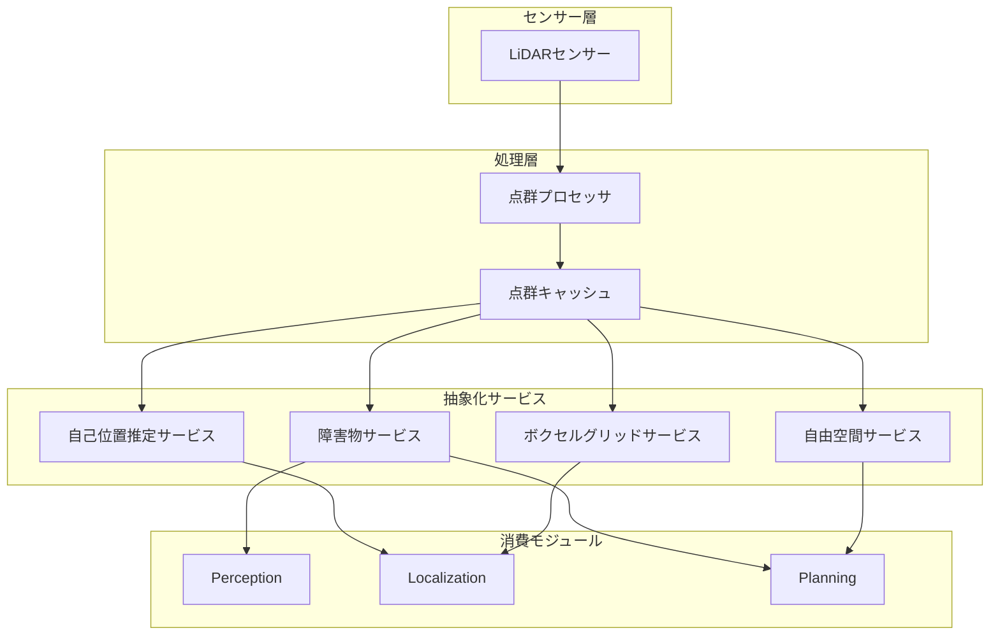

# Autoware向け点群データ疎結合化改善計画

## 現在のアーキテクチャの課題

### 1. 高密度通信の問題

現在、生の点群データが複数のコンポーネントに流れています：
- **Perception（認識）**: 物体検出、セグメンテーションのために生の点群を処理
- **Localization（自己位置推定）**: NDTスキャンマッチャーが位置推定のために生の点群を使用
- **Planning（経路計画）**: 一部のモジュール（obstacle_stop_planner、obstacle_cruise_planner）が点群を直接消費

これにより以下の問題が発生：
- 高帯域幅要求（点群10Hz = 〜2MB/フレーム × 10Hz × 3消費者 = 60MB/秒）
- モジュール間の密結合
- 同じデータの冗長な処理
- 分散配置の困難性

### 2. 現在のデータフロー



## 提案する改善アーキテクチャ

### 1. 抽象化レイヤー設計

生のセンサーデータと高レベルモジュールを疎結合化する抽象化レイヤーを導入：



### 2. 提案する抽象化サービス

#### A. 自己位置推定サービス
生の点群の代わりに以下を提供：
- **特徴点群**: マッチングに適した前処理済み点群
  - エッジ/コーナー特徴の抽出
  - 最適解像度へのダウンサンプリング
  - 車両座標系への変換
- **スキャンマッチングAPI**: リクエストベースのマッチングサービス
  ```cpp
  service LocalizationScan {
    request: initial_pose, search_range
    response: matched_pose, confidence_score, matched_points
  }
  ```

#### B. 障害物サービス
直接的な点群アクセスを以下に置き換え：
- **障害物グリッドマップ**: 2D/3D占有表現
  - 点群から事前計算
  - センサーレートで更新
  - 効率的な空間クエリ
- **障害物クエリAPI**:
  ```cpp
  service ObstacleQuery {
    request: query_region (polygon/box)
    response: obstacle_points, obstacle_clusters
  }
  ```

#### C. 自由空間サービス
プランニング特化の抽象化を提供：
- **走行可能領域マップ**: 自由/占有空間のバイナリ表現
- **距離フィールド**: 最近傍障害物までの事前計算距離
- **衝突チェックAPI**:
  ```cpp
  service CollisionCheck {
    request: trajectory_points
    response: collision_free (bool), nearest_obstacle_distance
  }
  ```

#### D. ボクセルグリッドサービス
一元化されたボクセルグリッド管理：
- **共有ボクセルグリッド**: 単一のボクセル化表現
- **マルチ解像度サポート**: 用途別の異なる解像度
- **増分更新**: 変更されたボクセルのみ更新

### 3. 実装戦略

#### フェーズ1: 抽象化レイヤーの導入
1. 抽象化サービスインターフェースの作成
2. 生の点群を消費するサービスプロバイダーの実装
3. 既存インターフェースとの後方互換性の維持

#### フェーズ2: モジュール移行
1. **Planningの移行**:
   - 点群サブスクリプションをサービス呼び出しに置換
   - 生の点の代わりに障害物グリッド/自由空間マップを使用
   - 軌道ベースの衝突チェックを実装

2. **Localizationの移行**:
   - 特徴点群サービスを使用
   - スキャンマッチングをサービスとして実装
   - 処理済み特徴のキャッシュと再利用

3. **Perceptionの強化**:
   - 主要な点群プロセッサーになる
   - 抽象化された表現を公開
   - クエリベースのサービスを提供

#### フェーズ3: 最適化
1. キャッシング戦略の実装
2. プロセス間通信の圧縮を追加
3. 分散配置のサポート

### 4. 提案アーキテクチャの利点

1. **帯域幅の削減**:
   - 生の点群は一度だけ処理
   - 抽象化ははるかに小さい（KB対MB）
   - クエリベースのアクセスで不要なデータ転送を削減

2. **疎結合**:
   - モジュールは生データではなく抽象化に依存
   - 実装の入れ替えが容易
   - テスタビリティの向上

3. **パフォーマンス**:
   - 一元化された処理で冗長性を削減
   - キャッシングでレイテンシを改善
   - 一箇所でのGPUアクセラレーションが可能

4. **スケーラビリティ**:
   - サービスは異なるマシンで実行可能
   - ロードバランシングが可能
   - クラウド展開に適している

### 5. API定義の例

```cpp
// 障害物サービスAPI
namespace autoware::abstraction {

class ObstacleService {
public:
  // 特定領域の障害物を取得
  ObstacleList queryObstacles(const geometry_msgs::Polygon& region);
  
  // プランニング用の占有グリッドを取得
  OccupancyGrid getOccupancyGrid(const GridParams& params);
  
  // 軌道の衝突チェック
  bool checkTrajectoryCollision(const Trajectory& trajectory);
  
  // 領域内の障害物更新を購読
  void subscribeToRegion(const geometry_msgs::Polygon& region,
                        ObstacleCallback callback);
};

// 自己位置推定サービスAPI  
class LocalizationService {
public:
  // マッチング用の処理済みスキャンを取得
  ProcessedScan getProcessedScan(const ScanParams& params);
  
  // スキャンマッチングを実行
  MatchResult matchScan(const Pose& initial_pose,
                       const ProcessedScan& scan);
  
  // 自己位置推定用の特徴点を取得
  FeatureCloud getFeatureCloud(const FeatureParams& params);
};

}
```

### 6. 移行パス

1. **第1-2週**: 抽象化インターフェースの設計と実装
2. **第3-4週**: キャッシング付きサービス実装の作成
3. **第5-8週**: プランニングモジュールを抽象化使用に移行
4. **第9-12週**: 自己位置推定をサービス使用に移行
5. **第13-16週**: パフォーマンスの最適化とベンチマーク

### 7. パフォーマンス目標

- **レイテンシ**: サービスクエリで10ms未満
- **帯域幅**: プロセス間通信で80%削減
- **CPU**: 冗長性排除により30%削減
- **メモリ**: 大規模データ構造の共有メモリ化

### 8. 互換性の考慮事項

- 移行期間中は既存トピックを維持
- レガシー互換性のためのアダプターノードを提供
- 直接的な点群アクセスの段階的廃止
- 新アーキテクチャを有効/無効にする設定フラグ

## まとめ

この疎結合化戦略は、以下により高密度通信の問題に対処します：
1. 点群データをソースで一度だけ処理
2. 異なるユースケースに効率的な抽象化を提供
3. クエリベースのアクセスパターンを実現
4. 分散かつスケーラブルな展開をサポート

提案されたアーキテクチャは、Autowareのモジュール性を維持しながら、効率性を大幅に向上させ、コンポーネント間の結合を削減します。