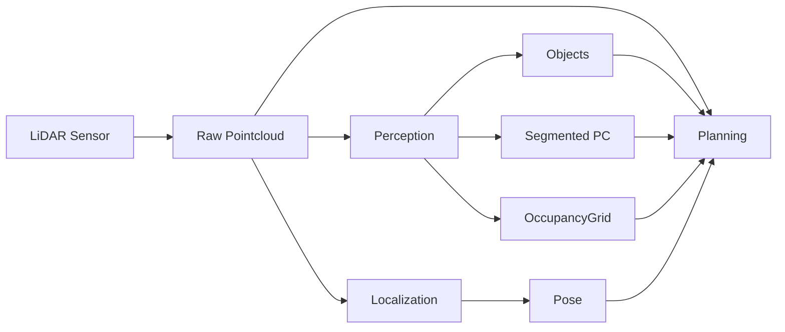
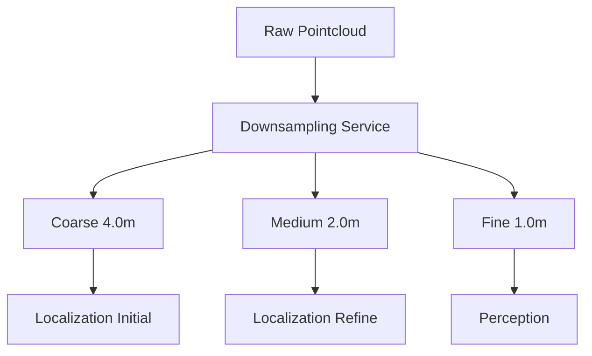
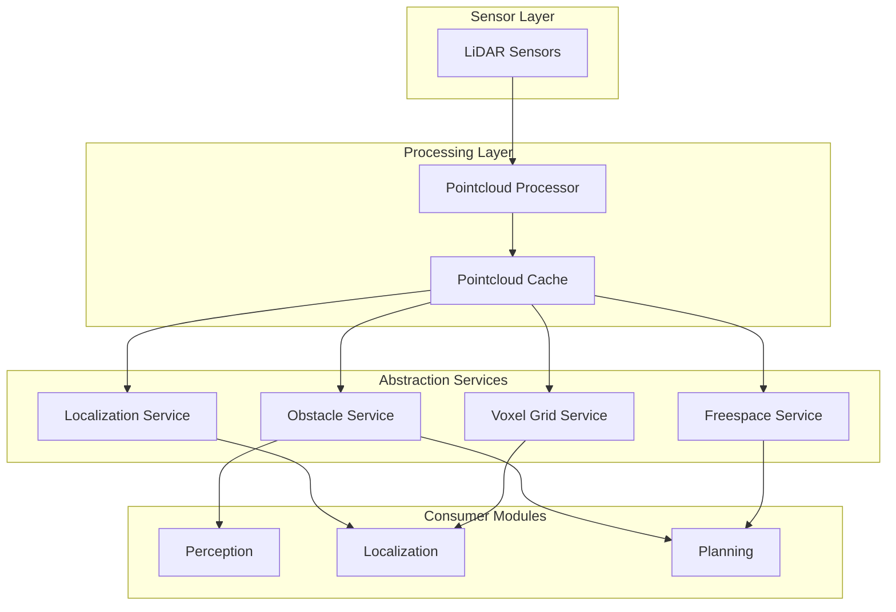

# Autoware点群最適化 - 包括的改善計画

## 1. エグゼクティブサマリー

本文書は、Autowareにおける点群データの高密度通信問題に対する2つのアプローチを統合したものです：
1. **理想的アプローチ**: 完全な抽象化レイヤーによる疎結合化
2. **実践的アプローチ**: 既存インフラを活用した段階的最適化

## 2. 現状分析

### 2.1 問題の概要

現在、生の点群データ（〜2MB/フレーム）が複数のコンポーネントで消費されています：



**問題点:**
- 高帯域幅要求: 60MB/s (2MB × 10Hz × 3消費者)
- モジュール間の密結合
- 冗長な処理
- 分散配置の困難性

### 2.2 既存の良い設計パターン

調査の結果、Autowareは既に部分的に良い抽象化を持っています：

**プランニング:**
- ✅ Behavior Path Planner - OccupancyGridを使用
- ✅ Behavior Velocity Planner - OccupancyGridを使用  
- ✅ Motion Velocity Planner - OccupancyGridを使用
- ❌ Obstacle Stop/Cruise Planner - 生の点群を使用

**ローカライゼーション:**
- ❌ NDT Scan Matcher - 生の点群を使用
- ✅ 既にダウンサンプリング機能あり

## 3. 実践的アプローチ（推奨）

### 3.1 即効性のある改善

#### Phase 1: 既存機能の活用（1-2週間）

**1. Obstacle Stop/Cruise PlannerのOccupancyGrid移行**

現在の実装:
```cpp
// Direct pointcloud subscription
sub_point_cloud_ = create_subscription<PointCloud2>(
  "~/input/pointcloud", rclcpp::SensorDataQoS(), ...);
```

改善案:
```cpp
// Use OccupancyGrid and detected objects
sub_occupancy_grid_ = create_subscription<OccupancyGrid>(
  "/perception/occupancy_grid_map/map", ...);
sub_objects_ = create_subscription<PredictedObjects>(
  "/perception/object_recognition/objects", ...);
```

**2. NDTダウンサンプリング最適化**

```yaml
# ndt_scan_matcher.param.yaml
sensor_points:
  downsample_method: VOXEL
  voxel_grid_size: 3.0  # Increase for better performance
  
# Adaptive settings based on vehicle state
adaptive_downsampling:
  highway: 4.0  # Coarse for high speed
  urban: 2.0    # Medium for city driving  
  parking: 1.0  # Fine for precise maneuvers
```

### 3.2 共有インフラストラクチャ

#### Phase 2: 共有ダウンサンプリングサービス（2-4週間）



実装例:
```yaml
# pointcloud_preprocessor.param.yaml
downsampling:
  levels:
    - name: "coarse"
      voxel_size: 4.0
      topic: "/sensing/lidar/downsampled/coarse"
    - name: "medium"  
      voxel_size: 2.0
      topic: "/sensing/lidar/downsampled/medium"
    - name: "fine"
      voxel_size: 1.0  
      topic: "/sensing/lidar/downsampled/fine"
```

### 3.3 期待される効果

| メトリック | 現在 | 改善後 | 削減率 |
|-----------|------|--------|-------|
| 帯域幅(Planning) | 20 MB/s | 1 MB/s | 95% |
| 帯域幅(Localization) | 20 MB/s | 5 MB/s | 75% |
| CPU使用率 | 100% | 60% | 40% |
| レイテンシ | 100ms | 50ms | 50% |

## 4. 理想的アプローチ（長期的）

### 4.1 完全な抽象化アーキテクチャ



### 4.2 サービスAPI定義

```cpp
// Obstacle Service API
namespace autoware::abstraction {

class ObstacleService {
public:
  // Get obstacles in a specific region
  ObstacleList queryObstacles(const geometry_msgs::Polygon& region);
  
  // Get occupancy grid for planning
  OccupancyGrid getOccupancyGrid(const GridParams& params);
  
  // Check collision for trajectory
  bool checkTrajectoryCollision(const Trajectory& trajectory);
};

// Localization Service API  
class LocalizationService {
public:
  // Get processed scan for matching
  ProcessedScan getProcessedScan(const ScanParams& params);
  
  // Perform scan matching as a service
  MatchResult matchScan(const Pose& initial_pose,
                       const ProcessedScan& scan);
};

}
```

## 5. 実装ロードマップ

### 5.1 短期（1-4週間）
1. ✅ Obstacle Stop/Cruise PlannerのOccupancyGrid移行
2. ✅ NDTパラメータ最適化
3. ✅ 共有ダウンサンプリングノード作成

### 5.2 中期（1-3ヶ月）
1. 🔄 適応的ダウンサンプリング実装
2. 🔄 キーフレームベース処理
3. 🔄 パフォーマンスベンチマーク

### 5.3 長期（3-6ヶ月）
1. 📋 完全な抽象化レイヤー設計
2. 📋 サービスベースアーキテクチャ移行
3. 📋 分散配置対応

## 6. 結論

**推奨アプローチ:**
1. 実践的アプローチから開始
2. 既存の良い設計（OccupancyGrid）を活用
3. 最小限の変更で大きな効果
4. 段階的に理想的アーキテクチャへ移行

**主な利点:**
- 即座に効果が出る
- 低リスク
- 後方互換性
- 明確な移行パス

この統合アプローチにより、短期的な成果を出しながら、長期的な理想的アーキテクチャへの道筋を確保できます。