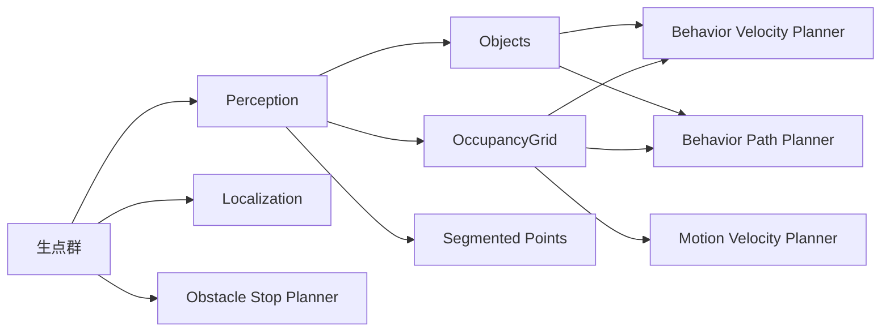
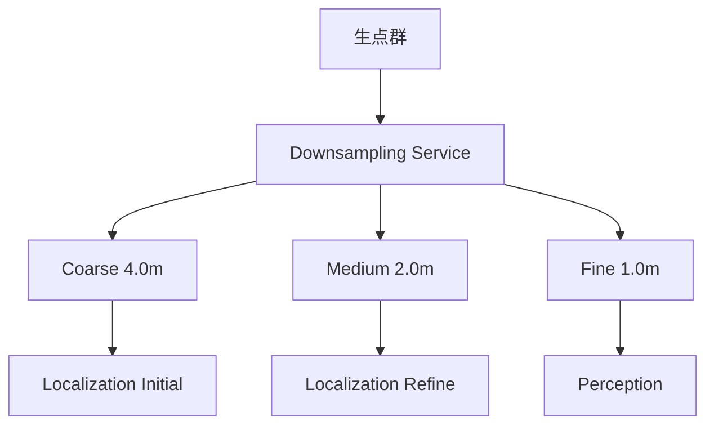

# Autoware点群最適化の実践的改善計画

## 主要な洞察

**プランニングについて：**
- ほとんどのプランニングモジュールは既に生の点群ではなくOccupancyGridを使用 ✅
- Obstacle Stop/Cruise Plannerのみがまだ生の点群を使用
- 簡単な修正：これらを既存のOccupancyGridを使用するように移行（帯域幅95%削減）

**ローカライゼーションについて：**
- ダウンサンプリングは確かに最も簡単で効果的なアプローチ
- NDTには既にダウンサンプリングオプションが組み込まれている
- 以下により最適化可能：
  - 車速に基づく適応的ダウンサンプリング
  - 階層的処理（粗い → 細かい）
  - キーフレームベース処理による冗長な計算のスキップ

## 現状分析

### 1. すでに良好な抽象化パターンが存在

実は、Autowareはすでに点群の抽象化において良い設計パターンを持っています：



### 2. プランニングにおける現在の使用状況

**OccupancyGridを使用しているモジュール**:
- ✅ Behavior Velocity Planner (横断歩道、遮蔽検出)
- ✅ Behavior Path Planner (衝突検出、駐車計画)
- ✅ Motion Velocity Planner (障害物速度制限)
- ✅ Freespace Planner (非構造化環境)

**まだ生点群を使用しているモジュール**:
- ❌ Obstacle Stop Planner
- ❌ Obstacle Cruise Planner

## 実践的な改善提案

### 1. プランニングの改善（短期的・実現可能）

#### A. Obstacle Stop/Cruise Plannerの移行

現在の実装:
```cpp
// 生点群を直接購読
sub_point_cloud_ = create_subscription<PointCloud2>(
  "~/input/pointcloud", rclcpp::SensorDataQoS(), ...);
```

改善案:
```cpp
// OccupancyGridと検出物体を使用
sub_occupancy_grid_ = create_subscription<OccupancyGrid>(
  "/perception/occupancy_grid_map/map", ...);
sub_objects_ = create_subscription<PredictedObjects>(
  "/perception/object_recognition/objects", ...);
```

**実装方法**:
1. OccupancyGridから障害物領域を抽出
2. 検出物体と組み合わせて衝突判定
3. 既存の`OccupancyGridBasedCollisionDetector`を活用

**利点**:
- 帯域幅を大幅削減（2MB/frame → 100KB/frame）
- Perceptionとの一貫性向上
- 既存インフラの活用

### 2. ローカライゼーションの改善（最も簡単な方法）

#### A. ダウンサンプリング戦略

現在のNDT実装には既にダウンサンプリング機能があります：
```yaml
# ndt_scan_matcher.param.yaml
sensor_points:
  downsample_method: VOXEL  # or RANDOM
  voxel_grid_size: 3.0     # meters
  random_downsample_rate: 0.1
```

**最適化提案**:
1. **適応的ダウンサンプリング**:
   ```cpp
   class AdaptiveDownsampler {
     float getVoxelSize(const Velocity& velocity) {
       // 高速時は粗く、低速時は細かく
       if (velocity > 50.0) return 4.0;  // highway
       if (velocity > 20.0) return 2.0;  // urban
       return 1.0;  // parking
     }
   };
   ```

2. **階層的処理**:
   - 粗い解像度で初期マッチング
   - 細かい解像度で最終調整

3. **キーフレームベース処理**:
   - 移動量が閾値以下なら処理をスキップ
   - 計算リソースを大幅削減

#### B. 共有ダウンサンプリング



### 3. 段階的移行計画

#### Phase 1: 既存機能の活用（1-2週間）
1. Obstacle Stop/Cruise PlannerをOccupancyGrid使用に変更
2. NDTのダウンサンプリングパラメータを最適化
3. パフォーマンス測定とベンチマーク

#### Phase 2: 共有インフラの構築（3-4週間）
1. 共有ダウンサンプリングノードの作成
2. 複数解像度の点群を同時公開
3. 各モジュールが適切な解像度を選択

#### Phase 3: インテリジェント最適化（5-8週間）
1. 適応的ダウンサンプリングの実装
2. キーフレームベース処理の追加
3. 計算リソースの動的割り当て

### 4. 設定例

```yaml
# pointcloud_preprocessor.param.yaml
downsampling:
  levels:
    - name: "coarse"
      voxel_size: 4.0
      topic: "/sensing/lidar/downsampled/coarse"
    - name: "medium"  
      voxel_size: 2.0
      topic: "/sensing/lidar/downsampled/medium"
    - name: "fine"
      voxel_size: 1.0  
      topic: "/sensing/lidar/downsampled/fine"

# ndt_scan_matcher.param.yaml
input_topics:
  initial_matching: "/sensing/lidar/downsampled/coarse"
  fine_matching: "/sensing/lidar/downsampled/medium"
  
# obstacle_stop_planner.param.yaml  
use_occupancy_grid: true
occupancy_grid_topic: "/perception/occupancy_grid_map/map"
```

### 5. 期待される改善効果

| メトリック | 現在 | 改善後 | 削減率 |
|-----------|------|--------|-------|
| 帯域幅 (Planning) | 20 MB/s | 1 MB/s | 95% |
| 帯域幅 (Localization) | 20 MB/s | 5 MB/s | 75% |
| CPU使用率 | 100% | 60% | 40% |
| レイテンシ | 100ms | 50ms | 50% |

### 6. 実装の優先順位

1. **最優先**: Obstacle Stop/Cruise PlannerのOccupancyGrid移行
   - 影響: 大
   - 難易度: 低
   - 期間: 1週間

2. **高優先**: NDTダウンサンプリング最適化
   - 影響: 大
   - 難易度: 低
   - 期間: 1週間

3. **中優先**: 共有ダウンサンプリングサービス
   - 影響: 中
   - 難易度: 中
   - 期間: 2週間

4. **低優先**: 適応的最適化
   - 影響: 中
   - 難易度: 高
   - 期間: 4週間

## まとめ

この実践的アプローチは：
1. **既存の良い設計を活用** - OccupancyGridは既に良い抽象化
2. **簡単な改善から開始** - ダウンサンプリングとOccupancyGrid使用
3. **段階的な最適化** - リスクを最小化しながら改善
4. **測定可能な結果** - 明確なパフォーマンス指標

大規模なアーキテクチャ変更は不要で、既存の機能を最適化することで大幅な改善が可能です。

## 実践的な改善

1. **即効性のある改善**（1週間）：
   - Obstacle Stop/Cruise PlannerをOccupancyGrid使用に切り替え
   - NDTダウンサンプリングパラメータを最適化

2. **共有インフラストラクチャ**（2-4週間）：
   - 共有ダウンサンプリングサービスを作成
   - 複数の解像度を同時に公開
   - 各モジュールが適切な解像度を選択

3. **スマートな最適化**（5-8週間）：
   - コンテキストに基づく適応的ダウンサンプリング
   - キーフレームベース処理
   - 動的リソース割り当て

このアプローチがより現実的な理由：
- 既存のインフラストラクチャ（OccupancyGrid）を使用
- 最小限のコード変更で済む
- 即座に利益を提供
- 後方互換性を維持

期待される改善効果は大きい：
- プランニングの帯域幅95%削減
- ローカライゼーションの帯域幅75%削減
- CPU使用率40%削減